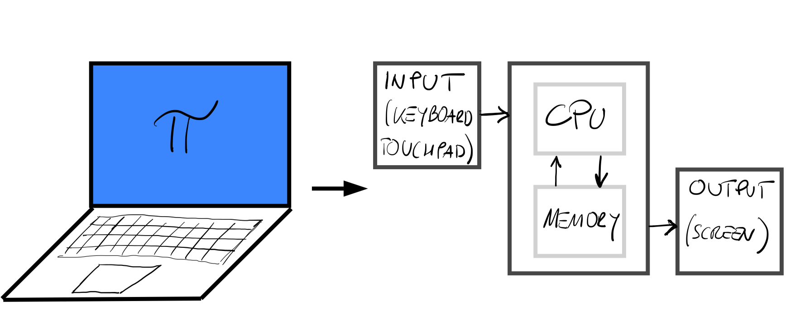
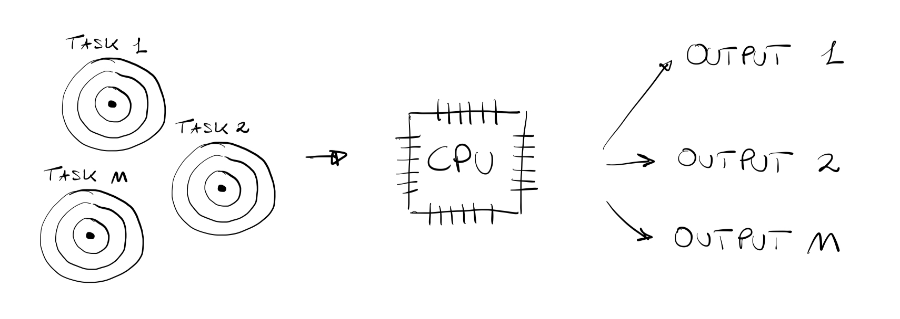
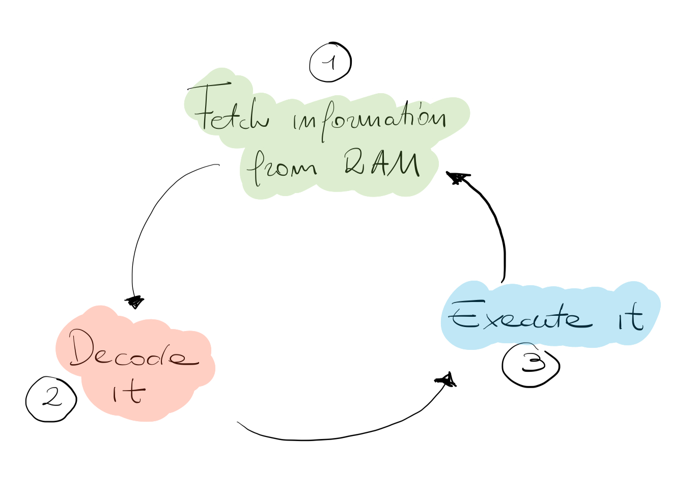
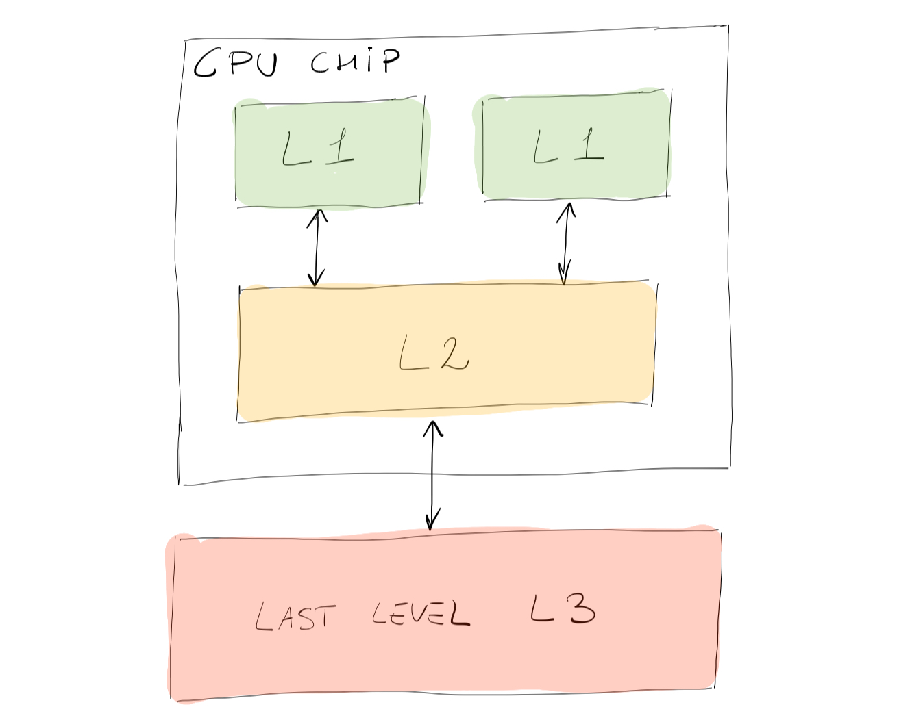
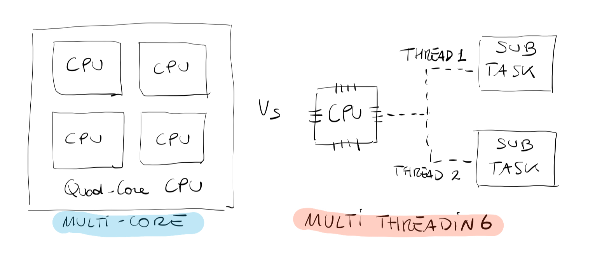
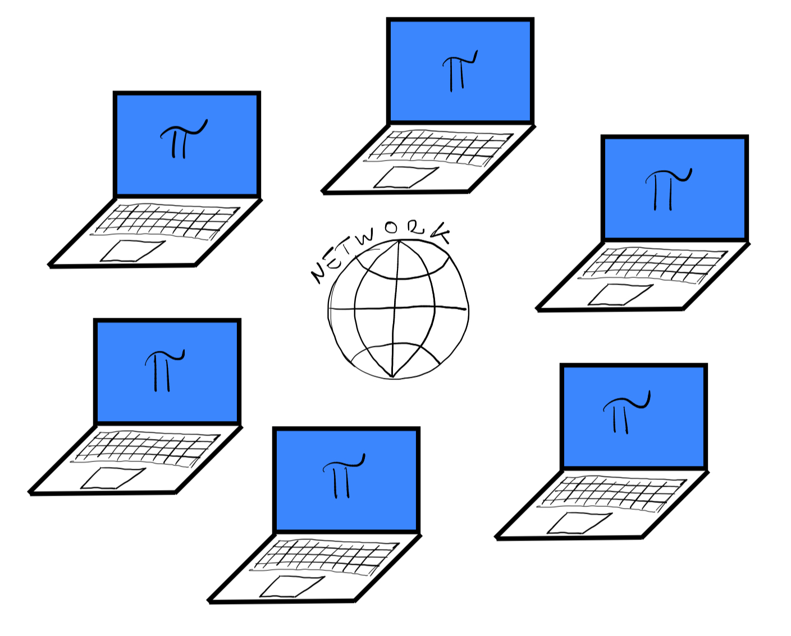
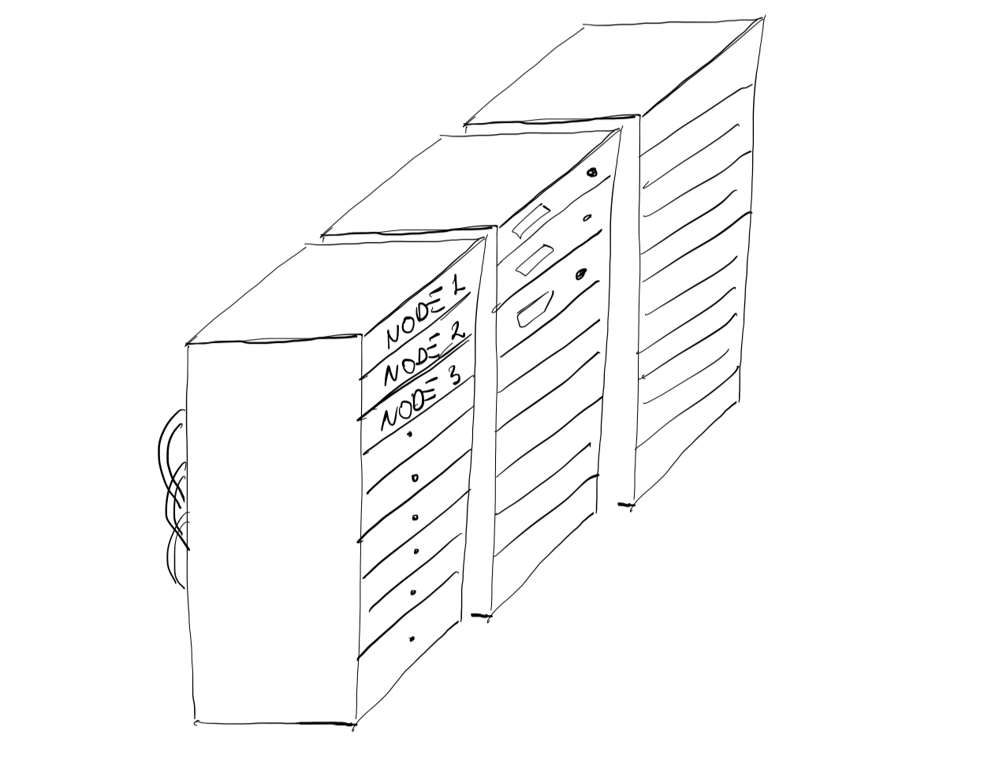

import { Icon } from '@astrojs/starlight/components';
import Box from '../../../components/Box.astro';
import Caption from '../../../components/Caption.astro';
import Option from '../../../components/Option.astro';
import CustomAside from '../../../components/CustomAside.astro';
import { Tabs, TabItem } from '@astrojs/starlight/components';
import CodeFetch from '../../../components/CodeFetch.astro';
import MultipleChoice from '../../../components/MultipleChoice.astro';

import { YouTube } from '@astro-community/astro-embed-youtube';

:::note[Learning Objectives]
At the end of this section, you should be able to:
1. Utilize the correct terminology for HPC.
2. Define what a computer cluster (or server) is.
3. Understand how to successfully communicate with the HPC system.
:::
<CustomAside icon="pen" title="Time to complete: 45 min" colour="green"></CustomAside>
<YouTube id='q6n53iB77rc' />

## It all stems from computing
At the basis of every research activity, there is the answer to research questions. In most cases, especially engineering, physics, mathematics, but even economics, social sciences, and business, the answer to a given research question is directly tied to the **solution** of a scientific problem. **The process of finding a solution following a set of operations** is known as **computing**.

We often make the mistake of connecting the word "computer" to the activity of "computing". However, computing is much older than the computer. In the old days, differential equations (means of description of many physical phenomena) were solved **using pen and paper**.   A computer is a "tool" that makes the activity of "computing" extremely fast. That is exactly why today we cannot live without it. {/*, and most of us (if not everyone) carry small computers in our pockets.*/}

Let us take, for instance, a common piece of equipment we use in our everyday life: a laptop. A laptop, as shown in the figure below, like any other computing machine (or computer) has some specific components:
- **Input device**: is a human interface device that allows us to tell the computer what to do (keyboard, touchpad, mouse).
- **Output device**: the device that allows us to read results and monitor the progress of our program (screen).
- **CPU & Memory**: the [Central Processing Unit (CPU)](https://arc4cfd.github.io/glossary/#section-1) and memory, usually interconnected, are the engine of the computing machine which are used to execute operations and store results.

<Caption>Figure of the main components of a computing machine in reference to a laptop</Caption>

## Yes, but what is a CPU?

In the previous figure, the CPU is represented as a "black box", however, it is very important for later sections, to understand its **purpose** and its **structure**. The CPU is the "brain" of the computer. As shown in the schematic below, the CPU *is in charge of* completing tasks by continuously processing and resolving mathematical/logical operations.

<Caption>Schematic of a CPU as a black box</Caption>

One of the major revolutions of computing came in the 1970s when Intel was able to manufacture the CPU into a single circuit board and chip with its Intel 4004, the very first **microprocessor**. Since then, the CPUs in our phones, laptops, and PCs although much more advanced share the same structure of the "vintage" Intel 4004, which was characterized by:
- 4-[bit](https://arc4cfd.github.io/glossary/#section-1) architecture.
- 640 [bytes](https://arc4cfd.github.io/glossary/#section-1) of addressable memory capacity, also known as [Random Access Memory (RAM)](https://arc4cfd.github.io/glossary/#section-1).
- Maximum **[clock speed](https://arc4cfd.github.io/glossary/#section-1)** of 108 kHz (Kilohertz).

The **clock speed** is a measure of the efficiency (or speed) of a CPU and it represents **how many times per second a CPU completes a work cycle**. The Intel 4004 chip, for instance, was capable of completing 108 thousand cycles per second. You might think that 108kHz is quite an impressive number, but just consider that a very common (and economic) Intel i3 completes about **4 billion** cycles per second per core (3.6 GHz)!

## What is a CPU workcycle?

<Caption>Sketch of the CPU cycle</Caption>

From the 1970's Intel 4004 chip to today's Intel i9 chip, the CPU still completes the same work cycle: it fetches instructions from the RAM, it decodes them, and finally executes them. Through the cycle, the information travels in bits. A bit is the basic unit of information that  can be either 1 or 0. Bits are the building blocks of the much larger and articulated "binary code". In very simple terms, the number of bits a CPU can handle at any one time limits the amount of memory that the CPU can access. More information about  binary code and CPU architecture can be found [here](https://www.ionos.ca/digitalguide/websites/web-development/binary-code/). For the sake of this short course, think of the binary code as the language spoken by the CPU and used to perform logical operations, and specifically, Boolean algebra. Most processors today are based on the x86 instruction set architecture developed by Intel, and are capable of processing 64 bits at the same time.

## It's all about memory

Before diving into the multi-core architecture, we need to address the memory problem. Modern CPUs are equipped with what is known as cache memory to **temporarily** store information, data, and programs that are commonly used by the CPU. You might ask **why would a CPU need a cache memory if it can access the RAM?** Cache memory is smaller in size and much faster than the RAM, but most importantly, it is located in very close proximity to the CPU. **How does it work?** When performing a task, that requires data to be read, the CPU automatically searches in the cache memory (faster, closer). If data is found (cache hit), it is gathered very quickly, and the entire process is optimized. If data is not found (cache miss) the CPU turns to the RAM. There are 3 levels of cache memory designed to have slightly different functions:
- Level 1 (L1): fastest, smallest in size, and closest to the CPU.
- Level 2 (L2); slower, higher in capacity, situated on the processor's chip.
- Level 3 (L3): slowest, has the largest capacity, and it's the farthest from the CPU.

Below is a simplified sketch on how the three levels of cache memory are organized on a CPU chip.

<Caption>Sketch of the cache memory structure on a CPU chip.</Caption>

## What is a core?

**A core is a CPU's processor**, it contains the [Arithmetic Logic Unit (ALU)](https://arc4cfd.github.io/glossary/#section-1) and a register. In the 1980s every CPU had just ONE core with ONE cache memory. Today, on the other hand, CPUs have a multi-core architecture, each one with its own L1 and L2 cache memory. Multi-core processes are **independent** processes put together on the same integrated circuit. Of crucial importance is the word **independent**. This means that one core could work on a task, while another core could, independently, work on a different task. The multi-core architecture constitutes the foundation of high-performance computing (HPC), as we shall see very soon. However, before multi-core went mainstream, **multi-threading** was a smart way of optimizing the CPU's workload. Multi-threading consists of splitting ONE core into several (commonly 2) virtual cores. This allows a CPU to perform two sets of tasks (threads). A very important point to remember is that the 2 resulting tasks will not be performed **at the same time** but rather the processor will alternate sequentially between one and the other. Even with the advent of the multi-core architecture, multi-threading is still a very common practice. For example, a 4-core (quad-core) CPU can use multi-threading to provide 8 threads (see the below figure). **Reality check**: multi-threading is extremely useful to prevent ``freezing" of the [Operating System (OS)](https://arc4cfd.github.io/glossary/#section-1) when a task is stuck, since it was given a limited operational span before moving to the next assigned task by the OS. For those of you who work with Windows OS, the **task manager** is exactly meant to allow you to manage and stop tasks.

<Caption>Figure illustrating multi-core vs. multi-threading architecture</Caption>

## Measure of computer performance

Nowadays, even small laptops can be very powerful, but, **how do we measure the computer performance?** In computing the measure of computer performance is the **[FLOPS](https://arc4cfd.github.io/glossary/#section-1)** or Floating Point Operations Per Second. To give a quick idea on the power of modern computers, in the 1980s a very large computer would perform about $10^6$ FLOPS, while a modern laptop ranges around $30-50\times10^9$ FLOPS (Gigaflops). Around 2009 a large super computer would perform $10^{15}$ FLOPS (Petaflops), and these days (2024) we have reached as far as $10^{18}$ FLOPS (Exaflops). Once the petaflops range is reached, we have a full-size machinery that must have a dedicated large-scale facility to host it, to cool it down, and a team to maintain its status.

## What if my laptop is not enough?

Going back to the **research questions** we mentioned earlier, in many cases the process of finding a solution via numerical computation can quickly outgrow even the most powerful laptop or workstation. Here are a couple of examples of **WHY** you might want to consider HPC:
- You are a student of an experimental lab that collects daily data on the water quality of lake Ontario. So far, you have been analyzing small datasets for small time ranges. Your supervisor tasks you with the analysis of over 10 years of data made available by a local weather forecasting company. **You are probably looking at terabytes (TB) of data, and your laptop will most likely crash**.
- You are a graduate student who, for their research, developed a model which now has to be validated with existing data. This requires running over a thousand simulations which, **on your laptop, will result in more than a month of running time**.
- You are a student who is focusing on computational fluid dynamics (CFD). The CFD package you were given has the capability to run in parallel. So far, you have never needed this option as you mostly analyzed 2D domains. However, **going to 3D simulations has more than tripled the simulation time**, and it might be time to use that feature.

<Caption>Figure showing a simple sketch of parallel computing.</Caption>

When a single laptop is not enough, one might think that the solution could be to (i) manufacture CPUs with faster clockspeeds, or to (ii) increase the memory per CPU. However, these two routes come with great limitations; the former is related to heat generation, power consumption, and physical size of the CPU chip, the latter is related to manufacturing costs. The solution is **parallel computing**. We could take $N$ laptops, each one with 4 cores, and connect them together via a very fast network (see the above figure). At this point we could take our target "large" problem, split it up into smaller $N$ sub-problems and solve each sub-problem on the individual laptops. Eventually, all the answers could be collected together to give the final answer to the original problem. **What we just described in very simple terms is the basis of high performance computing**. In the HPC terminology, every laptop is a **[compute node](https://arc4cfd.github.io/glossary/#section-1)**. Just like the individual laptop each node is characterized by its own operating system and its own network connection. The set of laptops is known as a **[computer cluster](https://arc4cfd.github.io/glossary/#section-1)** or **server**. In the example above the resulting computer cluster would have a total of 24 cores or processors.

Modern computer clusters depend heavily on parallelism which in turn depends heavily on the inter-connectivity between each node. That is why **a crucial characteristic of any cluster is a stable, reliable, and FAST** networking communication system (e.g. InfiniBand). Finally, modern clusters do not exactly look like a series of interconnected laptops, but more like a **very noisy** series of rack cabinets hosted by large remote facilities or data centers (see the figure below). In Ontario, the largest providers of advance research computing resources are four consortia based at universities and hospitals. These academic consortia support two of the country’s current five national ARC platforms: Niagara (at the University of Toronto) and [Graham](https://en.wikipedia.org/wiki/Graham) (at the University of Waterloo). Just as a comparison to our simple example, the Canadian computer cluster Graham (used as the main platform in this course) has a total of 33,448 processors connected via InfiniBand. [Frontier](https://en.wikipedia.org/wiki/Frontier_(supercomputer)), the most powerful supercomputer in the world (as of January 2024), situated at Oak Ridge National laboratory has a total of 8,699,904 processors capable of executing 1.102 quintillion operations per second (1.02 exaFLOPS).

<Caption>Figure showing a simple sketch of the common structure of a computer cluster.</Caption>

<CustomAside icon="rocket" title="Reality check!" colour="green">
You might not realize it, but in our daily lives we often (VERY often!) interact with large-scale clusters. 
</CustomAside>

For instance, the very simple task of finding the route to a new restaurant will probably take "ages" on your laptop, so in turn we rely on a website (e.g., Google maps) which runs on a **machine** usually located very far away from where you are: a remote server. All operations, from connecting to the server, to executing your search, to visualizing the results are performed on a large-scale HPC system. Social networking services, e-commerce services and so on, all use a "remote" server to store and manage data. The server itself has no direct display or input methods connected to it (as opposed to your laptop) but is characterized by much more memory and computing power than any of your devices will ever have. **To communicate** with the remote server all you need is:
- A local device: laptop, tablet, smartphone, or PC.
- A stable internet connection.

## Some relevant definitions
##### Advanced Research Computing (ARC)
 The term refers to the elements required to perform computationally and data-intensive research and data management, including high-performance computing, cloud-computing, and storage. ARC relies on high-speed networks, software, standards, and data-management services.

##### High-performance computing (HPC)
High performance computing (HPC) is one aspect of ARC and refers to the usage of a specialized cluster and computer hardware configured to handle high volumes of data calculations at high speeds. These resources are designed so many users can take advantage of them at the same time, performing better than any single desktop or laptop computer. 

<Box iconName="quiz">
  **QUIZ**

A compute node can only have a single CPU:
<MultipleChoice>
    <Option>
        True
    </Option>
    <Option isCorrect>
        False
    </Option>
</MultipleChoice>

What are the differences between **multi-threading** and **multi-core** architecture?
<MultipleChoice>
    <Option>
        None, in both cases several tasks can be executed at the same time.
    </Option>
    <Option isCorrect>
        In multi-threading several tasks are executed sequentially, while in a multi-core architecture several tasks can be executed independently.
    </Option>
</MultipleChoice>
</Box>

:::note[Reflections and Takeaways]
Having finished this lecture, you should now be able to answer the following questions:
1. What is a CPU, and how is it structured?
2. What is HPC, and why do I need it?
3. What is a computer cluster, and what are its important characteristics?
:::