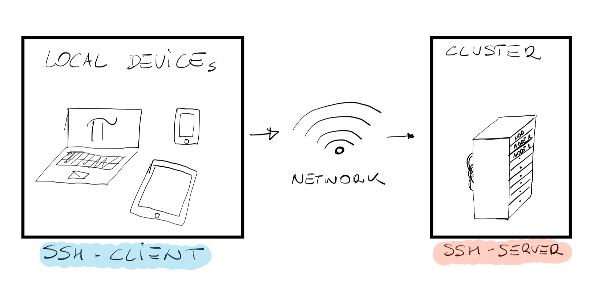
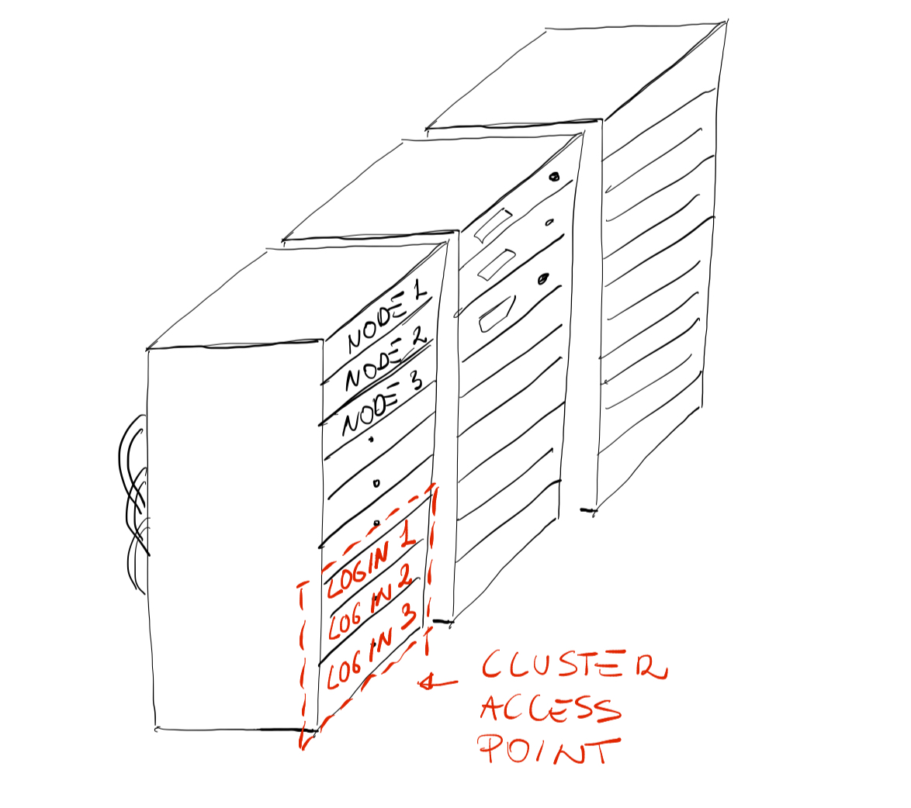
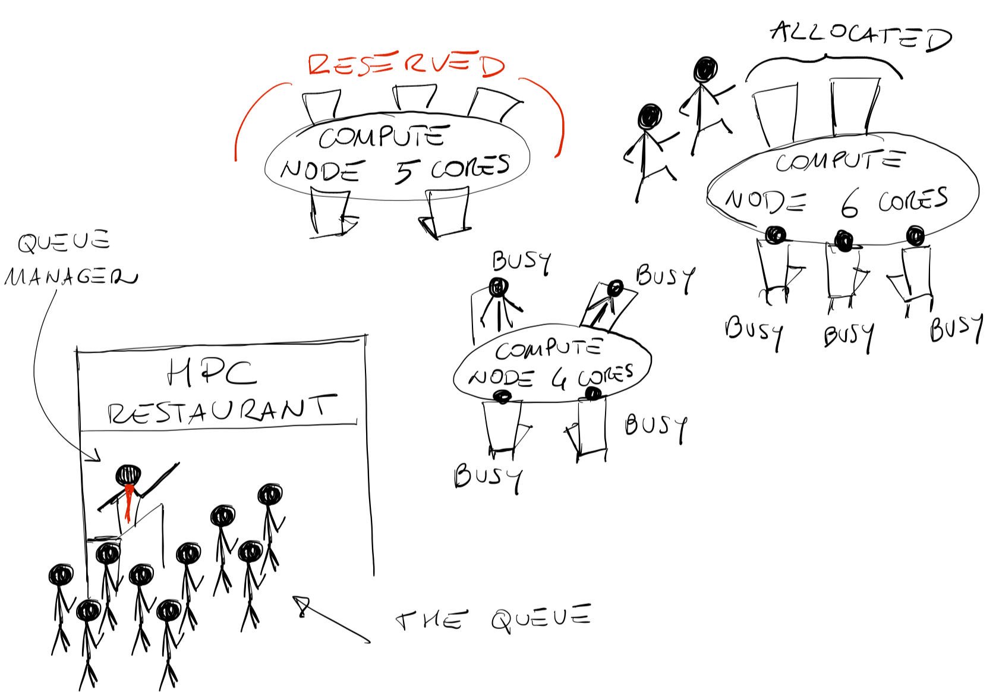
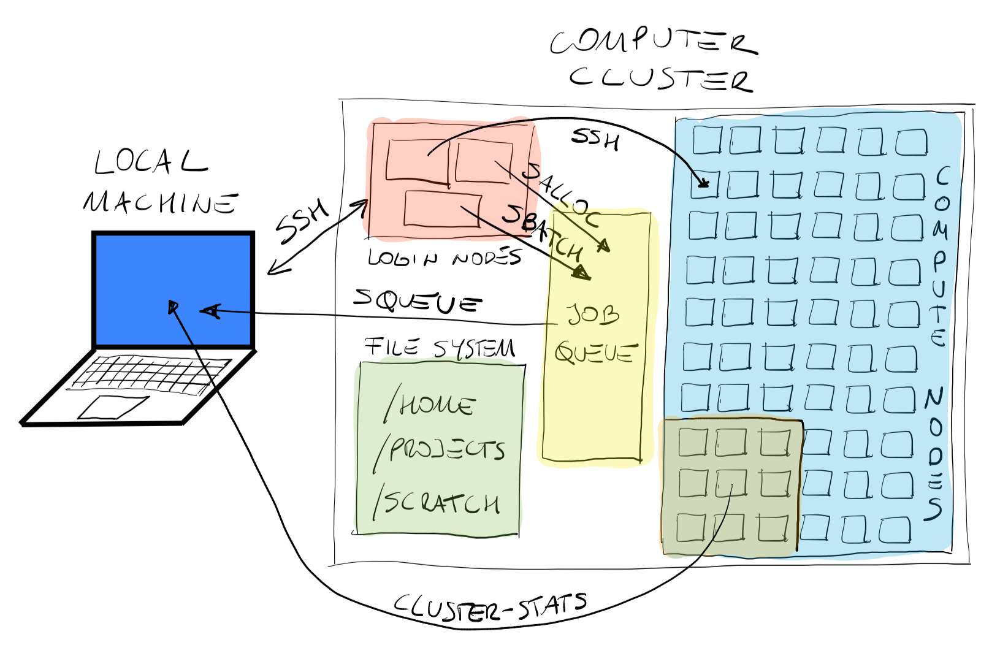

:::note[Learning Objectives]
By the end of this section, you should be able to:
1. Successfully log onto an HPC system.
2. Differentiate between various resources on the HPC system.
3. Understand the difference between various nodes and their tasks.
4. Explore and gather information on the HPC system.
5. Successfully allocate resources on the cluster.
6. Run simple jobs.
:::

## How do we use a computer cluster?

When we interact with a "computer" (laptop, tablet, cellphone) we do so, as mentioned earlier, using the **input** components of the hardware (keyboard, touchpad, etc.) and we expect the **result** of this interaction to be a **visual** display of windows, buttons to push, icons, and widgets. This is known as a **graphical user interface or GUI**. The first thing we realize is that we cannot really work with a computer cluster the same way we work on our regular laptop. The reasons being that (i) the computer cluster may be located very far from our location (maybe even in a different timezone), and (ii) the computer cluster has no direct input methods attached to it and therefore no GUI. The internet made it possible, however, to **connect** to a remote cluster using our local devices connected to a WiFi or VPNs. For practical reasons the communication from the local device and the remote cluster will occurr via command-line interface or CLI. Here, commands are sent as plain-text and if an output is returned, it will be printed as plain text as well. You have probably already seen a CLI (Linux or MacOS terminal windows), and probably already know how to open one on your local device. **If not, don't worry, here are some great resources to start with**. The following lecture will cover **how to successfully open a CLI on the remote machine**, and most importantly **how to do so in a secure way** so that other "listeners" on the same network will not be able to see the commands we are running nor the output we receieve.

## The Secure Shell or SSH Protocol



Common practice almost everywhere around the globe is to connect to a remote machine using the Secure Shell (SSH) protocol. An entire course could be developed on the SSH protocol, but for the sake of this short course think of it as a secure gateaway on the remote machine. As shown in the above figure, SSH enstablishes an encrypted network connection between two machines, and the key feature of course being the work **encrypted**. Data transferred (sent or received) between the local (your laptop) and remote machine (the server) are "encrypted" so that a third party will not be able to read or modify your commands. Other users might still be able to see that data is being trasferred, but they would not be able to read the content in the same way **you will never be able to tell what's inside the 16 Amazon boxes sitting outside your neighbour's front door**; you might guess, but you will never know for sure. The important thing to understand is that for SSH to work, it needs an SSH-client (installed on the local machine) and an SSH-server (installed and configured on the remote machine). Throughout this lecture we will only focus on the SSH-client. SSH-clients are usually command-line tools that only require the address of the remote machine in order to enstablish a connection. If you are working on Linux or MacOS, an SSH-client is already installed (run the command `which ssh` on your terminal to verify), for Windows user we suggest to download the Git package (which comes with its own SSH-client) or MobaXterm.

## Let's establish our first connection

Being this a Compute Ontario course developed by the University of Waterloo, we will carry out our example using one of the Canadian computer clusters. If you are following this course from **somewhere else in the world**, the process is exactly the same. As mentioned earlier, the only requirement by the SSH-client is the address of the remote machine. It will look something like `username@hostname` where:
- `username`: your personal username (Compute Ontario or Digital Research Alliance of Canada).
- `@`: separates the local personal ID and the address of the remote machine.
- `hostname`: the actual address of the remote machine.

Go ahead, open a terminal window (or MobaXterm) and type:
```bash
user@laptop:~$ssh username@narval.computecanada.ca
```
Upon pressing enter you might be asked to input your password. Caution: the character you will type after the password prompt will not be displayed on the terminal. Regular output will resume after pressing enter. If the password is correct you will notice that the terminal **look** changes as we are now connected to the remote machine and a welcome message (along with some instructions) might pop-up as shown below:
```
###############################################################################
                              _
  _ __   __ _ _ ____   ____ _| |   Bienvenue sur Narval / Welcome to Narval
 | '_ \ / _` | '__\ \ / / _` | |
 | | | | (_| | |   \ V / (_| | |   Aide/Support:    support@tech.alliancecan.ca
 |_| |_|\__,_|_|    \_/ \__,_|_|   Globus Collection: Compute Canada - Narval
                                   Documentation:     docs.alliancecan.ca

2024-01-30 - Multifactor authentication / Authentification multifacteur
En:
  Multifactor authentication will soon be mandatory to connect to this cluster.
  You can enroll your account into multifactor authentication on this page:
  https://ccdb.alliancecan.ca/multi_factor_authentications
  by following the instructions available here:
  https://docs.alliancecan.ca/wiki/Multifactor_authentication

  If you need unattended connections, please contact our technical support at
  support@tech.alliancecan.ca before activating multifactor authentication.

Fr:
  L'authentification multifacteur sera bientôt obligatoire pour vous connecter
  à cette grappe. Configurez dès que possible votre compte sur
  https://ccdb.alliancecan.ca/multi_factor_authentications
  et suivez les directives dans
  https://docs.alliancecan.ca/wiki/Multifactor_authentication/fr

  Si votre projet nécessite des connexions automatisées, écrivez à
  support@tech.alliancecan.ca avant d'activer cette nouvelle fonctionnalité.

###############################################################################
```
Along with the overall layout of the terminal window even the terminal prompt changed, and should now look something like:
```bash
[username@narval3 ~]$
```
:::caution
As you log into a remote machine you should be aware of the fact that your username is **public**. This makes the password you have chosen the weakest link in the security chain. If you want a more secure connection, you could generate an SSH key pair (your digital passport). A detailed process on how to set up an SSH key pair can be found [here](https://docs.alliancecan.ca/wiki/SSH_Keys).
:::

## Roaming around our new remote home

The first and most important question should be **where have we actually logged into**? Sometimes, when connecting to a remote machine, we have the misconception that we somehow turned on this giant computer and now we have access to ALL of it. However, the reality is much different. You can check WHO is hosting us by typing:
```bash
[username@narval3 ~]$ hostname
narval3.narval.calcul.quebec
```
Judging by the output, we are definitely on the remote machine, however we logged into something known as a **login node** or **head node**. As shown by the sketch below, login nodes serve as an access point to the cluster. The login node is well suited for uploading and downloading files, setting up software, and running quick tests. **It should never be used to run heavy computations**.



The reason login nodes should never be used to run heavy computations is that most likely, other users are logged into the same node. Type the command:
```bash
[username@narval3 ~]$ who
```
to discover who else is connected to that same node. You might be surprised to discover that (i) there might be quite a lot of people connected at the same time, and (ii) their usernames are public (reason why you should strongly consider setting up an SSH key pair). 

Before roaming around, **let's explore the login node**. Type:
```bash
[username@narval3 ~]$ nproc --all
64
```
What this gives us is the number of CPUs in the current node. Just this one single node has 8 times more compute power than your laptop. To have more information about the login node, you can type:
```bash
[username@narval3 ~]$ lscpu
```
The output of this command will probably give you more information than you can digest, however, in light of the previous lecture here are a few things to highlight from the displayed output:
```
    Architecture:        x86_64
    CPU op-mode(s):      32-bit, 64-bit
    Thread(s) per core:  1
    Model name:          AMD EPYC 7532 32-Core Processor
    CPU MHz:             2395.436
    L1d cache:           32K
    L1i cache:           32K
    L2 cache:            512K
    L3 cache:            16384K
```
You might have also noticed, in the previous commands, that the number after "narval" changed. That is because the login node is usually not only one, but rather a selection of nodes might be set aside by the system administrators to act as login nodes. In the Narval case we know that there are at least 3 login nodes. To check where we actually ARE we can run the command **p**rint **w**orking **d**irectory:
```bash
[username@narval2 ~]$ pwd
/home/username
```
`home` is your remote personal directory on the remote system. You can pack this directory with whatever file/folders you want (during your experience as a researcher with a compute Ontario account), just know that everything you save on the remote machine will STAY on the remote machine and after the login session is closed those files will not be accessible on your local laptop unless you manually downloaded them. The system administrator might also have populated your `/home` with useful directories and links. Run the following command to find out:
```bash
[username@narval2 ~]$ ls
nearline    projects    scratch
```
The output might look a bit different based on the cluster you logged into. For Compute Ontario systems `/home` contains two directories (nearline, and projects) and a "link" (scratch). It will be very clear in later sections the reasons behind these subdivisions. 

You might have probably guessed that if logged into the login node(s) whose purpose is to act as an access point to the cluster, and if there are hundreds of other nodes and thousands of other CPUs, there might be different nodes with different purposes. You would be correct! The most important types of nodes you will probably deal with are:
- **Login nodes**: your access point to the cluster.
- **Compute nodes**: the actual computer power of the cluster, the compute node purpose is to execute jobs.
- **Visualization nodes**: it might be necessary (sometimes) to start a remote graphical user interface to use software such as MATLAB or Paraview. This is usualy done via SSH and X11 forwarding. However, the performance of SSH+X11 is often very limited and the system administrator might set up a few nodes for a Virtual Network Computing (VNC). In very simple terms, VNC is a graphical desktop-sharing system that uses the Remote Frame Buffer protocol (RFB) to remotely control another computer. It transmits the keyboard and mouse input from one computer to another, relaying the graphical-screen updates, over a network.

## The job scheduler



With these many processors and their different purposes, one might wonder **who decides who does what on the cluster**? or **how do we make sure our simulation is running with the parameters it needs**? There is a very impressive piece of software that is in charge of this task known as: the job scheduler. Every cluster has its own scheduler, but its purpose remains the same: to manage the computer cluster resources and allocate jobs submitted by users. In the very simple sketch above, we compare the job scheduler to a restaurant manager. A queue of people is waiting to enter the diner (jobs submitted by users), however they do not sit down immediately but rather pass through the restaurant manager who makes sure that every table's capacity (compute node CPUs) is properly filled and everyone is served in a fair way. In most scenarios, the preferred way of using a computer cluster is to **submit** jobs (workload) to a scheduler system which governs access to compute nodes. the goal of the scheduler, and in general of a queue system, is to optimize and maximize the utilization of the cluster resources and, most importantly, to do so in a fair way to all users. Moreover, the scheduler will make our life much easier when we will need to run **a lot** of computations. Like many other clusters worldwide, Compute Ontario systems use an open-source, fault-tolerant, highly-scalable cluster manager known as SLURM. SLURM (Simple Linux Utility for Resource Management) was developed primarily by Lawrence Livermore National Laboratory and as of 2021 it is the workload manager of about 60% of the TOP500 supercomputers. **It is very much worth knowing how it works**. As a workload manager, SLURM has three key functions:
- **Allocating**: allocating exclusive and/or non-exclusive access to resources (computer nodes) to users for some duration of time.
- **Monitoring**: providing a framework for starting, executing, and monitoring work (typically a parallel job) on a set of allocated nodes.
- **Queue managing**: arbitrating contention for resources by managing a queue of pending jobs.
We will not go into too many details about the structure of SLURM (there are dedicated Compute Ontario courses about this) but here are a few things to remember: (i) SLURM consists of a deamon (slurmd) running **on each** of the compute nodes, and a central deamon (slurmctld) running on a management node, and (ii) information can be fetched using several user commands (salloc, scancel, squeue, sinfo, smap, srun, sbatch) a few of which will be explained in detail below.



The above figure shows the topology of the workflow in the computer cluster. As user we SSH from our local machine to the cluster, and as we have seen earlier we end up on a login node INTO our remote `/home`. From here we have several options: (i) we can submit our jobs to the queue, at what point the queue manager will take care of our **now pending** jobs, or (ii) we can SSH directly into a worker node to perform computations. Once our simulations are running (or maybe still pending) we can fetch information from the queue manager to our local machine about the status of our jobs. Finally, when jobs are completed results can be stored and analyzed in the user's file system. This brings us to the very important ... **structure of storage and file management**. Here are some VERY IMPORTANT pieces of information you might want to remember:
- `/home`: While your home directory may seem like the logical place to store all your files and do all your work, in general this isn't the case; your home normally has a relatively small quota and doesn't have especially good performance for writing and reading large amounts of data. The most logical use of your home directory is typically source code, small parameter files, and job submission scripts.
- `/project`: The project space has a significantly larger quota and is well adapted to sharing data among members of a research group since it, unlike the home or scratch, is linked to a professor's account rather than an individual user. The data stored in the project space should be fairly static, that is to say the data is not likely to be changed many times in a month. Otherwise, frequently changing data, including just moving and renaming directories, in project can become a heavy burden on the tape-based backup system.
- `/scratch`: For intensive read/write operations on large files (> 100 MB per file), scratch is the best choice. The scratch storage should therefore be used for temporary files: checkpoint files, output from jobs and other data that can easily be recreated.
:::danger[Warning]
Important files must be copied off `/scratch` regularly since they are not backed up and older files are subject to purging!
:::

:::note[Learning Objectives]
Having finished this lecture, you should now be able to answer the following important questions:
1. How do I connect to the remote machine?
2. What is a login node? What is a compute node?
3. What is the purpose of the job scheduler?
:::