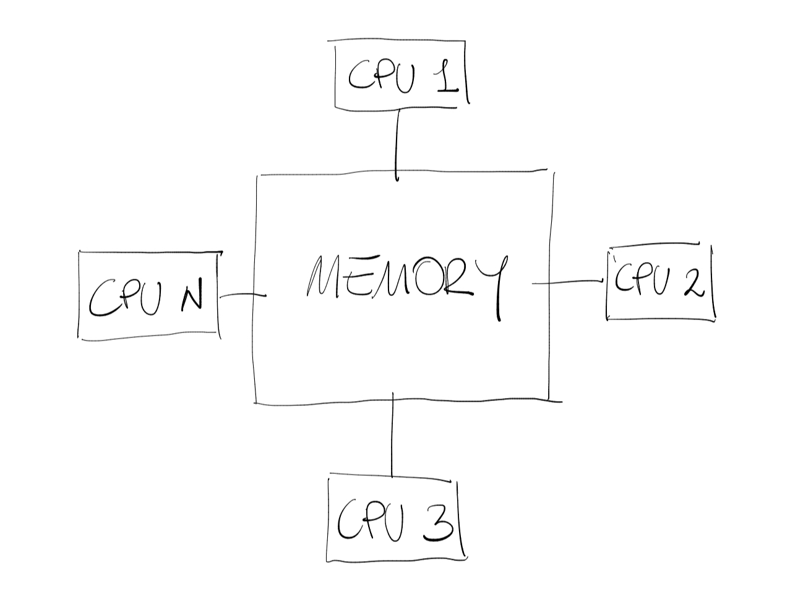
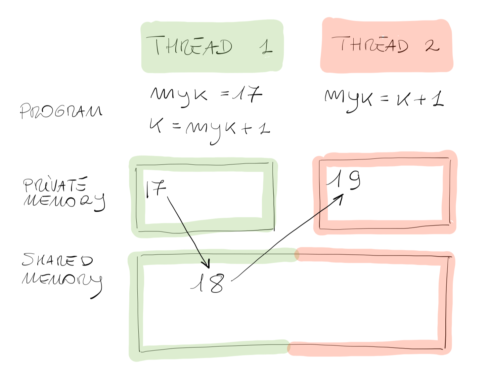
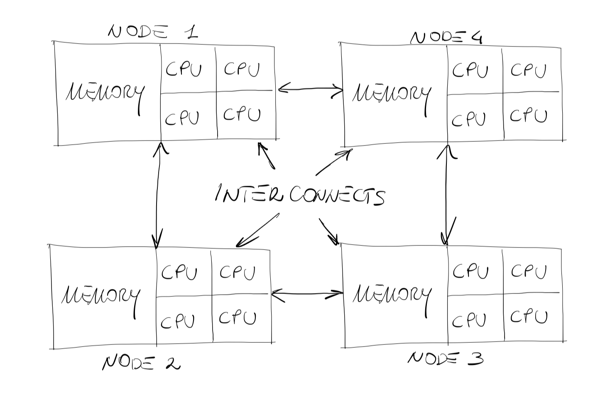
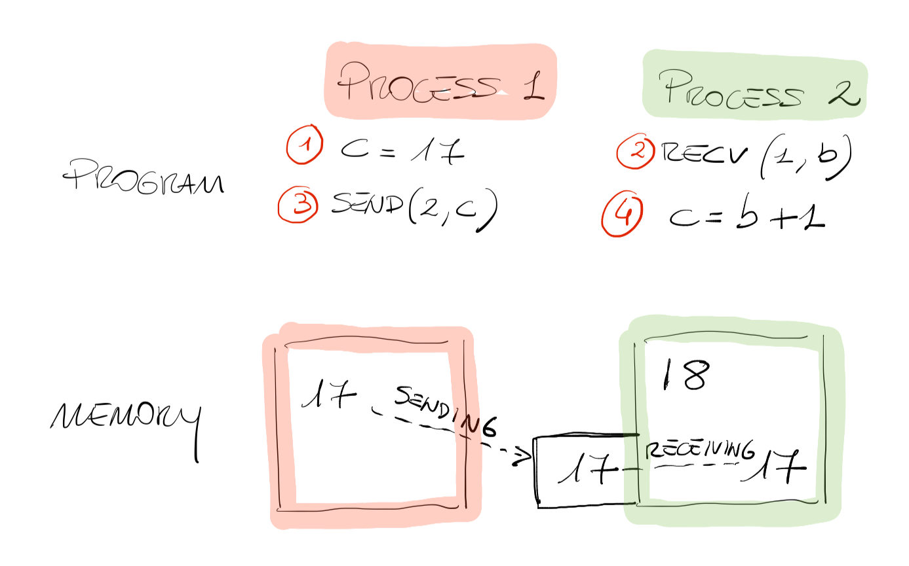
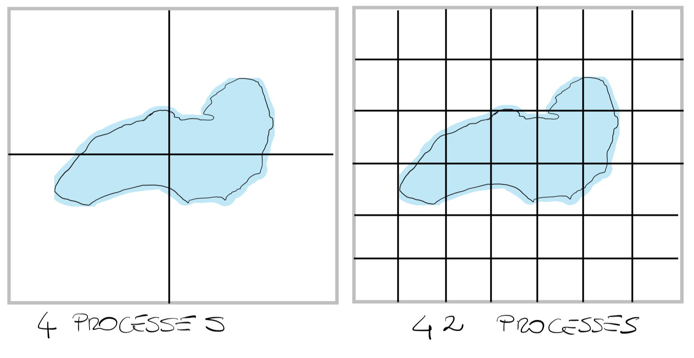
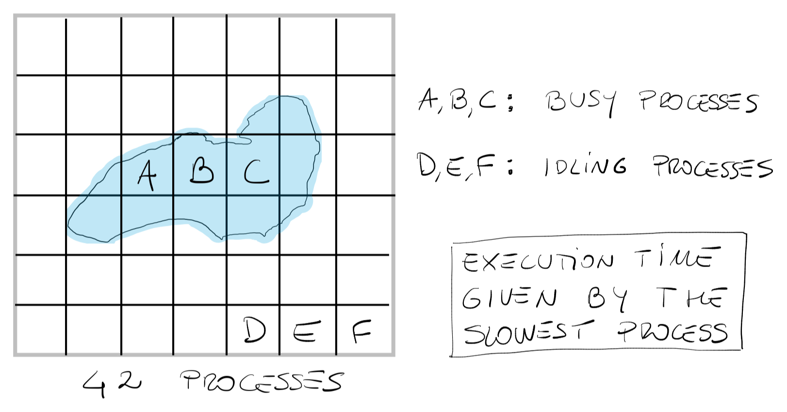
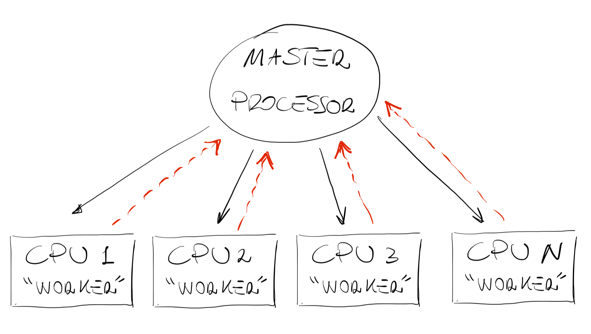
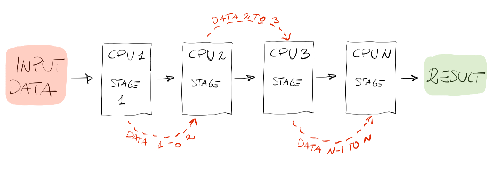
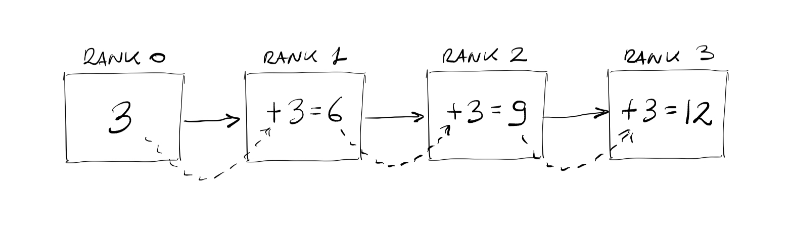

import { Tabs, TabItem } from '@astrojs/starlight/components';
import { Icon } from '@astrojs/starlight/components';
import Caption from '../../../components/Caption.astro';

import Box from '../../../components/Box.astro';
import CustomAside from '../../../components/CustomAside.astro';
import MultipleChoice from '../../../components/MultipleChoice.astro';
import Option from '../../../components/Option.astro';
import CodeFetch from '../../../components/CodeFetch.astro';
import CustomIcon from '../../../components/CustomIcon.astro';

:::note[Learning Objectives]
By the end of this section, you should be able to:
1. Explain the potential benefits of using parallel computing.
2. Use the correct terminology (e.g. thread, process, task) used in computing.
3. Understand the difference between distributed memory and shared memory parallelism.
4. Understand the various types of communication (blocking, non-blocking, collective, etc.) between processes.
:::
<CustomAside icon="pen" title="Time to complete: 55 min" colour="green"></CustomAside>

As mentioned in previous sections, to enhance computational performance we need to distribute the workload among the various resources we have. Take the VERY simple task of copying a 1000-page book: if a single person on average requires 1 hour to copy 1 page, it will take about 125 working days for that single person to copy the entire book. If we now split the workload among 50 people, we will have the work done in about 2.5 working days. In HPC terminology, using 50 processes (or CPUs) we ran the program (copied the book) 50 times faster. We can therefore say that, IDEALLY, we would like a program to run $N$ times faster on $N$ processors. **HOWEVER**, the reality is much different:

1. Not all parts of the program can be successfully split up.
2. Splitting the program up may lead to additional sources of overhead such as communication between processes.

:::caution[Caution]
The way we split up the program is the **critical** point of parallel computing. An efficient parallelization aims at achieving the following results:
1. **Limit communication** (the time processes spend on communicating to each other is time not spent in computing).
2. **Balance the load between processes** in such a way that all processors are equally busy (generally we don't want one processor doing all the work while others wait idling).
:::

Ideally, from the perspective of pure performance, we would like ZERO (or very little) communication between processors. In parallel computing we distinguish between (i) an *embarrassingly parallel* problem which requires little (or NO) interaction between processors (e.g. copying the 1000-page book), and (ii) a *tightly coupled* problem in which a lot of interaction/communication is required between the parallel tasks (e.g. solving the Navier-Stokes equations in a 3D domain). One of the most challenging, yet very important questions in parallel computing is: **how do we split the problem up into smaller tasks?** In other words, **how do we parallelize our code?**. The parallelization strategy heavily depends om the memory structure of the system used. Therefore, before diving into several ways of splitting up the workload, we should focus on ...

## Shared memory architecture & shared parallelism
When a system has a central memory and each CPU can access the same memory space it is known as a shared memory platform. A single node on a computer cluster might look something like this:


<Caption>Shared memory architecture.</Caption>

In a shared memory architecture, CPUs can operate independently on different tasks, however **they see** the same data in the same memory space. In a real-life easy example, it is like having 2 students working independently at two problems using a common very large blackboard containing important data for both (see figure below).


<Caption>Shared memory architecture simple example.</Caption>

The great advantage of this structure is that when the CPU (students) needs some data, it can directly access the shared memory to fetch it (common blackboard), and this process is usually very fast. However, it is very easy to see that problems might arise if student 1, for instance, changes something on the board (shared memory). The change may affect the workflow of student 2. This situation is commonly known as a **race condition**, which occurs when 2 or more CPUs (or threads) try to modify some data in the shared memory at the same time. This problem is due to the fact that the thread scheduling algorithm does not know *a priori* which thread is going to try to access the data first (when the students will need access to the board). It's in the hands of the developer to avoid such a condition. We will not go into details, but one way of mitigating this problem is to equip each thread with its own small **private memory**. In the previous simple example, it would be as if each student has their own notebook. So, what does a parallel algorithm look like in a shared memory architecture? Here is a very simple example:


<Caption>Shared parallelism example.</Caption>

Thread 1 is not able to see the $myk$ value of thread 2 and vice versa, but they can all access the $k$ value contained in the shared memory. It is also very easy to see that thread 2 MUST execute its program **after** thread 1 has completed its execution, and $k$ exists in the shared memory space. Therefore, in both a shared memory architecture and in shared parallelism it is crucial to **think** about the ordering of the data. In HPC terminology we say that in shared memory parallelism **synchronization** between threads is a crucial feature. From a practical point of view, multi-threading parallelism is suited for shared-memory architectures, and can be used on a single node in a computer cluster (e.g. one node on Graham has 32 or 64 CPUs). The framework that provides this parallelism strategy is OpenMP, an Application Program Interface (API) that may be used to explicitly direct multi-threaded, shared memory parallelism in C/C++ programs. 

## Distributed memory architecture & distributed parallelism

<Caption>Distributed memory architecture.</Caption>

Multi-threading is not suited, on the other hand, for distributed memory systems. As shown by the figure above, in a distributed memory architecture (e.g. an heterogeneous computer cluster), each processor (or node) has its own local memory, and they communicate with each other through message passing. This means that they can only access their own memory locations, and exchange information with other processors (or nodes) through sending and receiving messages. 


<Caption>Distributed memory architecture simple example.</Caption>

With a very simple example shown in the figure above, it is like having 2 students sitting in separate rooms each with a blackboard working at the same problem. Student 1 cannot see the data on the board of student 2 and vice versa, however they **depend** on each other for the solution to the problem. They are equipped with a telephone, and the only solution they have to advance towards the solution is calling each other and **passing messages**. The key point of this approach is that as soon as student 1 (process 1) asks the value of $a$ to student 2, then student 1 cannot continue in its execution and must **wait** for the answer from student 2. In HPC the students are known as processes and they are completely independent from each other and share no data. The call from student 1 to student 2 is known as a **blocking call** and the resulting communication is a **blocking-type** communication between processes. In very simple terms a parallel code using the message passing technique might look something like this, where the red numbers denote the order in which instructions must be executed:


<Caption>Distributed parallelism example.</Caption>

Process 1 assigns a value to $c$ and stores it in its private memory allocation (not accessible by process 2). Process 2 then issues a blocking call to receive the value of $c$ from process 1 and call it $b$, after which process 2 is **waiting**. Process 1 responds to the call by **sending** the value of $c$ to process 2 which is ready to receive. Process 2 then computes $c=b+1$. Comparing this approach with the shared-based structure we saw before we can say that in message-passing, the synchronization is automatic (e.g. the student waits until the phone rings), however the parallelization is much more complicated from a developer point of view. It requires more thinking, and might be a bit cumbersome at the beginning, however, and here is the **great advantage** of message-passing, there is no risk whatsoever to corrupt someone else's data. 

## The truth about message passing
In message-passing, the communication can be **synchronous** or **asynchronous**.

1. A synchronous **send** works just like faxing a letter. You fax the letter and **wait** for a message from the other end that tells you that the letter has been received. This process wastes a bit of computational resources as the sending process **hangs** for a confirmation instead of doing useful work.
2. An asynchronous **send** work just like **mailing** a letter. You put your mail in the mailbox and the postman will take care of the delivery process. The sending process does not know **when** the letter will be received but it can continue to do useful work.

In HPC terminology this is known as **point-to-point** communication where we have just **one sender** and **one receiver**. However, just like fax or mails, one could send the same message to several other processes (not just one) therefore initiating what is known as **collective communication**. As we shall see in the following section this is a very common scenario in parallel computing. Collective communication can take the form of a **broadcast**, where the same data is shared with all processes, or (more commonly) of a **scatter send** where only one processor holds all the data it separates and scatters towards all the other processes. For collective type communication we also often use the **gather** call where all processes, after they are done with their calculations, send all the data back to one processor. The framework that provides this parallelism strategy is the **[Message Passing Interface (MPI)](https://arc4cfd.github.io/glossary/#section-1)**.

## Domain decomposition
The most common parallelization strategy, especially in computational fluid dynamics, is known as **domain decomposition**, in which we take advantage of the geometric properties of the problem at hand and split it up into smaller sub-problems to send to various processes. As easy as it might sound, splitting the domain up in small chunks is no easy task, and it is associated with a cost mostly due to the overhead of communication between processes. With the very important goal in mind of **minimizing communication to maximize computation**, let's consider a first simple example: say that we are using a weather forecasting algorithm to study weather changes above lake Ontario.


<Caption>Geometric decomposition 4 vs 42 processes.</Caption>

The figure above shows two very different scenarios: on one side we decomposed the domain in 4 sub domains each corresponding to one process or CPU. On the other side we have split the domain up into 42 processes (or CPUs). The key point of this simple example is that although case 1 limits communications between processes (given that there are only 4) it probably does not take advantage of the computational power available. In case 2 on the other hand, although we managed to split the problem up in several sub-problems, we might run into a larger communication overhead. Therefore, in HPC terminology, the first aspect to consider when trying to decompose a domain is the **granularity** of the problem. 

Another very important aspect to consider is **load imbalance**. Following the previous example, say that we now have a software that allows us to measure water properties. If we run this process using the decomposition of 42 processes, we will probably run into great load imbalance problem. As you can see from figure below, processes **D,E,F** will finish their assigned task quite quickly (as they have no water in their sub-domain) while processes **A,B,C** will be busy doing computation. This is also true for many other processors in this example. The result is that, out of all the processors we are using, only a small fraction are doing useful work while a great percentage of them sit waiting (idling). This is a very undesirable scenario in parallel computing as **the execution time of a parallel task is always determined by the slowest processor**. 


<Caption>Example of load imbalance.</Caption>

:::tip[Rule of thumb]
As a genaral rule, **each processor** should have roughly the same amount of work (a load balance among processors).
:::

## Farming jobs
A very common solution to a **load imbalance** issue is to implement a **master worker parallel pattern** commonly knows as task farm (see figure below).


<Caption>Task farm parallel pattern.</Caption>

In this configuration, after the domain has been decomposed processors are subdivided into one **master** and $N$ **workers**. The job of the master processor is to assign tasks, while the job of the worker is to compute, get the task done, and send the results back to the master. 

<Box>
The great advantages of this structure are that:
1. **Communication is limited** between master and worker.
2. **Load imbalance is prevented.** Often the number of tasks is much larger than the number of processors, and in this scenario as soon as a worker has completed its task the master can assign a new task.
3. **Resilience**. In this type of scenario if something happens to a CPU, or to a node, or if a process is stuck, the final solution is not impacted as the master processor can redistribute the workload of the affected CPU to other workers.
</Box>

**However**, it is easy to see that this type of parallelization only works well when we have very distinct, very independent tasks or, in other words, when limited communication is required between processes. Another very common strategy is:

## Pipelines


<Caption>Pipeline parallel pattern.</Caption>

As shown in the figure above, another common parallel pattern used for computation is the **pipeline** pattern. Suppose your program is composed of well-defined separate stages, one could divide those stages among each processor. Think of the assembly line of a new PC. **Stage 1** could be putting together the motherboard, **stage 2** could be attaching the display adapter, **stage 3** could be attaching the solid state memory, and so on. One great advantage of this pattern, as can be easily seen by the figure, is that there is a 1D flow of data. In other words, stage $N$ only needs data from stage $N-1$. 

This is a very efficient way of parallelizing tasks and most importantly limits the amount of communication required. One might notice, however, that this parallel pattern is not well suited for scaling. For instance, what if the problem we are trying to solve has only 3 stages? Are we limited in using only 3 processes? Or what if something goes wrong in the pipeline and a process gets stuck? These are all valid questions which highlight potential shortcomings of this type of parallel pattern.

<CustomAside icon="star" title="Reality check!" colour="green">
In most modern applications, especially CFD, our program is composed of several sections:
1. Read data from file. 
2. Compute solution. 
3. Write solution to files. 
4. Post-process solution for visualization.
</CustomAside>

Usually each of these individual sections are parallelized using **a combination** of parallel patterns, some of which we have seen above.

## MPI in Python
In this example we will use the **message passing interface (MPI)** in Python to show what has been discussed earlier. Similar libraries can be found in any other programming language (Julia, Fortran, C++, etc). The general **send** and **receive** type of communication follows a few steps:

1. Process 1 decides a message needs to be sent to process 2.
2. Process 1 then prepares all of the necessary data into a buffer for process 2.
3. Process 1 **indicates** that the data is ready to be sent to process 2 by calling the **send** function.
4. Process 2 **first acknowledges** that it wants to receive data from process 1 and **then** asks for the data by calling the **recv** function.

<Box>What is clear from the above workflow is that calls to send/recv are always paired, and every time there is a process sending a message, there must be a process that also indicates it's ready to receive the message. Failing to do so might result in **deadlocks** in your code. Deadlocks happen when a process is waiting to receive a message which is never sent.</Box>

At this point one might ask, **but how does a process know where to send the message?** 

In general, the number of processes used in a given program is fixed and defined at the beginning of execution. Each of the processes is assigned a unique **integer** identifier starting from 0. This integer is known as the **rank** of the processor. Here, we will use **rank** and **process** as synonyms. As their unique identifier, the rank is also the way a process is selected when sending/receiving messages. MPI processes are arranged in logical collections that define which processes are allowed to send and receive messages. **A collection of this type is known as a communicator**. 

There is one special communicator when an MPI program starts, which contains all the processes in the MPI program: the *MPI.COMM_WORLD*. In MPI4py, *comm* is the base class of communicators. One process can learn of other processes by using 2 fundamental methods given by the communicator:
1. *Comm.Get_size*: returns the total number of processes contained in the communicator
2. *Comm.Get_rank*: returns the rank of the calling process within the communicator (different for every process in the program).

## Example: a parallel Hello World

<Box iconName='exercise'>
Here is a very simple application of what we have learned so far. By running the script below using **mpiexec -n p python hwmpi.py**, every worker will print "Hello world".

<Tabs group="tab-group">
    <TabItem label="Code">
        ```python title="hwmpi.py"
        # Hellow world in parallel

        from mpi4py import MPI

        comm = MPI.COMM_WORLD
        worker = comm.Get_rank()
        size = comm.Get_size()

        print("Hello world from worker ", worker, " of ", size)
        ```
    </TabItem>
    <TabItem label="Run command">
        ```bash
        [username@gra-login1 ~]$ mpiexec -n 4 python hwmpi.py
        ```
    </TabItem>
    <TabItem label="Output">
        ```bash
        Hello world from worker  0  of  4
        Hello world from worker  1  of  4
        Hello world from worker  2  of  4
        Hello world from worker  3  of  4
        ```
    </TabItem>
</Tabs>
</Box>


## Example: a parallel sum
<Box iconName='exercise'>
We now wish to write a parallel program to perform the following task:


<Caption>Summation in parallel.</Caption>

```python title="mpi_sum.py"
# A parallel sum

from mpi4py import MPI

comm = MPI.COMM_WORLD
worker = comm.Get_rank()
size = comm.Get_size()

a=3

if(worker == 0):
    print(size," processes started!")
    comm.send(a, dest=worker+1)
    print(worker," I am sending: ",a)
elif worker == size-1:
    rec = comm.recv(source=worker-1)
    print(worker," my step is ",rec+3)
else:
    rec = comm.recv(source=worker-1)
    comm.send(rec+3,dest=worker+1)

print(worker," my step is ",rec+3)
```

</Box>


:::note[Learning Objectives]
Having finished this lecture, you should now be able to answer the following important questions:
1. What is parallel computing?
2. What are the advantages and disadvantages of a shared-memory parallelization strategy?
3. What are the advantages and disadvantages of a distributed-memory parallelization strategy?
4. How do I decompose my problem?
:::