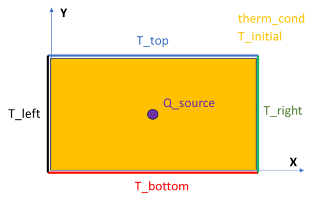
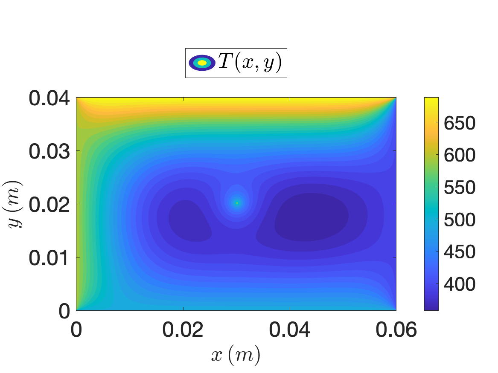

import Caption from '../../../components/Caption.astro';
import Box from '../../../components/Box.astro';
import MultipleChoice from '../../../components/MultipleChoice.astro';
import Option from '../../../components/Option.astro';
import CustomAside from '../../../components/CustomAside.astro';
import Spoiler from '../../../components/Spoiler.astro';
import CodeFetch from '../../../components/CodeFetch.astro';

import { Tabs, TabItem } from '@astrojs/starlight/components';

:::note[Learning Objectives]
By the end of this section, you should be able to:
1. Understand the 2D Poisson equation and its relevant applications for CFD.
2. Understand how to tackle this problem from an analytical perspective.
3. Understand how to tackle this problem from a numerical perspective.
4. Explain the various steps towards the numerical solution.
5. Solve the 2D Poisson equation and similar problem using parallel programming techniques.
:::

## The 2D steady heat conduction equation
In this section you will solve a practical problem taking advantage of all you have learned in the previous sections. Say your task is to study how heat is conducted in a square plate in which the 4 boundaries are at differente temperatures and a heat source is present at the center of the domain. As you may recall, this problem is mathematically described by the Poisson equation:
$$
    \nabla^2 T\left(x,y\right) + \frac{\dot{q}}{k} = 0
$$
where $T\left(x,y\right)$ is the variable temperature (function of the 2 spatial directions in a cartesian coordinate system), $\nabla^2$ is the Laplacian operator defined as $\nabla^2=\left(\partial^2/\partial x^2+\partial^2/\partial y^2\right)$, $\dot{q}$ is the heat source, and $k$ is the thermal conductivity of the medium. This is one of the most important partial differential equations in physiscs, and due to its elliptical character one of the most challenging (from a CPU time prospective) to solve numerically. For CFD applications, Poisson equation is particularly important as the PDEs describing fluid motion, the well known Navier-Stokes system of equations, is characterized by an elliptical characteristic in its viscous force term, and depending on the solution method one of the most expensive (if not the most expensive) step is the solution of a Poisson equation. It is important to note that the equation above can be solved analytically, and the solution will be valid **at every** point inside the domain. However, for very large domains, finding the analytical solution becomes a limiting task, and we tackle the problem numerically.


:::caution[Be cereful]
Solving the equation above numerically **WILL NEVER** give us the analytical solution, but rather **AN APPROXIMATION** of the analytical solution. How close the approximate solution will be to the analytical one will depend on our choices in the next section. 
:::

However, **as you shall see in section 2 of this course**, many problems in physics and engineering do not have an analytical solution, therefore it is IMPERATIVE to know we can trust our results. This is not meant to be a course on numerical methods, therefore we will not go into the details of the numerical solution, however here are the steps we will follow:

1. Domain discretization: replace the homogeneous domain with a set of discrete nodes.
2. Transform PDE to algebraic ODE: replace the partial derivatives with quotiens.
3. Boundary conditions.
4. Convergence criterion.

## Domain discretization
A rectangular plate is subject to constant temperature (Dirichlet) boundary conditions (uniquely input for each 4 sides) and has a heat source (input units in $W/m^2$) at its centre as shown in the figue below. We wish to solve the 2D steady heat conduction equation to model the behavior of temperature on the plate.


<Caption>Boundary and initial conditions of the rectangular plate.</Caption>

In this first step, we replace the object *plate* with a set of discrete grid points or **nodes** by specifying the size of the grid spacing in both directions $\Delta x$ and $\Delta y$. Given the simplicity of the Cartesian-type grid, we can map every node in the domain with a pair of indices $i,j$. Therefore the variable temperature $T$ in a generic node (red dot in the figure below) will be labled as $T_{i,j}$.


<Caption>Grid generation or Meshing.</Caption>

This process is commonly known as **grid generation step** or **mesh generation**. This step is not trivial in general and computationally very expensive depending on the size and complexity of the geometry. In our illustrative case we have 6 interior nodes and 14 boundary nodes.

## Transform PDEs to algebraic equations
The original problem to solve is a second order partial differential equation of the form:
$$
    \frac{\partial^2 T}{\partial x^2} + \frac{\partial^2 T}{\partial y^2} + \frac{\dot{q}}{k}=0
$$

Many techniques are used to **discretize** the governing equations, and entire textbooks are devoted to the theory behind it. Here we use the very simple yet widely used **finite difference** method to write the PDE as a set of finite differences:

$$
    \frac{T_{i+1,j}+T_{i-1,j}-2T_{i,j}}{\Delta x^2} + \frac{T_{i,j+1}+T_{i,j-1}-2T_{i,j}}{\Delta y^2}+\frac{\dot{q}}{k}=0
$$

One can then rearrange the above equation to find the value of temperature at each node $T_{i,j}$:

$$
    2T_{i,j}\left(1+\beta\right) = T_{i-1,j} + T_{i+1,j} + \beta\left(T_{i,j-1} + T_{i,j+1}\right)-\Delta x^2\frac{\dot{q}}{k}
$$
 
where $\beta=\Delta x^2/\Delta y^2$. The equation above can be easily programmed in any programming language and solved it to find the approximate solution for $T\left(x,y\right)$.

:::danger[IMPORTANT]
Note that $T_{i,j}$ refers to the temperature value at a nodal location, and therefore to solve the equation above and calculate $T_{i,j}$ we need the knowledge of temperature at every neighboring point. In numerical analysis this is often referred to as a 4-points stencil problem.
:::


## Apply boundary conditions
This is a crucial step towards the numerical solution, and many problems in CFD or other fileds arise, often, due to a poor application of boundary conditions. In this very simple case, the temprature is set at every face of the domain. Given that the plate does not exist anymore as we have subsituted it with a set of **nodes**, the boundary condition must be set on the nodes that are sitting on the boundary. Following the skematic figure above, one might say:

$$
    T_{1,0}=T_{2,0}=T_{3,0}=T_{bott}\quad\rightarrow\quad T_{0,1}=T_{0,2}=T_{left}
$$

Special care has to be devoted to the corner points as the temperature wil be an average of the temperature at its neighboring points.

## Solve the system of linear equations
The result of step 1 to 3 is a linear system of equations of the form:
$$
    A x = b
$$

Where $A$ is a matrix with some very special characteristics (tridiagonal for 1D case, pentadiagonal for 2 case etc.), $x$ is the variable field (in our case temperature), and $b$ is the right hand side (RHS). Because the temperature at the boundary nodes is known (boundary conditions) the system of linear equations must be solved for the interior points. Several techniques are described in the literature, however they mostly belong to 2 classes:

1. Direct methods: such as Gauss-Jordan elimination method based on matrix inversion technique.
2. Iterative methods: such as Gauss-Seidel method or Jacobi iterative method.

In this example we use the **Jacobi** iterative method although the procedure to find the approximate solution is the same for all methods in these categories. The solution to the linear system of equations will give us the temperature at all internal nodes $T_{i,j}$ and therefore the desired temperature profile $T\left(x,y\right)$ accross the plate.

## Convergence criterion
If an iterative method is used to solve the linear system of equations, a convergence criterion must be chosen to **STOP** the itearation loop. In this very simple case we might know the analytical solution to the problem and therefore perform a direct check with the approximate solution, however this is not the case in most engineering applications. The exact solution is almost always unknown and we need to be able to find ways to monitor the iterative process. One very simple yet weak method of improving the numerical solution is simply to increase the number of iterations. However this method does not allow us to understand if the numerical solution is reaching a **converged** result, or if it's just oscillating or diverging.

The most common technique to monitor iterations, and ensure that convergence is reached is by checking the **residual**. Once the $k$-th iteration has been computed we can define the residual as:
$$
    r^{k}=A\,x^{k} - f
$$

Where $x^{k}$ is the approximate solution at the $k$-th iteration. To have a measure of the residual comparable to every mesh count the RMS is often used as a more accurate parameter $||r^{k}||/\sqrt{n}$.

:::danger[IMPORTANT]
Note that convergence does not mean that the approximate solution is approaching the exact solution. It only means that the **numerical method** used is not oscillating or diverging but rather going towards a unique result.
:::

## Parallelization strategy
As mentioned earlier, often times, the matrix $A$ is **very** large depending on our mesh size, and not only solving the problem analytically becomes impossible, but even finding the approximate solution with a numerical method on a single processor can be very time consuming. Therefore one should take advantage of the parallel computing strategy and exploit the capabilities of modern computer cluster.

In the following, we provide a parallelized code, written in Python programming language, to solve the 2D Poisson equation as described above. In the code, the user specifies the following input parameters (highlighted in grey in the code below):

1. **The size of the domain**: x_length, y_length.
2. **The number of interior nodes**: x_node, y_node.
3. **Boundary conditions**: T_top, T_right, T_bottom, T_left.
4. **The strength of the source** $\dot{q}$: Q_source
5. **The thermal conductivity** $k$: therm_cond
6. **The number of maximum iterations**: iterations
7. **The tolerance for the convergence check**: epsilon

<details>
    <summary>Click HERE to see the code</summary>
    <CodeFetch rawURL='https://raw.githubusercontent.com/ARC4CFD/arc4cfd/dev/section1/heat_conduction_mpi.py' lang='python' meta="title='heat_conduction_mpi.py' mark={31-50}" />
</details>

Since the domain size is user defined, the solution matrix, *T_final*, can have more number of grid points in either rows or columns. *Regardless, the matrix splitting method implemented in the code ensures that splitting occurs only for the direction having highest number of grid points.* The code also pads boundary conditions to the user-defined interior points (2 in each x and y directions). Code documentation describes clear sections for scattering, Jacobi iterations and gathering of the solution matrix.


## Code upload on cluster and execution
Say you have written your code using your preferred text editor on your laptop. You now want to carry out some scaling tests on the cluster. The first step would be tro transfer the code to your account on the remote machine. This is usually done by **Secure File Transfer Protocol (SFTP)**. SFTP works in a very similar way to SSH and it allows you to *put* or *get* stuff from your remote account. Open a terminal windown where your code is and type:

```bash
[username@laptop ~]$ sftp username@graham.computecanada.ca
```

Upon login your terminal will, once again, change and should look something like this:
```bash
sftp>
```

You can now navigate to the directory where you want to upload your code to, and simply type:
```bash
sftp> put heat_conduction.py
Uploading heat_conduction.py to /home/username/heat_conduction.py
heat_conduction.py                  100% 9515   144.2KB/s   00:00
```

You are now ready to test your code on the cluster following what you have learned in previous sections of this course. The code can be executed using the following script in **interactive mode**:
```bash
mpiexec -n <number-of-processors> python heat_conduction.py
```


## Results format and benchmark
Performance of the code is displayed in console, containing following information:

1. *Nodes*: (total number of grid points including boundary nodes).
2. *Cores*: (computational cores used for the execution).
3. **Computational time**: (elapsed wall-clock time for execution).

A result file in csv format is also generated in the working directory, containing the temperature field solution. It has a naming format as follows: *Nodes_Cores.csv*.

In the result file, top and bottom rows, and left and right columns correspond to respective imposed boundary conditions.

As a benchmark we solved the 2D poisson for 240 nodes in $x$ and 160 nodes in $y$ using 1, 4, 8, 16, and 32 processors:

<Tabs group="tab-group">
    <TabItem label="1 CPU">
    ```bash
    [username@gra287 ~]$ mpiexec -n 1 python heat_conduction.py
    ['Nodes: ', 39204, ' Cores: ', 1, ' Computation Time: ', 748.971311, ' sec']
    Number of iterations:  3999
    ```
    </TabItem>
    <TabItem label="4 CPUs">
    ```bash
    [username@gra287 ~]$ mpiexec -n 4 python heat_conduction.py
    ['Nodes: ', 39204, ' Cores: ', 4, ' Computation Time: ', 188.380842, ' sec']
    Number of iterations:  3999
    ```
    </TabItem>
    <TabItem label="8 CPUs">
    ```bash
    [username@gra287 ~]$ mpiexec -n 8 python heat_conduction.py
    ['Nodes: ', 39204, ' Cores: ', 8, ' Computation Time: ', 97.032174, ' sec']
    Number of iterations:  3999
    ```
    </TabItem>
    <TabItem label="16 CPUs">
    ```bash
    [username@gra287 ~]$ mpiexec -n 16 python heat_conduction.py
    ['Nodes: ', 39204, ' Cores: ', 16, ' Computation Time: ', 50.451914, ' sec']
    Number of iterations:  3999
    ```
    </TabItem>
    <TabItem label="32 CPUs">
    ```bash
    [username@gra287 ~]$ mpiexec -n 32 python heat_conduction.py
    ['Nodes: ', 39204, ' Cores: ', 32, ' Computation Time: ', 30.048742, ' sec']
    Number of iterations:  3999
    ```
    </TabItem>
</Tabs>

Here are a few things to highlight:

1. We first notice that parallelization will improve the performance of our code to a great extent.
2. We also notice that increasing the number of processors by a factor of 2 does not cut the computational time required by a factor of 2. This is expected, based on what we learned above, as increasing the number of processors also increases the amount of communication required between them.
3. The number of iterations to reach the desired tolerance does not change.

## Visualization of results
In most cases we won't be able to visualize our results directly on the cluster. Therefore, results have to be downloaded to our local machine. Once again we will use the SFTP protocol to do that. After you have successfully logged into the cluster using SFTP, type the following command:
```bash
get 39204_32.csv
Fetching /home/username/39204_32.csv to 39204_32.csv
39204_32.csv                                  100%  421KB   1.0MB/s   00:00    
```

Once downloaded in the local machine, results can be visualized using the software of preference. In the following we make the example of a simple Matlab routine to plot the tempreature contours:

```matlab
%% Visualizing temperature contour
close all; clear all; clc;

T_final=load('39204_32.csv');
[nj,ni] = size(T_final);

Lx=linspace(0,0.06,ni);
Ly=linspace(0,0.04,nj);

figure;
set(gcf,'DefaultAxesFontsize',24);
contourf(Lx,Ly,T_final,30,'LineStyle','none')
colormap parula;
shading interp;
axis equal;
colorbar;

xlabel('$x\,(m)$','FontSize',24,'Interpreter','latex');
ylabel('$y\,(m)$','FontSize',24,'Interpreter','latex');
legend('$T(x,y)$','FontSize',24,'Interpreter','latex','location','northoutside');
```

Here is the output of the Matlab routine:

<Caption>Contours of temperature in the rectangular plate.</Caption>


:::note[Learning Objectives]
Having finished this lecture, you should now be able to answer the following important questions:
1. What is the 2D Poisson equation?
2. Why is the 2D Poisson equation relevant for CFD applications?
3. What are the important stesps towards the numerical solution of the 2D Poisson equation?
4. How do I run a parallel job on the cluster?
:::