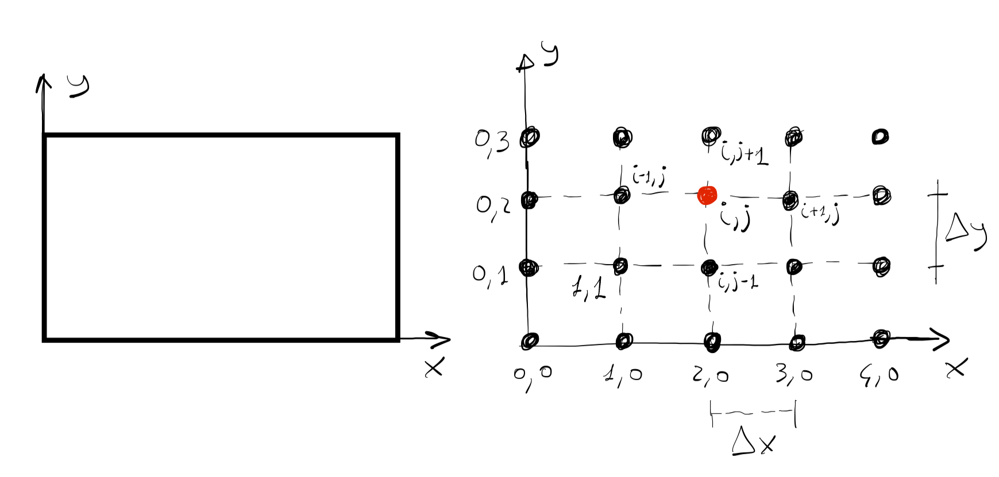
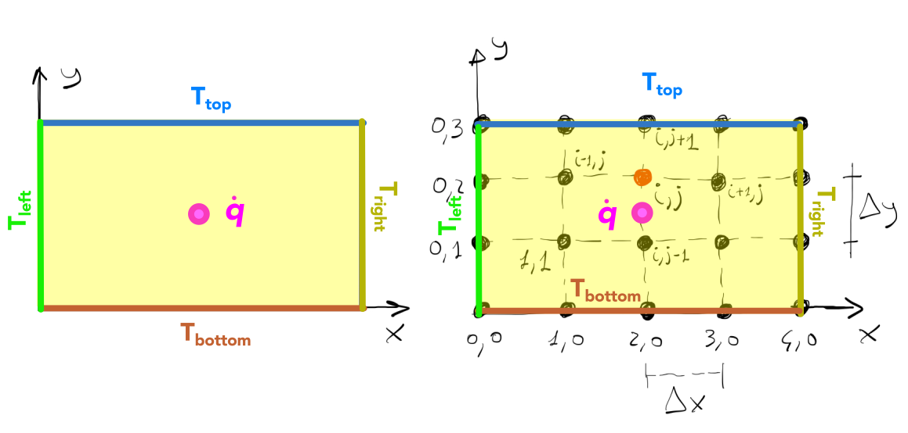
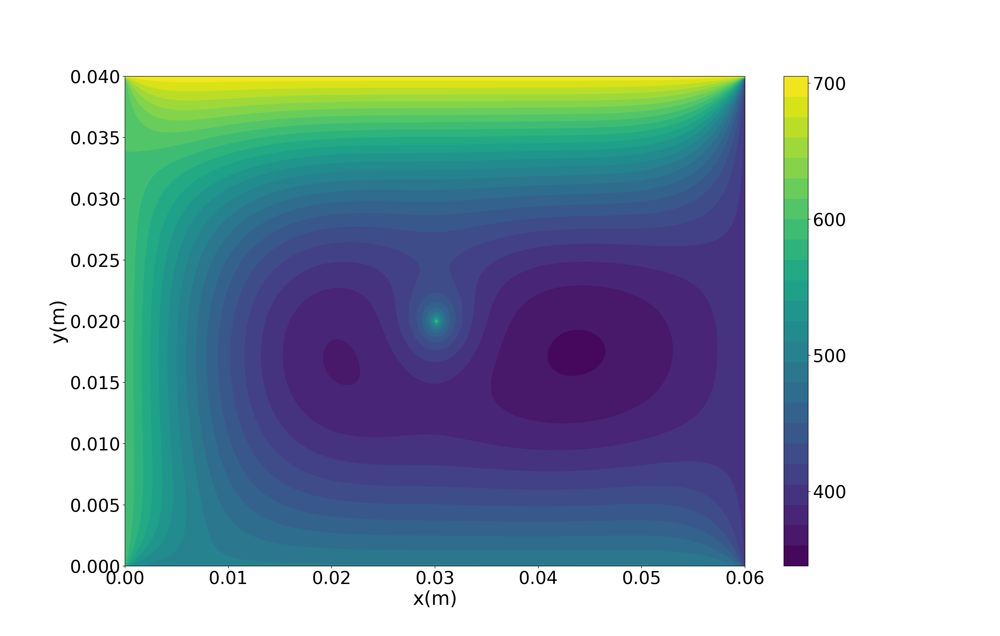

import Caption from '../../../components/Caption.astro';
import Box from '../../../components/Box.astro';
import MultipleChoice from '../../../components/MultipleChoice.astro';
import Option from '../../../components/Option.astro';
import CustomAside from '../../../components/CustomAside.astro';
import Spoiler from '../../../components/Spoiler.astro';
import CodeFetch from '../../../components/CodeFetch.astro';
import { YouTube } from '@astro-community/astro-embed-youtube';
import { Tabs, TabItem } from '@astrojs/starlight/components';
import { Icon } from '@astrojs/starlight/components';

:::note[Learning Objectives]
By the end of this section, you should be able to:
1. Discretize and solve a simple elliptic PDE
2. Define the initial and boundary conditions to the problem
3. Implement a distributed memory parallelization
4. Describe the typical workflow for HPC computations
:::
<CustomAside icon="pen" title="Time to complete: 60 min" colour="green"></CustomAside>

<YouTube id='WjKyCi96t90' />


## Two-dimensional heat conduction problem
In this section we will solve a practical problem using parallel computing. Say your task is to study heat conduction in a square plate, in a two-dimensional space in a steady state, in which all four sides are at different temperatures and a heat source is located at the centre of the domain. As you may recall, this problem is mathematically described by the Poisson equation:
$$
    \nabla^2 T\left(x,y\right) + \frac{\dot{q}}{k} = 0
$$
where $T\left(x,y\right)$ is the temperature, which is a function of the two spatial dimension, $\nabla^2$ is the Laplacian operator defined as $\nabla^2=\left(\partial^2/\partial x^2+\partial^2/\partial y^2\right)$, $\dot{q}$ is the heat source, and $k$ is the thermal conductivity of the medium. This is one of the most important partial differential equations in physics and, due to its elliptical character, has some unique challenges in solving in parallel. The solution of elliptic PDEs depend uniquely on the values at the boundaries and the sources in the domain. For CFD applications, the Poisson equation is particularly important as the PDEs describing fluid motion, the well known Navier-Stokes system of equations, has elliptic characteristics, particularly in its incompressible formulation.  Thus, a Poisson equation must usually be solved and, depending on the solution method, is one of the most expensive steps in the CFD calculation.  Although the above equation could be solved analytically, we focus on its numerical solution.


:::caution[Be careful]
Solving the equation above numerically will only asymptotically tend towards the analytical solution. The discretized solution of the equation will give an approximation of the analytical solution. 
:::

This lesson is meant to provide an overview of the solution procedure, therefore the intricate details of the numerical methods will not be covered. Instead, we refer the interested reader to [CFD Python: 12 steps to Navier-Stokes](https://lorenabarba.com/blog/cfd-python-12-steps-to-navier-stokes/) for additional information on the numerics used herein.

For the solution of the above PDE, we will follow the following steps:
1. Discretize the spatial domain
2. Transform PDE to algebraic ODE
3. Define boundary conditions
4. Solve the algebraic equation until convergence

### Domain discretization
In this first step, we discretize the plate dividing up the domain into a set of discrete grid points. Here, out of simplicity, we will assume that the grid points are equally spaced in both directions, thus we define the spacing between then by $\Delta x$ and $\Delta y$. Given the simplicity of the Cartesian discretization grid (we will define the structured grid in the next section), we can identify every grid point in the domain by a pair of indices $i,j$. Therefore the variable temperature $T$ at a grid point (red dot in the figure below) will be labeled as $T_{i,j}$.


<Caption>Domain discretization</Caption>

This process is can be thought of as the grid generation step. This step is not trivial in general and can be computationally very expensive depending on the size and complexity of the geometry. In our illustrative case we have 6 interior grid points and 14 boundary grid points.

### Transform PDEs to algebraic equations
The original equation that governs the physics of the problem is a second-order partial differential equation of the form:
$$
    \frac{\partial^2 T}{\partial x^2} + \frac{\partial^2 T}{\partial y^2} + \frac{\dot{q}}{k}=0
$$

Many techniques are used to **discretize** the governing equations, and entire textbooks are devoted to the theory behind it. Here we use the very easy **finite difference** method to write the PDE as a set of finite differences:

$$
    \frac{T_{i+1,j}+T_{i-1,j}-2T_{i,j}}{\Delta x^2} + \frac{T_{i,j+1}+T_{i,j-1}-2T_{i,j}}{\Delta y^2}+\frac{\dot{q}}{k}=0
$$

One can then rearrange the above equation to find the value of temperature at each grid point $T_{i,j}$:

$$
    2T_{i,j}\left(1+\beta\right) = T_{i-1,j} + T_{i+1,j} + \beta\left(T_{i,j-1} + T_{i,j+1}\right)-\Delta x^2\frac{\dot{q}}{k}
$$
 
where $\beta=\Delta x^2/\Delta y^2$.  Note that $T_{i,j}$ refers to the temperature value at a nodal location, and therefore to solve the equation above and calculate $T_{i,j}$ we need the knowledge of temperature at every neighboring point. In numerical analysis this is often referred to as a 4-points stencil problem.


### Apply boundary conditions
As the PDE corresponds to a boundary-value problem, the temperature values at the boundaries need to be provided in order to solve the governing equation. We consider the rectangular plate is subject to constant temperature (Dirichlet) boundary conditions and has a heat source (input units in $W/m^2$) at the centre as shown in the figure below. 


<Caption>Boundary conditions of the rectangular plate.</Caption>

In this very simple case, the temperature is set on every side of the domain. Since many grid points are located on the boundary, the temperature of these grid points are known. Following the schematic figure above, one might say:

$$
    T_{1,0}=T_{2,0}=T_{3,0}=T_{bottom}\quad \text{and}\quad T_{0,1}=T_{0,2}=T_{left} 
$$
$$
     T_{1,3}=T_{2,3}=T_{3,3}=T_{top}\quad \text{and} \quad T_{4,1}=T_{4,2}=T_{right}
$$

Given the four point stencil used in the problem, the corner points do not need to be defined as they do not enter into the solution of the interior points.

### Solve the system of linear equations until convergence 
The solution of the set of discretized governing equation can be represented by a linear system of equations of the form:
$$
    A T = b
$$

Where $A$ is a sparse matrix the size of which is related to the number of unknowns in our problem, $T$ is the variable field (in our case temperature), and $b$ is the right hand side (RHS). Because the temperature at the boundary grid points is known (boundary conditions) the system of linear equations must be solved for the interior points. Several techniques are described in the literature, however they mostly belong to two classes:

1. **Direct methods**: such as Gauss-Jordan elimination method based on matrix inversion technique
2. **Iterative methods**: such as Gauss-Seidel method or Jacobi iterative method

In this example we use the Jacobi iterative method. The solution to the linear system of equations will give us the temperature at all internal grid points $T_{i,j}$ and therefore the desired temperature profile $T\left(x,y\right)$ across the plate.

If an iterative method is used to solve the linear system of equations, a convergence criterion must be chosen to STOP the iteration loop. In this very simple case, as the governing equations admit an analytical solution, we could define a convergence criterion based on the error from the exact solution. However, in most general cases, the governing do not admit an analytical solution. 

The most common technique to monitor iterations, and ensure that convergence is reached is by checking the *residual*. Once the $k$-th iteration has been computed we can define the residual as:
$$
    r^{k}=A\,T^{k} - b
$$

Where $T^{k}$ is the approximate solution at the $k$-th iteration. To have a measure of the residual comparable at different mesh resolutions, the **norm** is often used as a more accurate parameter:
$$
||r^{k}||/\sqrt{n}
$$


## Parallelization strategy
As mentioned earlier,  the matrix $A$ could be very large depending on our grid size, thus finding an approximate solution with a numerical method on a single processor can be very time consuming. Therefore, one should take advantage of the parallel computing strategy and exploit the capabilities of modern computer clusters.

In the following, we provide a parallelized code, written in the Python programming language, to solve the 2D Poisson equation as described above. Learners without a basic knowledge of Python should consider the following a [tutorial](https://swcarpentry.github.io/python-novice-inflammation/).  In the code, the user specifies the following input parameters (highlighted in grey in the code below):

1. **Size of the domain**: x_length, y_length.
2. **Number of interior grid points**: x_node, y_node.
3. **Boundary conditions**: T_top, T_right, T_bottom, T_left.
4. **Strength of the source** $\dot{q}$: Q_source
5. **Thermal conductivity** $k$: therm_cond
6. **Maximum number of iterations**: iterations
7. **Tolerance for the convergence check**: epsilon

The parallelized code can be downloaded from the accompanying [ARC4CFD git repository](https://github.com/ARC4CFD/arc4cfd) or copied from below. This code can be run on the HPC clusters or locally. The parallelization is achieved by using a distributed memory architecture with message passing interface (MPI).
<details>
    <summary>Click HERE to see the code</summary>
    <CodeFetch rawURL='https://raw.githubusercontent.com/ARC4CFD/arc4cfd/master/Section1/heat_conduction_mpi.py' lang='python' meta="title='heat_conduction_mpi.py' mark={31-50}" />
</details>

Since the domain size is user defined, the solution matrix, *T_final*, can have more grid points in either the rows ($x$) or columns ($y$). For the distribute memory parallel implementation, the domain is divided in the direction with the having highest number of grid points.  The documentation describes each code section: scattering, Jacobi iterations, and gathering of the solution matrix.


### Code upload on cluster and execution
Say you have written your code using your preferred text editor on your laptop. You now want to carry out some scaling tests on the cluster. The first step would be to transfer the code to your account on the remote machine. This is usually done by **[Secure File Transfer Protocol (SFTP)](https://arc4cfd.github.io/glossary/#section-1)**. SFTP works in a very similar way to SSH and it allows you to *put* or *get* stuff from your remote account. Open a terminal window where your code is and type:

```bash
[username@laptop ~]$ sftp username@graham.computecanada.ca
```

Upon login your terminal will, once again, change and should look something like this:
```bash
sftp>
```

You can now navigate to the directory where you want to upload your code to, and simply type:
```bash
sftp> put heat_conduction.py
Uploading heat_conduction.py to /home/username/heat_conduction.py
heat_conduction.py                  100% 9515   144.2KB/s   00:00
```

If you plan to run anything more than a trivially small case, you should request an interactive node. After loading the required python module using the command we learned in [section 1.3](https://arc4cfd.github.io/section1/part3/#the-module-system) `module load python/3.11.2`, you are now ready to test your code on the cluster. The code can be executed using the following script:
```bash
mpiexec -n <number-of-processors> python heat_conduction.py
```


### Results format and benchmark
Performance of the code is displayed in the console with containing following information:

1. **Grid points**: (total number of grid points including boundary grid points).
2. **Cores**: (computational cores used for the execution).
3. **Computational time**: (elapsed wall-clock time for execution).

A result file in csv format is also generated in the working directory, containing the temperature field solution. It has a naming format as follows: *Nodes_Cores.csv*.

In the result file, top and bottom rows, and left and right columns correspond to respective imposed boundary conditions.

As a benchmark we solved the 2D poisson for 240 grid points in $x$ and 160 grid points in $y$ using 1, 4, 8, 16, and 32 processors:

<Tabs group="tab-group">
    <TabItem label="1 CPU">
    ```bash
    [username@gra287 ~]$ mpiexec -n 1 python heat_conduction.py
    ['Grid points: ', 39204, ' Cores: ', 1, ' Computation Time: ', 748.971311, ' sec']
    Number of iterations:  3999
    ```
    </TabItem>
    <TabItem label="4 CPUs">
    ```bash
    [username@gra287 ~]$ mpiexec -n 4 python heat_conduction.py
    ['Grid points: ', 39204, ' Cores: ', 4, ' Computation Time: ', 188.380842, ' sec']
    Number of iterations:  3999
    ```
    </TabItem>
    <TabItem label="8 CPUs">
    ```bash
    [username@gra287 ~]$ mpiexec -n 8 python heat_conduction.py
    ['Grid points: ', 39204, ' Cores: ', 8, ' Computation Time: ', 97.032174, ' sec']
    Number of iterations:  3999
    ```
    </TabItem>
    <TabItem label="16 CPUs">
    ```bash
    [username@gra287 ~]$ mpiexec -n 16 python heat_conduction.py
    ['Grid points: ', 39204, ' Cores: ', 16, ' Computation Time: ', 50.451914, ' sec']
    Number of iterations:  3999
    ```
    </TabItem>
    <TabItem label="32 CPUs">
    ```bash
    [username@gra287 ~]$ mpiexec -n 32 python heat_conduction.py
    ['Grid points: ', 39204, ' Cores: ', 32, ' Computation Time: ', 30.048742, ' sec']
    Number of iterations:  3999
    ```
    </TabItem>
</Tabs>

Here are a few things to highlight:

1. We first notice that parallelization will improve the performance of our code to a great extent.
2. We also notice that increasing the number of processors by a factor of 2 does not cut the computational time required by a factor of 2. This is expected, based on what we learned above, as increasing the number of processors also increases the amount of communication required between them.
3. The number of iterations to reach the desired tolerance does not change.

### Visualization of results
Since this is a small problem, we can download the results to our local machine for postprocessing. Once again we will use the SFTP protocol to do that. After you have successfully logged into the cluster using SFTP, type the following command:
```bash
get 39204_32.csv
Fetching /home/username/39204_32.csv to 39204_32.csv
39204_32.csv                                  100%  421KB   1.0MB/s   00:00    
```

Once downloaded on the local machine, results can be visualized using the software of preference. In the following we make the example of a simple Python script to plot the temperature contours:


{/* <CodeFetch rawURL='https://raw.githubusercontent.com/ARC4CFD/arc4cfd/master/Section1/result_vis.m' lang='matlab' meta='title="result_vis.m"' /> */}
<CodeFetch rawURL='https://raw.githubusercontent.com/ARC4CFD/arc4cfd/master/Section1/result_vis.py' lang='python' meta='title="result_vis.py"' />

Here is the output of the Python script:

<Caption>Contours of temperature in the rectangular plate.</Caption>


:::note[Learning Objectives]
Having finished this lecture, you should now be able to answer the following important questions:
1. What is the 2D Poisson equation?
2. Why is the 2D Poisson equation relevant for CFD applications?
3. What are the important steps towards the numerical solution of the 2D Poisson equation?
4. How do I run a parallel job on the cluster?
:::