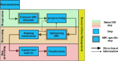

:::note[Learning Objectives]
By the end of this section, you should be able to:
1. Estimate the approximate computational cost for a CFD problem.
2. test
:::

## CFD and HPC
Computational Fluid Dynamics (CFD) is the study of fluids through the numerical solution of the equations governing their motion.    Most common CFD solvers rely on the discretized solution of the Navier-Stokes (NS) equations.  Although other approaches such as Lagrangian based  or lattice Boltzmann methods are increasingly being advanced, this course will specifically target the use of *classical CFD* methods based on the solution of the discretized Navier-Stokes equations using conventional finite volume methods. It should be noted that many of the concepts discussed herein are directly transferable to other types of numerical methods and approaches.

The strong nonlinearity in the Navier-Stokes equations result in fluid mechanics problems having a multiscale nature, especially in the case of turbulent flows. Additionally, fluid dynamics problems are combined with additional to multiphysics phenomena (heat transfer, acoustics, combustion, multi-phase problems), greatly complexifying the already challenging underlying fluid dynamics problem. For these reasons, CFD problems require a high-spatial and temporal resolution to resolve these coupled phenomena over the wide scales of interest. Thus the field of CFD is particularly well suited for *high-performance* computing applications.

## Why use CFD 

The reason for using CFD as opposed to experimental can be related to experimental limitations, access to experimental facilities, but most often related to costs. 

## Conceptual approach towards CFD
CFD simulations are undertaken to answer scientific or engineering questions. Yet the shortcomings of CFD lies in the approximations that must be made to represent a given physical setup.  Numerical representations of physical problems are inherently an abstraction of reality in the form of a set of discretized governing equations and a set of boundary conditions.   The results of the numerical simulation results can then be used to answer the original question motivating the study.

|:--:| 
| *Conceptual utilization of CFD to answer scientific or engineering questions* |

 The level of abstraction and approximations to construct the numerical model  will dictate the computational cost of the CFD investigation and ultimately the need for HPC. Although this may seem self-evident, HPC ressources are expensive (in both time and money) and can impose significant overhead (steep learning curve, bureaucratic, organizational etc.), therefore, they should only be leveraged if they will provide a net benefit to the research workflow. 
 
 
## Do I need HPC for my CFD problem?
 For a given level of abstraction, how do I determine if HPC ressources are needed?
1. Is my problem limited by the available memory on the workstation?
2. Do the simulations take too long to converge on a single code?
3. Do I have a large number of small runs?

If you have answered yes to any of the above questions, you should consider accelerating your CFD workflow using HPC.

## Defining a workflow of CFD with HPC
The conventional workflow for CFD simulations consists of three main steps:
1. Pre-processing
2. Processing
3. Post-processing

In this standard workflow, the numerical problem is defined and computational domain discretized in  the \textbf{Pre-processing} step, while the simulations are run in the *Processing*, and data is analyzed and visualized in the *Post-processing*.

 To effectively use HPC ressources for CFD simulations, the general workflow remains similar but additional steps should be integrated to strike the desired balance between the trueness of the physical representation of the problem and the finite computational resources. The added steps in the workflow will enable a better understanding between the competing aspects that make CFD computations expensive.

|:--:| 
| *Competing aspects in setting up CFD simulations* |

|:--:| 
| *Competing aspects in setting up CFD simulations* |

Similar to the standard, but given the comput
division, the following three steps. 
\begin{enumerate}
    \item \textbf{Preparation of the problem }
        \begin{enumerate}
            \item   \textbf{Plan}: Determine the geometry of interest, domain, boundary conditions, initial conditions, turbulence, multiphysics, Determine variables of interest etc
            \item \textbf{Estimate numerical requirements}: Compute approximate grid requirement, temporal resolution needed, how long is long enough,what is my computational and memory requirement
            \item \textbf{Pre-processing}: Create geometry and mesh   configure the numerical scheme, turbulence, io etc
        \end{enumerate}
    \item \textbf{Processing the numerical problem }
         \begin{enumerate}
            \item \textbf{Optimizing HPC}: Scaling and optimization, v\&V, mesh refinement,
            \item \textbf{Running simulations}
         \end{enumerate}
    \item \textbf{Post-processing and analysis}
        \begin{enumerate}
            \item Post-process, analysize
            \item visualize
         \end{enumerate}
    \item \textbf{Research data management}
\end{enumerate}

\begin{figure}
    \centering \includegraphics[width=\textwidth]{Courses/figs/figs_section2/ARC4CFD_workflow.pdf}
    \caption{Typical CFD workflow with HPC systems }
    \label{fig:enter-label}
\end{figure}

\subsubsection{Mindset to using HPC ressources}
\begin{itemize}
    \item Take an iterative approach to setting up the problem
    \item Start with a small and nimble problem
    \item Sanity check
    \item Scale-up and parallelize the problem
    \item Optimize the resource utilization
    \item Automate
\end{itemize}

\subsection{Glossary of terms}
\begin{itemize}
    \item Cores
    \item Processors
    \item wall clock time
    \item CPU-bound
    \item memory bound
    \item Amdahl's law
    \item Gustavsson's law
    \item Hyperthreading
    \item Interconnectspeed and latency
    \item FLOPs
    \item Algorithmic intensity (7 dwarves) \url{https://www.cse-lab.ethz.ch/wp-content/uploads/2022/09/Principles-of-HPC.pdf}
    \item Heterogeneous HPC
\end{itemize}

\subsubsection{PRESENT EXAMPLE CASE HERE which will be used throughout}

%\subsection{Best Practices}

%"A CFD simulation contains both errors and uncertainties. An error is defined as a recognizable deficiency that is not due to a lack of knowledge, whereas an uncertainty is a potential deficiency that is due to a lack of knowledge." ANDERSSON CFD BeST PRACTICE

\subsubsection{Loading CFD tools on Compute Ontario systems}
[JESWIN/NIPIN]

\subsubsection{Cost of CFD simulations}
[Discuss the actual cost of CFD simulations. ]
\url{https://alliancecan.ca/en/services/advanced-research-computing/accessing-resources/resource-allocation-competitions/2022-resource-allocations-competition-results#heading-monetary-value-of-the-2022-allocations}
