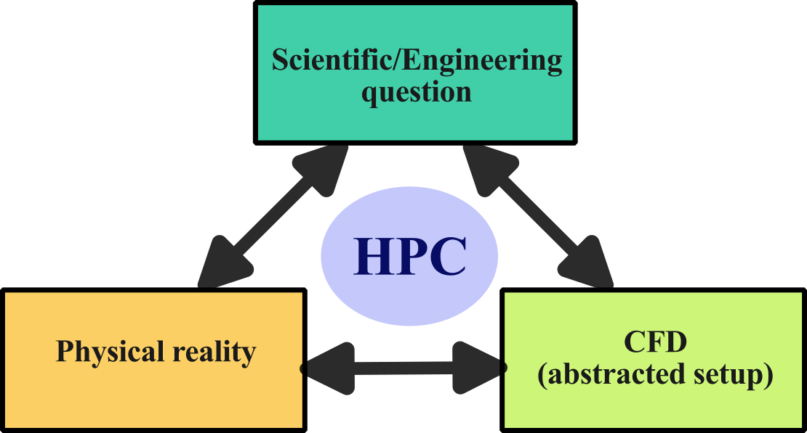
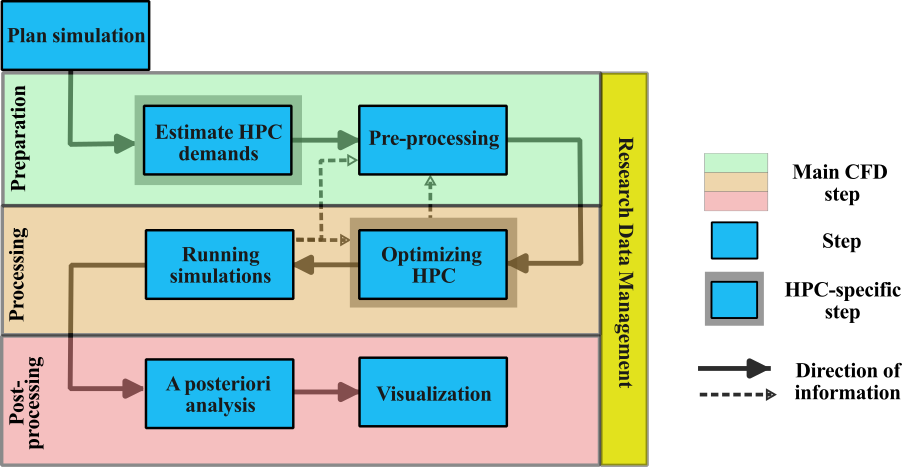

import Box from '../../../components/Box.astro';
import Caption from '../../../components/Caption.astro';
import CustomAside from '../../../components/CustomAside.astro';
import { Tabs, TabItem } from '@astrojs/starlight/components';


:::note[Learning Objectives]
At the end of this section, you should be able to:
1. Identify the use cases for HPC with CFD
2. Determine the workflow for solving CFD problem using HPC
3. Apply strategies to effectively use HPC 
:::
<CustomAside icon="pen" title="Time to complete: 60 min" colour="green"></CustomAside>

## CFD meets HPC
[Computational Fluid Dynamics (CFD)](https://arc4cfd.github.io/glossary/#section-2) is the study of fluids through the numerical solution of the equations governing their motion. Most common CFD solvers rely on the discretized solution of the [Navier-Stokes (NS)](https://arc4cfd.github.io/glossary/#section-2) equations, although other approaches such as Lagrangian  or [Lattice Boltzmann methods (LBM)](https://arc4cfd.github.io/glossary/#section-2) are increasingly being advanced. This course will specifically target the use of *classical CFD methods* based on the solution of the discretized Navier-Stokes equations using conventional *finite volume methods*. It should be noted that many of the concepts discussed herein are directly transferable to other types of numerical methods and approaches.

The inherent nonlinearity in the Navier-Stokes equations results in fluid dynamics problems being characterized by a **multiple scales**, which is especially prominent in the case of turbulent, reactive, or multi-physics flows. In many CFD problems, the geometric complexity of the simulations also imposes a large scale separation. For example, when simulating flow over a wind-turbine farm, one must simultaneously capture the large-scale dynamics in the atmospheric boundary layer while correctly accounting for, modelling, or simulating the tip vortex on each blade of the wind turbines. In many applications, fluid dynamics problems are combined with additional **multi-physics phenomena** (heat transfer, acoustics, combustion, multi-phase problems), greatly complexifying an already challenging underlying scale separation of the problem.


For these reasons, CFD problems require a **high spatial and temporal resolution** to resolve these coupled phenomena over the wide time and length scales of interest. Furthermore, as most finite volume methods rely on local information (provided from neighboring grid points) to solve the governing equations, these computational problems can be readily solved by parallel computing with each computational core receiving a different part of the domain (distributed memory parallelism).   Thus, the field of CFD is particularly well suited for [*high-performance computing* (HPC)](https://arc4cfd.github.io/glossary/#section-1) applications and is one of the classical fields that leverage modern computing architectures. 


## Why use CFD?
There are a number reasons for using CFD to address scientific or engineering problems. Here is a non-exhaustive list of some of the main reasons:

1. **Cost and time savings**: Experimental methods in fluid mechanics are the gold standard as they typically are the closest representation of the *true* fluid dynamic problem under consideration. Experiments can be expensive and time consuming especially for early design stages (in a typical industrial engineering context) or for large-scale problems (in ocean dynamics, for example).
2. **Inability to conduct experiments**: In some specific cases, experiments cannot be setup in a controlled manner (think of the simulation of any astrophysical phenomena) or  they operate in extreme environments that make measurements prone to lots of uncertainty (heat transfer at the wall in liquid rocket engines).
3. **Discretized solution to an analytically unsolveable equation set**: A general solution to the Navier-Stokes equations, despite decades of effort, remains [mathematically untractable](https://www.claymath.org/millennium/navier-stokes-equation/).  CFD simulations represent a discretized solution to these governing equations, insight into these equations can be gained in lieu of a closed-form analytical solution. 
4. **Virtual prototyping**: The virtual construction of a fluid mechanics prototype can facilitate the understanding of the problem prior to building a physical prototype. These virtual prototypes can be integrated early in the design cycle or can be developed as digital twins.  
5. **Design optimization**:  The integration of CFD with modern design optimization techniques can help find optimal solutions and rapidly cover a complex design space.
6. **Safety**: In many cases, experiments cannot be safely undertaken (nuclear safety verifications, fire propagation etc.), CFD can explore worst-case scenarios that we would not want to experimentally test.
7. **Enhanced understanding**: The CFD solution provides spatiotemporal information that can be used to enhance the understanding of the physical problem and supplement experiments.


## Limitations and assumptions in CFD
Naturally, there are many limitations to CFD. The principal limitations can be summarized in:

1. **Simplifying assumptions**: Problems in fluid dynamics are inherently very complex (geometrically and physically) and must be abstracted to define the problem in a CFD setting. The simplifying assumptions can be both geometric (e.g. not account for all the geometric complexity of an airfoil with rivet and joints) and physical (e.g. assume incompressibility of the flow); both introduce uncertainties into the CFD analysis.
2. **Model limitations**: Given the large scale separation of  fluid dynamic problems, models are often invoked to reduce the resolution requirements (for example, turbulence models). These models have inherent limitations in their applicability and admit some errors that can impact the integral scale of the problem under consideration.
3. **Numerical and modelling errors**: The discretized equations and the numerical methods associated with solving the Navier-Stokes equations are plagued with errors; the consideration of these errors represents an important step in assessing the numerical solution.
4. **Computational resources and knowledge**: Given the use cases described above and the multi-scale nature of the underlying problem, it becomes clear that computational resources represent one of the largest limitations for CFD. 

To effectively leverage HPC for CFD problems, there needs to be a compromise between the simplifying assumptions, models, and errors that one admits and the computational resources and knowledge one has at their disposal. 

As CFD relies on the numerical solution of a discretized set of partial differential equations, there are a number of characteristic features that a CFD code (and its numerics) must satisfy:

- A numerical model is **convergent** if and only if the solutions with increasingly refined solution grids approaches a fixed value;
- A numerical model is **consistent** only if this numerical solution converges to the solution of the continuous equations which govern the physical phenomenon being modeled, it is a measure of the extent to which the exact solution satisfies the discrete problem;
- A numerical model is **stable** if the errors (truncation, round-off, etc.) decay as the computation proceeds from one step to the next and represents a quantitative measure of the well-posedness of the discrete problem.
- A **grid independent** solution implies that the resolution is sufficient and further spatial or temporal refinement would not impact the numerical result.

**Convergence**,  **consistency**, and **stability** are necessary requirement for a CFD code. **Grid independence** is a necessary but insufficient condition for the validity of the numerical results and implies that the numerical model is **convergent**. If any of these conditions are not met, the simulation results cannot be considered to be valid. 


## Setting up CFD problems
CFD simulations are undertaken to **answer scientific or engineering questions**. Yet, the shortcomings of CFD lie in many of the  approximations  (modelling limitations, errors, simplifications) that must be made in order to simulate a given fluid dynamic problem.  *Mathematical representations of physical problems are inherently an abstraction of reality*. In CFD, the mathematical set of partial differential equations are transformed into a set of discretized equations that are solved while constrained to a set of initial and boundary conditions. The solution of this discretized problem  can then be used to answer the original question motivating the study. Faced with a CFD workflow that could benefit from modern HPC infrastructure, one seeks to create an alignment between the:  
 1. physical reality of the fluid dynamic problem we are hoping to simulate, 
 2. scientific or engineering question that we seek to answer,  and 
 3. abstracted CFD problem. 

Visually, the alignment between these concepts can be represented as follows:

<Caption>Alignment between these three aspects will facilitate an effective use of computational resources.</Caption>

By clearly identifying the underlying **scientific or engineering question** that the simulation seeks to answer helps to articulate the exact justification for the simulation. It also helps to assess the level of abstraction required for the CFD simulation.   It goes without saying that a good physical understanding  of the underlying fluid problem is needed. 


 
## Do I need HPC for my CFD problem?

The **level of abstraction and approximations** to construct the numerical CFD model will dictate the computational cost and, ultimately, the need for HPC. Although this may seem self-evident, HPC resources are expensive (in both time and money) and can impose significant overhead (steep learning curve, bureaucratic, organizational etc.), therefore, they should only be leveraged if they will provide a net benefit to the research workflow. 

For a given CFD problem, how do I determine if HPC resources are needed? Here are a number of questions one can ask:
 
1. **Am I memory limited?** Does the CFD case require more memory that I have available memory on my workstation?
2. **Is the simulation taking too long to run on a local workstation?**  Parallelization on multiple cores may help speed up the simulations.  
3. **Do I have a large number of small runs?**  Running them at the same time on multiple cores can increase the throughput.

If you have answered yes to any of the above questions, **and the CFD code is parallelizable and scalable on multiple cores**, you should consider accelerating your CFD workflow using HPC. Points 2 and 3 imply some level of impatience, this is left to the user to decide the level of patience they are willing to accept! For example, if a single CFD simulation takes 10 days to converge on a local workstation, that may be acceptable to some; just wait and analyze the results in 10 days. But, this same simulation, could take as little 6 hours on a single core (40 processors) assuming perfect parallelization.


## Defining a workflow of CFD with HPC
The conventional workflow for CFD simulations consists of three main steps:

1.  **preprocessing**
2.  **Processing**
3.  **postprocessing**

In this standard workflow, the numerical problem is defined and computational domain discretized in the **preprocessing** step, while the simulations are run in the **processing**, and data is analyzed and visualized in the **postprocessing**.


 To effectively use HPC resources for CFD simulations, the general workflow remains similar but additional steps should be integrated in order to strike the desired balance between the trueness of the physical representation of the problem and the finite computational resources that are available. HPC resources are expensive (see discussion [here](#cost-of-cfd-simulations)) and time consuming to utilize.  Therefore a purely iterative approach to CFD at large scale, like saying "*let's see how large a simulation we can run!*", represents poor utilization of HPC resources.
 
In order to effectively leverage HPC for CFD calculations, a number of additional steps are added in the workflow that enable a better understanding of the problem and help to strike a balance between the competing aspects that make CFD computations expensive and utilization of the finite computational resources. The workflow is shown here:


<Caption>Typical CFD workflow with HPC systems.</Caption>

The individual steps are briefly described and further expanded in the upcoming classes:
1. **Plan the simulation:** Determine the parameters of interest, the required simulation(s), and the influence on HPC costs.
2. **Estimate numerical requirements**: Compute approximate grid requirement, temporal resolution needed, simulation duration, estimate computational and memory requirements of the problem.
3. **preprocessing**: Create geometry and mesh, and configure the numerical setup.
4. **Optimizing HPC**: Scaling, profiling, and optimization, selecting best system, load balancing.
5. **Running simulations**:  Grid convergence, runtime analysis, and production runs.
6. **A posteriori analysis**: postprocess, analysis, and visualization.
 
 In addition to the workflow,  [research data management (RDM)](https://arc4cfd.github.io/glossary/#section-2) represents an increasingly important aspect of CFD on HPC, especially considering the financial cost of these large scale simulations. RDM is integrated into all steps of the workflow and will be specifically addressed in [Section 3](https://arc4cfd.github.io/section3/outline/) of this course.


## Mindset when using HPC resources with CFD
The added overhead and cost of HPC resources demands a slightly different mindset compared to small scale CFD computations. 

1. Take an *iterative* approach to setting up the problem, but take a methodological approach for large-scale CFD case 
2. Start small and build up complexity towards full scale problems
3. Always question, criticize, and check results
4. Aim to optimize the computational resource utilization
5. Organize and manage data effectively 
6. Automate the workflow, where possible


### Cost of CFD simulations
There is a monetary cost associated to the use of HPC resources that should be acknowledged as it further helps to motivate the effective usage of these computational resources. On the Digital Research Alliance systems, the monetary value in 2022 was ([source](https://alliancecan.ca/en/services/advanced-research-computing/accessing-resources/resource-allocation-competitions/2022-resource-allocations-competition-results#heading-monetary-value-of-the-2022-allocations)): 
| Resources    | Costs  |
| -------- | ------- |
| 1 core year  | $124    |
| 1 Tb storage/yr | $56     |

As an example, a single simulation, such as reported in [Wu et al. (2017)](https://www.pnas.org/doi/full/10.1073/pnas.1704671114), has a cost of about \$79k for the computations alone. Another way to think of this, if one is to run a CFD simulation for 24 hours on 1200 cores, that represents a cost of over \$400; if the data is utilized, the costs can be justified, otherwise...


<Box iconName='exercise'>
  <font size="+3">**Summative example**: Defining the problem</font>

We present an example that will carry through the entire section and allow us to systematically apply the CFD workflow and apply the concepts learned. For this example, we consider the study of a NACA 4412 airfoil with a flap. This is representative of a typical non-symmetric airfoil that could be encountered in many aerospace applications.


<Caption>Example of a NACA 4412 airfoil with a flap. </Caption>

In order to correctly plan the simulation, we must clearly identify the underlying scientific question that motivates the study. For this example, we are interested in **quantifying the buffeting effects caused by the gap between the airfoil and the flap**.  This question will motivate the entire application of this example in this course.  In order to start planning out the simulation, we need to align the physical problem, the scientific question and the abstracted CFD setup, as illustrated here:


<Caption>Example of the alignment between the physical problem, the scientific (or engineering) question and the CFD setup. </Caption>
The scientific question and physical problem are given in this case and we must determine the best abstracted CFD setup that is close enough to the actual physical setup  while allowing us to address the scientific question motivating this work. To answer this question, we will wait until next lesson.
</Box>


## Practical usage of CFD tools on Digital Alliance clusters
 This course is developed for two mainstream, open-source  CFD solvers, namely:
 - [SU2](https://su2code.github.io/), and 
 - [OpenFOAM](https://www.openfoam.com/). 
 
  Both tools are well established, have a large user base, and can be loaded onto the Alliance clusters. It should be noted that this is not a CFD course, but the focus lies in the usage of CFD on HPC systems, therefore many CFD-specific aspects will not be covered in great detail. Interested readers may want to consult the [cfd-online wiki](https://www.cfd-online.com/Wiki/Main_Page) or the dedicated forums to [SU2](https://www.cfd-online.com/Forums/su2/) or [openFoam](https://www.cfd-online.com/Forums/openfoam/).

  In order to test out the examples in this course using  the CFD solvers, we need to learn how to:

1. Load the CFD solver modules on the remote cluster.
2. Clone the corresponding git repository containing code(s) and examples.

We provide step-by-step instructions for each of these points.

### Loading required CFD modules on the cluster
The steps required to load the two CFD solvers are done for Graham, but a similar approach can be used for other Alliance clusters.

After connecting to Graham using SSH (or via MobaXterm), type:

```bash
[username@gra-login1 ~]$ module list
```

You will probably notice that some basic modules are already loaded on your profile, but neither *OpenFOAM* or *SU2* are currently present. As specified in section 1 of this course, we will use the command `module load <modulename>` to load any required module. Before, let's check what versions of the two CFD tools are available on the cluster. Type:

```bash
[username@gra-login1 ~]$ module spider openfoam
```
or 

```bash
[username@gra-login1 ~]$ module spider su2
```
We get the following output:
<Tabs group="tab-group">
    <TabItem label="OpenFOAM">
    ```bash
    ----------------------------------------------------------------------------------------
    openfoam:
    ----------------------------------------------------------------------------------------
    Description:
      OpenFOAM is a free, open source CFD software package. OpenFOAM has an extensive range of
      features to solve anything from complex fluid flows involving chemical reactions,
      turbulence and heat transfer, to solid dynamics and electromagnetics.

     Versions:
        openfoam/v1706
        openfoam/v1712
        openfoam/v1812
        openfoam/v1906
        openfoam/v1912
        openfoam/v2006
        openfoam/v2012
        openfoam/v2112
        openfoam/v2206
        openfoam/v2212
        openfoam/v2306
        openfoam/2.2.2
        openfoam/2.3.1
        openfoam/2.4.0
        openfoam/3.0.1
        openfoam/4.1
        openfoam/5.0
        openfoam/6
        openfoam/6.20180813
        openfoam/7
        openfoam/8
        openfoam/9
        openfoam/10
        openfoam/11
    ```
    </TabItem>
    <TabItem label="SU2">
    ```bash
    ------------------------------------------------------------------------------------------
    su2:
    ------------------------------------------------------------------------------------------
    Description:
      An open-source collection of software tools written in C++ for performing Partial
      Differential Equation (PDE) analysis and solving PDE-constrained optimization problems.
      The toolset is designed with computational fluid dynamics and aerodynamic shape
      optimization in mind.

     Versions:
        su2/5.0.0
        su2/6.0.1
        su2/6.1.0
        su2/6.2.0
        su2/7.0.0
        su2/7.0.5
        su2/7.0.8
        su2/7.5.1
    ```
    </TabItem>
</Tabs>

After a brief description of each tool, we notice that there are many different versions available to load. **Each versions has different set of dependent modules**. Dependent modules are necessary
to be loaded to ensure proper working of the selected openfoam/SU2 version. In order to know
the dependent modules, the command shall be repeated with full name. For example, for
`module spider openfoam/v2306`:

```bash
[username@gra-login1 ~]$ module spider openfoam/v2306
```
or 
```bash
[username@gra-login1 ~]$ module spider su2/5.0.0
```
When we look into the dependencies for each solver, we find:
<Tabs group="tab-group">
    <TabItem label="OpenFOAM">
    ```bash
    ------------------------------------------------------------------------------------------------
    openfoam: openfoam/v2306
    ------------------------------------------------------------------------------------------------

    You will need to load all module(s) on any one of the lines below before the "openfoam/v2306" module is available to load.

      StdEnv/2020  gcc/9.3.0  openmpi/4.0.3
      StdEnv/2023  gcc/12.3  openmpi/4.1.5
    ```
    </TabItem>
    <TabItem label="SU2">
    ```bash
    ------------------------------------------------------------------------------------------------
    su2: su2/5.0.0
    ------------------------------------------------------------------------------------------------

    You will need to load all module(s) on any one of the lines below before the "su2/5.0.0" module is available to load.

      nixpkgs/16.09  gcc/5.4.0  openmpi/2.1.1
      nixpkgs/16.09  gcc/7.3.0  openmpi/3.1.2
      nixpkgs/16.09  gcc/7.3.0  openmpi/3.1.4
      nixpkgs/16.09  intel/2016.4  openmpi/2.1.1
    ```
    </TabItem>
</Tabs>

Now that we have explored the dependencies for each solver, we can load required modules to run the simulations.

Here are the commands load everything that is required for each solver:
<Tabs group="tab-group">
    <TabItem label="Setup OpenFOAM">
    ```bash
    module load StdEnv/2020  gcc/9.3.0  openmpi/4.0.3 openfoam/v2306
    ```
    </TabItem>
    <TabItem label="Setup SU2">
    ```bash
    module load nixpkgs/16.09  gcc/7.3.0  openmpi/3.1.4 su2/5.0.0
    ```
    </TabItem>
</Tabs>
Now, we can run a CFD simulation with our loaded modules. Note that each version of the codes will have slightly different dependent modules.

### Clone the git repository to the cluster
The purpose of the section help the learner copy all the example cases from this course on the cluster and prepare the simulation files. 

On the login node, you can *clone* the associated repository to the remote cluster by typing:

```bash
[username@gra-login1 ~]$ git clone git@github.com:ARC4CFD/arc4cfd.git
```
Since the example files will be used for simulations, it is best to clone the repository to the  `/scratch` drive.

:::danger[Warning]
Important files must be copied off `/scratch` regularly since they are not backed up and older files are subject to purging!
:::


<Box iconName="quiz">
  <font size="+3">**QUIZ**</font>

Why is more rigorous planning required when using CFD tools and HPC?
<details>
    <summary>Solution</summary>
    Greater planning is needed when using HPC for a number of reasons:
      - Computational resources are limited and expensive; planning allows a more effective allocation of resources
      - Iterative approaches of *"let's run and see what we get"* are difficult and time consuming with large simulations
      - We need to assess the memory and disk-space requirement for the simulation
      - Planning helps to align our abstraction and modelling assumptions with the available HPC resources
</details>

In what cases should we not use HPC  for CFD simulations? And why not?
<details>
    <summary>Solution</summary>
   If the simulations can be run on a local workstation and the computational time is acceptable, one should not use HPC system. The reasons are that:
    - remote systems are more difficult to work with than local systems (we have to transfer data, visualization is often more challenging, installation of some specific tools may be challenging etc.)
</details>


</Box>


:::note[Reflections and Takeaways]
Having finished this lecture, you should now be able to answer the following important questions:
1. When do I need to consider HPC to solve CFD problems?
2. What are the main steps of the workflow when using CFD with HPC?
3. What strategies can I apply to help leverage CFD problems with HPC?
:::
 
