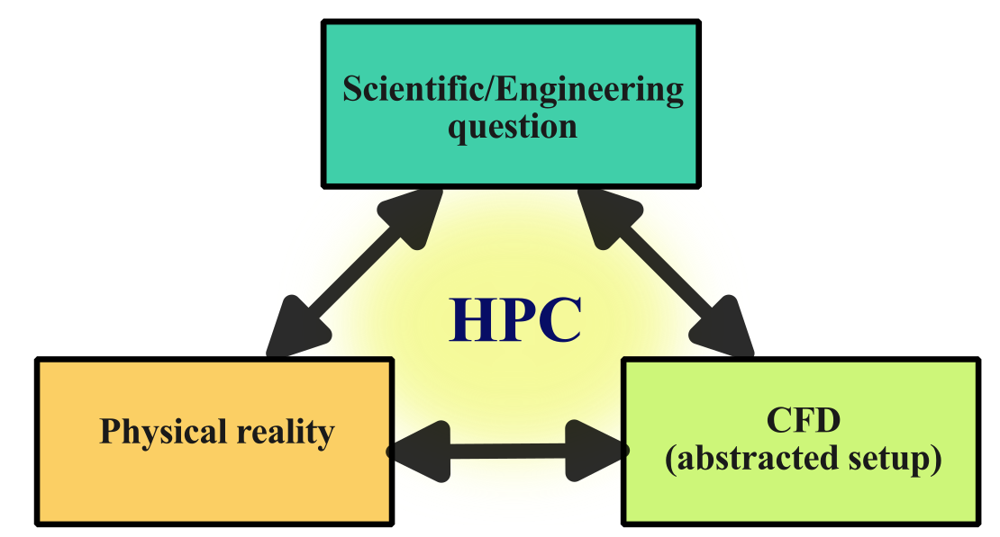

import Box from '../../../components/Box.astro';
import Caption from '../../../components/Caption.astro';
import CustomAside from '../../../components/CustomAside.astro';
import { Tabs, TabItem } from '@astrojs/starlight/components';


:::note[Learning Objectives]
By the end of this section, you should be able to:
1. Identify the use cases for HPC with CFD
2. Determine the workflow for solving CFD problem using HPC
3. Apply strategies to effectively use HPC 
:::


## CFD meets HPC
Computational Fluid Dynamics (CFD) is the study of fluids through the numerical solution of the equations governing their motion. Most common CFD solvers rely on the discretized solution of the Navier-Stokes (NS) equations, although other approaches such as Lagrangian  or Lattice Boltzmann methods (LBM) are increasingly being advanced. This course will specifically target the use of *classical CFD* methods based on the solution of the discretized Navier-Stokes equations using conventional finite volume methods. It should be noted that many of the concepts discussed herein are directly transferable to other types of numerical methods and approaches.

The inherent nonlinearity in the Navier-Stokes equations result in fluid dynamics problems often having a multiscale nature, which is especially prominent in the case of turbulent, reactive, or multiphysics flows. In many CFD problems, the geometric complexity of the simulations also imposes a large scale separation. For example, when simulating flow over a wind-turbine farm, one must simultaneously account for the large scale dynamics in the atmospheric boundary layer while correctly accounting for, modelling or simulating the tip vortex on each blade of the wind turbines. In many applications, fluid dynamics problems are combined with additional multiphysics phenomena (heat transfer, acoustics, combustion, multi-phase problems), greatly complexifying the already challenging underlying scale separation of the problem. For these reasons, CFD problems require a high spatial and temporal resolution to resolve these coupled phenomena over the wide time and length scales of interest. Furthermore, as most finite volume methods rely on local information (provided from neighboring grid points) to solve the governing equations, these computational problems can be readily solved by parallel computing with each computational core receiving a differnent part of the domain.   Thus, the field of CFD is particularly well suited for *high-performance computing* (HPC) applications and is one of the classical fields that leverage modern computing architectures. 


## Why use CFD (and why with HPC) ?
There are a number reasons for using CFD to address scientific or engineering problems. Here is a non-exhaustive list of the  reasons:

1. **Cost and time savings**: Experimental methods in fluid mechanics are the gold standard as they typically are the closest representation of the *true* fluid dynamic problem under consideration. Experiments can be expensive and time consuming especially for early design stages (typical industrial engineering settings) or for large-scale problems (in ocean dynamics, for example).
2. **Inability to conduct experiments**: In some specific cases, experiments cannot be setup in a controlled manner (think of the simulation of any astrophysical phenomena) or  they operate in extreme environments that make measurements prone to lots of uncertainty (heat transfer at the wall in liquid rocket engines).
3. **Discretized solution to an analytically unsolveable equation set**: A general solution to the Navier-Stokes equations, despite decades of effort, remains [mathematically untractable](https://www.claymath.org/millennium/navier-stokes-equation/).  CFD simulations represent a discretized solution to these governing equations, insight into these equations can be gained in lieu of a closed-form analytical solution. 
4. **Virtual prototyping**: The virtual construction of a fluid mechanics prototype can facilitate the understanding of the problem prior to building a physical prototype. These virtual prototypes can be integrated early in the design cycle or can be developed as digital twins.  
5. **Design optimization**:  The integration of CFD with modern design optimization techniques can help find optimal solutions and rapidly cover a complex design space.
6. **Safety**: In many cases, experiments cannot be safety undertaken (nuclear safety verifications, fire propagation etc.), CFD can explore worst-case scenarios.
7. **Enhanced understanding**: The CFD solution provides spatio-temporal information that can be used to enhance the understanding of the physical problem and supplement experiments.

Naturally, there are many limitations to CFD. The principal limitations can be summarized in:

1. **Simplifying assumptions**: Problems in fluid dynamics are inherently very complex (geometrically and physically) and must be abstracted to define the problem in a CFD setting. The simplifying assumptions can be both geometric (e.g. not account for all the geometric complexity of an airfoil with rivet and joints) and physical (e.g. assume incompressibility of the flow); both induce uncertainties into the CFD analysis.
2. **Model limitations**: Given the large scale separation of the fluid dynamic problems, models are often invoked to reduce the resolution requirements (for example, turbulence models). These models have inherent limitations in their applicability and admit some errors that can impact the integral scale of the problem under consideration.
3. **Numerical and modeling errors**: The discretized equations and the numerical methods associated with solving the Navier-Stokes equations are plagued with errors; the consideration of these errors represents an important step in assessing the numerical solution.
4. **Computational resources and knowledge**: Given the use cases described above and the multi-scale nature of the underlying problem, it becomes clear that computational resources represent one of the largest limitations for CFD. 


To effectively leverage HPC for CFD problems, there needs to be a compromise between the simplifying assumptions, models, and errors that one admits and the computational resources and knowledge one has at their disposal. 


## Conceptual approach towards CFD
CFD simulations are undertaken to answer scientific or engineering questions. Yet the shortcomings of CFD lies in many of the  approximations  (modeling limitations, errors, simplifications) that must be made in order to represent a given physical setup.  Mathematical representations of physical problems are inherently an abstraction of reality. In CFD, the mathematical set of partial differential equations are transformed to a set of discretized equations that are solved while constrained to a set of boundary conditions. The solution of this discretized problem  can then be used to answer the original question motivating the study. Faced with a CFD workflow that could benefit from modern HPC infrastructure, one seeks to create an alignment between:   1) the physical reality of the fluid dynamic problem we are hoping to simulate, 2) the scientific or engineering question that we seek to answer,  and 3) the  abstracted CFD problem. 


<Caption>Alignment between these three aspects will allow an effective use of computational resources.</Caption>

Identifying the underlying scientific or engineering question that the simulation seeks to answer helps to articulate the exact justification for the simulation. It also helps to assess the level of abstraction required for the CFD simulation.   It goes without saying that a good physical understanding  of the underlying fluid problem is needed. 

 The level of abstraction and approximations to construct the numerical CFD model will dictate the computational cost and, ultimately, the need for HPC. Although this may seem self-evident, HPC resources are expensive (in both time and money) and can impose significant overhead (steep learning curve, bureaucratic, organizational etc.), therefore, they should only be leveraged if they will provide a net benefit to the research workflow. 


 
## Do I need HPC for my CFD problem?
 For a given level of abstraction of a CFD problem, how do I determine if HPC resources are needed? Here are a number of questions one can ask:
 
1. **Am I memory limited? Does the CFD case require more memory that I have available memory on my workstation?**
2. **Is the simulation taking too long to run on a local workstation? Parallelization on multiple cores may help speed up the simulations.**   
3. **Do I have a large number of small runs? Can I run these many simulations at the same time on multiple cores?**

If you have answered yes to any of the above questions, and the CFD code is parallelizable and scalable on multiple cores, you should consider accelerating your CFD workflow using HPC. Points 2 and 3 imply some level of impatience, this is left to the user to decide the level of patience they are willing to accept. 


## Defining a workflow of CFD with HPC
The conventional workflow for CFD simulations consists of three main steps:

1.  **Pre-processing**
2.  **Processing**
3.  **Post-processing**

In this standard workflow, the numerical problem is defined and computational domain discretized in  the **pre-processing** step, while the simulations are run in the *processing*, and data is analyzed and visualized in the *post-processing*.


 To effectively use HPC resources for CFD simulations, the general workflow remains similar but additional steps should be integrated in order to strike the desired balance between the trueness of the physical representation of the problem and the finite computational resources that are available. HPC ressources are expensive (see discussion [here](#cost-of-cfd-simulations)) and time consuming to utilize.  Therefore a purely iterative approach to CFD at large scale, like saying "let's see how large a simulation we can run!", represents poor utilization of resources.
 
 As part of leveraging HPC for CFD calculations, a number of additional steps are added in the workflow that enable a better understanding of the problem and help to strike a balance between the competing aspects that make CFD computations expensive and utilization of the finite computational resources. The workflow is shown here:


<Caption>Typical CFD workflow with HPC systems.</Caption>

The individual steps are briefly described and further expanded in the upcoming classes:
1. **Plan the simulation(s):** Determine the parameters of interest, the required simulations, and the influence on HPC costs.
2. **Estimate numerical requirements**: Compute approximate grid requirement, temporal resolution needed, simulation duration, estimate computational and memory requirements of the problem
3. **Pre-processing**: Create geometry and mesh, and configure the numerical setup.
4. **Optimizing HPC**: Scaling, profiling, and optimization, selecting best system, load balancing
5. **Running simulations**:  Grid convergence, runtime analysis, and production runs 
6. **A posteriori analysis**: Post-process, analysis, and visualization
 
 In addition to the workflow, the research data management (RDM) represents an increasingly important aspect of CFD on HPC, especially considering the financial cost of these large scale simulations. RDM is integrated into all steps of the workflow and will be specifically addressed in Section 3 of this course.


## Mindset when using HPC resources with CFD
The added overhead and cost of HPC resources demands a slightly different mindset compared to local CFD computations. 

1. Carefully think through and plan the simulation you want to run
2. Take an iterative approach to setting up the problem **prior** to using large-scale HPC 
3. Start small and build up complexity towards full scale problems
4. Always question and check results
5. Optimize the resource utilization
6. Organize and manage data effectively 
7. Automate the workflow


### Cost of CFD simulations
There is a cost associated to HPC ressources that should be acknowledged to motivate the effective usage of the resources. On the Digital Research Alliance systems, the monetary value in 2022 was ([source](https://alliancecan.ca/en/services/advanced-research-computing/accessing-resources/resource-allocation-competitions/2022-resource-allocations-competition-results#heading-monetary-value-of-the-2022-allocations)): 
| Resources    | Costs  |
| -------- | ------- |
| 1 core year  | $124    |
| 1 Tb storage/yr | $56     |

As an example, a single simulation, such as reported in [Wu et al. (2017)](https://www.pnas.org/doi/full/10.1073/pnas.1704671114), has a cost of about \$79k for the computations alone. Another way to think of this, if one is to run a case for 24 hours on 1200 cores, that represents a cost of over \$400; if the data is utilized, the costs can be justified, otherwise...


## Required CFD tools to continue
As you might have noticed, this course is meant to be hands-on. As you learn new content, you should be able to follow along with **examples** and **quizzes** directly on the cluster. As we dive into the **core** portion of the course, focused on CFD, it's important that we set the stage in terms of tools required to continue. After this section, you should be able to:

1. Load the necessary CFD tools on the remote cluster.
2. Clone the code(s) that will be used for practice problems and examples.

Throughout the course, examples will be carried out in parallel using **two** open-source CFD tools: [SU2](https://su2code.github.io/), and [OpenFOAM](https://www.openfoam.com/). Lots of information and documentation is available in each respective website, and this will not be a **how to** tutorial, but rather a consistent process to utilize common CFD tools on computer clusters.

### Loading required CFD modules on the cluster
After connecting to Graham using SSH (or via MobaXterm), type:

```bash
[username@gra-login1 ~]$ module list
```

You will probably notice that some basic modules are already loaded on your profile, but neither **OpenFOAM** or **SU2** are currently there. As specified in section 1 of this course, we will use the command `module load modulename` to load any required module. Before, let's check what versions of the two CFD tools are available on the cluster. Type:

```bash
[username@gra-login1 ~]$ module spider openfoam
```
```bash
[username@gra-login1 ~]$ module spider su2
```

<Tabs group="tab-group">
    <TabItem label="OpenFOAM">
    ```bash
    ----------------------------------------------------------------------------------------
    openfoam:
    ----------------------------------------------------------------------------------------
    Description:
      OpenFOAM is a free, open source CFD software package. OpenFOAM has an extensive range of
      features to solve anything from complex fluid flows involving chemical reactions,
      turbulence and heat transfer, to solid dynamics and electromagnetics.

     Versions:
        openfoam/v1706
        openfoam/v1712
        openfoam/v1812
        openfoam/v1906
        openfoam/v1912
        openfoam/v2006
        openfoam/v2012
        openfoam/v2112
        openfoam/v2206
        openfoam/v2212
        openfoam/v2306
        openfoam/2.2.2
        openfoam/2.3.1
        openfoam/2.4.0
        openfoam/3.0.1
        openfoam/4.1
        openfoam/5.0
        openfoam/6
        openfoam/6.20180813
        openfoam/7
        openfoam/8
        openfoam/9
        openfoam/10
        openfoam/11
    ```
    </TabItem>
    <TabItem label="SU2">
    ```bash
    ------------------------------------------------------------------------------------------
    su2:
    ------------------------------------------------------------------------------------------
    Description:
      An open-source collection of software tools written in C++ for performing Partial
      Differential Equation (PDE) analysis and solving PDE-constrained optimization problems.
      The toolset is designed with computational fluid dynamics and aerodynamic shape
      optimization in mind.

     Versions:
        su2/5.0.0
        su2/6.0.1
        su2/6.1.0
        su2/6.2.0
        su2/7.0.0
        su2/7.0.5
        su2/7.0.8
        su2/7.5.1
    ```
    </TabItem>
</Tabs>

After a brief description of each tool, we notice that there are many different versions available to load. **Each versions has different set of dependent modules**. Dependent modules are necessary
to be loaded to ensure proper working of the selected openfoam/SU2 version. In order to know
the dependent modules, the command shall be repeated with full name. For example, for
`module spider openfoam/v2306`:

```bash
[username@gra-login1 ~]$ module spider openfoam/v2306
```
```bash
[username@gra-login1 ~]$ module spider su2/5.0.0
```

<Tabs group="tab-group">
    <TabItem label="OpenFOAM">
    ```bash
    ------------------------------------------------------------------------------------------------
    openfoam: openfoam/v2306
    ------------------------------------------------------------------------------------------------

    You will need to load all module(s) on any one of the lines below before the "openfoam/v2306" module is available to load.

      StdEnv/2020  gcc/9.3.0  openmpi/4.0.3
      StdEnv/2023  gcc/12.3  openmpi/4.1.5
    ```
    </TabItem>
    <TabItem label="SU2">
    ```bash
    ------------------------------------------------------------------------------------------------
    su2: su2/5.0.0
    ------------------------------------------------------------------------------------------------

    You will need to load all module(s) on any one of the lines below before the "su2/5.0.0" module is available to load.

      nixpkgs/16.09  gcc/5.4.0  openmpi/2.1.1
      nixpkgs/16.09  gcc/7.3.0  openmpi/3.1.2
      nixpkgs/16.09  gcc/7.3.0  openmpi/3.1.4
      nixpkgs/16.09  intel/2016.4  openmpi/2.1.1
    ```
    </TabItem>
</Tabs>

<CustomAside icon="star" title="Quick tip!" colour="green">
Remember that the examples will be carried out in parallel for both CFD tools.
</CustomAside>

Here are the commands to run to load everything that is required:
<Tabs group="tab-group">
    <TabItem label="Setup OpenFOAM">
    ```bash
    module load StdEnv/2020  gcc/9.3.0  openmpi/4.0.3 openfoam/v2306
    ```
    </TabItem>
    <TabItem label="Setup SU2">
    ```bash
    module load nixpkgs/16.09  gcc/7.3.0  openmpi/3.1.4 su2/5.0.0
    ```
    </TabItem>
</Tabs>


### Clone CFD examples
The purpose of the section is to copy all the example cases on the cluster and prepare the simulation files. As mentioned in section 1 of this course, our remote home has been pre-populated with some directories, with very precise characteristics.

:::tip[Rule of thumb]
As a general good practice one could follow the following steps:
1. `/home`: in the remote **personal** home one should store the main code, maybe connected to a remote repository for version control, and perform any sort of development on it.
2. `/scratch`: once the code is ready, and a simulation is to be started, one could copy all necessary run files from `/home` to `/scratch/run-01`. The simulation can then be run on the `/scratch` directory which has **a lot** of storage capability.
3. `/home`: once the results are ready to be post processed, one could move the result file back to `/home` and perform the post-processing analysis.
4. `/projects`: Finally, once the results have been processed, figures have been generated, papers have been written, one could move all the simulation files from `/scratch` to `/projects` for **long-term** storage.  
:::

:::danger[Repeated Warning]
Important files must be copied off `/scratch` regularly since they are not backed up and older files are subject to purging!
:::

Following this approach, after logging into Graham we can **clone** the case example files directly from the GitHub repository to our remote `/home`:


```bash
[username@gra-login1 ~]$ git clone git@github.com:ARC4CFD/arc4cfd.git
```


:::note[Learning Objectives]
Having finished this lecture, you should now be able to answer the following important questions:
1. When do I need to consider HPC to solve CFD problems?
2. What are the main steps of the workflow when using CFD with HPC?
3. What strategies can I apply to help leverage CFD problems with HPC?
:::
 
