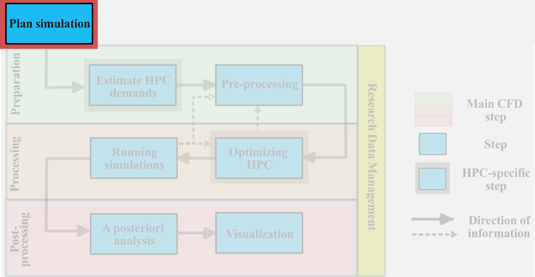
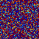
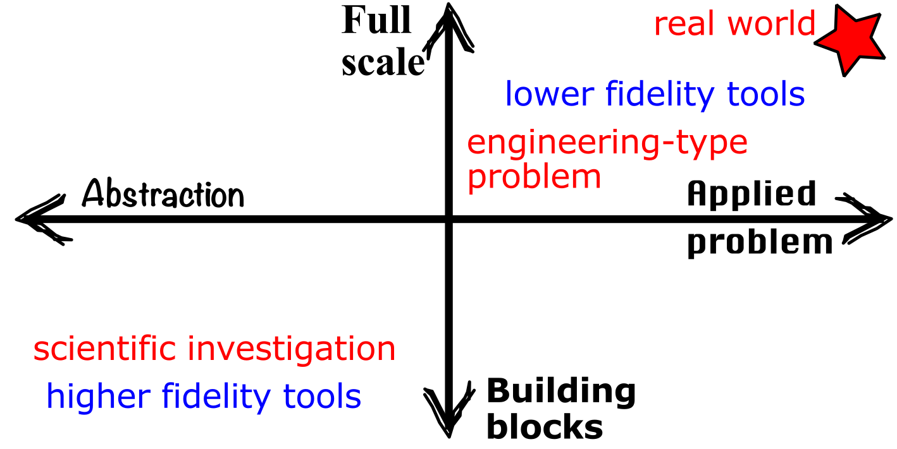
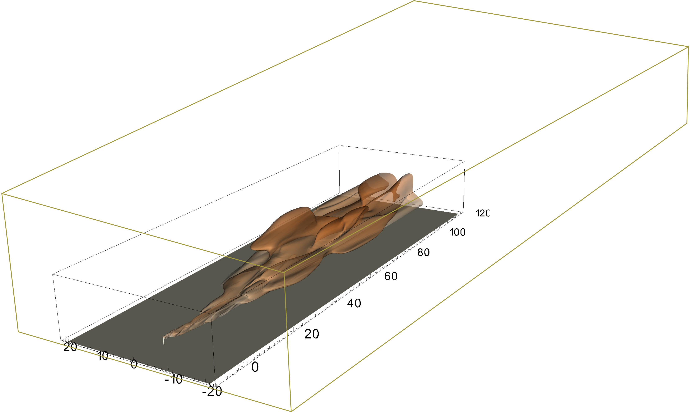
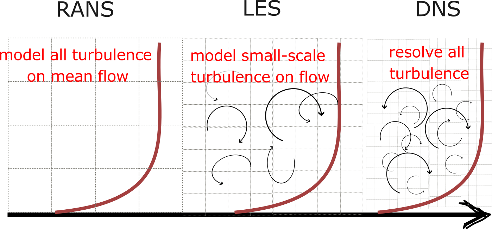
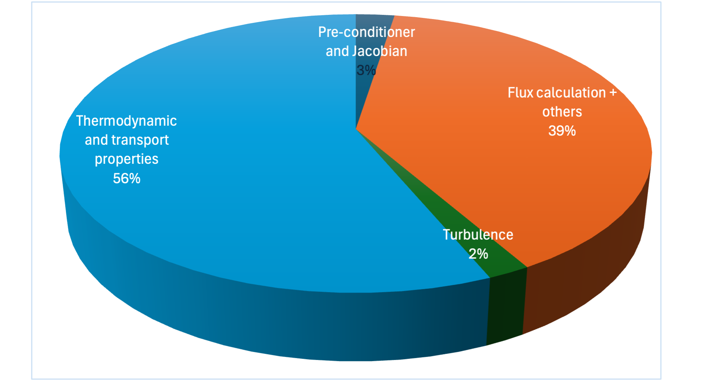
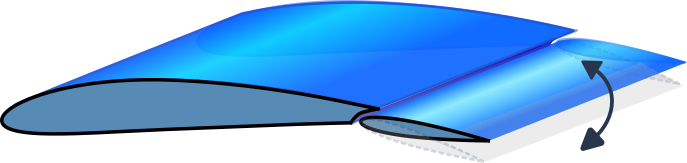
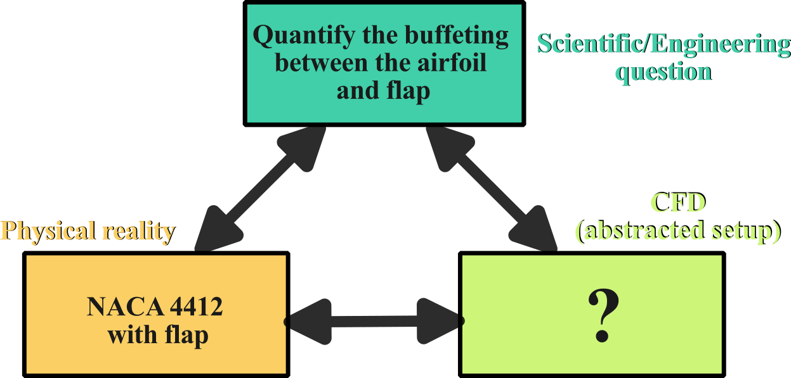
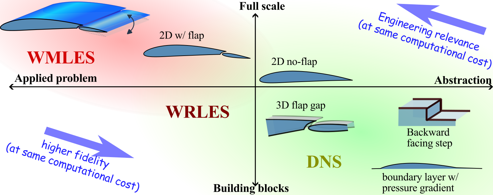
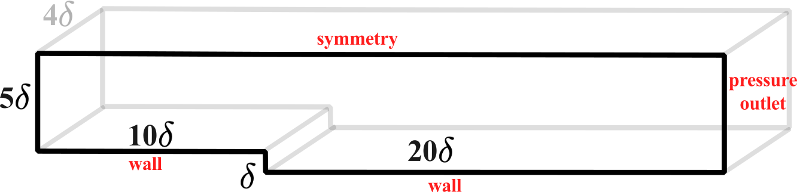

:::note[Learning Objectives]
By the end of this section, you should be able to:
1. Determine the parameters that influence the computational cost of a simulation
2. Identify the level of modelling and simulation required for a CFD problem
3. Select the level of geometric complexity to answer the scientific or engineering question  
:::
<CustomAside icon="pen" title="Time to complete: 60 min" colour="green"></CustomAside>

import Caption from '../../../components/Caption.astro';
import CustomAside from '../../../components/CustomAside.astro';
import Gif from '../../../components/Gif.astro';

import { Tabs, TabItem } from '@astrojs/starlight/components';
import { CardGrid } from '@astrojs/starlight/components';
import Option from '../../../components/Option.astro';
import MultipleChoice from '../../../components/MultipleChoice.astro';
import Box from '../../../components/Box.astro';
import Spoiler from '../../../components/Spoiler.astro';
import CustomIcon from '../../../components/CustomIcon.astro';

Constrained by finite HPC resources,  systematic planning of large-scale CFD simulations helps to best align the available resources with the scientific or engineering question that motivates the  CFD study. Naturally the details of the planing stage are case specific; nonetheless, this lesson explores the various parameters influencing HPC cost and introduces an example CFD problem that will be used in the following lessons in Section 2.

## Parameters that influence HPC cost
The overall HPC cost of a large-scale CFD simulation will be driven by three main categories of considerations, these are:

- **Physics and setup** 
	* *Dimensionality of the problem*
	* *Unsteadiness*
	* *Geometric complexity*
	* *Physics of the problem (including multi-physics, multiphase, and/or multi-species)*
	* *Physical time advancement needed*
	* *Extent of the computational domain*

- **Simulation parameters**
	* *Type of turbulence modelling* (*e.g.* RANS, LES, DNS)
	* *Thermodynamic modelling*
	* *Selection and order of numerical schemes* 
	* *Convergence criteria*
	* *Pre-conditioning and matrix inversion algorithm* 
    * *Type of boundary condition*
	* *Wall-resolved or wall modelled*
	* *Moving/deforming mesh, mesh adaptation etc.*
	* *Modelling of multi-physics or multiphase problem*
	
- **Parametric space**
	* *Number of simulations needed to cover the parametric space*

Each of the above categories of considerations is explored in more depth in the following.

 
### How to determine the physics and CFD setup?
The physical setup of the problem plays the largest role in determining the overall computational cost of a CFD study.  Determining the level of abstraction of the CFD setup as well as the necessary physics that should be simulated is a critical aspect in the planning stage of a simulation.   Significant computational savings can be gained by carefully thinking through and assessing the necessity of considering the various physical aspects of the problem. Simulating either a steady or a lower dimensional order problem can result in massive computational savings, yet these considerations need to take into account a number of key factors, which  involve a good understanding of the fluid dynamics of the problem under consideration. It is clear that determining the physics and CFD setup is highly problem specific, but it also depends on other externalities such as: expertise of the user, features/capabilities in the CFD solvers, resources and time available. In this subsection, we explore the main parameter influencing the CFD setup.

##### Dimensionality of the problem
The dimensionality of the problem is an important consideration that can greatly impact the computational time of a simulation. Consider a three-dimensional simulation that is discretized with  $64\times 64\times 64$ grid points (or 262,144 total grid points). If this simulation were able to be solved in two- instead of three-dimensions, the total number of grid points would drop by 64 times! ($64\times 64=4,096$) for a same resolution in the other two dimensions!  This great computational saving may not always be possible:

* Many problems are inherently three-dimensional and cannot be modelled as a two-dimensional problem (flow through a pump or dispersion of pollutants, for example). 
* Turbulence is inherently three dimensional. [Reynolds Averaged Navier Stokes (RANS)](https://arc4cfd.github.io/glossary/#section-2) models the impact of the unsteady turbulence on the mean flow, as such they can be used in a two-dimensional simulation; the applicability of [LES](https://arc4cfd.github.io/glossary/#section-2) or [DNS](https://arc4cfd.github.io/glossary/#section-2) in two-dimensions is more questionable.
* Only one component of vorticity can be represented in two dimensions (instead of a full three-dimensional vector) and axial vortex stretching cannot occur (a key characteristic of turbulence).
* Heat or mass transfer **may** be poorly estimated in two dimensions.

The following figure show decaying isotropic turbulence simulated in a two- (left) and three-dimensional (right) domains, where the vorticity is shown. Note the very clear difference between the turbulence in both cases, in 2D we clearly that the filament-like straining of the turbulence which occurs in a single plane (given the 2D domain). In 3D,  as the turbulence is not constrained to a single plane, the filamentary structure in the turbulence is not visible.
<CardGrid>
	<Gif src='../../../assets/figs_section2/IsoTurb2D.gif' alt='' width='100%'/>
	<Gif src='../../../assets/figs_section2/IsoTurb3D.gif' alt='' width='100%'/>
</CardGrid>
{/*    */}
<Caption>Comparison between a 2D (left) and 3D (right) simulation of isotropic-like turbulence. This example may be run in [Basilisk](http://basilisk.fr) in the git repo.</Caption>

##### Geometric complexity 
Reducing the geometric complexity of the physical problem  can significantly reduce the computational cost. Ultimately, we seek to omit or simplify any irrelevant geometrical details, yet determining what is *relevant* from what is *not* is challenging. The first question to ask is: *do we need to simulate the entire fluid dynamic problem under consideration?*  One good way to think of the problem of the required geometric complexity is to consider the following design space:

In this figure, the ordinate goes from simulating the **building blocks** of the problem all the way to the **full scale model**.  For example, if our full-scale physical problem involves the heating and ventilation in a room, the building blocks of this problem could be, for example : a) the jet formed by the ventilation exhaust, b) the heat transfer at the wall, or c) the mixing of hot and cold air. On the second axis (abscissa)  we have, on one end, the **abstracted problem** and on the other the **applied problem**.  As an example, if we are interested in exploring the laminar flow separation on an airfoil, the applied problem would be simulate the full airfoil at the desired conditions, and abstracted problem could be the study of flow separation on a smooth bump. In this case, we are abstracting the problem to better isolate the physics that are under consideration.  Most problems will cluster on the 45 degree axis in this design space (as shown) as applied problems are often considered at full-scale and abstractions are often building block.  Naturally the discussion of modelling complexity go hand-in-hand with the fidelity of the modelling.

Now suppose we are interested in simulating an applied, full-scale problem. These problems tend to have a lot of geometric complexity (e.g. flow over a complex terrain wind-turbine farm, or the aerodynamics of an race car).  Most small-scale geometric complexity that of a system can be removed (e.g. rivet heads, grooves), if their influence is deemed to be negligible.  These small geometric details require additional grid points to fully resolve, which are wasted computational resources if the details play a negligible role in the simulation results. If they are included without the necessary resolution, they can lead to an increased numerical error, local numerical instability, and/or can result in time-stepping limitations that can greatly penalize a large scale simulation. But more generally, determining, which geometric details to omit is non-trivial and requires a good amount of experience, intuition, and understanding of the numerical methods.

##### Physics of the problem 
A further consideration lies in determining the physical modelling needed in a simulation. Here, when we discuss the *physics of the problem*, we are referring to the various *physical models* used in addition to the classical Navier-Stokes equations to account for combustion, compressibility, heat transfer, multiphase flows etc. Sorry to our colleagues in physics for the abuse of terminology; this terminology is commonly used in the CFD community.  If we have an incompressible, single-phase flow over an adiabatic wall, the problem definition is straightforward and we can solve the classical governing equations of fluid motion. But for most applied problems in fluid dynamics, the determination of the physics is not as straightforward. 

For example, all matter--including a fluid--has a finite level of compressibility. The compressibility is defined by the bulk compressibility factor which is a ratio of the relative change in volume of the fluid per change in pressure: $k=1/V \frac{dV}{dp}$ (can be defined isothermally or isentropically).  But, if the relative change in volume (or we can think of this in terms of change in density) for the pressure change in a given fluid system, we can greatly simplify the Navier-Stokes equation by considering a constant density, incompressible flow. In other simulations, we may want to consider pressure dependant, variable density flows (for example in atmospheric turbulence) that is still incompressible. Under other conditions, we may want to solve a low-Mach formulation that can allow for density fluctuations. The decision on which type of incompressible solver one uses is problem dependent and has a direct impact on the computational cost. Some of these formulations  involve very large linear systems which can be challenging to compute  on massively parallel HPC systems. 

:::tip[Rule of thumb]
As a general rule, if the local Mach number is below 0.3, the compressibility effects will be negligible. If buoyancy or heat transfer transfer is important, we need to account for the variable density flow but not necessarily compressibility.
:::

Computational expense of a simulation can grow significantly by considering additional physics (multiphase flows, electro-fluid-dynamics etc.) or by addition strong source terms (buoyancy, radiation, heat release).  One must consider the various impacts on the  modelling of the physics of the problem on the desired simulation outcomes in light of the scientific/engineering question motivating the study.  Depending on the focus of the study, we may or may not want to consider various physical aspects. For example, if we are interested in determining the lift and drag of an airfoil, *a priori*, the aeroacoustic emission will not be relevant and can be neglected. But, if we are interested in quantifying the trailing edge tonal noise, then naturally we need to consider either resorting to an [aeroacoustic model](https://www.openfoam.com/industries/automotive-and-land-transportation/aeroacoustics) or resolving the acoustic wave propagation (typically very computationally demanding). 

:::tip[Tip]
Remove as much complexity in the physical modelling as you can without (significantly) affecting the simulation results.
:::

####  Extent of computational domain  
The extent of both the computational and time domain will directly impact the overall HPC cost of a simulation.  The computational domain size is primarily a consideration for external flows, although internal flows may also need to consider the computational domain size to simulate a fully developed pipe flow, for example.  Ideally, we need to determine the minimal domain size (minimize computational cost) that allows us to simulate the problem without negatively influencing the domain of interest. Take the example of a plume exhausting from a stack, as shown below. 

<Caption>Domain size consideration.</Caption>

If the outer domain is too small, the boundaries may influence the development of the plume and the error will pollute the computational results. The minimal size of the computational domain will depend on the modelling choices (next subsection) and therefore is difficult to generalize. There are two main approaches one can take for an a priori estimation of the computational domain size:

- **Theoretical or empirical formula**: we can estimate the boundary layer height based on streamwise distance, estimate the plume dispersion based on empirical dispersion models, or compute the entrance length in a pipe based on empirical correlations. These theoretical or empirical formula can help determine the characteristic feature which can then be used to estimate the computational domain size.
- **Low-order simulation**: Instead of relying on theory or empiricism, a low-order simulation can be run, sometimes even locally, to provide guidance on the characteristic size of the fluid dynamic phenomenon. This low-order simulation can be, for example, a two-dimensional representation of a three-dimensional problem, or a coarser and more heavily modelled simulation.

####  Extent of temporal domain  
Determining the required characteristic of time advancement of the simulation can also greatly impact the HPC costs. As Navier-Stokes equations have a parabolic-hyperbolic character, CFD solution depends, to some degree, on the initial and boundary values of the problem. As it is very difficult to perfectly impose initial conditions to a CFD simulation, we must first determine the "transience" of the simulation. This is the time needed for the flow to adapt the initial  to the boundary conditions of the problem. If we are interested in studying a *[statistically steady](https://arc4cfd.github.io/glossary/#section-2)* problem (an unsteady problem whose statistics are mostly invariant in time), we will typically measure this in terms of the **[flow-through time](https://arc4cfd.github.io/glossary/#section-2)**. The flow-through time corresponds to the time it takes for a fluid parcel to traverse the computational domain in the freestream. For example, if the computational domain has a length of $L_x=0.5$ m and the freestream velocity is $U_0=2$ m/s, then the flow though time would be $0.25$ s. Generally, depending on the modelling fidelity, size and domain of interest, we will aim to wait until 2 and 10 flow though times before assuming the statistically steady. 

**The second consideration is the determining the total time.** To estimate the overall cost of the numerical simulation one must consider that the equations of motion must be integrated for a time proportional to the integral time-scale of the flow $T$. The time step size $\Delta t$ is a function of the simulation technique used. In DNS, for instance, $\Delta t$ is limited by the need of resolving the life cycle of the smallest eddy of size $\eta$ (where $\eta$ represents the Kolmogorov scale). In LES, a larger time step could be used and will be determined by the size of the smallest resolved eddy. RANS, as expected, has the least restrictive requirement on $\Delta t$ given that it only resolves mean quantities. A good practice on estimating the total cost of a simulation was outlined by Reynolds [Reynolds (2005)](https://link.springer.com/chapter/10.1007/3-540-52535-1_52) who assumed that the operation count scales like the number of points in the domain, and that the time step $\Delta t$ is determined by the stability condition on the Courant–Friedrichs–Lewy (CFL) number, $\Delta t\approx 1/\Delta x$ [@piomelli2022vki]. Given that time integration must be performed for a number of steps proportional to $N_t\approx T/\Delta t$, this results in a total number of steps proportional to $N_t\approx \left(N_x N_y N_z\right)^{1/3}$, and a total computational cost of $\left(N_x N_y N_z\right)^{4/3}\approx Re^3$.

### What are the considerations for the simulation parameters?
We understand *simulation parameters* as parameters that can be *easily* modified within a simulation or input file. The choice of the simulation parameters will inherently be tied to some of the decisions taken in determining the physics and CFD setup, discussed above. Here, we present an overview of the simulation parameters that can impact the total HPC cost of a simulation. 

#### Turbulence modelling
Many of the applied fluid dynamics problems occur in a turbulent regime. As it is a highly multiscale phenomenon, the need to account for turbulence often drives the computational costs of the CFD simulations.  The detailed discussion on the turbulence and its modelling is left for the next class, here we briefly discuss the main difference in modelling approaches:
 <Caption>Comparison between various turbulence modelling and simulation approaches.</Caption>

- **[Reynolds Averaged Navier-Stokes (RANS)](http://localhost:4321/glossary#section-2)**: The effect of turbulence on the mean flow is *completely* modelled through the transport of additional equations. As resolution only needs to account for the mean flow, the resolution requirement is significantly lower than the other approaches. These class of turbulence models are often used for full-scale and applied problems in configuration in which the turbulence modelling uncertainty is acceptable.
- **[Large-eddy simulation (LES)](http://localhost:4321/glossary#section-2)**: The basic premise of LES is to resolve the large scales of turbulent motion in the flow and model the effect of the smallest scales. The resolution requirement is more important than RANS but allows for a significant computational saving at higher-Reynolds numbers compared to DNS. LES are increasingly used in more full-scale and applied problem for cases where RANS models are known to be ineffective; LES can also be used for detailed studies of abstracted and building block problems.
- **D[irect numerical simulation (DNS)](http://localhost:4321/glossary#section-2)**: In DNS, all the spatial and temporal scales of turbulence are resolved numerically. The problems studied by DNS are limited to lower scale separation (lower Reynolds numbers) and usually can only be applied to abstracted and building block problems.

A more detailed presentation of these models, and their submodels, is left for next class. 

#### Thermodynamic modelling
[JPH: better introduce this section]

For compressible and non-isothermal flows, we must typically solve the conservation of energy equation (in addition to the mass and momentum conservation) which requires an additional state equation to relate the primitive thermodynamic variables.  By default, most CFD solvers assume a calorically perfect gas, which imposes constant specific heat and ideal gas law. For simulations that have non-ideal thermodynamics, for example using the Peng-Robinson state equation, the solution of the thermodynamic solver requires an iterative loop and imposes significant computation overhead.  [Milan et al. (2021)](https://www.sciencedirect.com/science/article/pii/S0021999121004629) noted that the species transport equations and thermodynamics took over 56% of the total computational cost for a non-ideal, combustion simulation. 

#### Selection and order of numerical schemes
The selection of numerics, for both spatial and temporal discretization, can directly influence the overall computational time. The higher the order of numerical accuracy of the scheme, the more expensive the simulation but also results in the need for fewer grid points for the same numerical error. Most open-source and commercial codes used for general fluid dynamics rely on second-order finite volume schemes. Thus, a two-times increase of the computational grid should result in a four-time reduction in the numerical error. 

For time advancement, implicit methods are challenging for HPC due to the large matrix inversion. explicit methods are easier.

[Here also discuss implicit vs explicit schemes]

#### Other numerical and modelling considerations
Many other numerical considerations will directly impact the total HPC costs, the scope of which is too wide to cover effectively in this course. For example, the use
[JPH: advance this section]

### What parameters space do I need to cover?
The use of CFD, especially for optimization or design considerations, involves simulations spanning a large parameter space. These design spaces rapidly suffer from the **curse of dimensionality** and thus the selection of the parameter space to be investigated can greatly impact the computational cost. Typical, naive  approach would be to simulate all possible combinations of geometry and flow parameters by changing only one parameter at a time.  For example, let's consider an icing on an airfoil. We may want to explore all angles of attack, at various operating conditions, for various icing conditions. If we only consider 8 individual settings for each of these parameters, we would need to run 512 individual simulations. If each simulation is computationally demanding, this becomes a very expensive computational problem.

A more systematic approach is to rely on the **[Design of Experiments (DOE)](http://localhost:4321/glossary#section-2)**. The basic premise of DOE methodology is to simultaneously vary multiple factors at a time to obtain as much information as possible for each simulation. Although DOE stems from the experimental domain, it is widely used in CFD (e.g. [automotive](https://www.jstor.org/stable/44724846), [ship design](https://www.mdpi.com/2077-1312/7/7/226), and [aerospace](https://ntrs.nasa.gov/api/citations/20070010493/downloads/20070010493.pdf)) to reduce the computational cost of parametric investigations. 

<Box iconName='exercise'>
## EXAMPLE: Planning the simulation
We present an example that carries through the entire section and systematically apply the workflow and the concepts learned. For this example, we consider the study of a canonical NACA 4412 airfoil with a flap. This is a representative of a typical non-symmetric airfoil that could be encountered in many aerospace applications.

<Caption>Example of a NACA 4412 airfoil with a flap. </Caption>

In order to correctly plan the simulation, we must clearly identify the underlying scientific question that motivates the study. For this example, we are interested in **quantifying the buffeting effects caused by the gap between the airfoil and the flap**.  This question will motivate the entire application of this example in this course.  In order to start planning out the simulation, we need to align the physical problem, the scientific question and the abstracted CFD setup, as illustrated here:

<Caption>Example of the alignment between the physical problem, the scientific (or engineering) question and the CFD setup. </Caption>
The scientific question and physical problem are given in this case and we must determine the best abstracted CFD setup that is close enough to the actual physical setup  while allowing us to address the scientific question motivating this work. To help us determine the type of simulation needed, try to answer the following questions:

<Box iconName='quiz'>
#### Problem 1: Does this simulation need to be unsteady?
<MultipleChoice>
    <Option isCorrect>
        Yes
    </Option>
    <Option>
        No   
    </Option>
</MultipleChoice>

    
Problem 1: Solution 

The buffeting is an inherently **unsteady** phenomena, therefore the an unsteady simulation is  needed to capture this effect without resorting to additionally modelling. 

#### Problem 2: Does this simulation need to be three-dimensional?
<MultipleChoice>
    <Option >
        Yes
    </Option>
    <Option>
      No   
      </Option>
          <Option isCorrect>
      Maybe
      </Option>
</MultipleChoice>

    
Problem 2: Solution 

   This flow is likely turbulent and is characterized by spanwise aligned turbulent structures. 
   
    These structures are inherently three-dimensional, so ideally a [todo]
       

</Box>

The above questions guide us towards the need to simulate an unsteady, three-dimensional problem. Now comes the question of the necessary geometric complexity of the CFD setup. This question is intrinsically tied to the modelling fidelity needed for to answer the scientific question. Another way to think of it, if we had unlimited computational resources, we would simulate the entire airfoil (hey, while we are at it, why not simulate the full airplane!) in all its geometric complexity. Under finite computational resources, we must align the geometric complexity and modelling fidelity of the problem.

To better visualize this complexity, we can explore the possible geometric configurations on a two-dimensional space. The first axis (ordinate) goes from simulating the **building blocks** of the problem all the way to the **full scale model** (full airfoil). The second axis (abscissa) we have, at one end, the **abstracted problem** and at the other the **applied problem**. To better visualize the problem, we rotated the axes and provided examples possible geometries to consider: 

<Caption>Example of geometric and modelling fidelity matrix for the NACA 4412 airfoil with a flap. </Caption>
For the present course, the focus of the study lies in a higher-fidelity simulation in order to explore buffeting effects at the gap while leveraging HPC resources. As a result, there are multiple geometries that could be study. Here, we will focus on the [backward facing step (BFS)](http://localhost:4321/glossary#section-2). BFS is characterized by a recirculation flow with a strong shear layer.  

### Problem description: backward facing step
Here we simulate a BFS of height, $\delta$ , is subject to a freestream flow at velocity $U$.  The transient development of flow structure downstream of the step is simulated using incompressible solver at low-Reynolds number ($Re_ \delta = \frac{\rho U \delta}{\mu}= 5000$).  
The flow domain is chosen based on the experimental work by [Jovic and Driver (1994)](https://link.springer.com/article/10.1007/BF00208471) and subsequent DNS studies by [Le et al (1997)](https://www.cambridge.org/core/journals/journal-of-fluid-mechanics/article/abs/direct-numerical-simulation-of-turbulent-flow-over-a-backwardfacing-step/645D21758E8F74568008899C17B12ADD). Schematic of the flow domain is shown below:

<Caption> Geometry of the simulation example. </Caption>

OpenFoam v23 and SU2 v7 are used to simulate the flow. 

</Box>

:::note[Learning Objectives]
Having finished this lecture, you should now be able to answer the following important questions:
1. In a given CFD problem, what are the main drivers of the computational cost?
2. What are the compromises that are made with taking making decisions related to the modelling?
3. Can I place a given CFD problem on an axis of abstraction and applied problem? On a building-block and full-scale axis?
:::

 [Additional readings](./part2_references.mdx)

