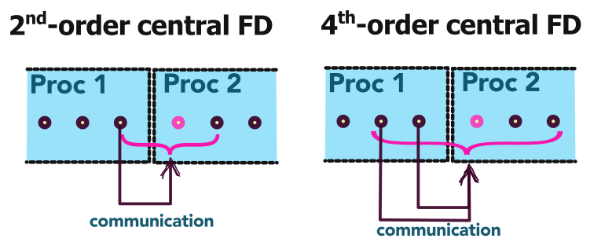

:::note[Learning Objectives]
At the end of this class, you should be able to:
1. Determine the parameters that influence the computational cost of a simulation
2. Identify the level of modelling and simulation required for a CFD problem
3. Select the level of geometric complexity to answer the scientific or engineering question  
:::
<CustomAside icon="pen" title="Time to complete: 75 min" colour="green"></CustomAside>

import Caption from '../../../components/Caption.astro';
import CustomAside from '../../../components/CustomAside.astro';
import Gif from '../../../components/Gif.astro';

import { Tabs, TabItem } from '@astrojs/starlight/components';
import { CardGrid } from '@astrojs/starlight/components';
import Option from '../../../components/Option.astro';
import MultipleChoice from '../../../components/MultipleChoice.astro';
import Box from '../../../components/Box.astro';
import Spoiler from '../../../components/Spoiler.astro';
import CustomIcon from '../../../components/CustomIcon.astro';

Constrained by finite HPC resources, systematic planning of large-scale CFD simulations helps to best align the available resources with the scientific or engineering question that motivates the CFD study. Naturally, the details of the planning stage are case specific; nonetheless, this lesson explores the various parameters influencing HPC cost and applies these concepts to the example problem introduced last lesson.

## Parameters that influence HPC cost
The overall HPC cost of a large-scale CFD simulation will be driven by three main categories of considerations, these are:

- **Physics and setup** 
    * *Dimensionality of the problem*
    * *Unsteadiness*
    * *Geometric complexity or geometric scale separation*
    * *Physics of the problem (including multi-physics, multiphase, and/or multi-species)*
    * *Physical time advancement needed*
    * * The extent of the computational domain*

- **Simulation parameters**
    * *Type of turbulence modelling* (*e.g.* RANS, LES, DNS)
    * *Thermodynamic modelling*
    * *Selection and order of numerical schemes* 
    * *Convergence criteria*
    * * Preconditioning and matrix inversion algorithm* 
    * *Type of boundary condition*
    * *Wall-resolved or wall modelled*
    * *Moving/deforming mesh, mesh adaptation etc.*
    
- **Parametric space**
    * *Number of simulations needed to cover the parametric space*

Each of the above categories is explored in more depth in the following.

 
### Impact of physics and CFD setup on HPC costs
The physical setup of the problem plays the largest role in determining the overall computational cost of a CFD study.  Determining the level of **abstraction of the CFD setup** as well as the **necessary physics** that needs to be simulated is a critical aspect in the planning stage.   Significant computational savings can be gained by carefully considering and assessing the necessity of considering the various physical or geometric aspects of the problem. Simulating either a steady or a lower-dimensional order problem can result in massive computational savings, yet these considerations need to take into account a number of key factors, which involve a **good understanding of the fluid dynamics** of the problem under consideration. Determining the necessary physics and abstraction of the CFD setup is highly case-specific, but it also depends on other externalities such as: expertise of the user, features/capabilities in the CFD solvers, resources and time available. In this subsection, we explore the main parameter influencing the CFD setup.

##### Dimensionality of the problem
The dimensionality of the problem is an important consideration that can greatly impact the computational time of a simulation. Consider a three-dimensional simulation that is discretized with  $64\times 64\times 64$ grid points (or 262,144 total grid points). If this simulation were able to be solved in two- instead of three-dimensions, the total number of grid points would drop by 64 times ($64\times 64=4,096$) for the same resolution in the other two dimensions!  This great computational saving may not always be possible:

* Many problems are inherently three-dimensional and cannot be modelled as a two-dimensional problem (for example, flow through a pump or dispersion of pollutants, for example). 
* Turbulence is a three dimensional phenomenon: [Reynolds Averaged Navier-Stokes (RANS)](https://arc4cfd.github.io/glossary/#section-2) models the impact of the unsteady turbulence on the mean flow, as such they can be used in a two-dimensional simulation; the applicability of [LES](https://arc4cfd.github.io/glossary/#section-2) or [DNS](https://arc4cfd.github.io/glossary/#section-2) in two dimensions is more questionable.
* Vortical flows : only one component of vorticity can be represented in two dimensions (instead of a full three-dimensional vector) and axial vortex stretching cannot occur (a key characteristic of turbulence).
* Heat or mass transfer (and many other diffusion problems) **may** be poorly estimated in two dimensions

As a simple example of the impact of dimensionality on the results can be seen in the decay isotropic turbulence simulated below in a two- (left) and three-dimensional (right) domains, where the vorticity is shown. Note the very clear differences between the turbulence in both cases; in 2D we clearly see the filament-like straining of the turbulence which occurs in a single plane (given the 2D domain). In 3D, since the turbulence is not constrained to a single plane, the filamentary structure in the turbulence is not visible. Therefore, a **2D dimensional simplification may not be appropriate** for this problem.
<CardGrid>
    <Gif src='../../../assets/figs_section2/IsoTurb2D.gif' alt='' width='100%'/>
    <Gif src='../../../assets/figs_section2/IsoTurb3D.gif' alt='' width='100%'/>
</CardGrid>
<Caption>Comparison between a 2D (left) and 3D (right) simulation of isotropic-like turbulence. This example may be run in [Basilisk](http://basilisk.fr) in the git repo.</Caption>

##### Geometric complexity 
Reducing the geometric complexity of the physical problem can significantly reduce the computational cost. Ultimately, we seek to omit or simplify any irrelevant geometrical details of the real-world fluid dynamic problem, yet determining what is *relevant* from what is *not* is challenging. The first question to ask is: *do we need to simulate the full fluid dynamic problem under consideration?*  One good way to think of the problem of the required geometric complexity is to consider the following axes:

<Caption>Determining the geometric complexity of a CFD simulation</Caption>

In this figure, the ordinate goes from simulating the **building blocks**, or the constitutive elements of the problem all the way to the **full scale model**.  For example, if our full-scale physical problem involves the heating and ventilation in a room, the building blocks of this problem could be, for example : a) the jet formed by the ventilation exhaust, b) the heat transfer at the wall, or c) the mixing of hot and cold air. The simulation of these building blocks can help us understand the details of the full-scale problem.

 On the second axis (abscissa)  we have, at one end, the **abstracted problem** and, at the other, the **applied problem**.  As an example, if we are interested in exploring the laminar flow separation on an airfoil, the applied problem would be to simulating the full airfoil under the desired conditions, and the abstracted problem could be the study of flow separation on a smooth bump. In this case, we are abstracting the problem of an airfoil to a smooth bump in order to better isolate the physics that are under consideration. 
 
Both of these axes are not fully independent, that is to say, a real-world fluid dynamics problem would be a **full scale** and **applied problem**, therefore most of the CFD setups lie on a 45-degree line in this design space (as shown) as applied problems are often considered at full-scale and abstractions are often building block.  Naturally the discussion of modelling complexity goes hand-in-hand with the fidelity of the modelling, and thus HPC costs.

The determination of the CFD setup should be done by considering the alignment with the scientific/engineering question and the fluid dynamic problem as discussed during [last lecture](https://arc4cfd.github.io/section2/part1/#setting-up-cfd-problems) in conjunction with the HPC resources. These considerations require a good comprehensive knowledge of the CFD and fluid dynamics. Therefore, reach out to colleagues, supervisors, or friends to discuss the limitations resulting from these decisions.

> ---
>
> “*Make things as (geometrically) simple as possible, but no simpler.*”
>
>       -Albert Einstein (CFD-revised)
>
> ---

<CustomAside icon="rocket" title="Simplifying geometries" colour="green">
When simulating a full-scale, applied CFD problem, we will always seek to simplify the unnecessary geometrical features of the problem. Many applied problems have geometric complexity (e.g. flow over a complex terrain wind-turbine farm, or aerodynamics of a race car, rivets or joints, etc.), especially, if the geometry is derived from computer-aided design (CAD).  Most of the small-scale geometric complexity can be removed (e.g. rivet heads, grooves), if its **influence is deemed to be negligible**.  These geometric details require additional grid points to fully resolve, which are wasted computational resources if the details play a negligible role in the overall simulation results. If they are included without the necessary resolution, they can lead to an **increased numerical error**, local **numerical instability**, and/or can result in **time-stepping limitations** that can greatly penalize a large-scale simulation. We want to make the geometry as simple as possible, but not simpler! Determining which geometric details to omit is non-trivial and requires a good amount of experience, intuition, and understanding of the numerical methods.
</CustomAside>

##### Physics of the problem 
A further consideration lies in determining the physical modelling needed in a simulation. Here, when we discuss the *physics of the problem*, we are referring to the various *physical models* used in addition to the classical Navier-Stokes equations to account for combustion, compressibility, heat transfer, multiphase flows etc. Sorry to our colleagues in physics for the abuse of terminology (!); the use of '*physics of the problem*' is commonly used in the CFD community. 

If we have an incompressible, single-phase flow over an adiabatic wall (no heat flux), the problem definition is straightforward, and we can solve the classical governing equations of fluid motion. But for most applied problems in fluid dynamics, the determination of the physics is not as straightforward.  For example, all matter--including a fluid--has a finite level of compressibility. The compressibility is defined by the bulk compressibility factor which is a ratio of the relative change in volume of the fluid per change in pressure: $\mathcal{k}=\frac{1}{V} \frac{dV}{dp}$ (this can be defined isothermally or isentropically).  But, if the relative change in volume (or we can think of this in terms of change in density) is **not** negligibly small for the pressure change in the problem, we can greatly simplify the Navier-Stokes equation by considering a constant density, incompressible flow. In other simulations, we may want to consider pressure dependant, variable-density fluid (for example in atmospheric turbulence) that is still incompressible. Under other conditions, we may want to solve a low-Mach formulation that can allow for density fluctuations and/or acoustic waves. The decision on which type of incompressible solver one uses is problem dependent and has a direct impact on the computational cost. Some of these formulations involve very large linear systems which can be challenging to compute  on massively parallel HPC systems. 

<CustomAside icon="star" title="Rule of thumb" colour="green">
As a general rule, if the local Mach number is below 0.3, the compressibility effects will be negligible. If buoyancy or heat transfer transfer is important, we need to account for the variable density flow, but not necessarily compressibility.
</CustomAside>

Computational expense of a simulation can grow significantly by considering additional physics (multiphase flows, electro-fluid-dynamics, fluid-structure interaction, conjugate heat transfer, etc.) or by addition strong source terms (buoyancy, radiation, heat release).  One must consider the various impacts on the  modelling of the physics of the problem on the desired simulation outcomes in light of the scientific/engineering question motivating the study.  Depending on the focus of the study, we may or may not want to consider various physical aspects. For example, if we are interested in determining the lift and drag of an airfoil *a priori*, the aeroacoustic emission will not be relevant and can be neglected. But, if we are interested in quantifying the trailing edge tonal noise, then naturally we need to consider either resorting to an [aeroacoustic model](https://www.openfoam.com/industries/automotive-and-land-transportation/aeroacoustics) or resolving the acoustic wave propagation (typically very computationally demanding). 

As a general rule, we seek to remove as much complexity in the physical modelling as we can without (significantly) affecting the ability to answer the scientific/engineering question motivating the study. The impact of considering additional physics **can** result in:
 - Increasing the number of unknowns that need to be solved
 - Constraining the time step of the problem
 - Imposing stabilizing numerical schemes 
 - Increasing the grid resolution needed

####  Extent of computational domain  

The extent to which the computational domain will directly impact the overall HPC cost of a simulation.  The computational domain size is primarily a consideration for external flows, although internal flows may also need to consider the computational domain size to simulate a fully developed pipe flow, for example.  Ideally, we need to determine the minimal domain size (minimize computational cost) that allows us to simulate the problem without negatively influencing the domain of interest. Take the example of a plume exhausting from a stack, as shown below. 

<Caption>Domain size consideration.</Caption>

If the outer domain is too small, the boundaries may constrain and influence the development of the plume and the error will pollute the computational results in the domain of interest. The minimal size of the computational domain will depend on the modelling choices (next subsection) and therefore is difficult to generalize. There are two main approaches one can take for an a priori estimation of the computational domain size:

- **Theoretical or empirical formula**: for example, we can estimate the boundary layer height based on streamwise distance, estimate the plume dispersion based on empirical dispersion models, or compute the entrance length in a pipe based on empirical correlations. These theoretical or empirical formulas can help determine the size of the characteristic feature, which can then be used to estimate the computational domain size.
- **Low-order simulation**: instead of relying on theory or empiricism, a low-order simulation can be run, sometimes even locally, to provide guidance on the characteristic size of the fluid dynamic phenomenon. This low-order simulation can be, for example, a two-dimensional representation of a three-dimensional problem, or a coarser and more heavily modelled simulation. These results can then inform the domain size needed for the large-scale simulation.

####  Extent of temporal domain  

Determining the required characteristic of time advancement of the simulation can also greatly impact the HPC costs. As the Navier-Stokes equations have a parabolic-hyperbolic character, the CFD solution depends, to some degree, on the initial and boundary values of the problem. As it is very difficult to perfectly impose initial conditions on a CFD simulation, we must first determine the approximate "transience" of the simulation. This is the time required for the flow to adapt the initial to the boundary conditions of the problem. If we are interested in studying a *[statistically steady](https://arc4cfd.github.io/glossary/#section-2)* problem (an unsteady problem whose statistics are mostly invariant in time), we will typically measure this in terms of the **[flow-through time](https://arc4cfd.github.io/glossary/#section-2)**. The flow-through time corresponds to the time it takes for a fluid parcel to traverse the computational domain in the freestream. For example, if the computational domain has a length of $L_x=0.5$ m and the freestream velocity is $U_0=2$ m/s, then the flow though time would be $0.25$ s. Generally, depending on the modelling fidelity, size and domain of interest, we will aim to wait until 4 and 10 flow through times before assuming the statistically steady (although this is heavily problem dependent). 

{/* **The second consideration is the determining the total time.** To estimate the overall cost of the numerical simulation one must consider that the equations of motion must be integrated for a time proportional to the integral time-scale of the flow $T$. The time step size $\Delta t$ is a function of the simulation technique used. In DNS, for instance, $\Delta t$ is limited by the need of resolving the life cycle of the smallest eddy of size $\eta$ (where $\eta$ represents the Kolmogorov scale). In LES, a larger time step could be used and will be determined by the size of the smallest resolved eddy. RANS, as expected, has the least restrictive requirement on $\Delta t$ given that it only resolves mean quantities. A good practice on estimating the total cost of a simulation was outlined by Reynolds [Reynolds (2005)](https://link.springer.com/chapter/10.1007/3-540-52535-1_52) who assumed that the operation count scales like the number of points in the domain, and that the time step $\Delta t$ is determined by the stability condition on the Courant–Friedrichs–Lewy (CFL) number, $\Delta t\approx 1/\Delta x$ [@piomelli2022vki]. Given that time integration must be performed for a number of steps proportional to $N_t\approx T/\Delta t$, this results in a total number of steps proportional to $N_t\approx \left(N_x N_y N_z\right)^{1/3}$, and a total computational cost of $\left(N_x N_y N_z\right)^{4/3}\approx Re^3$. */}

<Box iconName='exercise'>
  **Summative example**: Planning the simulation

Recall that we are interested in studying the buffeting effect on a NACA 4412 airfoil with a flap. The scientific question and physical problem are given in this case and we must determine the best abstracted CFD setup that is close enough to the actual physical setup  while allowing us to address the scientific question motivating this work. We recall, the illustration from last lesson:

<Caption>Example of the alignment between the physical problem, the scientific (or engineering) question, and the CFD setup. </Caption>

 To help us determine the type of simulation needed, try answering the following questions.

<Box iconName="quiz">
  **QUIZ**
  
   Does this simulation need to be unsteady?
<MultipleChoice>
    <Option isCorrect>
        Yes
    </Option>
    <Option>
        No   
    </Option>
</MultipleChoice>

    
Problem 1: Solution 

The buffeting is an inherently **unsteady** phenomena, therefore an unsteady simulation is  needed to capture this effect without resorting to additionally modelling.  Although we could run a steady-state simulation, we would likely not be able to compute the buffeting frequency or any of the other relevant parameters.

#### Does this simulation need to be three-dimensional?
<MultipleChoice>
    <Option >
        Yes
    </Option>
    <Option>
      No   
      </Option>
          <Option isCorrect>
      Maybe
      </Option>
</MultipleChoice>

    
 Solution 

   This flow is likely turbulent and is characterized by spanwise-aligned turbulent structures. The breakdown of these structures may have a spanwise component due to the finite size of the wing, therefore it may be preferable to run a three-dimensional simulation if we have the necessary HPC resources. To confirm the necessity of a three-dimensional simulation, it would be a good idea to conduct a literature review and assess this point based on the state-of-the-art in the field.
       

</Box>

These questions guide us towards the need to simulate an unsteady, three-dimensional problem. Now comes the question of the necessary geometric complexity of the CFD setup. This question is intrinsically tied to the modelling fidelity needed  to answer the scientific question. Another way of thinking about it is that if we had unlimited computational resources, we would simulate the entire airfoil (hey, while we are at it, why not simulate the full airplane!) in all its geometric complexity. Under finite computational resources, we must align the geometric complexity and modelling fidelity of the problem.

To better visualize this complexity, we can explore possible geometric configurations in the design space considered above. The first axis (ordinate) goes from simulating the **building blocks** of the problem all the way to the **full scale model** (full airfoil). In the second axis (abscissa), we have, at one end, the **abstracted problem** and, at the other, the **applied problem**. To better visualize the problem, we rotated the axes and provided examples of possible geometries to consider: 

<Caption>Example of geometric and modelling fidelity matrix for the NACA 4412 airfoil with a flap. </Caption>

For the present course, the focus of the study lies in a higher-fidelity simulation in order to explore buffeting effects at the gap while leveraging HPC resources. Other researchers may want to focus on the use of lower fidelity tools. The decision will be driven by the scientific/engineering question and the knowledge and expertise of the user.  As a result, there are multiple setups that could be studied. Here, we will focus on the [backward facing step (BFS)](https://arc4cfd.github.io/glossary#section-2). BFS is characterized by a recirculation flow with a strong shear layer, and will allow us to characterize the buffeting effect in a simple and easily parameterizable setup. 
</Box>

### Effect of simulation parameters on HPC cost
We understand *simulation parameters* to mean the parameters that can be *easily* modified within a simulation or input file.  The choice of the simulation parameters will inherently be tied to some of the decisions taken in determining the physics and CFD setup, discussed above. Here, we present an overview of the simulation parameters that can have a significant impact the total HPC cost of a simulation. 

#### Turbulence modelling
Many of the applied fluid dynamics problems occur in a turbulent regime. As turbulence is a highly multiscale phenomenon, the need to account for the turbulence often drives the computational costs of the CFD simulations.  The detailed discussion on the turbulence and its modelling is left for the [next lecture](https://arc4cfd.github.io/section2/part3), here we briefly discuss the main difference in modelling approaches:

 <Caption>Illustrative comparison between various turbulence modelling  approaches.</Caption>

- **[Reynolds Averaged Navier-Stokes (RANS)](http://localhost:4321/glossary#section-2)**: The effect of turbulence on the mean flow is *completely* modelled by characterizing the turbulence through the transport of additional turbulence equations (e.g. k-epsilon equation). As the grid resolution only needs to capture the gradients of the mean flow, the resolution requirement is significantly lower than that of the other turbulence modelling approaches. RANS-type turbulence models are often used for full-scale and applied problems in which the turbulence modelling uncertainty is acceptable. RANS models are well suited for most problems but may still have challenges for more complex flows (heavily separated flows, high-speed flows, complex thermodynamic flows, etc.)
- **[Large-eddy simulation (LES)](http://localhost:4321/glossary#section-2)**: The basic premise of LES is to resolve the large scales of the turbulent motion and model the effect of the smallest scales of turbulence. The resolution requirement is more important than RANS but allows for a significant computational saving at higher-Reynolds numbers compared to DNS. LES are increasingly used in full-scale and applied problems for cases where RANS models are known to be less effective; LES can also be used for detailed studies of abstracted and building block problems.
- **[Direct numerical simulation (DNS)](http://localhost:4321/glossary#section-2)**: In DNS, all spatial and temporal scales of turbulence are resolved numerically. The problems studied by DNS are limited to smaller scale separation (lower Reynolds numbers) and usually can only be applied to abstracted and building block problems, given the extreme computational cost.

#### Selection and order of numerical schemes
The selection of numerics, for both spatial and temporal discretization, can directly influence the overall computational time especially for parallel computing. When we are discussing the *order of a numerical scheme*, we refer to the *order of convergence of the scheme*.  As a general rule, the **higher the order, the more expensive the simulation** for the same number of grid points. But, the **higher order schemes require fewer grid points** for the same numerical error. Most open-source and commercial codes used for general fluid dynamics rely on second-order finite-volume schemes. Thus, a two-time increase of the computational grid should result in a four-time reduction in the numerical error. 

In addition to the computational complexity of higher-order schemes, we must also account for the increased communication overhead for parallel computing. Let us take the very simple example illustrated below. To compute a second-order finite difference at the highlighted grid point on processor 2, we require the neighboring points which requires communication from processor 1. If, instead, we use a 4th order central finite difference scheme, we must **double** the communication between both processors.

 
<Caption>Effect of numerical scheme order in HPC.</Caption>

We have similar considerations for the order of the time advancement schemes. In addition to the order of the scheme, time advancement schemes can be broadly categorized as  **implicit** and **explicit** methods. The numerical considerations are amply discussed in most [numerical methods resources](https://en.wikipedia.org/wiki/Explicit_and_implicit_methods), here we consider the implications of these time advancement schemes on the HPC cost. Although **implicit methods** show great benefits in terms of numerical stability, it requires the *inversion of large matrices* which are particularly ineffective due to significant communication overhead on highly parallelized computational CFD problems. Whereas explicit methods, which do not require the same interprocessor communication, do not face the same difficulty. Per time step, explicit methods tend to show much better scaling characteristics compared to implicit methods.

#### Thermodynamic modelling
Many CFD problems, especially for compressible or multi-physics problems, involve the consideration of thermodynamics and heat transfer, thus the necessity to consider a state equation to relate density, pressure, and temperature. This often demands the addition of a state equation, but often an additional transport equation for the total energy of the flow, which can significantly increase the computational cost of the simulation (but, on the plus side, we no longer need to solve a pressure-velocity coupling as in incompressible flows). 

By default, most CFD solvers with thermodynamics will assume a calorically perfect gas, which imposes constant specific heat and the ideal gas law. For simulations that have non-ideal thermodynamics, for example, using the Peng-Robinson state equation, the solution of the thermodynamic solver requires an iterative loop and imposes significant computation overhead.  [Milan et al. (2021)](https://www.sciencedirect.com/science/article/pii/S0021999121004629) noted that the species transport equations and thermodynamics took over 56% of the total computational cost for a non-ideal, combustion simulation. 

<Caption>Example of the relative computation cost for simulations with non-ideal state equations, from [Milan et al. (2021)](https://www.sciencedirect.com/science/article/pii/S0021999121004629).</Caption>

#### Other modelling considerations
Modelling decisions can have a direct impact on the total HPC cost of a simulation. Here, we discuss the impact on HPC cost for a limited number of modelling considerations. 

##### Wall-resolved or wall modelled
As will be covered in the next lesson, the resolution near the wall will often drive the overall HPC cost of a simulation. Therefore, if we are able to model the flow features near the wall instead of resolving it, we can greatly speed up the simulation. Using wall modelled approaches has a two-pronged effect: (1) reduces the total number of grid points of the simulation, and (2) often relaxes the numerical time stepping constraints which often arise in this region. This comes at the cost of a greater reliance on modelling assumptions.

##### Type of boundary conditions
Boundary conditions, and especially time varying boundary conditions, can impose greater computational costs to a simulation. Often the large computational increase is tied to load imbalances (discussed in [2.5](https://arc4cfd.github.io/section2/part5/)) that arise when the boundary computational costs are important.

##### Multi-physics and multiphase modelling decisions
Many of the multi-physics and multiphase calculations in CFD offer a range of modelling choices that can impact the computational cost of a simulation. For example,  under certain non-premixed combustion conditions, we can rely on [*flamelet* modelling](https://en.wikipedia.org/wiki/Laminar_flamelet_model) which enables an *a priori* computation of the combustion source terms. This can represent a significant computational benefit compared run-time, finite-rate combustion calculations. 

#### Other numerical considerations
Many other numerical considerations will directly impact the total HPC costs, the scope of which is too wide to cover effectively in this course. 

##### Preconditioning 
Many numerical methods can benefit from preconditioning in order to improve the well-posedness of the matrix inversion problem. Similar to the implicit methods discussed earlier, preconditioning, although necessary, can result in significant computational cost in massively parallel computations due to the global nature of the preconditioning operator.

##### Convergence criteria
Selection of convergence criteria can greatly impact computational cost. Although not HPC specific, the selection of the convergence criteria represents a compromise between the computation time and the acceptable numerical error of the simulation.

##### Multigrid methods
[Multigrid methods](https://en.wikipedia.org/wiki/Multigrid_method) is a multi-resolution method that can accelerate convergence of a steady-state simulation through the solution of a hierarchy of discretization. On shared memory systems, these techniques can greatly speed up the computations but, due to the multi-resolution required,  tend to be less effective on highly parallel systems.

##### Adaptive mesh refinement (AMR) 
[Adaptive mesh refinement](https://en.wikipedia.org/wiki/Adaptive_mesh_refinement) allows a run-time adaptation of the mesh  to meet the changing local grid resolution requirements. As the mesh is coarsened and refined locally, we can greatly reduce the overall number of grid points needed for a simulation. On highly-parallelized computations, AMR can lead to load balancing issues, as some processors will have more points than others. Therefore, unless dynamic load balancing techniques are implemented, AMR may present only modest improvements in HPC.

### Determining parameters space  to cover
The use of CFD, especially for optimization or design considerations, typically involves simulations that span a large parameter space. These design spaces rapidly suffer from the **curse of dimensionality** and thus the selection of the parameter space to be investigated can greatly impact the overall computational cost.  The naive approach would be to simulate all possible combinations of geometry and flow parameters by changing only one parameter at a time.  For example, let us consider an icing on an airfoil. We may want to explore all angles of attack, at various operating conditions, for various icing conditions. If we only considered 8 individual settings for each of these parameters, we would need to run 512 individual simulations. If each simulation is computationally demanding, this becomes a very expensive computational problem.

A more systematic approach is to rely on the **[Design of Experiments (DOE)](http://localhost:4321/glossary#section-2)**. The basic premise of the DOE methodology is to simultaneously vary multiple factors at a time to obtain as much information as possible for each simulation. Although DOE stems from the experimental domain, it is widely used in CFD (e.g. [automotive](https://www.jstor.org/stable/44724846), [ship design](https://www.mdpi.com/2077-1312/7/7/226), and [aerospace](https://ntrs.nasa.gov/api/citations/20070010493/downloads/20070010493.pdf)) to reduce the computational cost of parametric investigations.  By limiting the number of simulations through DOE, we can greatly reduce the overall computational cost of a CFD campaign.

<Box iconName='exercise'>
   **Summative example**: Backward facing step

Continuing with the summative example, we simulate a backward facing step (BFS) of height, $\delta$, which is subject to a freestream flow at velocity $U$.  The transient development of flow structure downstream of the step is at a low-Reynolds number ($Re_ \delta = \frac{\rho U \delta}{\mu}= 5000$).  
Although we could define the extent of the domain based on empirical calculations (for example, using Schlichting's skin-friction correlation), here the flow domain is chosen based on the experimental work by [Jovic and Driver (1994)](https://link.springer.com/article/10.1007/BF00208471) and subsequent DNS studies by [Le et al (1997)](https://www.cambridge.org/core/journals/journal-of-fluid-mechanics/article/abs/direct-numerical-simulation-of-turbulent-flow-over-a-backwardfacing-step/645D21758E8F74568008899C17B12ADD). Schematic of the flow domain is shown below:

<Caption> Geometry of the simulation example. </Caption>

In the next lesson, we will conduct an *a priori* estimate of the HPC costs and then simulate this case in OpenFoam and SU2.

</Box>

<Box iconName="quiz">
  **QUIZ**

Should we always strive to reduce the computational cost of a simulation?

    
Solution

    Not necessarily! We should try to strike a balance between the modelling assumptions and HPC costs. By carefully considering the physical setup of your CFD simulation, you can help reduce unnecessary computational costs which should be avoided.

How does parallel computing affect the parameter selection for a CFD simulation?

    
Solution

   HPC and parallel computing seek to reduce the overall wall-clock time of a simulation. Due to the fact that most parallel CFD simulations use distributed memory parallelism, the interprocessor communication  and load balancing can greatly impact the numerical techniques that can speed-up computations on a local workstation. 

</Box>

:::note[Reflections and Takeaways]
Having finished this class, you should now be able to answer the following questions:
1. In a given CFD problem, what are the main drivers of the computational cost?
2. What are the compromises that are made in making decisions related to modelling?
3. Can I place a given CFD problem on an axis of abstraction and applied problem? On a building-block and full-scale axis?
:::

