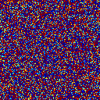

:::note[Learning Objectives]
By the end of this section, you should be able to:
1. Setup a methodology to determine key simulation parameters
2.  Determine variables of interest 
:::
import Caption from '../../../components/Caption.astro';
import CustomAside from '../../../components/CustomAside.astro';

import { Tabs, TabItem } from '@astrojs/starlight/components';

## Planning CFD simulations on HPC
Faced with a CFD workflow that could benefit from modern HPC infrastructure, the planning stage seeks to create an alignment between:   1) the physical reality of the fluid dynamic problem we are hoping to simulate, 2) the scientific or engineering question that we seek to answer,  and 3) the  abstracted CFD problem. 

<Caption>Alignment between these three aspects will allow an effective use of computational resources.</Caption>

Identifying the underlying scientific or engineering question that the simulation seeks to answer helps to articulate the exact justification for the simulation. It also helps to assess the level of abstraction required for the CFD simulation.   It goes without saying that the planning stage requires a good physical understanding  of the underlying fluid problem. 

## Parameters that influence HPC cost
The overall HPC cost of a CFD simulation will be driven by three main categories of considerations, these are related to:

- **Physical or abstracted setup** 
	* *Dimensionality of the problem*
	* *Unsteadiness*
	* *Geometric complexity of CFD*
	* *Multiphysics, multiphase, and/or multispecies*
	* *Physical time advancement needed*
	* *Extent of the computational domain*

- **Simulation parameters**
	* *Type of turbulence modeling* (RANS, LES, DNS)
	* *Order of numerical methods* (accuracy)
	* *Type of boundary condition*
	* *Wall-resolved or wall modelled*
	
- **Parametric space**
	* *Number of simulations needed to cover the parametric space*

[Add the discussion from Ferziger Peric on page 315.]: #

<Caption>Competing aspects in setting up CFD simulations</Caption>

### How to dermine the physical setup?
The physical setup that will be simulated plays the largest role on the overall computational cost of the CFD. All physical fluid dynamic problems are inherently unsteady and three-dimensional. Yet, significant computational saving can be gained from simulating either a steady or a reduced dimensional order problem, these simplification may be sufficient to bypass the need for parallel computing.
[discuss a bit more here]

The dimensionality of the problem is an important consideration. Consider a three-dimensional simulation with $64\times 64\times 64$ grid points (or 262,144 grid points); if this problem would be reduced the local resolution requirement drops by 64 times! ($64\times 64=4,096$) This great computational benefit comes with a a number of caveats:

* Many problems are inherently and cannot be modelled as a two-dimensional problem (flow through pump or dispersion of pollutants, for example). 
* Turbulence is inherently three-dimensional. As RANS fully models the turbulence, it can be applied to a two-dimensional problem but the applicability of LES or DNS is more questionable
*  Only one component of vorticity can be represented in two-dimensions (instead of a full three-dimensional vector) and vortex stretching cannot occur.

  
<Caption>XXXXXXXX</Caption>

The reduction of the geometric complexity of the problem can also significantly reduce the computational cost of the CFD. Ultimately, we seek to omit any irrelevant geometrical details. These small geometric details require additional grid points to fully resolve, which are wasted computational resources if the details plays a negligeable role in the simulation results. If they are included without the necessary resolution, they can be the site of increased numerical error, local numerical instability, and/or can result in time-stepping limitations that can greatly penalize a large scale simulation. Determining which geometric details do not have an overall effect on the flow is non-trivial  and requires a good amount of experience, intuitition, and understanding of the numerical methods.

Increasingly multiphysics simulations are 

CFD simulations inevitably represent a compromise between resolution, accuracy, parameter space

Multiphase flows?
Combustion?
MHD?
Turbulence?
High-paramter design space?
Moving/deforming simulations?
Multispecies and chemical reactions?

With massively parallel computers, the low-Mach number formulation becomes highly challenging, because it involves solving large linear systems.

### What are the considerations for the simulation parameters?

### What parameters space do I need to cover?

## What do I need to resolve?

## EXAMPLE: Planning the simulation
We seek to simulate the flow the flow around an NACA4412 airfoil with a flap. 

**Scientific question**:
Seek to understand the buffeting frequency in between the airfoil/flap gap.

We must balance the need for accurate 

Is the flow over the airfoil critical to answer ? Can we simplify this problem to a simple representative problem? If yes, what are the potential limitations of the analysis?

Is 3 dimensional critical?

Is compressibility important? Is there a need for multiphysics computations (e.g. icing)? 

1. Select problem
2. Determine the desired level of abstraction

## References
1. https://www.osti.gov/servlets/purl/1889593
2. https://ntrs.nasa.gov/api/citations/20140003093/downloads/20140003093.pdf
3. https://www5.in.tum.de/lehre/vorlesungen/hpc/WS14/intro.pdf