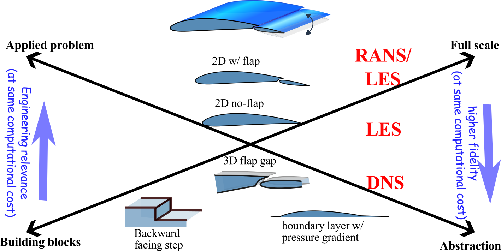

:::note[Learning Objectives]
By the end of this section, you should be able to:
1. Setup a methodology to determine key simulation parameters
2.  Determine variables of interest 
:::
import Caption from '../../../components/Caption.astro';
import CustomAside from '../../../components/CustomAside.astro';
import Gif from '../../../components/Gif.astro';

import { Tabs, TabItem } from '@astrojs/starlight/components';
import { CardGrid } from '@astrojs/starlight/components';
import Option from '../../../components/Option.astro';
import MultipleChoice from '../../../components/MultipleChoice.astro';
import Box from '../../../components/Box.astro';
import Spoiler from '../../../components/Spoiler.astro';

## Planning CFD simulations on HPC
Constrained by finite HPC resources, the systematic planning of large-scale CFD simulations helps to best align the available resources to the scientific question that underlines the simulations. The planing in CFD is case specific, this section explores the various parameters influencing HPC cost and introduces an example CFD problem that will be used in the following classes.

## Parameters that influence HPC cost
The overall HPC cost of a large-scale CFD simulation will be driven by three main categories of considerations, these are related to:

- **Physical or abstracted setup** 
	* *Dimensionality of the problem*
	* *Unsteadiness*
	* *Geometric complexity of CFD*
	* *Physics of the problem (inclusing multiphysics, multiphase, and/or multispecies)*
	* *Physical time advancement needed*
	* *Extent of the computational domain*
	* *Thermodynamic modelling*

- **Simulation parameters**
	* *Type of turbulence modeling* (*e.g.* RANS, LES, DNS)
	* *Order of numerical methods* 
	* *Type of boundary condition*
	* *Wall-resolved or wall modelled*
	* *Moving/deforming mesh, mesh adaptation etc.*
	
- **Parametric space**
	* *Number of simulations needed to cover the parametric space*

Each of the above categories of consideration is explored in more depth below:

### How to determine the physical setup?
The physical setup that will be simulated plays the largest role on the overall computational cost of the CFD. All physical fluid dynamic problems are inherently unsteady and three-dimensional. Yet, significant computational saving can be gained from simulating either a steady or a reduced dimensional order problem, these simplification may be sufficient to bypass the need for parallel computing.
{/* discuss a bit more here */}

##### Dimensionality of the problem
The dimensionality of the problem is an important consideration. Consider a three-dimensional simulation with $64\times 64\times 64$ grid points (or 262,144 grid points); if this problem would be reduced the local resolution requirement drops by 64 times! ($64\times 64=4,096$) This great computational benefit comes with a a number of caveats:

* Many problems are inherently and cannot be modelled as a two-dimensional problem (flow through pump or dispersion of pollutants, for example). 
* Turbulence is inherently three-dimensional. As RANS fully models the turbulence, it can be applied to a two-dimensional problem but the applicability of LES or DNS is more questionable
*  Only one component of vorticity can be represented in two-dimensions (instead of a full three-dimensional vector) and vortex stretching cannot occur.

<CardGrid>
	<Gif src='../../../assets/figs_section2/IsoTurb2D.gif' alt='' width='100%'/>
	<Gif src='../../../assets/figs_section2/IsoTurb3D.gif' alt='' width='100%'/>
</CardGrid>

{/*    */}
<Caption>Comparison between a 2D (left) and 3D (right) simulation of isotropic-like turbulence.</Caption>

##### Geometric complexity 
The reduction of the geometric complexity of the problem can also significantly reduce the computational cost of the CFD. Ultimately, we seek to omit any irrelevant geometrical details. These small geometric details require additional grid points to fully resolve, which are wasted computational resources if the details plays a negligeable role in the simulation results. If they are included without the necessary resolution, they can be the site of increased numerical error, local numerical instability, and/or can result in time-stepping limitations that can greatly penalize a large scale simulation. Determining which geometric details do not have an overall effect on the flow is non-trivial  and requires a good amount of experience, intuitition, and understanding of the numerical methods.

##### Physics of the problem 
A further consideration lies in determining the level of fidelity of the physics in the CFD model. For example, all matter--including fluids in all phases--has a finite level of compressibility. The compressibility is defined by the bulk compressibility factor which is a ratio of the relative change in volume of the fluid per change in pressure: $k=1/V \frac{dV}{dp}$, this can be defined isothermally or isentropically.  But, if the relative change in volume (or the we can think of density) for the pressure change in a given fluid system, we can greatly simplify the Navier-Stokes equation by considering a constant density flow. 

:::tip[Rule of thumb]
As a genaral rule, if the local Mach number is below 0.3, the compressibility effects will be negligible. Keep in mind that for simulations of, for example atmospheric flows, where the pressure and temperature vary with elevation, or in flows with large temperature variations, where the density changes with temperature, the Mach number-based delination is not effective. In these case, we can solve incompressible equations with variable density fluid.
:::

For compressible and non-isothermal flows, we must typically solve the conservation of energy equation which requires an additional state equation to relate the thermodynamic variables.  By default, most CFD solvers assume a calorically perfect gas, which imposes constant specific heat and ideal gas law. For simulations that have non-ideal thermodynamics, for example using the Peng-Robinson state equation, the solution of the thermodynamic solver requires an iterative loop and imposes significant computation overhead.  [Milan et al. (2021)](https://www.sciencedirect.com/science/article/pii/S0021999121004629) noted that the species transport equations and thermodynamics took over 56% of the total computational cost for a non-ideal, combustion simulation. 

Computational expense of a simulation can grow significantly by considering additional physics (multiphase flows, electro-fluid-dynamics) or by addition strong source terms (buoyancy, radiation, heat release).

[With massively parallel computers, the low-Mach number formulation becomes highly challenging, because it involves solving large linear systems.]: #

#### Computational domain and final simulation time

<Caption>Competing aspects in setting up CFD simulations</Caption>

### What are the considerations for the simulation parameters?
[to do]

### What parameters space do I need to cover?
[to do]

## What do I need to resolve?
[to do]

<Box imgSrc="/src/assets/quiz_icon.png">
## EXAMPLE: Planning the simulation
We present an example that carries through the entire section and systematically apply the workflow and the concepts learned. For this example, we consider the study of a canonical NACA 4412 airfoil with a flap. This is a representative of a typical non-symmetric airfoil that could be encountered in many aerospace applications.

<Caption>Example of a NACA 4412 airfoil with a flap. </Caption>

In order to correctly plan the simulation, we must clearly identify the underlying scientific question that motivates the study. For this example, we are interested in **quantifying the buffeting effects caused by the gap between the airfoil and the flap**.  This question will motivate the entire application of this example in this course.  In order to start planning out the simulation, we need to align the physical problem, the scientific question and the abstracted CFD setup, as illustrated here:

<Caption>Example of the alignment between the physical problem, the scientific (or engineering) question and the CFD setup. </Caption>
The scientific question and physical problem are given in this case and we must determine the best abstracted CFD setup that is close enough to the actual physical setup  while allowing us to address the scientific question motivating this work. To help us determine the type of simulation needed, try to answer the following questions:

<Box imgSrc="/src/assets/quiz_icon.png">
#### Problem 1: Does this simulation need to be unsteady?
<MultipleChoice>
    <Option isCorrect>
        Yes
    </Option>
    <Option>
      No   
      </Option>
</MultipleChoice>

    
Problem 1: Solution 

The buffeting is an inherently **unsteady** phenomena, therefore the an unsteady simulation is  needed to capture this effect without resorting to additionally modelling. 

#### Problem 2: Does this simulation need to be three-dimensional?
<MultipleChoice>
    <Option >
        Yes
    </Option>
    <Option>
      No   
      </Option>
          <Option isCorrect>
      Maybe
      </Option>
</MultipleChoice>

    
Problem 2: Solution 

   This flow is likely turbulent and is characterized by spanwise aligned turbulent structures. 
   
    These structures are inherently three-dimensional, so ideally a [todo]
       

</Box>

The above questions guide us towards the need to simulate an unsteady, three-dimensional problem. Now comes the question of the necessary geometric complexity of the CFD setup. The geometric complexity represents a compromise between the available computational resources/time  and the fidelity needed for to answer the scientific question. 

In the following class, we will present the main classes  

For the present example, the focus of the study will lies in a high-fidelity simulation [todo]

### Problem description
A backward facing step of height, $\delta$ , is subject to freestream flow at velocity $U$. The transient development of flow structure downstream of the step is simulated using incompressible SA-DDES. OpenFoam v23 and SU2 v7 are used to simulate the flow. 

The flow domain is chosen based on the experimental work by [Jovic and Driver (1994)](https://link.springer.com/article/10.1007/BF00208471) and subsequent DNS studies by Le et al (1997). Schematic of the flow domain is shown below:

The Reynolds number based on the step height is $Re_h = \frac{\rho U \delta}{\mu}= 5000$. 
</Box>

## References
1. https://www.osti.gov/servlets/purl/1889593
2. https://ntrs.nasa.gov/api/citations/20140003093/downloads/20140003093.pdf
3. https://www5.in.tum.de/lehre/vorlesungen/hpc/WS14/intro.pdf
