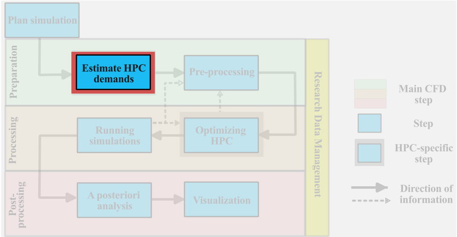
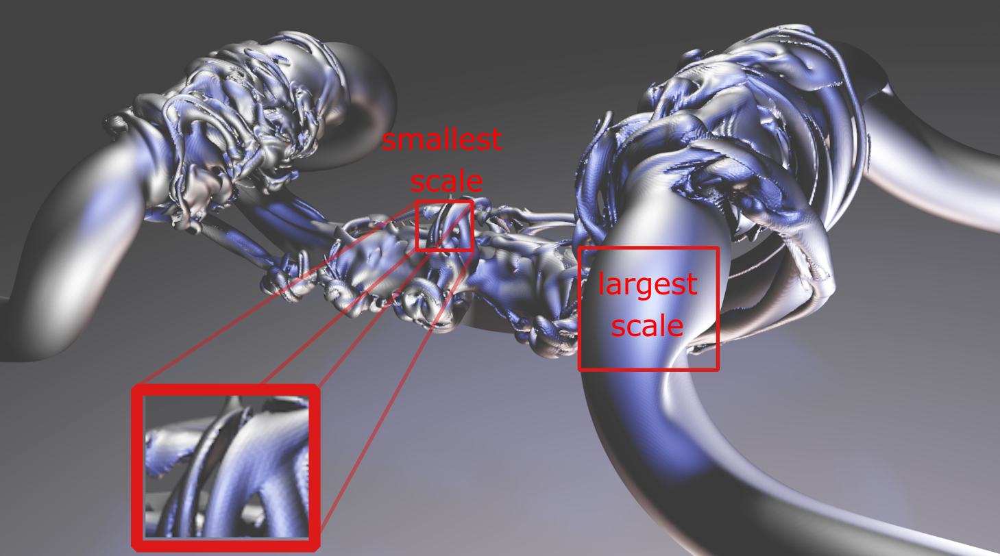
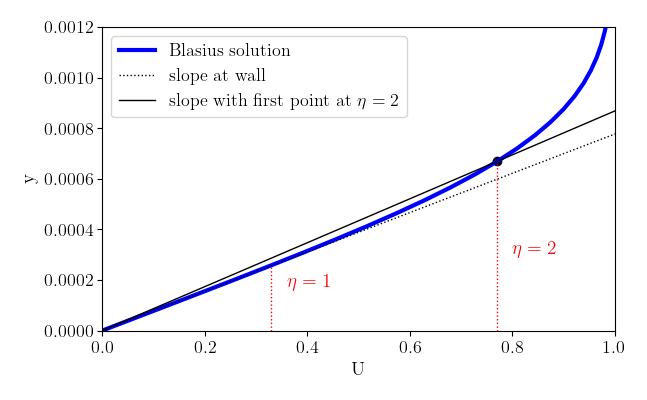
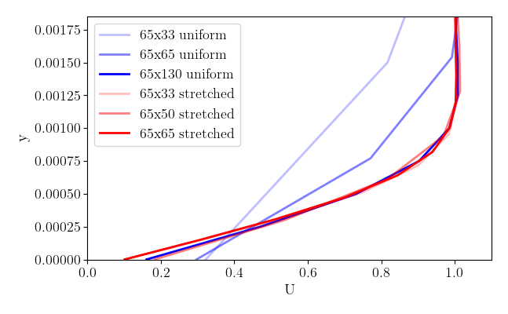
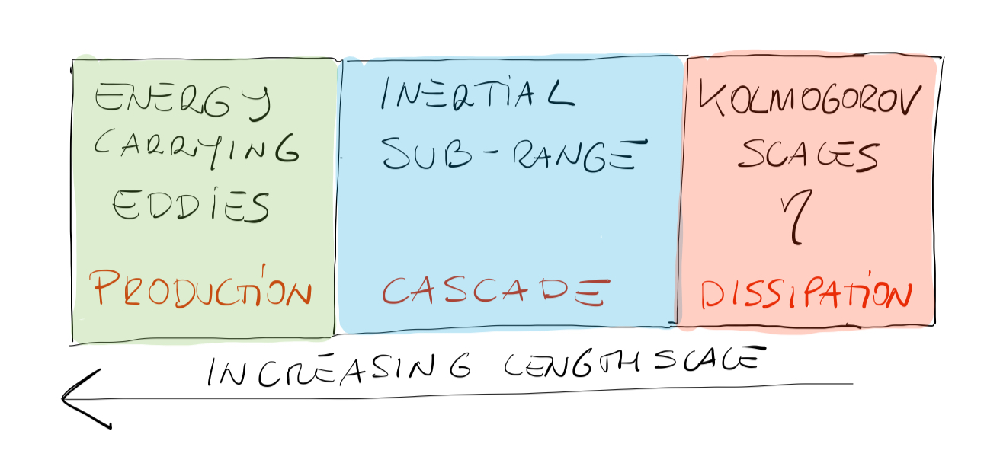
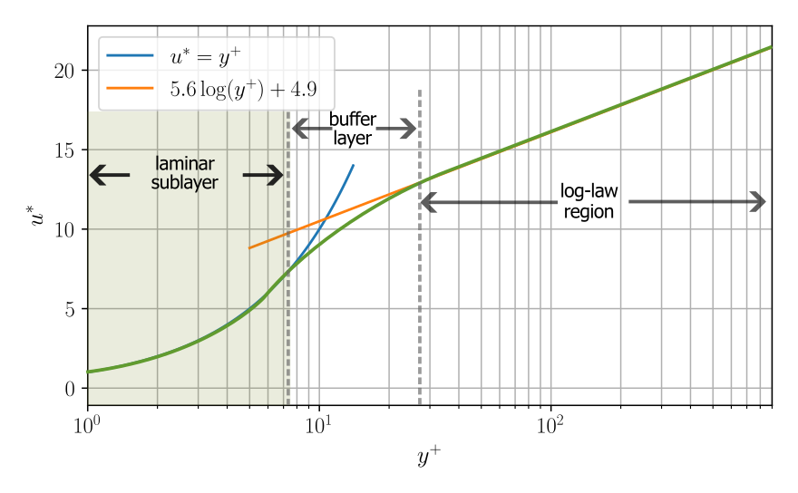
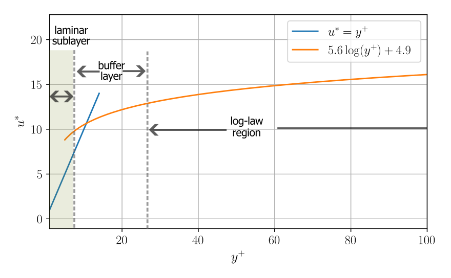
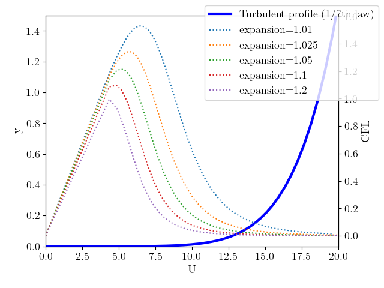

import Box from '../../../components/Box.astro';
import MultipleChoice from '../../../components/MultipleChoice.astro';
import Option from '../../../components/Option.astro';
import CustomAside from '../../../components/CustomAside.astro';
import Spoiler from '../../../components/Spoiler.astro';

import Caption from '../../../components/Caption.astro';

:::note[Learning Objectives]
At the end of this class, you should be able to:
1. Approximate the mesh size of a CFD simulation;
2. Estimate the total number of time steps needed for a simulation;
3. Estimate the memory and storage requirements of a simulation;
4. Approximate the total computational cost of a simulation.
:::
<CustomAside icon="pen" title="Time to complete: 90 min" colour="green"></CustomAside>

The objective of this section is to provide a systematic approach for an *a priori* estimation of the HPC cost of a large-scale CFD simulation. These estimates are meant to provide guidance prior to running simulations to better align the run(s) with the available computational resources. In this class, we will provide an approach to estimate:
- the computational mesh size;
- the time advancement needs;
- the storage and memory requirements.

Together, these estimates can provide an order of magnitude of the expected HPC costs. Each of these aspects will be discussed separately. Although these estimates are biased toward turbulent flows, the systematic approach can be used for other types of CFD simulations.



## Mesh size estimation
The *a priori* estimation of the grid resolution requirement will help determine the anticipated computational expense of the simulation. These *a priori* estimates do not replace grid sensitivity studies that are necessary for verification of the CFD simulation results; instead, these estimates are meant to provide an order of magnitude idea of the degree of freedom of the problem to better plan the HPC resource allocation. These mesh estimations are based on a **fully structured mesh**, therefore, a carefully designed unstructured mesh may help to reduce the computational expense of a simulation. Thus, the current approach can be considered as *conservative grid estimates*.

The costs for a CFD campaign are driven by either of the following.

-  large parametric space, thus a large number of smaller simulations;
-  large computational cost per simulation due to the multiscale nature of the problem.

For parametric studies, an accurate *a priori* estimate of the grid point requirement is often not necessary.  An iterative approach can be done on the individual simulation that is likely to be modest in size, given that the computational cost stems from the extent of the parametric space that is being investigated. Furthermore, the iterative grid size estimation is likely more accurate and effective than an *a priori* estimation. Thus, we consider the more complex problem of estimating the approximate grid point requirements for a large multiscale CFD simulation.  The resolution requirement of these multiscale CFD problems will be driven by:

- resolution of near wall-bounded flows;
- large-gradients in the freestream;
- multiphase and multiphysics considerations;
- special flow features (transition, separation, shock waves);
- geometric complexity (or large scale separation) in the physical problem.

All these features driving the computational cost are tied to the multiscale nature (either in space or time) of the fluid problem.  To illustrate the multiscale nature of a typical CFD simulation, we show a [pair of reconnecting, antiparallel vortices](https://www.cambridge.org/core/journals/journal-of-fluid-mechanics/article/abs/sound-generation-mechanism-of-compressible-vortex-reconnection/F4ED47A4360A583936C971E0A844B594). This figure highlights the necessity to resolve both the sharp gradient at the smallest scale as well as the largest scale of the problem, thus, we can see that we are rapidly bound by necessity to resolve the smallest and largest flow features.  The largest scale must comfortably fit within the computational domain as discussed [last lesson](https://arc4cfd.github.io/section2/part2/), whereas the resolution at the smallest scale is the focus in the following subsections.

<Caption>Example of a multiscale problem in [CFD](https://www.cambridge.org/core/journals/journal-of-fluid-mechanics/article/abs/sound-generation-mechanism-of-compressible-vortex-reconnection/F4ED47A4360A583936C971E0A844B594)</Caption>


:::caution[Remember]
Estimating the total computational cost of a numerical simulation **is both science and art**. An exact *a priori* knowledge of the amount of CPU hours required is a very hard task to accomplish, but one can follow a consistent and reliable strategy, which we outline below.
:::

### Grid estimate for wall bounded flows
The non-slip condition arising from the viscous nature of the fluid results in large velocity gradients close to solid walls. Thus, the overall mesh size will be strongly influenced by the near-wall grid requirements. The state of the boundary layers will also influence the grid count, therefore, we need to consider separately the resolution of the:
- laminar boundary layer;
- turbulent boundary layer;
- transitional boundary layer (later in this class).

Numerically, we need to **resolve the large gradients near the wall**, for this reason, we need more grid points at that location.  Naturally, the resolution is directly influenced by the numerical scheme and modelling considerations used in the CFD code; thus, these estimates are meant to provide an order of magnitude of the expected grid requirements for a second-order finite-volume solver.


#### Grid estimate for laminar boundary layers
The zero-pressure gradient flat plate boundary layer has the distinct advantage of admitting an analytical solution of the velocity profile: the [Blasius solution](https://en.wikipedia.org/wiki/Blasius_boundary_layer). The Blasius boundary layer is a self-similar solution,  defined in terms of $\eta_y$, which is  the ratio of wall distance, $y$ and $\delta(x)$ which is proportional to the boundary layer thickness. Note that the boundary layer thickness, $\delta_{99}$, is approximately $\delta_{99} \approx 5 \delta= 5\sqrt{\frac{\nu x}{U}}$. We can define $\eta_y=\frac{y}{\delta(x)}= y\sqrt{\frac{U}{\nu x}}$.  As such, a good estimate of the first grid point in a zero-pressure gradient *laminar* boundary layer will be tied to the ability to fall within the  *nearly* linear region of the Blasius solution close to the wall. 
 
<Caption>Blasius boundary layer showing the comparison of the error with the first grid point at $\eta_y=1$ and $\eta_y=2$.</Caption>


<CustomAside icon="star" title="Rule of thumb" colour="green">
A reasonable estimate would be to place the first grid point at  $\eta_y= y\sqrt{\frac{U}{\nu x}}\approx 1$, thus we can  define:

$$y_{\text{first grid}}\approx\sqrt{\frac{\nu x}{U}}$$

 where $\nu$, $x$, and $U$ are respectively the kinematic viscosity, the streamwise distance of the boundary layer, and the freestream velocity.   If the first point is located farther away from the wall, the linear approximation of the slope at the wall will be incorrect.
 
 If we are interested in accurately capturing the thermal boundary layer (in a laminar flow), we know that:
  
  $$\frac{\delta_{\text{thermal}}}{\delta_{\text{momentum}}} = \frac{1}{Pr^{1/3}}$$
  
  Therefore, a laminar case with heat transfer would set the first grid point to meet both thermal and momentum conditions.
</CustomAside>


Let us work through an example.


<Box  iconName='exercise'>
  <font size="+3"> **Example: laminar boundary layer on flat plate**</font>

Consider the very simple case of a zero-pressure gradient ($\partial p/\partial x =0$) laminar boundary layer (incompressible) on a flat plate with heat transfer. We provide a sample simulation in SU2 [(which can be downloaded in the git repo)](https://github.com/ARC4CFD/arc4cfd); this case is an adaptation of the [SU2 tutorial case](https://su2code.github.io/tutorials/Inc_Laminar_Flat_Plate/).  Here, we consider a number of different wall normal mesh (keeping the streamwise grid spacing constant). First, we look at the uniform mesh in the wall normal direction which we discretize with $33$, $65$, $130$ grid points between $ y=0$ (wall) and $ 0.03$ m; this corresponds to a first grid point at $y_{\text{first grid}} = 9 \times 10^{-4}$, $4.6 \times 10^{-4}$, and $2.3 \times 10^{-4}$ m, respectively. Then, we consider a stretched grid with points with 33, 50, and 65 grid points. The first grid point and stretching ratios are $1.5 \times 10^{-4}/1.1$, $3.0 \times 10^{-4}$/1.1, and $1.5 \times 10^{-4}/1.04$, respectively, for the 33, 50, and 65 grid point cases. The figure below  aggregates all the results at a fixed $x=0.25$ location in the domain. 



<Caption>Comparison of the velocity profiles near the wall in a laminar boundary layer.</Caption>


We note that stretched grids are essential to minimize the total required grid points (e.g. simulation at $65\times 130$ with uniform grids has similar results to $65\times 33$ with a stretched grid).

Now that we have simulation results to work with, let us try to estimate the grid characteristics based on what we learned. Let us use the parameters of the simulation: 
- density ($1.13235$ $kg/m^{3}$)
- viscosity ($1.834\times 10 ^{-5}$ $kg/(m\cdot s)$)
- freestream velocity ($69.16$ $m/s$),

Here,  we evaluated the boundary layer at $x=0.25$ m. Therefore, we estimate the boundary layer thickness to be $\delta_{99}\approx 5 \sqrt{\frac{\nu x}{U}} = 0.00128$ m which aligns with the numerical result shown here.

Now, let's estimate the first grid point at the wall at $\eta_y=1$:

$$y_{\text{first grid}}\approx\sqrt{\frac{\nu x}{U}} \approx 2.42\times 10^{-4} m$$

Based on this estimate, **with a uniform mesh**, this problem needs approximately 124 grid points in the wall normal direction (between $y=0$ and $0.03$ m), whereas first grid point condition can be met on a stretched grid with as few as 33 grid points (with an acceptable stretching ratio)!  Since we have heat transfer, we should look carefully at the Prandtl number  (air typically has $Pr=0.72$)  may impose additional near wall requirements. 

Now that we know the distance to the wall of the first point grid point, we can estimate the total grid points in the wall normal direction needed in the laminar boundary layer based on an acceptable expansion ratio of the mesh (typically below 1.1) to fill the domain in the $y$ direction. In the streamwise direction, we can estimate the required grids points based on the maximum allowable aspect ratio, which is about 20 of a laminar case (covered in more detail in the next class). Thus, the streamwise spacing  estimate is:

$$\Delta x \approx 20\cdot 2.42\times 10^{-4} \approx  0.005$$

Thus, if the domain is $0.35$ m, we can expect about 70 grid points in the streamwise direction.

**Based on these small calculations, we can estimate that we would probably need about $70\times 33$ to simulate this case.**

#### Hands-on exercise: 
Assume that the same physical setup defined above except with a freestream velocity of only 35 m/s, calculate:
1. position of the first grid point $y_{\text{first grid}}$ at $x=0.25$
2. estimate the total number of grid points (assuming a maximum aspect ratio of 20) for:    
    - a uniform mesh in the wall normal direction
    - a stretched mesh with a stretching ratio of 1.05

Modify the input files of the simulations in the repository, re-run the simulation, and compare the grid resolution with the estimate grid points. 

</Box>


{/* [ANSYS user guide](https://www.ansys.com/content/dam/amp/2022/february/asset-creation/best-practices-campaign/Best%20Practice-Rans%20turbulence%20modeling%20in%20Ansys%20CFD.pdf)
https://www.tfd.chalmers.se/~lada/comp_turb_model/postscript_files/Quick_Guide_to_Setting_Up_LES_version_1.4_for_Lars.pdf 


*/}


#### Grid estimate for turbulent boundary layers
As the estimation of grid requirements in a turbulent boundary layer builds on a fundamental understanding of turbulent flow, an *optional* summary of the main concepts in turbulence is provided below. These fundamental concepts of turbulence theory are the basis on which we can estimate the grid requirements in a turbulent boundary layer in the following.
<CustomAside icon="star" title="Turbulence: main concepts (optional)" colour="green">
<details>
    <summary>Click here for further details</summary>
##### Turbulence
Turbulence is an ubiquitous state of fluid motion that affects our daily lives in many ways. On a macro-scale, turbulent flows govern weather changes and the formation and evolution of tropical cyclones; on a smaller scale, turbulence affects pollutants transport in the atmosphere or fluid flow in our body. From an engineering standpoint, almost every fluid system of practical interest involves turbulent flows (e.g. flows over bluff/blunt bodies, flows through ducts and pipes, and turbomachines).

The purpose of this section is to give students a general overview of the current state of numerical simulation of turbulent flows with the main goal of educating the audience to a systematic approach to the solution of complex fluid problems. This is far from a complete description of the physics and mathematical model of turbulence, to which entire textbooks have been dedicated over the years [Pope (2000)](https://www.cambridge.org/highereducation/books/turbulent-flows/C58EFF59AF9B81AE6CFAC9ED16486B3A#overview), [Durbin et al. (2010)](https://onlinelibrary.wiley.com/doi/book/10.1002/9780470972076).

#### What is turbulence?
Turbulence is a chaotic, irregular state of fluid motion in which the instabilities present in the flow, caused by initial and boundary conditions, are amplified ([LES: theory and applications, Piomelli](https://arc4cfd.github.io/glossary/#section-2)). This results in a self-sustaining cycle of *generation* and *destruction* of turbulent **eddies** (regions of high vorticity in the flow). Although chaotic in nature, every turbulent flow displays universal characteristics:
1. **Unsteadiness**: turbulent flows are inherently unsteady. The instantaneous velocity in a turbulent flow when plotted as a function of time might look *random* to any observer unfamiliar with the topic. This randomness is the reason why turbulence research is based on statistical methods.
2. **Three-dimensional**: turbulent flows are highly 3D, even though the flow might have once preferential direction and the resulting **average** velocity might be a function of only two coordinates, the instantaneous velocity fluctuates in all 3 spatial directions.
3. **Mixing**: the presence of instantaneous fluctuations in all directions greatly amplifies the mixing of mass, momentum, and energy in the flow. Based on the application of interest enhanced mixing might be a positive outcome (e.g. internal combustion engines), or a negative one (e.g. increase in the skin-friction coefficient and increase in drag force).
4. **Vorticity**: Vorticity is probably the most important and *defining* characteristic of turbulent flows. There are flows in nature that share some common characteristic of turbulence, but are characterized by negligible vorticity; these flows are not turbulent (e.g. random motion of waves on the ocean surface, potential flow over a boundary layer) ([LES: theory and applications, Piomelli](https://arc4cfd.github.io/glossary/#section-2)).
5. **Dissipative**: Due to the enhanced mixing and vorticity, turbulence brings regions of different momentum (different velocities) into contact, resulting in the dumping of velocity gradients through the effect of viscosity. As the velocity gradient is reduced, so is the energy content of the flow (or turbulent kinetic energy). Turbulence is a **dissipative** process: if energy is not supplied to the flow, turbulence will eventually die. Throughout this process, energy is irreversibly transformed to heat.
6. **Multiscale**: As mentioned earlier, turbulent flows are characterized by the presence of coherent regions of high vorticity, *eddies*. In any turbulent flow, *eddies* span a wide range of length and time scales. This property of turbulence directly impacts the numerical simulation of turbulent flows and should be given a bit more attention.

#### The scales of turbulence
Whether generated by perturbation in the initial condition or by rapid changes in geometry, turbulent flows are characterized by a wide distribution of **eddies** of various shapes and sizes. The behaviour of these **eddies** is strongly dependent on their length and velocity scales. Let's consider, for instance, a high-Reynolds number flow with $\mathcal{L}$ and $\mathcal{U}$ its characteristic length and velocity scales, respectively. The Reynolds number is defined as:

$$ Re = \frac{\mathcal{L}\mathcal{U}}{\nu}\gg 1$$

where $\nu$ is the fluid kinematic viscosity. The largest **eddies** in the flow have a length and velocity scale, $L_o$ and $V_o$, comparable to $\mathcal{L}$ and $\mathcal{U}$, therefore, their representative Reynolds number $Re_o=L_o V_o/\nu>>1$. On these **eddies** viscosity has little effect as inertia forces dominate, and they are known as **energy carrying eddies**. Their shape is dependent on the geometry and boundary conditions, and they are anisotropic. In turbulent flows, energy is therefore produced at large scales, however, because no dissipation can occur at these large scales, large **eddies** must transfer their energy to smaller and smaller **eddies**. This process was mathematically modelled by the brilliant mathematicians Kolmogorov and now known as the **energy cascade**. As turbulent **eddies** becomes smaller and smaller, their representative Reynolds number decreases, until at the smallest scales $U_\eta$ and $L_\eta$, it becomes of order unity:

$$ Re_\eta = \frac{L_\eta U_\eta}{\nu}\approx 1$$

Viscosity effects now become relevant, and energy is dissipated through viscous dissipation and irreversibly converted to heat. A visual sketch of this complicated process is shown in the figure below.

<Caption>Energy cascade.</Caption>


<Box color='green'>
**Important to keep in mind**
- Energy is dissipated ONLY at the smallest scales.
- The rate of (how much) energy dissipation is set by the largest scales where production takes place.
- The intermediate scales only *transfer* energy from larger eddies to smaller eddies. 
- As the Reynolds number increases, the separation between the large (integral) and small (dissipative) scales increases.
</Box>

#### Numerical simulation of turbulent flows
Computational Fluid Dynamics (CFD) for the simulation of turbulent flows is becoming more and more popular as the available computational power of modern computers increases. In the following, we will overview the most common approaches followed in CFD, with the idea in mind that the numerical methods requirements greatly change based on what one wants to analyze in the flow. 

1. The first and most straightforward approach is to **directly** discretize the equations of motion, and solve them numerically as done in the Poisson equation example in the previous section. This method is commonly referred to as **Direct Numerical Simulation (DNS)**. This method aims at resolving EVERY scale of turbulent motion (integral to dissipative). Assuming that the mesh is fine enough to capture the smallest **eddie** (Kolmogorov scale), one will obtain a 3-dimensional time-dependent solution of the governing equation in which the only source of errors is the one introduced by the numerical methods [Pope (2000)](https://www.cambridge.org/highereducation/books/turbulent-flows/C58EFF59AF9B81AE6CFAC9ED16486B3A#overview).

2. The second very common approach to finding a numerical solution to turbulent flows is to decompose the equations of motion into a **mean** and a **fluctuating** components. This process is known as Reynolds' averaging procedure, where the long-time average of a general quantity $f$ is defined as $\left\langle f\right\rangle = \frac{1}{T}\int_{t}^{t+T}f\left(\tau\right)d\tau$, where $T$ is a time interval much larger than any time scale in the turbulent flow. Any instantaneous quantity $f$ in the flow, can therefore be taken as the sum of a **mean** and a **fluctuating** part, $f=\left\langle f\right\rangle + f'$. If one applies the Reynolds decomposition to the equations of motion, one obtains the well-known **Reynolds-Averaged Navier-Stokes** (RANS) equations which describe the evolution of the mean (large-scale) quantities. Unfortunately, the resulting system of equations is not closed as the effect of the fluctuating component appears in the Reynolds stress term and requires the introduction of approximations (turbulence models). A very wide range of models for the Reynolds stresses exist, ranging from simple algebraic models, to more complex 2-equations models, to full Reynolds stresses closure models ([LES: theory and applications, Piomelli](https://arc4cfd.github.io/glossary/#section-2)).

:::tip[Some available techniques to simulate turbulent flows]
1. Direct Numerical Simulation (DNS). All scales of turbulence must be solved.
2. Large-Eddy Simulation (LES). Only the large, energy-carrying eddies are resolved while smaller ones (smaller than a cutoff filter) are modelled using a full closure model. LESs can be Wall-Resolved (WRLES) or Wall-Modelled (WMLES) depending on how the near-wall region is treated.
3. Reynolds-Averaged Navier-Stokes (RANS). The averaged equations for mean quantities are solved, while the Reynolds stresses term is modelled via algebraic one- or two-equations models.
:::
</details>
</CustomAside>


Due to the combined effect of turbulent mixing near the wall and the non-slip condition at the wall, a larger velocity gradient will arise in the turbulent boundary layer -thus smaller grid spacing- compared to a laminar boundary layer of the same height. To assess the required grid resolution, we need to understand the self-similarity of the average turbulent velocity profile, thus the [Law of the Wall](http://brennen.caltech.edu/fluidbook/basicfluiddynamics/turbulence/lawofthewall.pdf). To this end, we can non-dimensionalize the velocity and distance with the characteristic quantities *at* the wall. The characteristic velocity at the wall is the **friction velocity** defined as:

$$u_\tau =\sqrt{\frac{\tau_w}{\rho}}$$

which is a ratio of the wall shear stress $\tau_w = \mu (\partial u/\partial y)|_{y=0}$ and the density $\rho$. The characteristic lengthscale near the wall is then: $u_{\tau}/{\nu}$. With these characteristic variables, we can define the non-dimensional velocity and distance based on the inner wall scaling:

$$y^{+}= \frac{y u_{\tau} }{\nu}$$

and

$$ u^+=\frac{u}{u_\tau}= \frac{u}{\sqrt{\tau_w/\rho}}$$

With these definitions, we can plot the typical velocity profiles of a zero-gradient turbulent (incompressible) boundary layer often referred to as the **law of the wall** (which formally refers to the logarithmic velocity profile, but often used to refer to the universality of the inner-scaled mean velocity profile). The near universality of the mean velocity profile (we note there are slightly different scalings for high-speed  and non-adiabatic walls, for example)  results in three distinct regions in the inner layer of the boundary:

  - **Viscous sublayer**: primarily laminar region with linear relationship between $u^+=y^+$
  - **Buffer layer**: overlap region between the two regions
  - **Log-law region**: showing a logarithmic relation between distance from the wall and velocity

The universal velocity profile is often shown in a semilog plot (below), the profile to determine the required first grid point is more insightful if we show in linear plot. 

 
<Caption>Mean velocity profile in the typical semi-log plot.</Caption>


<Caption>Mean velocity profile in a linear-linear plot.</Caption>


We observe that any mesh point placed in the laminar sublayer *should* give us the correct velocity gradient at the wall (as we know the non-slip condition at the wall, thus $u(y=0)=0$), therefore:

$$\tau_w = \mu \left.\frac{\partial u}{\partial y}\right|_{y=0} \approx \mu \frac{u(y_\text{first grid})-u(y=0)}{y_\text{first grid}- y=0} = \mu \frac{u(y_\text{first grid})}{y_\text{first grid}} $$

To correctly resolve the near velocity profile, the first grid point needs to comfortably fall within the linear sublayer ($u^+=y^+$). Since the flow is primarily laminar due to the large relative viscosity near the wall, this resolution requirement holds for wall-resolved RANS, LES, and DNS. To be safe, one should aim to have $y^+\approx 1$ at all locations in the boundary layer, therefore:

$$y_{\text{first grid}}\approx\sqrt{\frac{\nu }{u_\tau}}$$

Given the linear profile in the viscous sublayer, some research propose to slightly loosen the $y^+\approx 1$, especially for heavier turbulence modelling approaches such as RANS, but the first grid point should **always** be  $y^+<5$ without additional dedicated near wall modelling. Many modern DNS simulations use an ever stricter limit on the first grid point $y^+<0.4$ ([see summary](https://www.sciencedirect.com/science/article/pii/S2590055223000069)).  This resolution criterion is the same for all wall resolves models, either in RANS, LES, or DNS. Here, we need to distinguish between **wall-resolved simulations** (we satisfy the first grid point constraint and fully resolve the boundary layer) and the **wall-modelled approaches** (we model the velocity profile near the wall and loosen the grid constraints).


#### Wall-resolved simulations
Wall-resolved simulations seek to satisfy: a) the near wall first grid point requirement, as well as b) providing sufficient resolution in the boundary layer to resolve all the gradients. For wall-resolved **RANS** modelling, we can generally expand the grid with a ratio of up to 1.1, with a minimum of 10 grid points within the boundary layer thickness if the accuracy requirement is not too high, [otherwise 30-40 cells in the wall normal direction would be advised.](https://www.ansys.com/content/dam/amp/2022/february/asset-creation/best-practices-campaign/Best%20Practice-Rans%20turbulence%20modeling%20in%20Ansys%20CFD.pdf). As the turbulence is completely modelled in RANS, the grid requirement in the streamwise and streamwise directions is not as severe and the grid can have a significant aspect ratio:

$$\Delta y^+ (\text{wall normal}) \approx 1; \qquad \Delta x^+ (\text{streamwise}) \approx  \Delta z^+ (\text{spanwise}) < 100 \Delta y^+ (\text{wall normal})$$

In wall-resolved **LES** (more specifically, we are discussing wall-resolved LES or WRLES), only the large eddies must be resolved under the assumption that the dissipative scales ($\eta$) are isotropic, universal, and can be easily modelled. Thus, we **must satisfy the minimal grid size requirement at the wall** but we can have a coarser grid, compared to DNS, away from the wall. Therefore, it is advisable to have a grid stretching in the wall normal direction below 1.03-1.05.  With regards to grid aspect ratio, ideally we would have a near wall resolution such that:

$$ \Delta x^+  \approx \Delta y^+  \approx   \Delta z^+ \leq 2 $$
 
 As this is close to DNS cost, we often accept higher aspect ratio meshes for wall-resolved LES:

  $$ \Delta y^+ \approx 2 \qquad   \Delta x^+  \approx \Delta z^+  \leq 20 $$

 The estimation of grid resolution requirement in the **outer**  boundary layer is characterized by a length scale proportional to the thickness of the boundary layer $\delta$. A common agreement in the literature shows that to accurately capture the energy-carrying eddies responsible for momentum and energy transport, **at least** 15 points per boundary layer thickness $\delta$ ([LES: theory and applications, Piomelli](https://arc4cfd.github.io/glossary/#section-2)).  
 
 We can use these results to provide a scaling for the required number of grid points for a WRLES. Under these conditions [Choi and Moin (2012)](https://pubs.aip.org/aip/pof/article/24/1/011702/361102/Grid-point-requirements-for-large-eddy-simulation) estimated that the number required to resolve the inner layer in a WRLES is:
  
  $$N_{total}=\left(N_x \times N_y\times Nz\right)\propto Re_x^{13/7}$$ .

In **DNS**, all scales of motion, including the smallest dissipative scales ($\eta$) must be fully resolved.  Since the smallest turbulence needs to be accurately resolved, we have a much stricter constraint on the aspect ratio of the mesh:

$$ \Delta x^+  \approx \Delta y^+  \approx   \Delta z^+ \leq 2 $$
 
Given this constraint, we typically have a much lower stretching ratio in the wall normal direction, which is taken below 1.025 but often around 1.01. The number of grid points required is proportional to the ratio $L/\eta\approx Re^{3/4}$ where $Re$ is the Reynolds number based on the integral length and velocity scales. [The number of grid points required to perform a 3D DNS is found to be](https://pubs.aip.org/aip/pof/article/24/1/011702/361102/Grid-point-requirements-for-large-eddy-simulation)):
 $$N\propto Re^{9/4}$$.


#### Wall functions or wall modelled simulations
The universality of the turbulent mean flow profile has motivated the development of wall functions and wall models to mitigate strict resolution requirements near the walls. These models help reduce the total grid points near the wall, which also greatly benefits the computational time advancement (discussed in the next section).

For **RANS** wall functions, the first grid point should be set within the log-law region, thus between  $30 < y^+ < 250$. This significantly reduces the computational cost of the simulation but adds significant modelling parameters to the simulation.

The **wall-modelled LES** (WMLES), can similarly reduce the near wall requirement by modelling the characteristics immediately adjacent to the wall. We recall that wall-resolved LES (WRLES) has a resolution that is nearly as strict as a DNS simulation! 
To estimate the grid point requirements in WMLES, we resort to the analysis by [Choi and Moin (2012)](https://pubs.aip.org/aip/pof/article/24/1/011702/361102/Grid-point-requirements-for-large-eddy-simulation) that showed:

  $$N_{total}\propto Re_{x}$$
  
where $x$ is the streamwise dimension of the computational domain. Other works have also analyzed the estimated grid scaling requirements in WMLES such as [Larsson et al. (2015)](https://oatao.univ-toulouse.fr/14614/7/Bodart_14614.pdf), the analysis has also been extended to [non-equilibrium flows](https://web.stanford.edu/group/ctr/ResBriefs/2023/24_Agrawal.pdf).


<CustomAside icon="star" title="Rule of thumb" colour="green">
A summary of the scaling results is shown in the table below:

$$\Delta x^+ (\text{streamwise})=  \Delta z^+ (\text{spanwise}) = \phi \Delta y^+ (\text{wall normal})$$
| Turbulence approach    | $y^+$ (first grid) |  $\mathbf{\phi}$    | $\mathbf{N_{total}\propto}$|
| :---        | :---: |         ---: |  :---: |
| RANS (wall-resolved) |  $<5$ |       10-100| N/A |
| RANS (wall function) |  $30$ to $250$ |       10-100| N/A |
| WMLES |  $<30$ |10-100|  $Re_{x}$ |
| WRLES |  $<1$|   4-20| $Re_x^{13/7}$|
| DNS  |   $<1$|  1-6 | $Re^{9/4}$|
</CustomAside>
These are meant to be orders of magnitude approximations of the grid count and will also depend on other parameters of the simulation.


### Grid resolution in the freestream
Although the near wall mesh resolution greatly impacts the total number of grid points needed in a simulation, the resolution of other gradients in the freestream can greatly impact the total simulation costs.

For **RANS** simulations where we only need to resolve the mean flow gradients, mixing layers, jets, or wakes can be resolved with [at least 10 grid points across the layer](https://www.ansys.com/content/dam/amp/2022/february/asset-creation/best-practices-campaign/Best%20Practice-Rans%20turbulence%20modeling%20in%20Ansys%20CFD.pdf). For scale resolving simulations, such as **LES**, it is suggested that we should aim to have [at least 20 points across the characteristic diameter of a jet/wake or in a shear layer](https://www.ansys.com/content/dam/product/fluids/cfd/tb-best-practices-scale-resolving-models.pdf). Unlike near the wall where there is a strong anisotropy which can justify a large aspect ratio, in the freestream, we should aim to greatly reduce the aspect ratio in LES such that $\Delta x\approx \Delta y^+\approx \Delta z^+$. Finally, in **DNS**, since all length scales must be resolved, we can use crude scaling relations to estimate the grid requirement. We know that the Kolmogorov length scale is defined as:

$$\eta = \left(\frac{\nu^3}{\epsilon}\right)^{1/4}$$
 
 We can estimate the rate of energy dissipation $\epsilon$ through crude dimensional reasoning. We can define:
 
 $$\epsilon=\frac{\mathcal{U}^3}{\mathcal{L}}$$

where $\mathcal{U}$ and $\mathcal{L}$ are the characteristic velocity and length scale.  In a shear layer, these characteristic dimensions correspond to the velocity difference between the stream and the thickness of the layer. Thus, we can estimate the Kolmogorov scale in the freestream shear and, concomitantly, the grid resolution requirement.


{/*Consider the flow over a backward-facing step (one of the examples in this section) in which a closed separation bubble is formed downstream the step. The largest eddie in the flow is the separation bubble itself, and is characterized by a length scale $L$ proportional to the integral scale of the flow. Depending on the Reynolds number analyzed, a wide range of smaller and smaller eddies is present, the smallest being of size $\eta$.

1. In DNS, all scales of motion, including the dissipative scales ($\eta$) must be resolved. The computational domain must be significantly larger than the largest eddie of dimensions $L$, but the grid size must be of order $\eta$ to capture the tiniest eddie. The number of grid points required is proportional to the ratio $L/\eta\approx Re^{3/4}$ where $Re$ is the Reynolds number based on the integral length and velocity scales. The number of grid points required to perform a 3D DNS is $N\approx Re^{9/4}$.

2.  In a wall-bounded flow, the resolution of the inner layer is driven by the presence of the quasi-streamwise vortices and grid resolution is more demanding [Robinson (1991)](https://www.annualreviews.org/doi/pdf/10.1146/annurev.fl.23.010191.003125).*/}

 

### Multiphase, multiphysics and special flow features (transition, shock waves)
The generalization of the grid estimates to multiphase or multiphysics simulations is outside the scope of this course. In these cases, we need to resolve both the hydrodynamics of the problem in addition to the added grid requirements stemming from the multiphase or multiphysics aspect of the simulation. Therefore, a good starting point is to estimate the hydrodynamic grid requirement which can be corrected with a stricter resolution requirement arising from these phenomena.

 Here, we explore the mesh considerations for three commonly encountered problems:
- Combustion
- Acoustics
- Shock waves

Each of these specific features are briefly discussed below.

##### Combustion
An increased grid requirement is needed near the reactive zone, as this region will be characterized by strong thermal and compositional gradients that should be captured. The actual number of grid points needed across the flame strongly depends on the modelling paradigm used. To obtain an estimate on the required number of grid points to fully resolve a laminar flame, one could run simplified one-dimensional test cases (using, for example, [Cantera](https://cantera.org)), for either a [diffusion](https://cantera.org/examples/python/onedim/diffusion_flame_batch.py.html) or [premixed](https://cantera.org/examples/jupyter/flames/flame_speed_with_convergence_analysis.ipynb.html) flame. By analyzing the sensitivity of the 1D simulation, we can estimate the grid point requirement across a flame.

In most engineering applications, combustion will rely on some modelling assumptions, especially when combustion arises in a turbulent regime. Premixed combustion is typically more computationally demanding than non-premixed combustion, as they are thin flames that are greatly influenced by the surrounding turbulence. A key feature of these flames is their laminar flame speed, which requires their flame structure to be resolved.  Typical laminar premixed flames are usually smaller than 1 mm, which imposes a strict resolution requirement. Numerical techniques, such the [thickened flame](https://web.stanford.edu/group/ctr/ctrsp00/poinsot.pdf), can be used  to loosen the  strict resolution.


##### Acoustics
If we are interested in modelling the propagation of an acoustic wave in a fluid, we grid resolution and numerics play an important role. In addition to using low-dispersion and low-dissipation numerics, to propagate an acoustic wave on a discrete mesh, we need a minimal number of grid points per wavelength. The number of grid points needed per wavelength is highly dependent on the numerical scheme used in the simulation. To estimate the number of grid points per wavelength, a [modified wavenumber analysis](https://www.nas.nasa.gov/assets/nas/pdf/ams/2018/introtocfd/Intro2CFD_Lecture2_Lecture3_Pulliam_Chap3_Modk.pdf) can be conducted. On the flip side, we can also use the modified wavenumber analysis to estimate the minimal frequency that can be resolved on a given grid. On the basis of these values, we can correct the overall grid estimate accordingly.


##### Shock waves
Shock waves are an important feature of high-speed flows that are characterized by a nearly discontinuous jump in the hydro- and thermodynamic properties of the flow. Due to the viscous and thermal diffusion in  the fluid, the shock wave does have a very small but finite thickness. In a laminar shock, the thickness is approximately 10 [mean free paths](https://en.wikipedia.org/wiki/Mean_free_path) of the molecules. In a turbulent regime, the averaged thickness will be much larger than the purely laminar case, albeit often much smaller than the grid resolution in typical engineering simulations. 

Given that most CFD simulations will never resolve the shock wave, shock-fitting techniques are often used for applied simulations. If one is interested in resolving the average shock thickness in a turbulent flow, a simple estimate of the characteristic shock thickness has been proposed by [Lacombe et al.](https://arc.aiaa.org/doi/10.2514/1.J059499). This estimate can guide the resolution requirement across the shock.


## Estimating time advancement
The time advancement of the CFD simulation has a significant impact on the total HPC costs.  Starting from the initial condition (for an  unsteady problem), the governing equations need be advanced by a time step, $dt$, that may be constant or varying. Naturally, the allowable $dt$ will be constrained by  either:

- Stability of the temporal scheme  (numerics);
- Characteristic time of the smallest resolved timescale (physics). 

The stricter of the two time constraints will impose a limit on $dt$. Each of the timestep constraint is discussed below.
 
 ### Numerical timestep limitation
 The stability of the time advancement scheme depends, first and foremost, on the numerics. Two general classes of numerical time advancement schemes can be defined:
 - **Implicit time advancement**:  unconditionally (most of the time) stable
 - **Explicit time advancement**: conditionally stable
 
 Although **implicit methods** have clear advantages in terms of numerical stability that allows the user to take very large time steps, they typically require preconditioners and are often difficult to get good [parallel efficiency on large clusters](https://ntrs.nasa.gov/api/citations/19950023030/downloads/19950023030.pdf). The use of implicit methods can result in degradation of the code scaling despite the larger time step. **Explicit time advancement schemes**, on the other hand, are very well suited for parallel computing, but these methods face numerical stability constraints based on the Courant–Friedrichs–Lewy condition (**CFL**). The CFL number is defined as:
  
  $$CLF=\frac{\mathcal{U} dt}{\Delta x}$$
  
 where 	$\mathcal{U}$ is the magnitude of the local characteristic velocity at each grid point, $dt$ is the timestep, and $\Delta x$ the local characteristic mesh size. To ensure stability, the maximum CFL number of at all grid points in the domain must be below the stability limit CFL (which depends on the numerics of the scheme).  There are two main characteristic velocities that can limit the time advancement:
  - **convective CFL limit**: the most general condition tied to the local velocity of the fluid
  - **acoustic CFL limit**: typically arises in compressible solver with wave propagation 

 The maximum CFL condition will arise at locations in the flow that have the largest local characteristic velocity and the smallest local mesh. Thus, the timestep limit often arises in the boundary layer or in the shear layers.  If the mesh is well-constructed, the finest mesh arises in regions of large gradients; therefore, estimations of the allowable timestep will typically focus on identifying the locations in these regions with the highest CFL number. For **incompressible simulations**, the time advancement is bound by the convective limit, in other words $\mathcal{U}=\| \vec{u}\|$. Therefore, assuming a turbulent **mean** velocity profile, we can explore the effect of the grid stretching ratio on the position of the maximum CFL number in the boundary layer (we assume that our first grid point is set to $y^+=1$). We can see that as the expansion ratio grows, the location limiting the stability of the time step moves closer to the wall (as it is always a balance between local velocity and grid size). Naturally, if this were a DNS, we would consider the local velocity (and not the mean velocity) in the CFL calculation.
 
  
  <Caption>Illustration of the location of the maximum CFL number in a turbulent boundary layer with varying expansion ratios.</Caption>
 
 A similar analysis can be conducted in the laminar boundary layer velocity profile.  If the code does not have the ability to use local timestepping (which allows for different timestep size at different spatial locations), the time step can be estimated *a priori* by:

  - assume (or computing) the stability of the limit of the numerical scheme (typically $CFL<1$);
  - based on the resolution requirement estimates, identify the location of maximum CFL, and estimate $dt$;
  - compute the total number of time steps, $N_{time}$, needed in the simulation with the knowledge of the integral time-scale of the flow $T$.
 
Although the above approach is generalizable, some workers have proposed scaling analyses to estimate the number of timestep in a typical scale-resolving simulations   [(Yang and Griffin, 2021)](https://pubs.aip.org/aip/pof/article/33/1/015108/1061120/Grid-point-and-time-step-requirements-for-direct).
 

| Turbulence approach    | Scaling | 
| :---        | :---: |   
| WMLES |  $N_{time}\propto Re_x^{1/7}$ |
| WRLES |  $N_{time}\propto Re_x^{6/7}$ | 
| DNS  |   $N_{time}\propto Re_x^{6/7}$ | 

  
 In **compressible simulations**, the time advancement limit is more strongly constrained by the acoustic wave propagation speed ($\mathcal{U}=c$), where $c$ is the local speed of sound. The relative importance of the acoustic and convective limit can be characterized by the local Mach number in the flow $M=U/c$. Thus, if $M\ll 1$, the speed of sound $c$ will be large relative to the convective speed $U$ and the time steps will be *acoustically constrained*. Therefore, very low Mach number simulations on fully compressible codes are typically **very expensive**. In these cases, we typically rely on [low-Mach formulations](https://www.esaim-m2an.org/articles/m2an/pdf/2005/03/m2an01EDP.pdf) to bypass the acoustic constraint. 
 
 
:::caution[Caution]
Keep in mind that some flows may also be constrained by a viscous stability limit (not covered here). 
:::


  ### Physical timestep limitation
Although the stability limit usually constrains the timestep, it is important to recognize that governing equations are *integrated* in time. We have no knowledge of the  information contained within the time step (unless we have substeps), thus we need to make sure that the time advancement $dt$ is **smaller** than the expected smallest time scale of the simulation. These constraints are especially important in scale-resolving simulations, but also in unsteady RANS simulations if there are oscillation or periodic flow features. To estimate the physical timestep limitation, we would need to estimate the timescale of the smallest resolved flow feature.


 In **steady RANS**, there is no physical timestep step limitation due to the steady-state nature of the solution. In  **unsteady RANS**, the physical timescale would be tied to the well-defined large scale structured in the flow (either shedding frequency,  oscillations etc.). For **DNS**, we need to rely on the smallest resolved timescale, which is the Kolmogorov timescale:

 $$ \tau_{\eta}= \sqrt{\frac{\nu}{\epsilon} }$$

In LES, the smallest resolved timescale can vary greatly based on a number considerations. A first-order estimate, we can use the characteristic [Taylor timescale that can be defined using as](https://mitpress.mit.edu/9780262536301/a-first-course-in-turbulence/):

$$\tau_{taylor}\approx 4  \tau_{\eta}$$

Although these physical timestep limitations may be relevant to compute, most of the time, the numerical stability of will often be the limiting factor in determining $dt$.


 <Box iconName='quiz'>
### Problem 1: Finding a maximum dt based on the CFL stability constraint
Suppose we have a flat plate turbulent boundary layer with the known characteristics:
- Friction velocity: $u_\tau=0.5$ m/s
- Viscosity $\nu=1.8205 \times 10^{-5}$ kg/(m*s)
Using the 1/7th power law to approximate the turbulent boundary layer ($\bar{u}/u_\tau=8.7(y u_\tau/\nu)^{1/7}$), compute the CFL number if you set the time advancement to $dt=1 \times 10^{-5}$ s and that your first grid point satisfies $y^+=1$ and your grid has an expansion ratio of 1.025.
 (solution in git)
#### How much walltime do you need?
<MultipleChoice>
    <Option>
TEST
    </Option>
        <Option>
TEST2
    </Option>
</MultipleChoice>


<details>
    <summary>Problem 1: Solution </summary>


 
</details>

 </Box>
 
 


## Estimating  memory and storage requirements
The memory used during CFD computation and the storage requirements (disk space) requirements are related concepts. Although the total memory requirements are code and numerics specific, the memory usage and storage will scale with the total number of grid points of the problem. Both of these points are discussed below.


### Memory requirements
An order of magnitude estimate of the required memory will help determine the total amount of memory needed for a simulation (and thus the number of cores). As mentioned, the total memory depends greatly on many factors (numerics, codes, meshes etc), therefore a precise memory estimate is not feasible. Instead, we provide ways to estimate the memory needs of a simulation: (a) the minimal memory requirement, (b) a scaled memory approach. 

#### Minimal memory requirement
The minimal memory requirement seeks to determine the minimal amount of memory required for the mesh and the variables necessary for the simulation. This value will certainly underestimate the true memory required but can provide a starting point for memory considerations.

Let us assume that all the integers and real values are stored on 64 bits (we are likely overestimating the integers but this simplification provides a simpler estimation). Therefore, we need to compute the total memory required for both the mesh and the data. Let's consider that the mesh contains $N_{total}$ grid points in a three-dimensional domain. Therefore, each grid point will have three coordinates ($x$, $y$, and $z$) and, unless the mesh is fully structured, will have a relational database for which each cell will contain information about its neighbors. If we assume a hexahedral mesh, we would have 6 neighbors, therefore, we need at:  $6*N_{total}$ values to identify the neighboring cells. Thus we can estimate the total memory need for the mesh as: 

$$\mathcal{M}_{mesh}= (N_{total}*3 + N_{total}*6) * 64$$

Then we can estimate the data needed to store the transported variables in the CFD. If we have incompressible, single-phase RANS equations, we typically carry 4 hydrodynamic quantities ($u$, $v$, $w$, $p$) plus the transported turbulence equations (2 for typical $k$-$\epsilon$ or SST). We will also typically have intermediary quantities that need to be stored (e.g. during time advancement or scalars), therefore we can safely estimate that we can double the total number of variables stored in memory. In this example, we can estimate the memory of the data as:


$$\mathcal{M}_{data}= (N_{total}*12) * 64$$

The total memory is then:

$$\mathcal{M}_{total}=\mathcal{M}_{mesh}+\mathcal{M}_{data}$$

This provides a lower-bound estimate of the total memory requirement.


#### Scaled memory approach
The minimal memory requirement approach is only a rough estimate of true memory usage. This is because different codes and different numerical methods will have different memory footprints. As an alternative approach, we can roughly assume that memory usage will scale with the number of grid points. This is a coarse, but reasonable estimate that can provide a more accurate memory estimation for very large computations. 

To investigate the memory usage during runtime, we can use the function `seff`:

```bash ins=/Memory.*/
    [user@gra-login1] seff 12361444

Job ID: 12361444
Cluster: niagara
User/Group: jphickey/jphickey
State: FAILED
Nodes: 1
Cores per node: 80
CPU Utilized: 02:58:01
CPU Efficiency: 32.09% of 09:14:40 core-walltime
Job Wall-clock time: 00:06:56
Memory Utilized: 1.81 GB
Memory Efficiency: 1.06% of 170.90 GB
```
This function can be run after the end of a simulation to reveal the memory characteristics. Therefore, if you hope to run a refined simulation with $N_{BIG}$ grid points, you can estimate the memory requirements (on an interactive node) by using the *same code and problem setup* with $N_{small}$ grid points. You can then assume a linear scaling such that:

$$\mathcal{M}_{BIG}= \mathcal{M}_{small} \frac{N_{BIG}}{N_{small}}$$ 

This allows a bit better estimate of the memory requirement of a very large simulation.


### Storage requirements
The total storage estimate can be assessed *a priori* based on the expected number of 'snapshots' (or three-dimensional output or restart files), the number of parameters stored, and the grid size. Saving simulations to disk can be done to: (1) restart the simulation, (2) archive the data, or (3) postprocess the simulation. We can estimate the total size of the snapshot in binary format.  To do so, we need to consider the following:

  - precision (single- or double-precision)
  - mesh type (structured or unstructured)
  - output format (e.g. vtk, silo, etc.)
  - number of variables output.

Most of the real variables in modern CFD are double-precision, thus taking up 64-bit. Some software allow output to be written in 32-bit, which can be beneficial to the overall storage need without much loss in precision. Integers are also output, especially for unstructured mesh formats, to relate faces and grid points. These are usually stored as 32-bit integers, although for very large meshes, 64 bits may be needed, as 32-bits only allows 4,294,967,296 signed integers.

For practical reasons, we propose a simple approach to estimate the minimum size of a single snapshot of a structured mesh. Structured meshes have implicit connectivity between the mesh points, whereas unstructured meshes must also store the connectivity among each grid point. The present estimate represents the minimum size of the data file. First, we list all the variables that are to be output:
 -  coordinates ($x$, $y$, $z$)
 -  velocity ($u$, $v$, $w$)
 - thermodynamics ($p$, $\rho$)
 - multiphase or multiphysics
 - any additional outputs (derivatives etc.)
 
Let us consider an incompressible code for which we need a restart file. To restart the simulation we need at least the coordinates (3), velocity (3), and pressure (1), or 7 variables. These need to be written for $N_{total}= N_x \times N_y \times N_z$ grid points. Therefore, the minimum size of a restart file for a $100^3$ mesh is 448 MB:

$$\mathcal{DS}= 7 * 100^3*64 = 448 \times 10^6 \text{ bits} = 448 \text{ Mb} $$

 where $\mathcal{DS}$ represents the *disk space* needed. However, most of the time, the output will include additional variables. If we plan to output 20 'snapshots' the total storage requirement would be 20*448 MB = 8.96 Gb. Before running the simulation, we need to make sure that sufficient disk space is available to write the data. To do so, you may use the following command on the Digital Alliance Systems:

```bash 
# [user@gra-login1] diskusage_report
                   Description                Space           # of files
                 Home (username)         280 kB/47 GB              25/500k
              Scratch (username)         4096 B/18 TB              1/1000k
       Project (def-username-ab)       4096 B/9536 GB              2/500k
          Project (def-username)       4096 B/9536 GB              2/500k
```
Making sure that sufficient disk space is available is critical to avoid errors at runtime.


## Computational cost of the simulation
On the basis of the above discussions, we found ways to estimate:
- $N_{total}$: total number of grid points in the simulation
- $N_{time}$: total number of time steps needed for the simulation
- $\mathcal{M}_{total}$: total memory needed for the simulation
- $\mathcal{DS}_{total}$: total storage requirements for the simulation

To estimate the total HPC cost, we need to know the approximate wall clock time per-time-step, $dt$, for the simulation: $dt_{wall}$. This time step $dt_{wall}$ naturally depends on the number of processors, size of the simulation, numerics etc., therefore a reasonable estimate should be made by the user.

Let's say, we plan to run a simulation with $N_{total}= 1\times10^6$ grid points, over $N_{time} 250,000$ time steps, which requires a memory utilization of $\mathcal{M}_{total} = 250 Gb$. The first important consideration is that the memory needed will dictate the minimal number of processors needed (assuming distributed memory parallelization). For this case, on Niagara, we would need *at least* 2 cores (80 processors). The second step is to determine the approximate wallclock time needed for each timestep. Based on previous usage, you can estimate this problem to take $dt_{wall}=3$ s  on 80 processors. Admittedly, $dt_{wall}$ is not easy to estimate a priori, therefore a *best-guess-estimate* is probably as good as we can do. We can anticipate the total HPC time to be:

$\text{HPC time} = N_{time}*dt_{wall}= 250,000 \text{ steps}* 3 \text{ s/step}/ (60*60) \text{ s/h}= 208 \text{ hours}$ on **two cores**.

Assuming a scaling efficiency of 80% when going up to 24 cores (discussed next class), we get:

$\text{HPC time} = N_{time}*dt_{wall}= 250,000 * (3/(12*0.8)) / (60*60)= 21.7 \text{ hours}$ on **24 cores**.

The storage requirements are easy to assess based on the discussion in the previous subsection.


<Box iconName='exercise'>
  <font size="+3"> **Summative example**: Estimating grid in BFS</font>

An *a priori* estimation of the HPC costs of the backward-facing step is undertaken. Let us first list out the characteristics of the simulation (from [Jovic and Driver (1994)](https://link.springer.com/article/10.1007/BF00208471)):

- $Re_ \delta = \frac{\rho U  \delta}{\mu}= 5000$
- $Re_\theta = \frac{\rho U \theta}{\mu}= 600$
- $U_0= 7.7 m/s$
- $\delta = 9.65 mm$


From these data, we can compute the viscosity of the fluid:  $\nu= \frac{0.00965 *7.7}{5000} = 0.000014861 m^2/s$ (as the flow is incompressible and constant density, we can assume $\rho=1$). Based on the selected domain (last class), we can make a conservative estimate of the length of the boundary layer: $30 delta$ (we can overlook the separated flow region at this stage).  Thus we can compute:

$$Re_x=\frac{ U  x }{\nu}=\frac{ 7.7 \cdot 30\delta}{0.000014861} =150,000$$

First, let us estimate the first grid point in this turbulent flow. We use the  Schlichting skin-friction correlation:

$$C_f = (2 \log (Re_x) - 0.65)^{-2.3} = 0.00072435$$

From the friction coefficient, we can compute the wall shear stress as:

$$\tau_w=C_f \frac{1}{2} \rho U^2_0= \frac{0.00072435}{2}7.7^2= 0.021473$$

The friction velocity can now be estimated:
$$u_\tau=\sqrt{\frac{\tau_w}{\rho}}=\sqrt{0.021473} = 0.146538 $$

If we want a $y^+$ equal to unity, we can compute the distance of the first cell:

$$y_{\text{first point}}= \frac{y^+ \nu}{u_\tau} = \frac{0.000014861}{0.146538} \approx  0.0001 m$$

Assuming  that a grid stretching ratio of 1.025, from the bottom wall to the top wall of the domain ($6\delta=0.5404 m$) would require about 108 grid points in the wall normal direction, grid stretching calculation can be done [here](https://openfoamwiki.net/index.php/Scripts/blockMesh_grading_calculation).

Now, let us consider the number of grid points required in the streamwise direction. If we accept a stretching ratio of 25 ($\Delta x^+=  \Delta z^+ = 25 \Delta y^+$), then we need:
$$\frac{L_x}{dx} = \frac{30\delta}{25*0.0001 }= 116$$ grid points

Similarly, in the $y$ direction:
$$\frac{L_z}{dz} = \frac{4\delta}{25*0.0001 }=15$$ grid points

Based on these estimates, we require about 186,600 grid points for an LES in this case without considering the shear layer.

<Box iconName='quiz'>
## Problem 2
Suppose that you want to simulate a case at a $Re_ \delta=10,000$ estimate the grid requirement. (need to refine example)
### How much walltime do you need?
<MultipleChoice>
    <Option>
TEST
    </Option>
        <Option>
TEST2
    </Option>
</MultipleChoice>


<details>
    <summary>Problem 1: Solution </summary>
   We recall that we can estimate $$\frac{N_{new}}{N} \propto \frac{Re_{new,Lx}^{13/7}}{Re_{Lx}^{13/7}} = \left(\frac{10,000}{5,000}\right)^{13/7}= 3.623$$ (this is wall modelled, careful!, need to revisit)
           </details>
</Box>

</Box>


:::note[Reflections and Takeaways]
Having finished this class, you should now be able to answer the following questions:
1. What are the considerations to estimate the total mesh size of a simulation?
2. How do I estimate the total time steps needed for a simulation?
3. What are the various approaches to estimate the memory and storage requirements of a simulation?
4. What parameters are involved in computing the total simulation costs? 
:::
