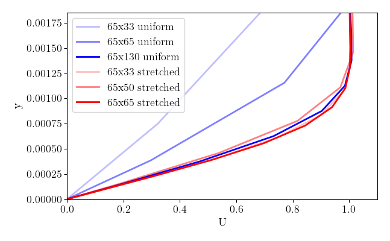

import Box from '../../../components/Box.astro';
import MultipleChoice from '../../../components/MultipleChoice.astro';
import Option from '../../../components/Option.astro';
import CustomAside from '../../../components/CustomAside.astro';
import Spoiler from '../../../components/Spoiler.astro';

import Caption from '../../../components/Caption.astro';

:::note[Learning Objectives]
By the end of this section, you should be able to:
1. Estimate the approximate computational cost for a CFD problem.
2. Estimate the required run-time memory and storage.
3. Estimate the resolution requirements for a given physical problem.
4. Determine the parametric space.
:::

## Estimating HPC requirements of CFD simulations: Overview
The objective of this section is to provide a formal approach for an *a priori* estimate the overall computational cost of a large scale CFD simulation. These grid estimates are meant to provide guidance in order to better align the simulation with the available computational ressources. The true costs will depend on a number of other factors  such as: type of mesh, meshing software, order of the scheme, and CFD tool.

## Estimate grid point requirement
The *a priori* estimate of the grid resolution requirement will help determine the anticipated computational expense of the simulation. These *a priori* estimates do not replace grid sensitivity studies, that are necessary for validation on CFD simulations, but are meant to provide an estimate to better plan the HPC ressource allocation. Very large CFD simulations are driven either by:
- A large number of smaller simulations (parametric study);
- The multi-scale nature of the physical problem under consideration.

For parametric studies, an accurate *a priori* estimate of the grid point requirement is often not necessary as an iterative approach each individual simulation will likely be most in size and the computational will come from the parametric space that is being investigated. In those cases, it is likely more accurate and effective than an *a priori* grid estimation to iteratively find the computational cost of the single simulation and then evaluate the total HPC expense. The present case will deal with the more complex problem of estimating the HPC requirements for a large  simulation  for a multiscale CFD problem. The multiscale nature of the problem is often what requires the large computational grid and induces the large HPC cost. Multiscale CFD problems can be tied to the following physical considerations:
- Geometric complexity of the physical problem;
- Turbulence;
- Multiphase and multiphysics considerations;
- Special flow features (transition, separation, shock waves).

The multiscale nature of a CFD simulation can be seen in the representation of a reconnecting, antiparallel vortex pair. This figure highglights the necessity to resolve both the smallest scale of the turbulent flow as well as the largest scale, thus, we can quickly see that we are rapidely bound by the scale separation in the problem 

The components that contribute to the scale separation in typical CFD simulations are 

### Geometric complexity
For a given problem, the geometric complexity will demand additional grid points. As the geometric complexity is tied to presence of walls in the flows, we should consider the type of boundary layer at the wall. The boundary layers are either:
- Laminar
- Turbulent (next subsection)
- Transitional (later in this class)
To estimate the grid requirement needed for a complex geometry simulation, let's first consider a fully laminar boundary layer in the present subsection (the turbulent and transitional boundary layer have specific considerations discussed below).  The resolution of the sharp gradient at the wall is necessary to adequately simulate a boundary layer, and naturally is directly influenced by the numerical scheme in the code. 

The zero-pressure gradient flat plate boundary layer has the distinct advantage of admitting an analytical solution of the velocity profile, the [Blasius solution](https://en.wikipedia.org/wiki/Blasius_boundary_layer). As such, a good estimate of the first grid point in a *laminar* boundary layer will be tied to the ability to fall within a nearly linear region close to the wall
 

:::tip[Rule of thumb]
A simple rule of estimate can is based on the height at $\eta= y\sqrt{\frac{U}{\nu x}}\approx 1$, at this point, the Blasius solution starts more significantly departing from the linear approximation. In other words, the first grid point should be:

$$y_{{first point}}\approx\sqrt{\frac{\nu x}{U}}$$
:::

Let's look at this problem with an example.

<Box iconName='exercise'>
## Example: laminar boundary layer on flat plate
Consider a very simple case of a zero pressure gradient ($\partial p/\partial x =0$) laminar boundary layer (incompressible) on a flat plate with heat transfer. The problem can be run [Link to git repo] and is an adaptation of the [SU2 tutorial case](https://su2code.github.io/tutorials/Inc_Laminar_Flat_Plate/).  Here, we consider a number of different wall normal mesh (keeping the mesh in the streamwise direction constant). First, we look the uniform mesh in the wall normal direction which we discretize with 33, 65, 130 grid points between 0 (wall) and y=0.03m. Then, we consider the stretched grid points with 33, 50, and 65 grid points (with a stretching ratio between 1.04 to 1.1 and first grid point between 0.0007 m to 0.0015). The figure below agregates all the results at a fixed x location in the domain.

Velocity             |  Temperature
:-------------------------:|:-------------------------:
 | 

There are a couple clear take-aways here:
1. Stretched grids are essential to minimize the total required grid points (e.g. simulation at 65x130 with uniform grid is about the same as 65x33 stretched grid)
2. The resolution of the velocity boundary layer does not guarantee that the thermal boundary layer will be captured ($Pr=0.72$).

The above 

$$ \delta_{99}=5.29 \sqrt{\frac{\nu x}{U}}$$

Based on the simulation, we have: density (1.13235 $kg/m^{3}$), viscosity (1.83463e-05 $kg/(m s)$), freestream velocity (69.1687 $m/s$), and we evaluated the boundary layer at $x=0.25$. Therefore, we estimate the boundary layer thickness to be $\delta_{99}=0.00128$ m which aligns with the numerical result shown here.

We can estimate the derivative at the wall as:

$$y_{\text{first point}}\approx\sqrt{\frac{\nu x}{U}} \approx 2.42\times 10^{-4} m$$

Based on this estimate, with a uniform mesh, this problem needs approximately 124 grid points in the wall normal direction, whereas this condition can be met on a stretched grid with as few as 33 grid points ! 

If we have heat transfer, we should be careful to modify if the Prandtl number is below unity (air typically has $Pr=0.72$). In this case, we can make some simplifications since we know that:

$$ \frac{\delta_{\text{hydrodynamic}}}{\delta_{\text{thermal}}} \approx \sqrt{Pr} \qquad \qquad y_{\text{first point}}\sqrt{\frac{\nu x}{U Pr}} $$

</Box>

Now that we have an estimate for the grid requirement for a laminar boundary layer, we 

[ANSYS user guide](https://www.ansys.com/content/dam/amp/2022/february/asset-creation/best-practices-campaign/Best%20Practice-Rans%20turbulence%20modeling%20in%20Ansys%20CFD.pdf)

### Turbulence
Turbulence is an ubiquitous state of fluid motion that affects our everyday life in many ways. On a macro scale, turbulent flows govern weather changes and the formation and evolution of tropical cyclones; on smaller scale, turbulence affects pollutants transport in the atmosphere or fluid flow in our body. From an engineering standpoint, almost every fluid system of practical interest involves turbulent flows (e.g. flows over bluff/blunt bodies, flows through ducts and pipes, and turbomachines).

The purpose of this section is to give students a general overview of the current state of numerical simulation of turbulent flows with the main goal of educating the audience to a systematic approach to the solution of complex fluids problems. This is far from a complete description of the physiscs and mathematical model of turbulence, to which entire textbooks have been dedicated over the years [Pope (2000)](https://www.cambridge.org/highereducation/books/turbulent-flows/C58EFF59AF9B81AE6CFAC9ED16486B3A#overview), [Durbin et al. (2010)](https://onlinelibrary.wiley.com/doi/book/10.1002/9780470972076).

#### What is turbulence?
Turbulence is a chaotic, irregular state of fluid motion in which the instabilities present in the flow, caused by initial and boundary conditions, are amplified [@piomelli2022vki]. This results in a self-sustaining cycle of *generation* and *destruction* of turbulent **eddies** (regions of high vorticity in the flow). Although chaotic in nature, every turbulent flow displays universal characteristics:
1. **Unsteadiness**: turbulent flows are inherently unsteady. The instantaneous velocity in a turbulent flow when plotted as a function of time might look *random* to any observer unfamiliar with the topic. This randomness is the reason why turbulence research relies on statistical methods.
2. **Three-dimensional**: turbulent flows are highly 3D, even though the flow might have once preferential direction and the resulting **average** velocity might be a function of only two coordinates, the instantaneous velocity fluctuates in all 3 spatial directions.
3. **Mixing**: the presence of instantaneous fluctuations in all directions greately amplifies the mixing of mass, momentum, and energy in the flow. Based on the application of interest enhanced mixing might be a positive outcome (e.g. internal combustion engines), or a negative one (e.g. increase in the skin-friction coefficient and increase in drag force).
4. **Vorticity**: Vorticity is probably the most important and *defining* characteristic of turbulent flows. There are flows in nature that share some common characteristic of turbulence, but are characterized by negligible vorticity; these flows are not turbulent (e.g. random motion of waves on the ocean surface, potential flow over a boundary layer) [@piomelli2022vki].
5. **Dissipative**: Due to the enhanced mixing and vorticity, turbulence bring regions of different momentum (different velocities) into contact resulting in the dumping of velocity gradients through the effect of viscosity. As velocity gradient is reduced, so is the energy content of the flow (or turbulent kinetic energy). Turbulence is a **dissipative** process: if energy is not brough into the flow, turbulence will eventually die. Throughout this process energy is irreversibly transformed to heat.
6. **Multiscale**: As mentioned earlier, turbulent flows are chracterized by the presence of coherent regions of high vorticity, *eddies*. In any turbulent flow, *eddies* span a broad rand of length and time scales. This property of turbulence impacts directly the numerical simulation of turbulent flows and should be given a bit more attention.

#### The scales of turbulence
Whether generated by perturbation in the initial condition or by rapid changes in the geometry, turbulent flows are characterized by a wide distribution of **eddies** of various shapes and sizes. The behaviour of these **eddies** is strongly dependent on their length and velocity scales. Let's consider, for instance, a high-Reynolds number flow with $\mathcal{L}$ and $\mathcal{U}$ its characteristic length and velocity scales, respectively. The Reynolds number is defined as:

$$ Re = \frac{\mathcal{L}\mathcal{U}}{\nu}\gg 1$$

where $\nu$ is the fluid kinematic viscosity. The largest **eddies** in the flow have a length and velocity scales, $L_o$ and $V_o$, comparable to $\mathcal{L}$ and $\mathcal{U}$, therefore their representative Reynolds number $Re_o=L_o V_o/\nu>>1$. On these **eddies** viscosity has little effect as inertia forces dominate, and they are known as **energy carrying eddies**. Their shape is dpendent on the geometry and boundary conditions and they are anisotropic. In turbulent flows, energy is therefore produced at large scales, however, because no dissipation can occur at these large scales, large **eddies** must transfer their energy to smaller and smaller **eddies**. This process was mathematically modelled by the brilliant mathematicians Kolmogorov and today known as the **energy cascade**. As turbulent **eddies** becomes smaller and smaller, their representative Reynolds number decreases, until at the smallest scales $U_\eta$ and $L_\eta$, it becomes of order unity:

$$ Re_\eta = \frac{L_\eta U_\eta}{\nu}\approx 1$$

Viscosity effects now become relevant, and energy is dissipated through viscous dissipation and irreversibly converted to heat. A visual sketch of this complicated process is shown in the figure below.

<Caption>Energy cascade.</Caption>

:::note[Important to keep in mind]
- Energy is dissipated ONLY at the smallest scales.
- The rate of (how much) energy dissipation is set by the largest scales where production takes place.
- The intermediate scales only *transfer* energy from larger eddies to smaller eddies. 
- As the Reynolds number increases, the separation between the large (integral) and small (dissipative) scales increases.
:::

#### Numerical simulation of turbulent flows
Computational Fluid Dyamics (CFD) for the simulation of turbulent flows is becoming more and more popular as the available computational power of modern computers increases. In the following we will overview the most common approaches followed in CFD, with the idea in mind that the numerical methods requirements greately change based on what one wants to analyze in the flow. 

1. The first and most straight forward approach is to **directly** discretize the equations of motion, and solve them numerically as done in the Poisson equation example in the previous section. This method is commonly referred to as **Direct Numerical Simulation (DNS)**. This method aims at resolving EVERY scale of turbulent motion (integral to dissipative). Assuming that the mesh is fine enough to capture the smallest **eddie** (Kolmogorov scale), one will obtain a 3-dimensional time-dependent solution of the governing equation in which the only source of errors is the one introduced by the numerical methods [Pope (2000)](https://www.cambridge.org/highereducation/books/turbulent-flows/C58EFF59AF9B81AE6CFAC9ED16486B3A#overview).

2. The second very common approach to finding a numerical solution to turbulent flows is to decompose the equations of motion into a **mean** and a **fluctuating** components. This process is known as Reynolds' averaging procedure, where the long-time average of a general quantity $f$ is defiend as $\left\langle f\right\rangle = \frac{1}{T}\int_{t}^{t+T}f\left(\tau\right)d\tau$, where $T$ is a time interval much larger than any time scale in the turbulent flow. Any instantaneous quantity $f$ in the flow, can therefore be taken as the sum of a **mean** annd a **fluctuating** part, $f=\left\langle f\right\rangle + f'$. If one applies the Reynolds decomposition to the equations of motion obtains the well-known **Reynolds-Averaged Navier-Stokes** (RANS) equations which describe the evolution of the mean (large-scale) quantities. Unfortunately, the resulting system of equations is not closed, as the effect of the fluctuating component appears in the Reynolds-stress term and requires the introduction of approximations (turbulence models). A very wide range of models for the Reynolds stresses exists ranging from simple algebraic models, to more complex 2-equations models, to full Reynolds stresses closure models [@piomelli2022vki].

:::tip[Some available techniqeues to simulate turbulent flows]
1. Direct Numerical Simulation (DNS). All scales of turbulence must be solved.
2. Large-Eddy Simulation (LES). Only the large, energy-carrying eddies are resolved while smaller ones (smaller than a cutoff filter) are modelled using a full closure model. LESs can be Wall-Resolved (WRLES) or Wall-Modelled (WMLES) depending on how the near-wall region is treated.
3. Reynolds-Averaged Narvier-Stokes (RANS). The averaged equations for mean quantities are solved, while the Reynolds stresses term is modelled via alebraic one or two-equations models.
:::

#### Resolution requirements
The range of length scales and the sized of the **eddies** in a turbulent flow will determine the grid resolution requirement our the simulation. Consider the flow over a backward-facing step (one of the examples in this section) in which a closed separation bubble is formed downstream the step. The largest eddie in the flow is the separation bubble itself, and is characterized by a length scale $L$ proportional to the integral scale of the flow. Depending on the Reynolds number analyzed, a wide range of smaller and smaller eddies is present, the smallest being of size $\eta$.

1. In DNS, all scales of motion, including the dissipative scales ($\eta$) must be resolved. The computational domain must be significantly larger than the largest eddie of dimensions $L$, but the grid size must be of order $\eta$ to capture the tiniest eddie. The number of grid points required is therefore proportional to the ratio $L/\eta\approx Re^{3/4}$ where $Re$ is the Reynolds number based on the integral length and velocity scales. The number of grid points required to perform a 3D DNS is $N\approx Re^{9/4}$.

2. In LES, only the large eddies must be resolved undere the assuption that the dissipative scales ($\eta$) are isotropic, universal, and can be easily modelled. The estimation of grid resolution requirement for LES is usually divided into **outer** and **inner** layer. In wall-bounded flows, the outer layer is characterized by a length scale proportional to the thickness of the boundary layer $\delta$. A common agreement in the literature shows that to accurately capture the energy-carrying eddies responsible for momentum and energy transport, **at least** 15 points per boundary layer thickness $\delta$ are required in each direction, or 3000 per $\delta^3$ [@piomelli2022vki]. In a wall-bounded flow, the resolution of the inner layer is driven by the presence of the quasi-streamwise vortices and grid resolution is more demanding [Robinson (1991)](https://www.annualreviews.org/doi/pdf/10.1146/annurev.fl.23.010191.003125). In turbulent boundary layers or channel flows the LES requirements in terms of grid streamwise and spanwise spacing is $\Delta_x^+\approx 100$ and $\Delta_z^+\approx 20$ (where $+$ denotes viscous wall units $x^+=x u_\tau/\nu$). Under these conditions Choi and Moin estimated that the number required to resolve the inner layer is $\left(N_x N_y Nz\right)\approx Re^{13/7}$ for WRLES, and $\left(N_x N_y Nz\right)\approx Re_{L_x}$ for WMLES (where $L_x$ is the streamwise dimension of the computational domain) [Choi and Moin (2012)](https://pubs.aip.org/aip/pof/article/24/1/011702/361102/Grid-point-requirements-for-large-eddy-simulation).

#### Computational cost of the simulation
:::caution[Remember]
Estimating the total computational cost of a numerical simulation **is both science and art**. An exact *a priori* knowledge of the amount of CPU hours required is a very hard task to accomplish, but one can follow a consistent and reliable strategy we outline below
:::

### Multiphase and multiphysics considerations

### Special flow features (transition, separation, shock waves)

## Estimating time advancement

To estimate the overall cost of the numerical simulation one must consider that the equations of motion must be integrated for a time proportional to the integral time-scale of the flow $T$. The time step size $\Delta t$ is a function of the simulation technique used. In DNS, for instance, $\Delta t$ is limited by the need of resolving the life cycle of the smallest eddy of size $\eta$. In LES, a larger time step could be used and will be determined by the size of the smalles resolved eddy. RANS, as expected, has the least restrictive requirement on $\Delta t$ given that it only resolves mean quantities. A good practice on estimating the total cost of a simulation was outlined by Reynolds [Reynolds (2005)](https://link.springer.com/chapter/10.1007/3-540-52535-1_52) who assumed that the operation count scales like the number of points in the domain, and that the time step $\Delta t$ is determined by the stability condition on the Courant–Friedrichs–Lewy (CFL) number, $\Delta t\approx 1/\Delta x$ [@piomelli2022vki]. Given that time integration must be performed for a number of steps proportional to $N_t\approx T/\Delta t$, this results in a total number of steps proportional to $N_t\approx \left(N_x N_y N_z\right)^{1/3}$, and a total computational cost of $\left(N_x N_y N_z\right)^{4/3}\approx Re^3$.

:::caution[Caution]
This estimate does not consider the viscous stability, and it is strictly valid ONLY for calculations in which at least the diffusion term is treated implicitly. 
:::

One should also be aware of the fact that this estimate is not valid when considering oscillating or pulasting flows in which an external time-scale caused by the amplitude of the oscillation is forced into the flow. In this case the total integration time is a function of the period of the oscillation.

<Box imgSrc="/src/assets/quiz_icon.png">
## EXAMPLE: Estimating the HPC costs of the BFS

[HEre we want to do a full example]
</Box>