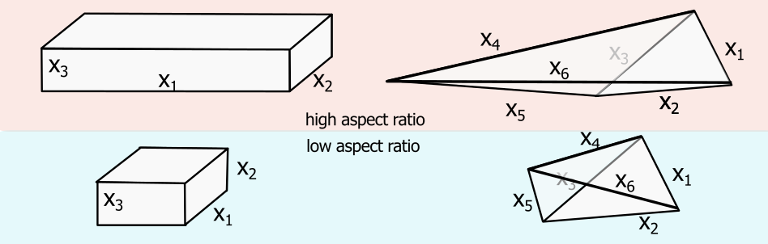

import Box from '../../../components/Box.astro';
import Caption from '../../../components/Caption.astro';
import CustomAside from '../../../components/CustomAside.astro';
import { Tabs, TabItem } from '@astrojs/starlight/components';
import CodeFetch from '../../../components/CodeFetch.astro';

import { YouTube } from '@astro-community/astro-embed-youtube';

:::note[Learning Objectives]
By the end of this section, you should be able to:
1. Define the workflow and toolsets for pre-processing of CFD simulations 
2. Construct a geometry and a mesh for CFD 
3. Explain the parameters that influence the mesh quality
4. Define the parameters to set for the numerical setup
:::


## Pre-processing for CFD simulations: Overview
The pre-processing step is not specific to the CFD workflow on HPC systems. In fact, many of these steps such as geometry generation, mesh creation, and input file setup are integral steps to any CFD simulation. Out of completness, we present them main steps as well specific considerations for pre-processing when using  HPC.


## Pre-processing main steps, concepts, and toolsets
The steps for pre-processing CFD simulations are very broadly divided into:
1. Construction of the geometry;
2. Discretization of the fluid domain;
3. Setup the simulation.
These steps are broken down in following but first, we briefly discuss the pre-processing workflow on HPC systems.

### Pre-processing workflow
For small non-HPC simulations, where memory or computational limitations are not an issue, the pre-processing, processing and postprocessing steps can be done locally. With larger CFD simulations, this workflow needs to be revisited. Two main types of workflow emerge for the pre-processing step:

1. Local pre-processing
2. Remote pre-processing

The optimal workflow for a given problem depends on a number of factors including local workstation computational resources, toolset and, even, the internet bandwidth. But the most significant constraint lies in the local workstation memory during the meshing stage. Complex mesh generation is often a memory intensive process that may constrain the user to a remote pre-processing on HPC systems. Let's explore these ideas in more detail.


<Caption> Comparison of local and remote pre-processing workflow. </Caption>

#### Local pre-processing
For smaller CFD problems or simple meshing needs, the local pre-processing is usually the favoured approach. Here, the user on a local workstation can genetrate the geometry and the mesh and then copy the resulting mesh on remote HPC system for processing the simulation. This is usually the standard workflow for most users.

<CustomAside icon="star" title="PROs" colour="green">
- Easy to setup and organize data
- Limited lag in interactive mode due to internet bandwidth  
</CustomAside>

<CustomAside icon="warning" title="CONs" colour="red">
- Memory and computationally constrained
- Must copy the final mesh to the remote HPC system
</CustomAside>

#### Remote pre-processing
When the CFD problem becomes quite larger or the mesh is very complex, workstation limitations constrain the user to resorting to a remote pre-processing. In this case, the pre-processing toolset are run on the remote HPC system, either interactively or headless (without gui). This leverages the larger computational resources on the remote system for pre-processing. As the mesh is generated on the same HPC system where the CFD simulation will be run, there is the added benefit of maintain the data at the same location.  Now, it is also possible to use a hybrid approach where, for example, the CAD is done locally and transfered to the remote system for meshing phase. When considering remote pre-processing, it's important to take into account: availability of the pre-processing tools on remote system, licence constraints, speed/lag time for running the software.

<CustomAside icon="star" title="PROs" colour="green">
- Access to larger memory and computational resources for pre-processing
- '*Data locality*': mesh is generated on the system where simulations are run
</CustomAside>

<CustomAside icon="warning" title="CONs" colour="red">
- During interactive mode, there may be significant lag
- Availability of the software/licence on remote system
</CustomAside>


### Toolsets
Many tools are available to complete the pre-processing step. Here, we provide a brief overview of some of the tools available. Please keep in mind that some CFD solvers have geometry and meshing capabilities built in.

#### Open-source options:
- [Gmsh](https://gmsh.info): most versatile open-source meshing tool for CFD applications for structured and unstructured grids
- [FreeCAD](https://www.freecad.org): tool to generate CAD definition of the CFD domain, must be combined with a mesher to generate a CFD mesh
- [Salome](https://www.salome-platform.org): SMESH within this platform is a full fledge meshing tool that can accommodate complex geometries
- [blockMesh](https://www.openfoam.com/documentation/user-guide/4-mesh-generation-and-conversion/4.3-mesh-generation-with-the-blockmesh-utility): a utility within the openFoam framework to generate structured meshes
- [snappyHexMesh](https://www.openfoam.com/documentation/user-guide/4-mesh-generation-and-conversion/4.4-mesh-generation-with-the-snappyhexmesh-utility): a utility within the openFoam framework to generate an unstructured mesh around an arbitrarily complex CAD geometry
- [meshio](https://github.com/nschloe/meshio): although formally not a meshing tool, this software can translate mesh files among many different mesh formats

#### Commercial tools
- [Pointwise](https://www.pointwise.com)
- [Cubit](https://coreform.com/products/coreform-cubit/gambit/)
- [Autodesk](https://www.autodesk.com/solutions/cad-software)
- integrated meshers within commercial packages (e.g.  [Ansys Meshing](https://www.ansys.com/training-center/course-catalog/fluids/introduction-to-ansys-meshing-cfd), [StarCCM+ Mesher](https://plm.sw.siemens.com/en-US/simcenter/fluids-thermal-simulation/star-ccm/) )

For this course, we focus on [Gmsh](https://gmsh.info) which is a highly versatile open-source mesher that can create structured or unstructured grid. It can also natively or near-natively output in a number well-known meshing formats. A Gmsh tutorial can be found [here](https://gmsh.info/doc/texinfo/gmsh.html#Gmsh-tutorial).


##  Construct the geometry
For complex geometries, for example pumps, industrial applications, or  building fluid dynamics, the geometry of the simulation domain should be generated in a dedicated CAD software. Many meshing tools have limited capabilities to build complex geometries;   for very simple geometries, the features in the meshing software may be sufficient. If the CAD can be natively developed within the meshing software, it should be favoured as it facilitates the integration of the geometry and mesh and enables an easier parametrisation. While some commercial tools have seamless integration between the CAD and meshing software, most meshing tools require an additional step to generate and transfer the CAD geometry. While some CAD tools have meshing capabilities, they usually cater to solid mechanics community, which has very different types of constraints on their mesh generation.

The format of the CAD geometry depends on the compatibility with the meshing software. Typically, IGES or STEP formats are widely used in meshing softwares. For some meshing applications (such as snappyHexMesh) where only the outer hull of the geometry is needed, a fluid mesh can be generated from an STL (Stereolithography) format.

<Box iconName='exercise'>
### Example: Cylinder in crossflow (domain generation)
For this example, we construct a domain and mesh for a cylinder in crossflow. For this purpose, we will use [Gmsh](https://gmsh.info). Gmsh is widely used open-source meshing tool and is installed on the [Digital Research Alliance clusters](https://docs.alliancecan.ca/wiki/Available_software) but you can download it locally as well. We will not cover the usage of Gmsh and the interested reader can [consult the tutorial online](https://gmsh.info/doc/texinfo/gmsh.html#Gmsh-tutorial). Gmsh can be used either through its GUI (graphical user interface) or with an intepreted script. Note that when you use the GUI, Gmsh automatically writes the script. Therefore, by saving and modifying the script, you can reproduce a mesh without a GUI. Furthermore, with a very large mesh, you can define the mesh in the script locally and run it remotely. For this example, we will directly work in the Gmsh script.


<Caption> Gmsh interface and location of the script. </Caption>

Let's assume that we have computed all the necessary domain size in a previous step and we have a general idea of the geometry we hope to create:

<Caption> Example of geometry we want to create. </Caption>
As we have a non-slip wall at the cylinder, we know that we need to pay close attention to the mesh at this location, so we create a zone around the cylinder which will have a higher mesh density. Now, we can parametrize these values into the Gmsh script below. In Gmsh, we must also, at this stage, make a decision on the mesh density (highlighted in the example). Note that the raw input file can be download from the git repository of the course. 

```python "even" del=/dx.*/ del=/BL.*/  del=/nCirc.*/ del=/nZ.*/

SetFactory("OpenCASCADE");

upstream   = 200;   // upstream distance from cylinder
downstream = 500;   // downstream distance from cylinder
height     = 100;  //  height from cylinder
width      = 50;   // width of computational domain 
radius     =10;   // radius of cylinder

dx        = 1;    // size of mesh near cylinder
BL        = 1.2;  // Approximate boundary layer thickness
dxfar     = 4.0;  // size of mesh far field

// Generate domain point-by-point
Point(1) = { 0,  0, 0, dx};     
Point(2) = { radius,  0, 0, dx};     
Point(3) = { 0,  radius, 0, dx};    
Point(4) = {-radius,  0, 0, dx};      
Point(5) = { 0, -radius, 0, dx};     

Point(6) = { BL*radius,  0, 0, dx};   
Point(7) = { 0,  BL*radius, 0, dx};   
Point(8) = {-BL*radius,  0, 0, dx};    
Point(9) = { 0, -BL*radius, 0, dx};   

// Create cylinder and region around the cylinder boundary layer
Circle(10) = {2, 1, 3};
Circle(11) = {3, 1, 4}; 
Circle(12) = {4, 1, 5};
Circle(13) = {5, 1, 2};

Circle(14) = {6, 1, 7};
Circle(15) = {7, 1, 8}; 
Circle(16) = {8, 1, 9};
Circle(17) = {9, 1, 6};

Line(18) = {2, 6};
Line(19) = {7, 3};
Line(20) = {4, 8};
Line(21) = {9, 5};

//- Create vertices and surfaces
Line Loop(22) = {10, 18, 14, 19};
Line Loop(23) = {19, 11, 15, 20};
Line Loop(24) = {20, 12, 16, 21};
Line Loop(25) = {21, 13, 17, 18};

Plane Surface(26) = {22};
Plane Surface(27) = {23};
Plane Surface(28) = {24};
Plane Surface(29) = {25};

//--Create bounding domain
Point(30) = { downstream, 0, 0, dxfar};
Point(31) = { downstream, height, 0, dxfar};
Point(32) = { 0, height, 0, dxfar};
Line(33) = {6, 30};
Line(34) = {30, 31};
Line(35) = {31, 32};
Line(36) = {32, 7};
Line Loop(37) = {33, 34, 35, 36, 14};
Plane Surface(38) = {37};

Point(39) = { downstream, -height, 0, dxfar};
Point(40) = { 0, -height, 0, dxfar};
Line(41) = {9, 40};
Line(42) = {40, 39};
Line(43) = {39, 30};
Line Loop(44) = {41, 42, 43, 33, 17};
Plane Surface(45) = {44};

Point(46) = { -upstream, height, 0, dxfar};
Point(47) = { -upstream, 0, 0, dxfar};
Line(48) = {32, 46};
Line(49) = {46, 47};
Line(50) = {47, 8};
Line Loop(51) = {15, 36, 48, 49, 50};
Plane Surface(52) = {51};

Point(53) = { -upstream, -height, 0, dxfar};
Line(54) = {47, 53};
Line(55) = {53, 40};
Line Loop(56) = {16, 50, 54, 55, 41};
Plane Surface(57) = {56};
```
If we load the script, we should see the following three-dimensional geometry.


<Caption> Geometry generation in Gmsh. </Caption>

</Box>


## Generate mesh
Once the geometry is generated, the fluid domain can be discretized for the CFD computation. At this stage, it's a good idea to be nimble and favour an iterative approach to generating the final production run mesh. It's often a good idea to start by generating a smaller mesh, visually inspecting the discretized grid, and, if needed, modifying the CAD geometry (e.g. domain size, removing smaller features of the CAD, smoothing unnecessary sharp corners, etc.) The estimates on the grid resolution requirements (computed in the last lecture) should be integrated in the production run mesh.

As we discussed last lecture, the discretization greatly influences the computational costs in two ways: 
- it determines the degrees of freedom in the problem;
- it constrains the time advancement step.

There are a couple considerations when generating the mesh that are discussed below.

:::tip[Tip]
Start with a small mesh, output the results, and inspect the mesh before the creating your final mesh.  It may be a good idea to run a quick simulation on the coarse before committing to the generating the large mesh.
:::


### Deciding the type of mesh to use
There are two main types of mesh that are used in CFD: structured and unstructured mesh. 

<Caption> Comparison of structured and unstructured mesh. </Caption>


#### Structured mesh
Structured meshes are (typically) hexahedra-shaped mesh organized in a logical way. Given their regular hexahedral shape, they are well suited minimize the numerical errors in the flux calculation between the cells. The structured mesh can also have clear advantages in terms of computational efficiency, as the there is an implicit knowledge of the neighboring cells. For example, if a domain is discretized using $128X256X64$ grid points, the resulting mesh can be stored in an array stores which implicitly has the connectivity of the neighboring cells. At point $(i=55, j=3, k=5)$, we know that cell $(i=54, j=3, k=5)$ and $(i=56, j=3, k=5)$ are immediate neighbors in the $x$ direction while $(i=55, j=2, k=5)$ and $(i=55, j=5, k=5)$ will be the neighbors in the $y$ direction, and so forth. In order to use a structured mesh, the user must be able to define the structured domain in a $(Nx, Ny, Nz)$ array, which is sometimes difficult due to the geometric complexity of the domain. Another disadvantage comes from requiring needing a $(Nx, Ny, Nz)$ array, which means that some parts of the domain may have more points than needed. There are approaches such as block-structured meshing or non-cartesian meshing approach (using Jacobians) but these fall outside the scope of the present course. Although many academic codes can take full advantage of the structured mesh, many of the more general purpose CFD codes will store and treat structured meshes in the exact same way as unstructured meshes.


<CustomAside icon="star" title="PROs" colour="green">
- Smaller storage and memory needs 
- Better accuracy (possibly)
- Lower computational cost
- Potentially faster computations
</CustomAside>

<CustomAside icon="warning" title="CONs" colour="red">
- Can result in more grid points: by construct, we may have unnecessary grid points due to the need to have a structured mesh
- Inability to mesh complex geometries
</CustomAside>

:::danger[Keep in mind]
Most commercial and open-source CFD codes, such as SU2 and OpenFoam, permit the use of structured meshes but maintain an unstructured data structure for the computation of the interface fluxes. 
:::

#### Unstructured mesh
Most popular  finite-volume CFD solvers are based on unstructured meshes. In this case, the mesh information is not stored in a $Nx, Ny, Nz$ array but in a list of points and the a relational database that contains the information of the neighboring cells for flux computations. The unstructured mesh format provides more flexibility and generazibility for complex meshing. 

<CustomAside icon="star" title="PROs" colour="green">
- Easy to mesh complex geometries
- Can result in fewer grid points (grids can be locally clustered at specific locations)
- Easier to automate  
</CustomAside>

<CustomAside icon="warning" title="CONs" colour="red">
- Computatioanally less efficient then structured meshes
- Requires more checks on the mesh quality
- Larger memory requirement
</CustomAside>


### Discretizing the domain
The mesh generation process will depend heavily on the toolset used and the general meshing decisions (type of mesh, region of higher resolution etc.) A small mesh can be rapidly generated locally on your laptop; but large, complex meshes will require additional computational resources. Careful planning of the mesh and a nimble iterative approach should be favoured. Simultaneously, it's always a good idea to aim to make a parametric geometry and mesh such that future changes to the grid can be done without too many problems.


<Box iconName='exercise'>
### Example: Cylinder in crossflow (mesh generation)
Continuing from the cylinder in crossflow example, we now focus on adding the specific meshing requirements. For this example, we will use a structured mesh near the cylinder wall and an unstructured mesh elsewhere. This will enable us to minimize the error with a structured mesh where the gradients are the largest (near the wall) and save grid points in the far field with an unstructured mesh.

First, we define the number of grid points in the boundary layer (here there is no near wall clustering), the number of points around the circumference of the cylinder, and number of points in the spanwise direction. Note that to make a structured mesh in Gmsh, we construct **Transfinite Line** with which we create **Transfinite Surface**.

```python "even"  ins=/nBL*/ del=/nZ/ /nCirc/
nBL       = 11;  //  grid points in BL
nCirc     = 25;  // grids in circumference
nZ        = 5;    // grid points in the z-direction

Transfinite Line{18, 19} = nBL;
Transfinite Line{10, 14} = nCirc;
Transfinite Surface{26}; 
Recombine Surface{26};

Transfinite Line{19, 20} = nBL;
Transfinite Line{11, 15} = nCirc;
Transfinite Surface{27};
Recombine Surface{27};

Transfinite Line{20, 21} = nBL;
Transfinite Line{12, 16} = nCirc;
Transfinite Surface{28};
Recombine Surface{28};

Transfinite Line{21, 18} = nBL;
Transfinite Line{13, 17} = nCirc;
Transfinite Surface{29};
Recombine Surface{29};
Recombine Surface{38};
Recombine Surface{45};
Recombine Surface{52};
Recombine Surface{57};

num[]=Extrude {0,0,-width} {Surface{26, 27, 28, 29, 38, 45, 52, 57}; Layers{nZ}; Recombine;};

Coherence Mesh;

```
If this were to be used as a CFD simulation, we would additionally need to define the boundaries of the computational domain (done in the final example in the class).


<Caption> Generated mesh near cylinder. </Caption>

<Caption> Close-up of the mesh near cylinder. </Caption>
</Box>


### Assessing the mesh to quality
Assessing the mesh quality prior to a large scale simulation can avoid lengthy iterations on HPC systems (copying mesh over to HPC system, waiting in queue, assessing error etc.). These mesh checks can typically be done within the meshing tool or in standalone mesh assessments  scripts (for example *checkMesh* in openFoam). The mesh assessment will typically report a number of different metrics including the following:

- **Minimum and maximum mesh size**: This information does not impact the quality assessment but can provide useful insight for the simulation. As many time advancement methods are constrained by the CFL number, an unreasonably small mesh may constrain, unnecessarily, the time-advancement of the simulation. Especially for complex geometry, the assessment of the minimal mesh size with respect to the required resolution may highlight the need to revisit the mesh generation prior to running the simulation. 

- **Aspect ratio**: The aspect ratio corresponds to the ratio of the smallest to the largest edge length of the cells.<br />
$$ \text{Aspect Ratio} = \frac{\max(x_1, x_2, x_3,...x_n)}{\min(x_1, x_2, x_3,...x_n)} $$<br />
This formula is primarily for hexaheadral meshes, a slight modification of  this formula (using an internal sphere) is used for tetrahedral or other mesh geometries.  This computation is conducted in each cell of the domain and the maximum value is presented.

  <Caption>Illustration of the aspect ratio of the mesh.</Caption>


- **Mesh orthogonality**: The orthogonality is a measure of the angle between the vector of the face normal and the connecting line between two neighboring cells. In structured meshes, the orthogonality is null (assuming no non-cartesian mapping), for unstructured meshes this value can be large, although below 90 degrees. High mesh orthogonality, can lead to numerical errors in the flux calculation and instability in the CFD computation. 


  <Caption>Illustration of the aspect ratio of the mesh.</Caption>


- **Volume ratio**: This metric reveals the largest volumes ratio between neighboring cells. Strong differences in cell size can result in large numerical error and thus instability of the simulation. The sensitivity of this parameter depends on a number of factors such as order of the numerical method. If this value is too large, a smoother transition should be considered.
$$ \text{Volume ratio} = \frac{\max(V_1, V_2, V_3,...V_n)}{\min(V_1, V_2, V_3,...V_n)} $$

  <Caption>Illustration of the volume ratio in the mesh.</Caption>

- **Skewness**: The skewness is measure the departure from a perfectly perpendicular vertex angles of the mesh (for hexahedral meshes). The definition for non-hexahedral meshes is slightly more involved (and not covered herein) but the basic idea remains the same.
$$ \text{Skewness} = \max\left(\frac{\theta_{max}-90}{90},\frac{90-\theta_{min}}{90}\right) $$

  <Caption>Illustration of the mesh skewness.</Caption>

General meshing metrics can be summarized [as follow](https://www.simscale.com/docs/simulation-setup/meshing/mesh-quality/#:~:text=%7D%7B27%7D%20%24%24-,It%27s%20correlated%20between%20the%20maximum%20edge%20length,of%20the%20cell%27s%20external%20sphere.&text=It%20is%20recommended%20to%20keep%20the%20maximum%20skewness%20below%200.5,maximum%20skewness%20is%20above%200.85.):

| Mesh quality    | Maximum value acceptable value | 
| :---        | :---: |   
| Aspect ratio |  20 |
| Orthogonality |  85 deg | 
| Volume ratio  |   80 | 
| Skewness  |   0.85 | 


<Box iconName='exercise'>
### Example: Cylinder in crossflow (check mesh)
Now that the mesh is created, we can check the quality of the final mesh. Most meshing tools have mesh quality checks built in. Gmsh also has some limited statistics that roughly align with the above mentioned. By calling **Tool->Statistics**, we have access to the following information:

- **SICN**: signed inverse condition number
- **Gamma**: inscribed radius / circumscribed radius
- **SIGE**: signed inverse error on the gradient of solution

These quantities can also be visualized and corrections can be made to the mesh prior to simulating the final results. Using the **checkMesh** tool in openFoam, for example can provide even greater statistical insight with the metrics shown above.

</Box>


## Configure numerical setup
The final stage of pre-processing is setting up the case. 
- Linking the mesh to the CFD solver
- Setting up the initial conditions of the problem
- Setting up the boundary conditions
- Determining the governing equations (generally Euler or Navier-Stokes), state equations, and any other multiphysics
- Selecting the models (e.g. turbulence, acoustics, combustion) 
- Select the decomposition of the domain for parallel computing

As these are case specific, we will investigate these steps during the final example in this section.


<Box iconName='exercise'>
## Example: Backward facing step - pre-processing


### Construct domain
The size of the computational domain was determined in the previous classes and we can create the geometry that will be used. To make the mesh easily parametrizable, we define the important dimensions as variables in the script:

```python "even" ins=/N.*/ del=/L.*/
// Gmsh project created on Mon May 29 13:48:18 2023
SetFactory("OpenCASCADE");

// x is streamwise direction
// y is wall-normal direction
// z is spanwise direction
// origin at start of backward step midplane
// Important parameters
h = 0.0096;
Li = 10.*h;
Lx = 20.*h;
Ly = 5.*h;
Lz = 4.*h;
```
Similarly, we can define the number of grid points based on the previous calculations (this particular case corresponds to a very coarse simulation).

```python "even" ins=/N.*/ del=/L.*/
Nxi = 50;
Nx = 100;
Ny = 50;
Nz = 40;
```
Now we can use the variables to create all the points, the lines connecting the points, connecting all the lines to create surface, and, finally, the surfaces to create volumes.

```python "even" 
Point(1) = {0, 0, 0};
Point(2) = {0, h, 0};
Point(3) = {Lx, h, 0};
Point(4) = {Lx, 0, 0};
Line(1) = {1, 2};
Line(2) = {2, 3};
Line(3) = {3, 4};
Line(4) = {4, 1};
Curve Loop(1) = {4, 1, 2, 3};
Plane Surface(1) = {1};

Point(5) = {0, h+Ly, 0};
Point(6) = {Lx, h+Ly, 0};
Line(5) = {2, 5};
Line(6) = {5, 6};
Line(7) = {6, 3};
Curve Loop(2) = {5, 6, 7, -2};
Plane Surface(2) = {2};
Point(7) = {-Li, h, 0};
Point(8) = {-Li, h+Ly, 0};
Line(8) = {2, 7};
Line(9) = {7, 8};
Line(10) = {8, 5};
Curve Loop(3) = {8, 9, 10, -5};
Plane Surface(3) = {3};
```

To create a structured mesh in Gmsh, we need to define **transfinite curves** which we discretize with the corresponding number of points. We can then **Extrude** the mesh in the spanwise direction.

```python "even" 
Transfinite Curve {-10, 8} = Nxi Using Progression 1.08;
Transfinite Curve {6, 2, -4} = Nx Using Progression 1.04;
Transfinite Curve {9, 5, -7} = Ny*0.5 Using Progression 1.2;
Transfinite Curve {1, 3} = Ny*0.5 Using Bump 0.2;


Transfinite Surface "*";
Recombine Surface "*";

Extrude {0, 0, -Lz*0.5} {
  Surface{1, 2, 3};
  Layers{Nz*0.5};
  Recombine;
}

Extrude {0, 0, Lz*0.5} {
  Surface{1, 2, 3};
  Layers{Nz*0.5};
  Recombine;
}

```

Finally, we can define our conditions on the mesh.

```python "even" 
Physical Surface("inlet") = {27, 14};
Physical Surface("outlet") = {24, 11, 20, 7};
Physical Surface("wall_in") = {26, 13};
Physical Surface("wall_ver") = {18, 5};
Physical Surface("wall_hor") = {17, 4};
Physical Surface("top") = {28, 15, 23, 10};
Physical Surface("back") = {12, 16, 8};
Physical Surface("front") = {29, 21, 25};
Physical Volume("internal") = {1, 2, 3, 4, 5, 6};
```


<details>
    <summary>Click HERE to see the entire Gmsh script</summary>
    <CodeFetch rawURL='https://raw.githubusercontent.com/ARC4CFD/arc4cfd/master/Tutorials/BFS_OpenFOAM/mesh/bfs_200k.geo' lang='bash' meta="title='bfs_200k.geo' mark={31-50}" />
</details>

### Define mesh

Mesh for the domain is generated using gmsh. 3 sets of mesh corresponding to varying y+ values are generated for the simulation. The boundary layer is modeled using SA turbulence model and the first cell y+ value in the models are constrained within 5. Table 1 gives the list of mesh and time step parameters considered for each y+ cases. Meshed domains are shown in Figs. 2-4. 


### Checking mesh 


```python "even" del=/OK/
Mesh stats 
    points:           248080
    internal points:  0
    faces:            493640
    internal faces:   245560
    cells:            123200
    faces per cell:   6
    boundary patches: 6
    point zones:      0
    face zones:       0
    cell zones:       0

Overall number of cells of each type:
    hexahedra:     123200
    prisms:        0
    wedges:        0
    pyramids:      0
    tet wedges:    0
    tetrahedra:    0
    polyhedra:     0

[ ... ]
Checking geometry...
    Overall domain bounding box (0 0 -0.02) (0.8 0.6 0)
    Mesh has 2 geometric (non-empty/wedge) directions (1 1 0)
    Mesh has 2 solution (non-empty) directions (1 1 0)
    All edges aligned with or perpendicular to non-empty directions.
    Boundary openness (-2.0825662e-18 -4.7665119e-17 -7.2485769e-16) OK.
    Max cell openness = 8.3684791e-16 OK.
    Max aspect ratio = 20.267217 OK.
    Minimum face area = 1.8359327e-08. Maximum face area = 0.00013630178.  Face area magnitudes OK.
    Min volume = 3.6718654e-10. Max volume = 1.9504299e-07.  Total volume = 0.0095748737.  Cell volumes OK.
    Mesh non-orthogonality Max: 43.799677 average: 7.524501
    Non-orthogonality check OK.
    Face pyramids OK.
    Max skewness = 0.44455366 OK.
    Coupled point location match (average 0) OK.
```

</Box>


### Example: Simulation setup
Standard SA model is used for near-wall turbulence modeling while Smagorinsky LES sub-grid scale (SGS) model is implemented at wall-normal distances larger than a value specified from default wall-distance coefficient. (Refer to Molina et al (2017) for SU2 formulations). 
In SU2, 2nd order dual-time stepping scheme is used for time marching method with 5 inner iterations per time step. Total simulation duration is 400ms which corresponds to roughly 10 flow passes across stream wise direction. Results are saved every 2ms. 


:::note[Learning Objectives]
Having finished this lecture, you should now be able to answer the following important questions:
1. What is the optimal workflow and toolset needed to pre-process a CFD simulation?
2. What are the considerations in the geometry and mesh generation process
3. How do I determine, *a priori*, if my mesh is good?
4. What parameters should I consider setting in the simulation?
:::