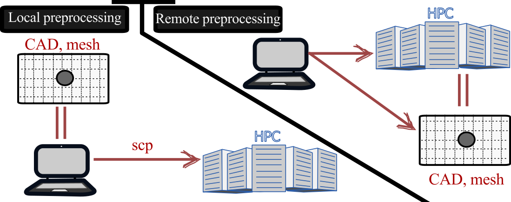

import Box from '../../../components/Box.astro';
import Caption from '../../../components/Caption.astro';
import CustomAside from '../../../components/CustomAside.astro';
import { Tabs, TabItem } from '@astrojs/starlight/components';
import CodeFetch from '../../../components/CodeFetch.astro';

import { YouTube } from '@astro-community/astro-embed-youtube';

:::note[Learning Objectives]
By the end of this section, you should be able to:
1. Construct a mesh and send to HPC
2. Configure numerical setup with HPC consideration
3. Understand interconnectivity among CFD tools
:::

## Preprocessing for CFD simulations: Overview
The pre-processing step is not specific to the CFD workflow on HPC systems. In fact, many of these steps such as geometry generation, mesh creation, and input file setup are integral steps to any CFD simulation. Out of completness, we present them main steps as well specific considerations for pre-processing when useing  HPC.

## Preprocessing main steps, concepts, and toolsets
The steps for preprocessing CFD simulations are very broadly divided along with the toolset used:
1. Construct the geometry
2. Discretize the fluid domain
3. Setup the simulation
These steps are broken down in following but first, we will have a brief overview of the toolsets that can be used for the first two steps of pre-processing CFD simulations.

### Workflow
For small non-HPC simulations, where memory or computational limitations are not an issue, the preprocessing, processing and postprocessing steps can be done locally. With larger CFD simulations, this workflow needs to be revisited. Two main types of workflow emerge for the pre-processing step:
1. Local preprocessing
2. Remote preprocessing
The optimal workflow for a given problem depends on a number of factors including local workstation computational resources, toolset and, even, the internet bandwidth. But the most significant constraint lies in the local workstation memory limitation during the meshing stage. Complex mesh generation is often a memory intensive process that may constrain the user to a remote preprocessing. Let's explore these ideas in more detail.

<Caption> Comparison of local and remote pre-processing workflow. </Caption>

#### Local preprocessing
For smaller CFD problems or simple meshing needs, the local preprocessing is usually the favoured approach. Here, the user on a local workstation can genetrate the geometry and the mesh and then copy the resulting mesh on remote HPC system for processing the simulation. This is usually the standard workflow for most users.

<CustomAside icon="star" title="PROs" colour="green">
- Easy to setup and organize data
- Limited lag in interactive mode due to internet bandwidth  
</CustomAside>

<CustomAside icon="warning" title="CONs" colour="red">
- Memory and computationally constrained
- Must copy the final mesh to the remote HPC system
</CustomAside>

#### Remote preprocessing
When the CFD problem becomes quite larger or the mesh is very complex, workstation limitations constrain the user to resorting to a remote preprocessing. In this case, the preprocessing toolset are run on the remote HPC system, either interactively or headless (without gui). This leverages the larger computational resources on the remote system for preprocessing. As the mesh is generated on the same HPC system where the CFD simulation will be run, there is the added benefit of maintain the data at the same location.  Now, it is also possible to use a hybrid approach where, for example, the CAD is done locally and transfered to the remote system for meshing phase.

<CustomAside icon="star" title="PROs" colour="green">
- Access to larger memory and computational resources for preprocessing
- '*Data locality*': mesh is generated on the system where simulations are run
</CustomAside>

<CustomAside icon="warning" title="CONs" colour="red">
- During interactive mode, there may be significant lag
- Availability of the software/licence on remote system
</CustomAside>

### Toolsets
Many tools are available to complete the pre-processing step. Here, we provide a brief overview of some of the tools available. Please keep in mind that some CFD solvers have geometry and meshing capabilities built in.

 
#### Open-source options:
- [Gmsh](https://gmsh.info): most versatile opensource meshing tool for CFD applications for structured and unstructured grids
- [FreeCAD](https://www.freecad.org): tool to generate CAD definition of the CFD domain, must be combined with a mesher to generate a CFD mesh
- [Salome](https://www.salome-platform.org): SMESH within this plateform is a full fledge meshing tool that can accomodate complex geomeries
- [blockMesh](https://www.openfoam.com/documentation/user-guide/4-mesh-generation-and-conversion/4.3-mesh-generation-with-the-blockmesh-utility): a utility within the openFoam framework to generate structured meshes
- [snappyHexMesh](https://www.openfoam.com/documentation/user-guide/4-mesh-generation-and-conversion/4.4-mesh-generation-with-the-snappyhexmesh-utility): a utility within the openFoam framework to generate an unstructured mesh around an arbitrarily complex CAD geometry
- [meshio](https://github.com/nschloe/meshio): although formally not a meshing tool, this software can translate mesh files among many different mesh formats

#### Commercial tools
- [Pointwise](https://www.pointwise.com)
- [Cubit](https://coreform.com/products/coreform-cubit/gambit/)
- [Autodesk](https://www.autodesk.com/solutions/cad-software)
- integrated meshers within commercial packages (e.g.  [Ansys Meshing](https://www.ansys.com/training-center/course-catalog/fluids/introduction-to-ansys-meshing-cfd), [StarCCM+ Mesher](https://plm.sw.siemens.com/en-US/simcenter/fluids-thermal-simulation/star-ccm/) )

For this course, we focus on [Gmsh](https://gmsh.info) which is a highly versatile open-source mesher that can create structured or unstructured grid. It can also natively or near-natively output in a number well-known meshing formats.

##  Construct the geometry
For complex geometries, for example pumps, industrial applications, or  building fluid dynamics, the geometry of the simulation domain should be generated in a dedicated CAD software. Many meshing tools have limited capabilities to build complex geometries;   for very simple geometries, the features in the meshing software may be sufficient. If the CAD can be natively developed withing the meshing software, it should be favoured as facilitates the integration of the geometry and mesh and enables an easier parametrisation. While some commercial tools have seamless integration between the CAD and meshing software (which can facilitate the parametrisation of the geometry), most meshing tools require an additional step to generate and transfer the CAD geometry. While some CAD tools have meshing capabilities, they usually cater to solid mechanics field, which has very different types of constaints on their mesh.

The format of the generated CAD geometry depends compatability with the meshing software. Typically, IGES or STEP formats are widely used in meshing softwares. For some meshing applications where only the outer hull of the geometry is needed, a fluid mesh can be generated from an STL (Stereolithography) format.

## Generate mesh
Once the geometry is generated, the fluid domain can be discretized for the CFD computation. At this stage, it's a good idea to be nimble and favour an iterative approach to generating the final production run mesh. It's often a good idea to start by generating a smaller mesh, visually inspecting the discretized grid, and, if needed, modifying the CAD geometry (e.g. domain size, removing smaller features of the CAD, smoothing unecessary sharp corners, etc.)

There are a couple considerations when generating the mesh that are discussed below.

### Deciding the type of mesh to use
There are two main types of mesh that are used in CFD: structured and unstructured mesh. 

<Caption> Comparison of structured and unstructured mesh. </Caption>

#### Structured mesh
The structured mesh have clear advantages in terms of computational efficiency, as the there is an implicit knowledge of the neighboring cells in a simulation. For example, if a domain is discretized using $128X256X64$ grid points, resulting mesh array stores, implicitly, the knowledge of the neighboring cells at each point. For example, at point $(i=55, j=3, k=5)$, we know that cell $(i=54, j=3, k=5)$ and $(i=56, j=3, k=5)$ are immediate neighbors in the $x$ direction while $(i=55, j=2, k=5)$ and $(i=55, j=5, k=5)$ will be the neighbors in the $y$ direction. In order to use a structured mesh, the user must be able to define the domain in a $n$-dimensional array, which is sometimes difficult to do (do to meshing complexity) or can be done at the cost of having more points than needed in parts of the domain. There are approaches such as block-structured meshing or non-cartesian meshing approach (using Jacobians) but these fall outside the scope of the present course.

<CustomAside icon="star" title="PROs" colour="green">
- Smaller storage and memory needs
- Better accuracy (possibly)
- Lower computational cost
- Potentially faster computations
</CustomAside>

<CustomAside icon="warning" title="CONs" colour="red">
- Can result in more grid points: by construct, we may have unnecessary grid points due to the need to have a structured mesh
- Inability to mesh complex geometries
</CustomAside>

:::danger[Keep in mind]
Most commercial and open-source CFD codes, such as SU2 and OpenFoam, permit the use of structured meshes but maintain an unstructured data structure for the computation of the interface fluxes. 
:::
x
#### Untructured mesh
Most popular  finite-volume CFD solvers allow unstructured meshes. In this case, the mesh information is not stored in a $Nx, Ny, Nz$ array but in a list of points and the a relational database that contains the information of the neighboring cells for flux computations. The unstructured mesh format provides more flexibility and generazibility for complex meshing. 

<CustomAside icon="star" title="PROs" colour="green">
- Easy to mesh complex geometries
- Can result in fewer grid points (grids can be locally clustered at specific locations)
- Easier to automate  
</CustomAside>

<CustomAside icon="warning" title="CONs" colour="red">
- Computatioanally less efficient then structured meshes
- Requires more checks on the mesh quality
- Larger memory requirement
</CustomAside>

### Assessing the mesh to quality
Assessing the mesh quality prior to a large scale simulation can avoid lengthy iterations on HPC systems (copying mesh over to HPC system, waiting in queue, assessing error etc.). These mesh checks can typically be done within the meshing tool or in standalone mesh assessments (for example *checkMesh* in openfoam). The main mesh characteristics can 

- **Minimum and maximum mesh size**: This information does not impact the quality assessment but can provide useful insight for the simulation. As many numerical methods rely on the CFL number, an unreasonably small mesh may constrain the time-advancement in the simulation. therefore this knowledge may invite a reconsideration of the mesh generation.

- **Aspect ratio**: The aspect ratio corresponds to the ratio of the smallest to the largest edge length of the cells.

$$ \text{Aspect Ratio} = \frac{\max(x_1, x_2, x_3,...x_n)}{\min(x_1, x_2, x_3,...x_n)} $$

 This formula is primarily for hexaheadral meshes, a slight modification of  this formula (using an internal sphere) is used for tetrahedral or other mesh geometries.  This computation is conducted in each cell of the domain and the maximum value is presented

- **Mesh orthogonality**: The orthogonality is a measure of the angle between the vector of the face normal and the connecting line between two neighboring cells. In structured meshes, the orthogonality is null (assuming no non-cartesian mapping), for unstructured meshes this value can be large, although below 90 degrees. High mesh orthogonality, can lead to numerical errors in the flux calculation and instability in the CFD computation. 

- **Volume ratio**: This metric reveals the largest volumes ratio between neighboring cells. Strong discrepencies in cell size can result in large numerical error and thus instability of the simulation. The sensitivity of this parameter depends on a number of factors such as order of the numerical method. If this value is too large, a smoother transition should be considered.

$$ \text{Volume ratio} = \frac{\max(V_1, V_2, V_3,...V_n)}{\min(V_1, V_2, V_3,...V_n)} $$

- **Skewness**: The skewness is measure the departure from a perfectly perpendicular vertex angles of the mesh (for hexahedral meshes). The definition for non-hexahedral meshes is slightly more involved (and not covered herein) but the basic idea remains the same.

:::tip[Rule of thumb]
General meshing metrics can be summarized as follow:

:::

### How to generate the mesh
In the previous class, we defined the necessary grid requirement for the simulation. These calculations are 

gmsh -2 -setnumber domain_size 1.0 source/square.geo -o ./square.msh

Discussion reconstructParMesh for openFoam

## Configure numerical setup

## Example: Domain and Grid generation
For the backward facing step simulation presented in the previous classes, we will use [Gmsh](https://gmsh.info). Gmsh is widely used meshing tool and is installed on the [Digital Research Alliance clusters](https://docs.alliancecan.ca/wiki/Available_software) but you can download locally as well. We will not cover the usage of Gmsh and the interested reader can [consult the tutorial online](https://gmsh.info/doc/texinfo/gmsh.html#Gmsh-tutorial). Gmsh can be used through its GUI (graphical user interface) or using an intepreted script.

    
Click HERE to see the code

    <CodeFetch rawURL='https://raw.githubusercontent.com/ARC4CFD/arc4cfd/master/Tutorials/BFS_OpenFOAM/mesh/bfs_200k.geo' lang='bash' meta="title='bfs_200k.geo' mark={31-50}" />

### Construct domain

Mesh for the domain is generated using gmsh. 3 sets of mesh corresponding to varying y+ values are generated for the simulation. The boundary layer is modeled using SA turbulence model and the first cell y+ value in the models are constrained within 5. Table 1 gives the list of mesh and time step parameters considered for each y+ cases. Meshed domains are shown in Figs. 2-4. 

## Example: Simulation setup
Standard SA model is used for near-wall turbulence modeling while Smagorinsky LES sub-grid scale (SGS) model is implemented at wall-normal distances larger than a value specified from default wall-distance coefficient. (Refer to Molina et al (2017) for SU2 formulations). 
In SU2, 2nd order dual-time stepping scheme is used for time marching method with 5 inner iterations per time step. Total simulation duration is 400ms which corresponds to roughly 10 flow passes across stream wise direction. Results are saved every 2ms. 

:::note[Learning Objectives]
Having finished this lecture, you should now be able to answer the following important questions:
1. XXXXXX
:::
