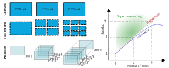

:::note[Learning Objectives]
By the end of this section, you should be able to:
1. Run a comprehensive scaling analysis on your problem
2. Understand the compiling and profiling strategies to optimize HPC
3. Determine parameters that modify the balancing of computational loads among workers
4. Optimize CFD simulations on HPC system 
:::

In the previous section, we developed a systematic approach to construct a CFD problem that aligns with the underlying scientific question that we seek to answer, conducted an a priori estimate of the computational expense, and pre-processed the simulation. 

Given a mesh, setup, and operating conditions, the objective of this section is to efficiently utilize the available HPC ressources.

For a given CFD simulation, how can we determine the best system to use?

[test](https://www.cse-lab.ethz.ch/wp-content/uploads/2022/09/Principles-of-HPC.pdf)
[test](https://www.nersc.gov/assets/Uploads/Tutorial-ISC2019-Intro-v2.pdf)
[test](https://www.scientific-computing.com/hpc2018-19/the-roofline-model)
[test](https://www.youtube.com/watch?v=IrkNZG8MJ64)
[test](https://inria.hal.science/hal-03207431/document)

## Compiling and profiling CFD codes

[test](https://docs.scinet.utoronto.ca/index.php/Introduction_To_Performance#gprof_.28profiling:_everywhere.29)

## Why is scaling important? 
We seek to best utilize the computational architechture for our CFD problem. The 

## Assessing scalability of the code
To optimally utilize HPC ressources, the CFD solver must be parallilezable and scalable. That is to say, by increasing the number of cores, we reduce the overall wall clock time for a given problem. To quantify the parallel performance, the computational speedup. There are two types of scaling that help to quantify the parallel performance of a CFD code on specific HPC hardware: **strong scaling** and **weak scaling**.

### Strong scaling
Strong scaling, also refered to as Amdahl's law, quantifies the expected speedup with increasing number of computational processors  for a fixed-size computational taks. For a fixed task, such as a CFD simulation, increasing the number of parallel processes results in a decrease in the workload per processor, thus a reduction in wall clock time. Eventually, as the number of processors increase and the per-processor workload shrinks, the communication overhead will impact the strong scaling. The strong scaling is particularly useful for compute-bound processes (CPU-bound), which are typical of most CFD software.

 Many tasks can be divided among processors to reduce the overall computational cost of the simulations, yet some task, let's call them 'housekeeping' tasks, cannot be effectively parallelized.  In CFD codes, 'housekeeping' task may be tied to reading input files or allocating variables, which usually is most important in the initialization of the simulation. For most simulations, these poorly parallelizeable tasks represent a minimal amount of the total computational cost.  Let's assume a CFD simulation is parallizeable with minimal tasks serial housekeeping task, the speedup can be compute as the ratio of the time it takes (in seconds) a specific task on 1 processor ($t(1)$) to time of the same task on $n$ processors ($t(n)$):
$$
    S_n=\frac{T(1)}{T(n)}
$$
Ideal parallelizability would imply that doubling the number of processors would halve the computational wall time, or: $T_1= n T_n$. This would correspond to 100\% parallel efficiency of the code, where the parallel efficiency is defined as:
$$
    \eta = \frac{n T(1)}{T(n)}
$$
Parallel efficiency 

