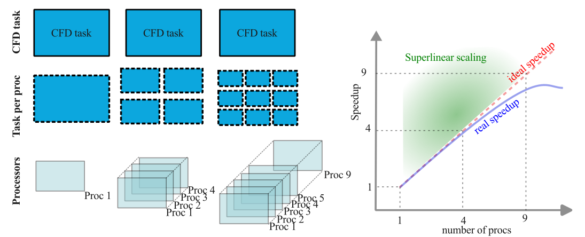
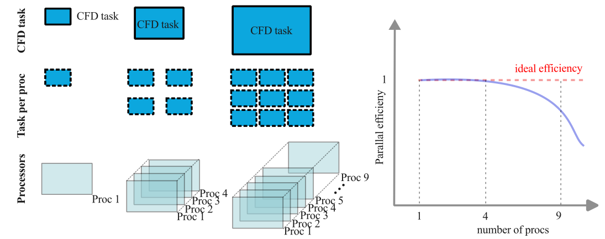

:::note[Learning Objectives]
By the end of this section, you should be able to:
1. Run a comprehensive scaling and determine the most efficient HPC usage
2. Determine the optimal HPC system for a give CFD problem
3. List out strategies to optimize a CFD code on HPC
:::
import Box from '../../../components/Box.astro';
import Caption from '../../../components/Caption.astro';
import CustomAside from '../../../components/CustomAside.astro';
import MultipleChoice from '../../../components/MultipleChoice.astro';
import Option from '../../../components/Option.astro';
import Spoiler from '../../../components/Spoiler.astro';
import CodeFetch from '../../../components/CodeFetch.astro';
import Gif from '../../../components/Gif.astro'


## Optimizing CFD simulations for HPC: Overview
In the previous classes, we planned the simulations, estimated the HPC costs, and pre-processed the simulation. Now, we will turn our attention to optimizing the usage of HPC resources. In this section, for a given CFD simulation and code, the objective is to most effectively use the available HPC resources. We will assume an end-user approach to the CFD code, therefore we won't cover topics that would force us to look 'under the hood' (into the code).


## Assessing scalability of the code
To optimally utilize HPC resources, the CFD solver must be **parallelizable** and **scalable**. That is to say, by increasing the number of compute cores, we reduce the overall wall clock time for a given problem. This speed-up is achieved if each processor is able to complete computational tasks independently from the other. To quantify the parallel performance of a CFD problem on a CFD code, we will define two types of scaling: **strong scaling** and **weak scaling**.  Each are presented in this section.


### Strong scaling
Strong scaling, also referred to as Amdahl's law, quantifies the expected speedup with increasing number of computational processors  for a **fixed-sized computational task**. For a fixed task, such as a CFD simulation, increasing the number of parallel processes results in a decrease in the workload per processor, thus, should results in a reduction of wall clock time. Eventually, as the number of processors increase and the per-processor workload shrinks, the communication overhead between the processors  will impact the strong scaling. The strong scaling is particularly useful for compute-bound processes ([CPU-bound](https://arc4cfd.github.io/glossary/#section-2)), which are typical of most CFD software. This tests can also help identify potential load balancing issues in the simulation.

 Many tasks can be divided among processors to reduce the overall computational cost of the simulations, yet some task, let's call them 'housekeeping' tasks, cannot be effectively parallelized.  In CFD codes, 'housekeeping' tasks may be tied to reading input files or allocating variables, which usually is most important in the initialization of the simulation. For most large scale simulations, these poorly parallelizeable tasks (usually) represent only a minimal amount of the total computational cost.  Let's assume a CFD simulation is parallizeable with minimal serial housekeeping tasks, the speedup can be d as the ratio of the time it takes (in seconds) a specific task on 1 processor ($T(1)$) to time of the same task on $n$ processors ($T(n)$):
$$
    S_n=\frac{T(1)}{T(n)}
$$
Ideal parallelizability would imply that doubling the number of processors would halve the computational wall clock time, or: $T_1=n T_n$. This would correspond to 100\% parallel efficiency of the code, where the parallel efficiency is defined as:
$$
    \eta = \frac{T(1)}{n T(n)}
$$
Efficiency is usually below unity, but in special cases superlinear scaling may be possible. The figure below illustrates the main points in strong scaling. It is important to keep in mind that:
- Strong scaling is code and HPC architecture dependent
- Increasing the degrees of freedom of the problem will usually improve parallel efficiency (if efficiency is bogged down by communication overhead)
- Although theoretically possible, superlinear speed up is usually rarely observed in CFD simulations


<Caption>Strong scaling of a CFD code. </Caption>


###  Weak scaling
Weak scaling defines the computational efficiency of a **scaled problem size**  with the number of processors. Weak scaling evaluates a constant per processor workload, thus provides an estimate of the size of the computational task on a larger HPC system for the same wall clock time. Weak scaling is often referred to as Gustafson's law and is a particularly useful to evaluate memory-limited applications; embarrassingly parallel problems tend to have near perfect weak scaling.  As weak scaling involves increasing the computational tasks with this number of processors, this implies scaling the number of grid points with the number of processors, thus represents a more much involved scaling test compared to strong scaling.

For a problem size of $M$ computed on $N$ processors, the time to complete a task is $T(M,N)$. With these definitions, we can define the weak scaling speedup as:
$$
    \text{weak scaling} =\frac{T(M,1)}{T(N\times M,N)} 
$$
It is clear that the size of the computational task on the denominator ($N\times M$) increases with the number processors, thus maintaining a constant workload on each processor. As the number of processes increase, the communication overhead also increases, reducing the weak scaling speedup. For geometrically complex problems, weak scaling is challenging as it requires a new mesh for each number of processors. For a 2D structured mesh, we can, for example, define $M=64^2$ to be run on 1 processor. On four processors, each processor would run  $M=64^2$ but the total CFD problem would be  $4\times M= 128^2$; on 16 processors, each processor still $M=64^2$ but the total problem size is $16\times M= 256^2$, and so on. For a comprehensive weak scaling analysis, one could conduct multiple analyses with $M=64^2$ on each processor, then $M=128^2$ on each processor, then $M=256^2$ and so forth. These multiple weak scaling results can provide a more comprehensive computational expectation of the code.

<Caption>Weak scaling of a CFD code. </Caption>

### Scaling tests for CFD
The scaling tests are an **essential** component to running large scale simulations on HPC systems. It's important that the scaling test will naturally depend on the CFD code but also, very importantly, will depend on the simulation. For example, if you use a dynamic inflow boundary condition (injection of turbulence at the inlet), the local overhead in computing the inflow variable may result in a slowdown due to the processor waiting on others. As a result, a same CFD code with different operating conditions may show different scaling properties.  Similarly, a same code run on two different HPC systems may also show different scaling results. A code performance is dependent on the architecture of the HPC system.

:::tip[Tip]
It's important to conduct scaling tests on: 
1. Run scaling tests on a similar or identical setup you plan on running
2. Use the same HPC system that you plan on using
:::

In order to quantify the scaling, we must have tools to measure.  Most commonly, we will use the wall-clock time in scaling test but other quantifiable metrics may also be used. The Compute Ontario HPC systems have the following command that can be used to compute the wall clock time for a given process:
```bash
[username@nia0144 ~]$ /bin/time SU2_CFD MyInput.cfg
```
Although this provides a measured time to complete the simulation, this approach does not discriminate the parallelized tasks from the 'housekeeping' tasks. Another approach is to take the time calculation directly from the CFD output, especially if the time is computed on a per-time-step basis.


The following list are additional considerations you want to have when conducting scaling tests on CFD code:
1. Define a consist metric to evaluate the compute time (e.g. wall clock time to run 100 time steps);
2. Avoid defining times that are not consistent or dependent on the simulation (e.g. computing wall clock time to run 1 s of simulation time)
3. Select a metric such that you minimize the importance of the serial housekeeping tasks: for example if you only compute 5 time steps, yet the initialization takes up about 25\% of the total, you will have an incorrect assessment of the scaling;
4. Scaling is solver and hardware specific. A scaling test on different architecture will give different results.
5. Use a simulation that is most representative of the actual run you plan on conducting.
6. Ideally, run multiple independent runs per job size and average the results.
7. Try to run on an interactive/debug node.

Let's do an example.

<Box iconName='exercise'>
#### EXAMPLE: Why do I need a scaling test on my specific case?
We often face the temptation of relying on someone else's scaling or published scaling results to avoid the process of conducting our scaling analysis. But it's important to investigate the scaling on a problem that is as close to the actual large-scale simulation as possible.

Let's do an example: here we conduct two scaling test on OpenFoam using two different solvers and different problems (including of mesh size). Both tests are conducted on Niagara. We define a common metric for both cases and conducted the scaling.


##### **rhoCentralFoam**		        
| Proc    | Time (s) |  Strong scaling    |
| :---  | :---: | :---: | 
| 1	    |65.81	| 1.00|
| 2	    | 34.56	| 1.90| 
| 4	    | 16.36	| 4.02| 
| 8	    | 8.63	| 7.63| 
| 16	| 4.92	| 13.38| 
| 32	| 3.38	| 19.47| 
| 64	| 2.23	| 29.51| 
| 128	| 1.11	| 59.29| 


##### **pimpleFoam**	
| Proc    | Time (s) |  Strong scaling    |
| :---  | :---: | :---: | 	  
| 1	| 595.43| 	1.00| 
| 2	| 338.7	| 1.76| 
| 4	| 162.53| 	3.66| 
| 6	| 126.15| 	4.72| 
| 8	| 95.01	| 6.27| 
| 12	| 67.36| 	8.84| 
| 16	| 58.29	| 10.21| 
| 20	| 60.96	| 9.77| 
| 24	| 54.02	| 11.02| 
| 28	| 47.9	| 12.43| 
| 32	| 44.04	| 13.52| 

Compiling both results on the same plot, we see drastic difference in efficiency.

<Caption>Comparison of scaling results of two solvers in OpenFoam. </Caption>
With 16 processors, the efficiency is an acceptable 84\% using rhoCentralFoam, but with pimpleFoam, the efficiency drop to 64\% which is not very good.

**Always conduct scaling analyses on size and type of problem you wish to study!**
</Box>


As the scaling tests require lots of small steps, it is possible to automate the scaling tests using bash scripts. The following example can automates a strong scaling test in OpenFoam (you need to be on an interactive node!).

<CodeFetch rawURL='https://raw.githubusercontent.com/ARC4CFD/arc4cfd/master/Section2/OpenFoam/ScalingTests/StrongScalingTest/runStrongScalingTest.sh' lang='bash' meta="title='strongscalingTest.sh'" />


:::tip[Tip]
A bit of planning and testing **can save HPC time and effort**!
:::


### Interpreting scaling test results
Now that we have scaling test results, we must interpret them to effectively utilize the HPC systems. As most CFD codes are compute-bound, strong scaling test are typically more relevant.  Ideally, we would want to reach a compromise between parallel efficiency and the overall wall clock time.


Suppose we have access to 32 processors and we have a CFD simulation that scales similar to the previous example (with rhoCentralFoam). Running the simulation on 32 processors, would give us an efficiency around 60%. This would greatly underutilize the HPC resources. In fact, running this same case on 16 processors instead of 32 would only be 31\% slower. If there are, let's say, five simulations that need to be run, then the most effective utilization would be to run each simulation on 8 processors. This would result in a *much faster* throughput than running each simulation sequentially on 40 processors.


> ---
>
> *“The wisest are the most annoyed at the loss of (computational)* time.”
>
>  -Dante Alighieri (HPC-revised)
>
> ---


## Determining the optimal HPC system for a given code
Aligning the  HPC system architecture for a given CFD code can help improve efficiency. Most of the time the selection of an HPC system may be a secondary consideration but in other cases, when choosing between two HPC systems, it may be worth investigating.

The **roofline model** is a simple representation of arithmetic intensity  versus performance of a code, and helps to assess the theoretical limits based on the systems architecture and memory characteristics. There are two limiting factors to the performance of a code, namely limitations on the:
1. CPU peak performance (compute-bound)
2. RAM memory bandwidth (memory-bound)

The roofline model allows a representation of those limiting characteristics. The roofline model can be mathematically defined as:
$$
    P_{max}=\min(P_{peak},I*b_{max})
$$
where $P_{peak}$ is the hardware peak performance (FLOPS) and $b_{max}$ is the peak bandwidth. The $I$, in the equation, is the algorithmic intensity and is code dependent. The algorithmic intensity is a ratio of the number of basic operations (floating point add and multiplies) per number of bits moved between fast and slow memory. Most CFD codes have a high algorithmic intensity, meaning they have many basic operations per cache calls. For this reason, CFD are typically compute-bound in the roofline representation. Optimally, we would select a system which falls at the ridge point where the memory and computational limits intersect.


<Caption>Roofline model. </Caption>
Thus, when analysing a system, we are typically interested in increasing the  **CPU peak performance** instead of increasing the memory bandwidth.  Here is an example how the various systems can be displayed in the roofline model.


<Caption>Modification of the roofline model based on the HPC characteristics. </Caption>


:::note[Important to keep in mind]

To better understand the characteristics of the processor, you can type: **/proc/cpuinfo** on any compute node (there is no point in checking the specs of the login node). This information provides the nominal CPU speed and cache size.
```python "even" ins=/3100.*/ del=/28160.*/
[username@<computeNode> ~]$ /proc/cpuinfo

processor	: 77
vendor_id	: GenuineIntel
cpu family	: 6
model		: 85
model name	: Intel(R) Xeon(R) Gold 6148 CPU @ 2.40GHz
stepping	: 4
microcode	: 0x2007006
cpu MHz		: 3100.195
cache size	: 28160 KB
physical id	: 1
siblings	: 40
core id		: 26
cpu cores	: 20
apicid		: 117
initial apicid	: 117
fpu		: yes
fpu_exception	: yes
cpuid level	: 22
wp		: yes
```
:::


## Strategies for effective HPC utilization

### Load-balanced parallel computations
For the optimal use of HPC resources, the *workload* should be equally spread out among all processors. When we conducted the strong scaling analysis, we assumed that equally dividing the mesh among all parallel processes was equivalent to equally dividing the workload. This may not be the case. Consider the case where the computational domain is equally divided among two processors. If, for example, the inflow condition requires the generation of synthetic turbulence (which requires a lot of adhoc calculations), whereas the outflow is simply convected out of the domain, as shown below:


<Caption>Load balancing challenges in CFD. </Caption>

As processor 1 has the added workload of inflow conditions,  the processor 2 will complete its tasks sooner and have to idle while waiting for processor 1. For two processors, this is a completely acceptable wait time but if we are running on 1,200 processors and only 1 processors delays the computation for all other 1199 processors, the load imbalance may result in significant penalty of the computation.

 Load imbalances may be particularly acute in CFD as HPC systems are increasingly heterogeneous, the increased computational demands are may not be equally divided, and  we are increasingly facing dynamic CFD workloads. The dynamic workload can be due to adaptive mesh refinement (locally increasing grid points) or through Lagrangian-based particle laden flows. 

 To address the combined load balancing challenges of increasingly complex codes running on heterogeneous HPC systems, dynamic load balancing can be considered although these concepts extend beyond the scope of an introductory class. Interested readers may consult [research on the topic.](https://link.springer.com/chapter/10.1007/978-3-319-93698-7_33)


### Minimize communication among processors
Most modern CFD codes primarily use multiple MPI processes on different physical CPU cores which are connected. As seen earlier, the inter-processor communication is often the bottleneck which limits the parallel efficiency of the code. In CFD computations, communication is necessary to compute the flux across physical MPI processes as well as averaging other operations that require information exchange (e.g. fast fourier transforms). The decomposition of the CFD domain among the various processors is not unique and can impact the communication, and  scalability of the code. Thus, one strategy, in lieu of dynamic load-balancing, is to minimize:
- Amount of information transferred
- Number of processors 
This can be done by manually dictating the decomposition of the computational domain. Let's look at an illustrative example.

<Box iconName='exercise'>
#### EXAMPLE: Minimizing communication
 Consider the CFD domain comprised of $N \times M$ grid points that can be decomposed either in four blocks of $N\times M/4$ or  $N/2\times M/2$ on two dual core processors. The question is: What is the optimal decomposition? (assuming the same workload on each processor). We anticipate that the communication between cores will typically have more latency than among two processors on the same chip. By looking at the **amount** and **number of communication partners**, we can anticipate that the overall communication will be more efficient with the $N\times M/4$ decomposition. It is easy comprehend how this communication problem is exacerbated when discussing high number of cores for a 3D problem.


<Caption>Optimal parallelization in CFD.</Caption>
</Box>


:::note[Evaluating communication of CFD simulations]
Many CFD codes rely on [ParMetis](http://glaros.dtc.umn.edu/gkhome/metis/parmetis/overview) (Parallel Graph Partitioning and Fill-reducing Matrix Ordering) to  create high quality partitionings of very large meshes. Sometimes, the decomposition is, by default, handled directly in the code (as in SU2, although the user can also control the decomposition) other times it must be explicitly defined (as in OpenFoam). In OpenFoam, the **decomposePar** command decomposes the mesh and initial conditions based on the user-defined **system/decomposeParDict**. When running the **decomposePar**, the output may be helpful to assess the communication among processors. For example:

```python "even" ins=/3100.*/ del=/28160.*/
[...]

Processor 39
    Number of cells = 517259
    Number of points = 545608
    Number of faces shared with processor 19 = 5405
    Number of faces shared with processor 38 = 20216
    Number of processor patches = 2
    Number of processor faces = 25621
    Number of boundary faces = 30421

[...]

Number of processor faces = 957287
Max number of cells = 517259 (9.66634671059e-05% above average 517258.5)
Max number of processor patches = 5 (31.5789473684% above average 3.8)
Max number of faces between processors = 67248 (40.4970505188% above average 47864.35)


Number of processor faces = 1841355
Max number of cells = 258639 (0.00376987521713% above average 258629.25)
Max number of processor patches = 5 (26.582278481% above average 3.95)
Max number of faces between processors = 65100 (41.4175973672% above average 46033.875)
```

In the above, processor 39, must communicate information to processor 19 and 38. Additionally, at the bottom of the output, we
get summary information on the total number of faces shared between processors and how evenly this is divided among all the processors. By modifying the decomposition in **system/decomposeParDict**, a minimized communication overhead may be achieved.
:::


### Profiling CFD codes
Profiling CFD codes can help understand the bottlenecks in the code and provide hints about potential improvements that can improve the code efficiency on HPC systems. The profiling of CFD codes on HPC systems requires more advanced computational knowledge than expected in this introductory course. The interested reader can consult the [Scalasca](https://apps.fz-juelich.de/scalasca/releases/scalasca/2.5/docs/manual/) profiler that is [loaded on the Canadian clusters](https://docs.alliancecan.ca/wiki/Debugging_and_profiling#Scalasca_profiler_(scalasca,_scorep,_cube)).


### CFD-specific ideas to speed up simulations
Although improving the load-balancing and minimizing communication can speed up the simulation, the greatest speedup potential lies in the actual parameters and modelling within the simulations. Here are CFD-specific considerations that can help speed up a CFD computation:

##### **Investigate and adjust the mesh**
Looking at the preliminary results, we can identify the regions of high CFL number that are constraining the time advancement of the simulation. Is the fine mesh resolution needed at this location? Can we coarsen these mesh without affecting the results? Big computational savings can be made since doubling the characteristic mesh size at high-CFL region can effectively halve the simulation time by doubling the allowable timestep in an explicit time advancement simulation (**big savings!**). In most cases, the fine mesh resolution is needed to resolve local flow gradient. As such the user must investigate the trade-off between accuracy and computational speed. In the OpenFoam output, we can glean useful information. In the output below, we see that the AVERAGE CFL number is 675 times smaller than the cell size that is constraining the time stepping. This can help us identify potential speed-up opportunities. Can we locally increase the mesh size? Can we re-arrange the mesh at these locations?
```python "even" 
Courant Number mean: 0.00404550158114 max: 2.69641684221
```


##### **Consider wall modelling strategies**
 If we are faced large computational cost,  In this case, the user may consider to apply wall-modeling strategies which have the benefit of greatly reducing computational costs and possibly have better control on the error of the simulation. Will the added modelling of the boundary layers negatively affect the simulation results?


##### **Coarse-to-fine mapping**
Many simulations have significant transience as the flow inside the domain adapts to the boundary conditions. In fact, much of the overall HPC costs are tied to overcoming the transience, especially in turbulent flows. Can we run a coarse simulation and 'map' the results to a finer mesh (using [**mapFields**](https://www.openfoam.com/documentation/guides/latest/doc/guide-fos-field-mapFields.html) in OpenFoam, for example)? We may still need to overcome a short transience as the coarse result adapts to the finer mesh, but  the overall HPC costs may be reduced. 

##### **Think through the algorithms used**
 Some algorithms that are very beneficial for local CFD computations can be detrimental for large HPC calculations. Two cases in point are:
  - Multigrid acceleration
  - Preconditionners 

Both these algorithms, which greatly speed up computations on a single core system, can become computationally liability on large computations. Both these algorithms require communication to many processors and may greatly affect the strong scaling performance of the code. Can the simulation be solved without these approaches?

##### **Revisit meshing strategies**
 The meshing decisions in [section 2.4](https://arc4cfd.github.io/section2/part4/) may need to be revisited. Can we save total grid points by using unstructured  instead of  structured mesh? Can we use a higher-order scheme (higher HPC cost but reduce grid points) to reduce the grid points?


<Box iconName='exercise'>
## EXAMPLE: Scaling of the backward-facing step


<Caption>Strong scaling of a CFD code. </Caption>


#### EXAMPLE: Weak scaling test

[SCALING TESTS HERE]

Step by step process for scaling test


Show scaling on Graham, niagara, etc

Show difference in scaling


<Caption>Strong scaling of a CFD code. </Caption>


<Caption>Weak scaling of a CFD code. </Caption>

</Box>


{/*
*[test](https://www.cse-lab.ethz.ch/wp-content/uploads/2022/09/Principles-of-HPC.pdf)
[test](https://www.nersc.gov/assets/Uploads/Tutorial-ISC2019-Intro-v2.pdf)
[test](https://www.scientific-computing.com/hpc2018-19/the-roofline-model)
[test](https://www.youtube.com/watch?v=IrkNZG8MJ64)
[test](https://inria.hal.science/hal-03207431/document)
[test](https://hpc-wiki.info/hpc/Scaling_tests)
[test](https://www.cse-lab.ethz.ch/wp-content/uploads/2022/09/Principles-of-HPC.pdf)
[test](https://people.eecs.berkeley.edu/~kubitron/cs252/handouts/papers/RooflineVyNoYellow.pdf)
[test](https://www.cines.fr/wp-content/uploads/2014/10/lesson2_slides.pdf)


## Striking a balance: HPC vs accuracy

https://su2foundation.org/wp-content/uploads/2020/06/Gomes.pdf


*/}

:::note[Learning Objectives]
Having finished this lecture, you should now be able to answer the following important questions:
1. How do I perform a weak or strong scaling analysis?
2. How do I determine the optimal HPC system for a given code?
3. How do I effectively use HPC resources?
:::


