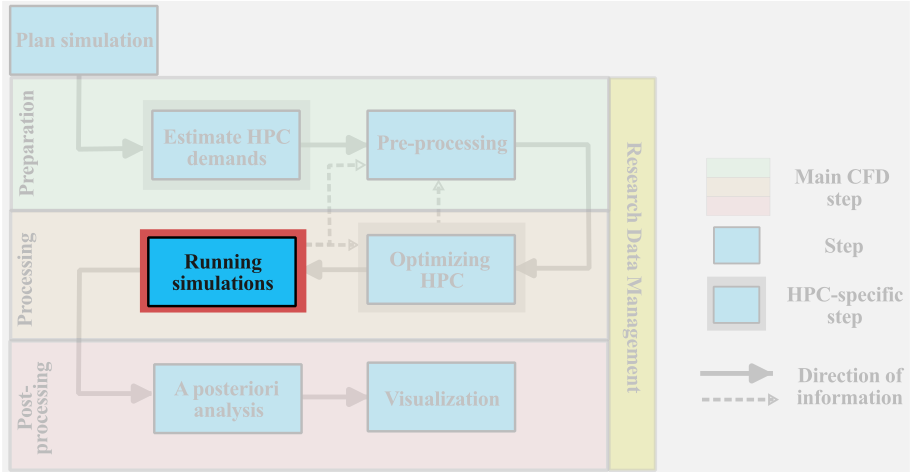
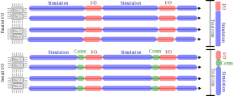

import Box from '../../../components/Box.astro';
import Caption from '../../../components/Caption.astro';
import CustomAside from '../../../components/CustomAside.astro';
import { Tabs, TabItem } from '@astrojs/starlight/components';

:::note[Learning Objectives]
By the end of this section, you should be able to:
1. Organize and plan simulation files on the cluster
2. Run the simulation and optimize
3. Carry out a runtime analysis of flow parameters
:::

## Running CFD simulations on HPC: Overview




{/*[test](https://www.grc.nasa.gov/WWW/wind/valid/tutorial/spatconv.html)
[test](https://curiosityfluids.com/2016/09/09/establishing-grid-convergence/)*/}
{/**/}

We are now ready to start a large-scale CFD simulation. As mentioned in the previous sections, we have chosen a problem (the backward facing step, BFS) that has some very important flow features, but most importantly it's a case that has been extensively analyzed in the literature both numerically [Li et al. 1997](https://www.cambridge.org/core/journals/journal-of-fluid-mechanics/article/abs/direct-numerical-simulation-of-turbulent-flow-over-a-backwardfacing-step/645D21758E8F74568008899C17B12ADD), and experimentally [Jovic and Driver 1994](https://ntrs.nasa.gov/api/citations/19940028784/downloads/19940028784.pdf). The purpose of this section is to standardize the workflow of **setting up**, **running**, and **monitoring** a large-scale CFD simulation on a remote HPC system. Buckle up!

## Organize simulation files on the cluster
The first and **most important** step is to well organize the simulation files on the cluster. During your career as a researcher you will probably end up running a **LARGE** number of numerical simulations, and a well planned bookkeeping can save you **A LOT** of time.

:::caution[Disclaimer]
1. Although, all examples and simulations will be carried out using the University of Waterloo cluster **Graham**, the same process will apply to any other Compute Ontario HPC systems.
2. The workflow presented here **is NOT** a *set in stone* rule, but rather a **suggestion** for any user of HPC resources.
:::

If you are following along with the course, you probably have already cloned all the example files and GitHub repository on the Cluster, if not please go back and check [section 2.1](https://arc4cfd.github.io/section2/part1/). The question now is: **how do we organize our simulation files?**

To answer this question, let's first figure out what options we have. Upon loggin into Graham, type:
```bash
[username@gra-login1 ~]$ diskusage_report
```
This command will check available disk space and the current disk utilization on our **personal** and **group** profiles. The output will look something like:
```bash
[username@gra-login1 ~]$ 
                             Description                 Space             # of files
                     /home (user username)              23G/50G             112/500k
                  /scratch (user username)            6633G/20T            14k/1000k
                 /project (group username)              0/2048k               0/1025
               /project (group def-piname)           292M/1000G             294/505k
            /project (group rrg-piname-ac)             49T/100T            112k/505k
```
Where `username` refers to your personal space, while `piname` to your group (or principal investigator) profile. `/home` has a capacity of 50GB and, as we mentioned earlier, is not the recommended place to store simulation results or data. `/home` is suitable for code development and version control. `/project (group rrg-piname-ac)` (in this case) is the largest directory on the cluster, it's linked to your principal investigator account, and is the place where **FINAL** data should be stored long-term. Finally, `/scratch` is the second largest directory, it's connected to the single user, and as mentioned in [section 2.1](https://arc4cfd.github.io/section2/part1/), it's the right place to **set up and run** your simulations.

:::danger[Final Warning]
Important files must be copied off `/scratch` regularly since they are not backed up and older files are subject to purging!
:::

Following this approach, one can clone from the course [GitHub repository](https://github.com/ARC4CFD/arc4cfd/tree/master) both the **OpenFOAM** and **SU2** BFS examples to the remote `home` into the respective case directory:

<Tabs group="tab-group">
    <TabItem label="/home/bfs_openfoam">
    ```bash
    [username@gra-login1 ~]$ ls
    README              case                movie.ogv           run.sh
    bfs_Umag.pvsm       mesh                run_jobscript.sh
    ```
    </TabItem>
    <TabItem label="/home/bfs_su2">
    ```bash
    [username@gra-login1 ~]$ ls
    Coarse                                       README
    Fine                                         Turbulent-flow-over-Backward-facing-step.pdf
    Intermediate                                 su2job.sh
    ```
    </TabItem>
</Tabs>

### Create the Run directory
Now that you have cloned the required tools in your `/home`, think of them as the **SOURCE** code of your CFD tools. Any modifications you want to do on the source should happen in `/home`, as it's your own personal space, and nothing will be purged from here. However:

:::caution[Caution]
`/home` is not the place **to run** your simulation. Depending on the size of your mesh, and the number of snapshots saved, you will reach the **quota limit** of 50GB very soon. 
:::

For this reson, once you are happy with the changes implemented on the source code, you should **copy** the code into a **Run directory** in `/scratch`. In this case no changes were required in the source files, therefore we can directly:
<Tabs group="tab-group">
    <TabItem label="/scratch/01_BFS_openFOAM">
    ```bash
    [username@gra-login1 ~/home/bfs_openfoam]$ cp -r * ./scratch/01_BFS_openFOAM
    ```
    </TabItem>
    <TabItem label="/scratch/02_BFS_SU2">
    ```bash
    [username@gra-login1 ~/home/bfs_su2]$ cp -r * ./scratch/02_BFS_SU2
    ```
    </TabItem>
</Tabs>

Don't underestimate the importance of **name convention** for files and directory. We reccommend to find your own preferred system, and be consistent with it. At this point we are ready to setup the simulation.


### Setting up simulation parameters
All the simulation files have already been prepared, and here we highlight only the most important steps to follow before running the simulation:

1. **Mesh size**: the first and most important choice is the **number of points**. We prepared the case so that students can run several **meshes**. Here, however, for semplicity's sake, we only follow the example of the coarsest mech of $237000$ grid points (named `bfs_200k_DDES`).

2. **Time step size**: the choice of the grid size directly impact the maximum time step size on e can use due to the CFL stability condition ([section 2.3](https://arc4cfd.github.io/section2/part3/)). For the chosen case (of $200000$ points) the CFL stability condition requires: $\Delta_t=10^{-4}$.
<details>
    <summary>OpenFOAM</summary>
    ```bash
    vim case/system/controlDict
    # change deltaT to 1e-4;
    ```
</details>
<details>
    <summary>SU2</summary>
    Example 2 content
</details>

3. **Domain decomposition**: after performing the scaling test for a given mesh ([section 2.5](https://arc4cfd.github.io/section2/part5/)), we know how many processors we should use to optimize the CFD workflow. The user should modify the `numberOfSubdomains` entry in the `case/system/decomposeParDict` file. In this example we use 64 processors.
<details>
    <summary>OpenFOAM</summary>
    ```bash
    vim case/system/decomposeParDict
    # change numberOfSubdomains to 64;
    ```
</details>
<details>
    <summary>SU2</summary>
    Example 2 content
</details>

4. **Simulation End Time**: especially when turbulence or geometric non-homogeneity are present, it's important to run the simulation long enough to let the flow properly develop in the computational domain. This phase is usually referred to as **the transient** phase. Once the flow is fully developed, a **steady state** is reached and the flow is referred to as **statistically stationary**. As mentioned in [section 2.3](https://arc4cfd.github.io/section2/part3/) estimating the time required to reach a steady-state is very difficult and is case-dependent. A reasonably good measure to get a rough estimate is the Large Eddy Turn-Over Time (LETOT). One LETOT is the time required for the largest eddy to leave the domain. **In this example we choose the End Time to correspond to $\approx 10$ LETOTs**.
<details>
    <summary>OpenFOAM</summary>
    ```bash
    vim case/system/controlDict
    # change endTime to 0.5;
    ```
</details>
<details>
    <summary>SU2</summary>
    Example 2 content
</details>

5. **Snapshot time interval**: once again, when turbulence governs the physics of the flow we use statistical methods to process and analyze the results. For this reason once should collect a large sample of **flow realization** or snapshots in order to perform post-processing analysis and compute flow statistics. The interval between two successive snapshots should not be too large (as they will be uncorrelated) nor too small (as they will be too much correlated). One can always refer to the LETOT and choose a percetage of that as the sampling interval.
<details>
    <summary>OpenFOAM</summary>
    ```bash
    vim case/system/controlDict
    # change writeInterval to 20;
    ```
</details>
<details>
    <summary>SU2</summary>
    Example 2 content
</details>

## Run simulation using a batch script file
Explain various ways of running the BFS simulation [TO DO]
1. Interactive nodes
2. Batch 
3. Importance of automation

## Perform a runtime analysis of flow parameters
Explain how to perform runtime analysis to check if steady-state is reached [TO DO].  


## Perform a grid convergence study 
Explain the importance of a grid sensitivity study and how to carry it out [TO DO]

## SUGGESTION JPH: discuss I/O issues (binary vs ASCII, parallel output (e.g. OF) vs serial output (or parallel output + merge as done in SU2))
 


## SUGGESTION JPH: Brief discussion on V\& V 
How can we validate and verify in the context of HPC. validate and verify on smaller problems, gain confidence and verify large scale test (avoid iterating as it's very expensive in HPC costs)