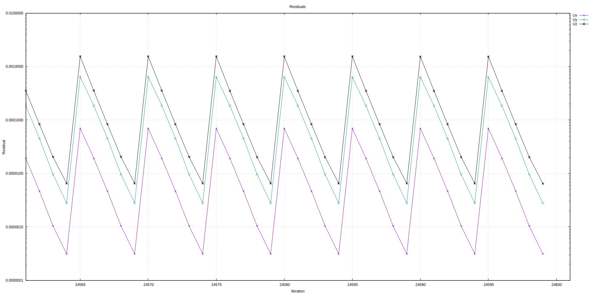
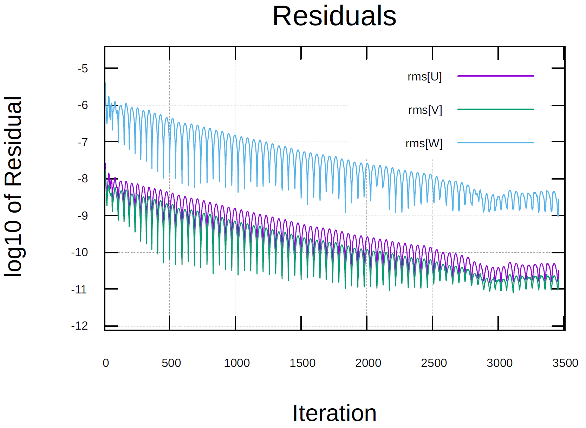

import Box from '../../../components/Box.astro';
import Caption from '../../../components/Caption.astro';
import Option from '../../../components/Option.astro';
import CustomAside from '../../../components/CustomAside.astro';
import { Tabs, TabItem } from '@astrojs/starlight/components';
import CodeFetch from '../../../components/CodeFetch.astro';
import MultipleChoice from '../../../components/MultipleChoice.astro';
import { YouTube } from '@astro-community/astro-embed-youtube';

:::note[Learning Objectives]
By the end of this section, you should be able to:
1. Organize and plan simulation files on the cluster
2. Run the simulation and optimize
3. Carry out a runtime analysis of flow parameters
:::
<CustomAside icon="pen" title="Time to complete: 45 min" colour="green"></CustomAside>

We are now ready to start a large-scale CFD simulation. We have generated the mesh, setup the simulation, and run scaling tests.  The purpose of this section is to standardize the workflow of organizing, running, and monitoring a large-scale CFD simulations on a remote HPC system and to provide best-practice tips.


:::caution[Disclaimer]
1. All examples will be carried out on Graham, but the approach is generalizable to any  HPC system
2. The workflow is NOT *set in stone*, but rather  *suggestions* to facilitate HPC usage
3. The examples will be carried out in  both OpenFOAM and SU2; students can toggle between OpenFOAM and SU2 as shown below
<Box color='clear'>
<Tabs group="tab-group">
    <TabItem label="Click for OpenFOAM">
    OpenFOAM commands
    </TabItem>
    <TabItem label="Click for SU2">
    SU2 commands
    </TabItem>
</Tabs>
</Box>
:::

## Remote files on the cluster
Prior to running a simulation, it is good practice to organize the file system on the remote cluster. Although this step may be timely to implement, it will save time in the long run. The question now is: **how do we organize our simulation files?**

{/*
If you are following along with the course, you probably have already cloned all the example files from the GitHub repository onto the Cluster. If not please go back and check [section 2.1](https://arc4cfd.github.io/section2/part1/). */}

To answer this question, let's first figure out what options we have. Upon logging into Graham, type:
```bash
[user@gra-login1] diskusage_report
```
This command will check available disk space and the current disk utilization on our **personal** and **group** profiles. The output will look something like:
```bash
[user@gra-login1] 
                             Description                 Space             # of files
                     /home (user username)              23G/50G             112/500k
                  /scratch (user username)            6633G/20T            14k/1000k
                 /project (group username)              0/2048k               0/1025
               /project (group def-piname)           292M/1000G             294/505k
            /project (group rrg-piname-ac)             49T/100T            112k/505k
```
Where `username` refers to your personal space, while `piname` to your group (or principal investigator) profile.

- `/home` has a capacity of small which  is suitable for code development, source code, small parameter files, job submission scripts and version control. Note that we cannot write to the  `/home` drive from the compute nodes.
- `/project (group rrg-piname-ac)` is directory that is linked to your principal investigator's account and meant for longer-term storage and  sharing data among members of a research group. 
- `/scratch` is connected to a single user, and is intended for intensive read/write operations on large files. As mentioned in [section 2.1](https://arc4cfd.github.io/section2/part1/), it's the right place to **set up and run** your simulations.

More detailed information on the Alliance's storage and management systems can be found on their [website](https://docs.alliancecan.ca/wiki/Storage_and_file_management).

:::danger[Reminder]
Important files must be copied off `/scratch` regularly since they are not backed up and older files are subject to purging!
:::

As we have space on the `/home` drive, if it's not already done, we can clone from the course [GitHub repository](https://github.com/ARC4CFD/arc4cfd/tree/master). The repository contains the input file and mesh for the examples (and is of modest size), therefore the `/home` drive will allow us to modify and save the examples prior to copying the cases to `/scratch` for running the simulations.

<Box color='clear'>
<Tabs group="tab-group">
    <TabItem label="/home/bfs_openfoam">
    ```bash
    [user@gra-login1] ls
    README              case                movie.ogv           run.sh
    bfs_Umag.pvsm       mesh                run_jobscript.sh
    ```
    </TabItem>
    <TabItem label="/home/bfs_su2">
    ```bash
    [user@gra-login1] ls
    Coarse                                       README
    Fine                                         Scaling
    Intermediate                                 Turbulent-flow-over-Backward-facing-step.pdf
    ```
    </TabItem>
</Tabs>
</Box>


### Create the run directory
Now that you have cloned the repository to your `/home` directory, we can make any modifications. Any modifications you want to do on the source should happen in `/home`, as it's your own personal space, and nothing will be purged from here.

For this reason, once you are happy with the changes implemented on the source code, you should **copy** the code into a **run directory** in `/scratch`. In this case no changes were required in the source files, therefore we can copy them directly:
<Box color='clear'>
<Tabs group="tab-group">
    <TabItem label="/scratch/01_BFS_openFOAM">
    ```bash
    [user@gra-login1] cp -r * ./scratch/01_BFS_openFOAM
    ```
    </TabItem>
    <TabItem label="/scratch/02_BFS_SU2">
    ```bash
    [user@gra-login1] cp -r ./Coarse/ ./scratch/02_BFS_SU2
    ```
    </TabItem>
</Tabs>
</Box>


### Naming convention and folder structure
At this stage, don't underestimate the importance of naming conventions for files and directories.  Consistent naming conventions can help finding your data, avoid mistakes, and minimize duplication of efforts. Some CFD codes, such as OpenFoam, have strict folder naming and structure convention for each simulation, while other codes, such as SU2, do not.  As each CFD project typically comprise of multiple simulations (mesh refinement, scaling tests, different turbulence models), a consistent naming convention and folder structure, determined a priori, will facilitate the organization, running, post-processing, and, ultimately, the research data management.

Best practices in folder naming conventions:
 - **Avoid space and special characters in the names!**: Use either dashes (-) or underscores (_) if you need to separate elements in the folder name. Alternatively, you can use the camelCase in which the first word is in lowercase and every other word starts with a capital letter (e.g. pimpleFoam).
 - **Keep it short but meaningful**: Keep folder names as short as possible and consider using abbreviations (write those down!)
 - **Write down the naming convention**: Write down the naming convention in the data management plan (DMP), more in Section 3, or in a README file.
 - **Dates in folder names should follow an ISO 8601 format** If dates are used in the folder names, use a well accepted standard format YYYYMMDD or YYYY-MM-DD. 
 
Here are a couple considerations for directory naming conventions:

- **Think about the simulations you plan to run**: Consider all the possible simulations you will need to run:
    - What are the important parameters of the simulations? Here are some typical parameters that may be varied between simulations:
        - turbulence models (SST, k-omega, RSM etc.)
        - boundary conditions (freestream velocity, wall resolved, wall modelled, Reynolds number)
        - various grid resolutions (coarse, medium, fine etc.)
        - thermophysical properties (Prandtl number, thermal convection etc.)
        - ...

- **Establish a consistent naming convention and folder structure**
    - Depending on the planned parameter space that you plan to cover, you can establish a consistent naming convention and folder structure. Depending on the complexity of the CFD project, you may opt for either:
        - a more complex folder hierarchy 
        - a more comprehensive folder naming convention
    
    The naming convention and folder structure need not be unique and different research projects may have . Here are two different examples
    
<Box color='clear'>
<Tabs group="tab-group">
    <TabItem label="Folder and Subfolder hierarchy">
    Having a deeper folder and subfolder hierarchy may help to organize the various simulations, especially for larger CFD projects. As the simulation organization is embedded withing the folder structure, there is naming convention of each folder is less critical. Here is an example:
    ```bash
    ./BackwardFacingStep
    |-- gridConvergenceStudy/
    |   +-- coarse/
    |   +-- medium/
    |   +-- fine/
    |   +-- README
    |-- workingDir/
    |-- scalingTests/
    |   +-- weakScaling/
    |   |   +-- ...
    |   +-- strongScaling/
    |   |   +-- Sim_40proc/
    |   |   +-- Sim_20proc/
    |   |   +-- ...
    |-- turbulenceModels/
    |   +-- SST/
    |   +-- kOmega/
    |   +-- SST/
    |-- README
    ```
    </TabItem>
    <TabItem label="Comprehensive Naming Convention">
    For smaller CFD projects, a flatter folder structure may be preferred to facilitate navigation among various simulation. The flatter folder structures comes at the cost of a very comprehensive naming convention. Here is an example:

        `[SIMULATION_NAME]_[Reynolds_number]_[Turbulence_model]_[resolution]`

    where `[SIMULATION_NAME]` is `BFS` for the backward facing step, `[Reynolds_number]` is `ReXXXX` where XXXX is the Reynolds number, `[Turbulence_model]` defines the turbulence models (`SST`, `KOM`: k-omega, `RSM`: Reynolds stress modelling etc.), and `[resolution]` is the resolution of the mesh (`CRS` coarse, `MDM` medium, `FIN` fine etc.). Based on these conventions
        `BFS_Re5000_SST_CRS`
        `BFS_Re5000_SST_CRS`
      ```bash
    ./BackwardFacingStep
    |-- BFS_Re5000_SST_CRS/
    |-- BFS_Re5000_SST_MDM/
    |-- BFS_Re5000_SST_FIN/
    |-- workingDir/
    |-- BFS_Re5000_KOM_FIN/
    |-- BFS_Re5000_RSM_FIN/
    |-- BFS_Re1000_KOM_FIN/
    |-- BFS_Re10000_KOM_FIN/
    |-- README
    ```
    </TabItem>
</Tabs>
</Box>


### Book keeping
When running a large number of simulations, in addition to a consistent naming convention and folder structure, it is good practice to maintain a centralized database of the simulations. This database, which could be an Excel sheet, can provide a quick summary of the important details (date of simulation, number of processors, code compilation characteristics, etc.) for each simulation and any user comment.


## Setting up simulation parameters
As the tutorial files have already been prepared, here we highlight only the most important steps in setting up the files prior to running the simulations. We assume that we are using  mesh with a known resolution that has been generate by an external meshing software (see details in [section 2.4](https://arc4cfd.github.io/section2/part4/)). For simplicity and ease of computation, we only use coarsest mesh with about $237,000$ mesh elements (named `bfs_200k_DDES` in OpenFoam, and `Coarse` in SU2 examples). With this mesh, we can set the remaining parameters of the simulations:

:::tip[Tip]
Simulation setups can be daunting. Luckily, rarely do we need to construct a simulation setup from scratch. Instead, the best practice is to first test cases which are often provided within the CFD package. For example, we can look at:
- [SU2 Test Cases](https://github.com/su2code/SU2/tree/master/TestCases)
- [OpenFoam Tutorials](https://www.openfoam.com/documentation/guides/v2112/doc/openfoam-guide-examples.html)

You can then **select the closest case to the one you plan to simulate** and adapt it. Selecting the best case among those  available is often not trivial.
:::

1. **Initial and boundary conditions**:
TODO 

2. **Numerics**: the selection of the numerical details for both the temporal and spatial calculations will directly impact the computational cost. The specific details on the selection of the numerics falls outside the scope of ARC4CFD, therefore it's only list some of the considerations to set: 

    - Explicit, Semi-implicit, and Implicit time advancement and/or the order of the selected numerical scheme
    - Spatial discretization and order of scheme (convective and diffusive terms, we can also set details for turbulence equations)
    - Pre-conditioning scheme (Jacobi, ILU, LU_SGS etc.)
    - Type of linear solvers (FGMRES, BCSTAB, etc.)
    - Stabilization schemes
    - Convergence criteria
    - ...

3. **Time step size**: the chosen numerics, the local grid resolution, and the minimal resolved time scale will directly impact time step of the simulation. In the present tutorial case, with an explicit time advancement, the time step is CFL bound([section 2.3](https://arc4cfd.github.io/section2/part3/)) and requires: $dt=10^{-4}$. Alternatively, in most CFD codes, we can set the maximum CFL number and the solver will select the $dt$ to meet the CFL conditions. The advantage of fixing $dt$ is that we know that we evolved to 1 s after 10,000 time steps, whereas fixing the CFL allows us to maximize the $dt$ based on the stability of the code.
<details>
    <summary>OpenFOAM</summary>
    ```bash
    vim case/system/controlDict
    # change deltaT to 1e-4;
    ```
</details>
<details>
    <summary>SU2</summary>
    ```bash
    vim Coarse/Backstep_str_config.cfg
    # change TIME_STEP (line 118) 
    ```
</details>


4. **Simulation End Time**: For **steady** CFD simulations, the for a given set of boundary conditions, the residual of the simulation must be reduced to the desired convergence criteria. For  **unsteady** CFD simulations, especially with turbulence and/or geometric complexities, it's important to run the simulation long enough to let the flow properly develop in the computational domain. As the flow *adapts* from it's initial conditions given the boundary conditions of the problem, there will inevitably be a transient phase.  Eventually, the flow will reach a statistically steady state during which the spatially- or phased-averaged statistical quantities (drag coefficient, turbulent fluctuation etc.) remain constant.  As mentioned in [section 2.3](https://arc4cfd.github.io/section2/part3/) estimating the time required to reach a steady-state is very difficult and is case-dependent. A reasonably good measure to get a rough estimate is the flow through time (FTT) as described in [section 2.2](https://arc4cfd.github.io/section2/part2/). In this example we choose the end time to correspond to $\approx 10$ flow-through times.

<details>
    <summary>OpenFOAM</summary>
    ```bash
    vim case/system/controlDict
    # change endTime to 0.5;
    ```
</details>
<details>
    <summary>SU2</summary>
    ```bash
    vim Coarse/Backstep_str_config.cfg
    # change TIME_ITER (line 120) to 5000
    ```
</details>

5. **Output and snapshot time interval**: for the flow analysis, we typically rely on a combination of:
    - **run-time statistics**: these statistics are collected *during* run time
    - **post-processed statistics**: these statistics are post-processed *after* the simulation from the output data

Although run time statistics are often desired as we can get high temporal resolution, they can impart a significant run time penalty on large simulations (e.g. averaging on a plane). Post-processed statistics provide more flexibility (we can compute new statistics even after the simulation has been run.) but demand significantly more **flow realizations** or snapshots  compute.  
<details>
    <summary>OpenFOAM</summary>
    ```bash
    vim case/system/controlDict
    # change writeInterval to 20;
    ```
</details>
<details>
    <summary>SU2</summary>
    ```bash
    vim Coarse/Backstep_str_config.cfg
    # change OUTPUT_WRT_FREQ to OUTPUT_WRT_FREQ = 4800, 20
    # this will make sure that restart files are written before 
    # the simulation end time is reached, and snapshots are saved every 20 steps.
    ```
</details>


6. **Domain decomposition**: after performing the scaling test for a given mesh ([section 2.5](https://arc4cfd.github.io/section2/part5/)), we know how many processors we should use to optimize the CFD workflow.
<details>
    <summary>OpenFOAM</summary>
    The user should modify the `numberOfSubdomains` entry in the `case/system/decomposeParDict` file. In this example we use 64 processors.
    ```bash
    vim case/system/decomposeParDict
    # change numberOfSubdomains to 64;
    ```
    (depending of on the parallelization `method` selected (see [openFoam user guide](https://www.openfoam.com/documentation/guides/latest/doc/openfoam-guide-parallel.html)) there may be other parameters to be modified)
</details>
<details>
    <summary>SU2</summary>
    **No need to specify this *a priori* in SU2**. During execution the user will decide how many processors to use for the calculation.
</details>
After all flow and simulation parameters have been set, **we are now ready to run the simulation**. 


## Run a large-scale CFD simulation
As previously seen in [section 1.5](https://arc4cfd.github.io/section1/part5/), when solving the two dimensional Poisson equation, there are 2 common ways of running large-scale simulations on the cluster: 
1. an interactive session by logging into the compute nodes directly, and 
2. submitting a batch job to SLURM.
Interactive sessions are easier to set up and debug, as we can interactively run the simulation on the compute node and immediately assess the outputs.  But the interactive sessions  not suited for: long jobs (as the terminal window must stay open and the workstation on), many processors, or multiple parallel simulations. Therefore, interactive sessions should only be used for small simulations, debug large simulations, and/or for running scaling tests.

Now that we copied the tutorial case from our `/home` directory onto `/scratch`, our goal is to run 3 simulations starting from a coarse mesh ($\approx 200,000$ mesh elements) to a fine mesh (of about $800,000$ mesh elements). As we shall see in a later section, this will help us to ascertain the grid convergence of the simulation, but for now let's follow the steps towards running the simulation:

### Running in interactive mode


<Box color='clear'>
<Tabs group="tab-group">
    <TabItem label="OpenFOAM steps">
    1. **Allocate required HPC resources**:
    ```bash
    salloc -n 64 --time=10:00:0 --mem-per-cpu=3g --account=account-name
    ```
    2. **Create the sub-case directory** `bfs_200k_DDES` within the main case directory:
    ```bash
    [user@gra796] cp -r * ./case/* ./bfs_200k_DDES
    ```
    3. **Generate mesh** from file using the `gmsh` utility:
    ```bash
    [user@gra796] gmsh mesh/bfs_200k.geo -3 -o mesh/bfs_200k.msh -format msh2
    ```
    4. **Convert mesh to OpenFOAM format** and **modify boundary file to reflect boundary conditions**:
    ```bash
    [user@gra796] gmshToFoam mesh/bfs_200k.msh -case /bfs_200k_DDES
    [user@gra796] cp /bfs_200k_DDES/constant/polyMesh/boundary /bfs_200k_DDES/constant/polyMesh/boundary.old
    [user@gra796] sed -i '/physical/d' /bfs_200k_DDES/constant/polyMesh/boundary
    [user@gra796] sed -i "/wall_/,/startFace/{s/patch/wall/}" /bfs_200k_DDES/constant/polyMesh/boundary
    [user@gra796] sed -i "/top/,/startFace/{s/patch/symmetryPlane/}" /bfs_200k_DDES/constant/polyMesh/boundary
    [user@gra796] sed -i "/front/,/startFace/{s/patch/cyclic/}" /bfs_200k_DDES/constant/polyMesh boundary                                        
    [user@gra796] sed -i "/back/,/startFace/{s/patch/cyclic/}" /bfs_200k_DDES/constant/polyMesh/boundary
    [user@gra796] sed -i -e '/front/,/}/{/startFace .*/a'"\\\tneighbourPatch  back;" -e '}' /bfs_200k_DDES/constant/polyMesh/boundary
    [user@gra796] sed -i -e '/back/,/}/{/startFace .*/a'"\\\tneighbourPatch  front;" -e '}' /bfs_200k_DDES/constant/polyMesh/boundary
    [user@gra796] sed -i -e '/cyclic/,/nFaces/{/type .*/a'"\\\tinGroups        1(cyclic);" -e '}' /bfs_200k_DDES/constant/polyMesh/boundary
    [user@ggra796] sed -i -e '/wall_/,/}/{/type .*/a'"\\\tinGroups        1(wall);" -e '}' /bfs_200k_DDES/constant/polyMesh/boundary
    ```

    5. **Start the simulation**:
    ```bash
    [user@gra796] cd ./bfs_200k_DDES
    [user@gra796] ./Allrun
    ```
    Where the `Allrun` script performs some very important operations. Among them:
    ```bash
    cp -r 0.orig 0                # initialize the flow
    runApplication decomposePar   # decomposed the domain based on the # of procs.
    runParallel $(getApplication) # run the application in parallel
    runApplication reconstructPar # after simulation is done join processors into single file
    rm -rf processor*             # remove all the single processors directories
    ```
    After **step 5** is completed, you should see the simulation starting on the terminal:
    ```bash
    Running decomposePar on /home/ambrox/scratch/BFS_OpenFOAM/bfs_200k_DDES
    Running pimpleFoam in parallel on /home/ambrox/scratch/BFS_OpenFOAM/bfs_200k_DDES using 64 processes
    ```
    At this point the terminal window *hangs* while the simulation runs. If the terminal window is closed the simulation **stops**.
    </TabItem>
    <TabItem label="SU2 steps">
    1. **Allocate required HPC resources**:
    ```bash
    salloc -n 64 --time=10:00:0 --mem-per-cpu=3g --account=account-name
    ```
    2. **Generate mesh** from file using the `gmsh` utility:
    ```bash
    [user@gra796] gmsh Backstep_str_mesh.geo -0
    ```
    3. **Start the simulation**:
    ```bash
    [user@gra796] mpirun -n 64 SU2_CFD Backstep_str_config.cfg
    ```    
    </TabItem>
</Tabs>
</Box>


### Submitting a batch script
When dealing with multiple simulations, long duration, or a large number of processors, it is best to submit [SLURM](https://docs.alliancecan.ca/wiki/Running_jobs#Use_sbatch_to_submit_jobs). As seen earlier, SLURM will queue the job and run it when the resources become available. In this case, for instance, we could include Steps 1-5 in a single file `run.sh` to be run in interactive mode, or **even better** in a batch job script `run_jobscript.sh` to submit to the job scheduler. Both files are included in the GitHub repository and are shown below:

<Box color='clear'>
<Tabs group="tab-group">
    <TabItem label="OpenFOAM steps">
    <details>
        <summary>run.sh</summary>
        <CodeFetch rawURL='https://raw.githubusercontent.com/ARC4CFD/arc4cfd/master/Section2/OpenFoam/run.sh' lang='bash' meta="title='run.sh' " />
    </details>
    <details>
        <summary>run_jobscript.sh</summary>
        <CodeFetch rawURL='https://raw.githubusercontent.com/ARC4CFD/arc4cfd/master/Section2/OpenFoam/run_jobscript.sh' lang='bash' meta="title='run_jobscript.sh' " />
    </details>
    </TabItem>
    <TabItem label="SU2 steps">
    <details>
    <summary>su2job_StdEnv.sh</summary>
        <CodeFetch rawURL='https://raw.githubusercontent.com/ARC4CFD/arc4cfd/master/Section2/SU2/Coarse/su2job_StdEnv.sh' lang='bash' meta="title='su2job_StdEnv.sh' " />
    </details>
    </TabItem>
</Tabs>
</Box>

The command to submit the batch script is simply:
<Box color='clear'>
<Tabs group="tab-group">
    <TabItem label="OpenFOAM steps">
    ```bash
    [user@gra-login1] sbatch run_jobscript.sh
    Submitted batch job 26236582 
    ```
    </TabItem>
    <TabItem label="SU2 steps">
    ```bash
    [user@gra-login1] sbatch su2job_StdEnv.sh
    Submitted batch job 26236582 
    ``` 
    </TabItem>
</Tabs>
</Box>

<Box iconName='quiz'>
### Problem 1
Run the numerical simulation of the same backward facing step flow for the mesh containing $\approx 400000$ grid points. 

What would be the time step size $\Delta t$ required by the CFL stability condition?
<MultipleChoice>
    <Option>
      The same
    </Option>
    <Option  isCorrect>
      $4\times 10^{-5}$   
    </Option>
    <Option>
      $2\times 10^{-5}$   
    </Option>
</MultipleChoice>

What would be the writeInterval required to still print results every 2 milliseconds?
<MultipleChoice>
    <Option>
      20
    </Option>
    <Option  isCorrect>
      50   
    </Option>
    <Option>
      40   
    </Option>
</MultipleChoice>
</Box>


## Perform a runtime analysis of the simulation
Once the job is submitted, we should make sure the simulation is running properly. This is done by typing the command:
```bash
[user@gra-login1] sq

JOBID     USER      ACCOUNT       NAME    ST  TIME_LEFT   NODES CPUS TRES_PER_N MIN_MEM NODELIST (REASON) 
26236582  username  def-piname  bfs_DDES   R   19:59:46     8    64        N/A    3G    gra[11005,11007,11010,11012-11016] (None)
```

Based on the output, the code is running, as expected, on 64 processors using 8 nodes. This check however, does not really tell us that everything is going well but only that the 64 processes have started and are working on something. The next step would be to check the log file.

<Box color='clear'>
<Tabs group="tab-group">
    <TabItem label="OpenFOAM">
         If you recall, with the command `mpirun pimpleFoam -parallel > log.pimpleFoam` in the **run_jobscript.sh** we asked the code to write any output to a log file called `log.pimpleFoam`. If you notice, this file popped up into our case directory (`bfs_200k_DDES`) as soon as the simulation started. 

        Depending on how far along in the simulation you are, the `log.pimplefoam` file might be quite long. To give you a quick run through of how it looks, let's visualize the beginning of it:

        <details>
            <summary>See log.pimpleFoam</summary>
            ```bash
            [user@gra-login1] vim log.pimpleFoam
            Starting time loop

            Courant Number mean: 0.37558691 max: 5.0866216
            Time = 0.0081

            PIMPLE: iteration 1
            DILUPBiCGStab:  Solving for Ux, Initial residual = 0.0543257, Final residual = 0.0030492453, No Iterations 1
            DILUPBiCGStab:  Solving for Uy, Initial residual = 0.019132138, Final residual = 0.0009267347, No Iterations 1
            DILUPBiCGStab:  Solving for Uz, Initial residual = 0.066712166, Final residual = 0.0049700607, No Iterations 1
            GAMG:  Solving for p, Initial residual = 0.98050352, Final residual = 0.021488268, No Iterations 2
            time step continuity errors : sum local = 0.00044866542, global = -1.3391353e-05, cumulative = -1.3391353e-05
            GAMG:  Solving for p, Initial residual = 0.14858043, Final residual = 8.6866034e-07, No Iterations 45
            time step continuity errors : sum local = 3.0582936e-08, global = -3.2758568e-09, cumulative = -1.3394628e-05
            PIMPLE: iteration 2
            DILUPBiCGStab:  Solving for Ux, Initial residual = 0.058760738, Final residual = 0.003117804, No Iterations 1
            DILUPBiCGStab:  Solving for Uy, Initial residual = 0.021669178, Final residual = 0.00078736235, No Iterations 1
            DILUPBiCGStab:  Solving for Uz, Initial residual = 0.12996742, Final residual = 0.010186982, No Iterations 1
            GAMG:  Solving for p, Initial residual = 0.59370611, Final residual = 0.014856221, No Iterations 2
            time step continuity errors : sum local = 0.00034748909, global = 1.1426898e-05, cumulative = -1.9677303e-06
            GAMG:  Solving for p, Initial residual = 0.30867957, Final residual = 9.1670175e-07, No Iterations 49
            time step continuity errors : sum local = 1.3500471e-08, global = 1.43852e-09, cumulative = -1.9662918e-06
            PIMPLE: iteration 3
            DILUPBiCGStab:  Solving for Ux, Initial residual = 0.015980338, Final residual = 0.0006615279, No Iterations 1
            DILUPBiCGStab:  Solving for Uy, Initial residual = 0.0087843757, Final residual = 0.00022240436, No Iterations 1
            DILUPBiCGStab:  Solving for Uz, Initial residual = 0.11693161, Final residual = 0.006951935, No Iterations 1
            GAMG:  Solving for p, Initial residual = 0.65043891, Final residual = 0.010075974, No Iterations 2
            time step continuity errors : sum local = 0.00010854745, global = 2.6004423e-06, cumulative = 6.3415051e-07
            GAMG:  Solving for p, Initial residual = 0.40140073, Final residual = 9.079401e-07, No Iterations 47
            time step continuity errors : sum local = 4.8308146e-09, global = 5.1590399e-10, cumulative = 6.3466642e-07
            ```
        </details>

        Important information to retain from the log file are:
        1. **The time iteration** corresponds to the time integration of the equations of motion mentioned in [section 2.3](https://arc4cfd.github.io/section2/part3/).
        2. **The CFL** or Courant number is displayed at every time stamp.
        3. **Residuals** are shown at each iteration for all velocity components and pressure.
        4. **Local and global** mass conservation is also printed at each iteration.

        These 4 pieces of information are already incredibly useful to understand if the simulation is converging, diverging, if mass is globally conserved, or if there is a problem in the domain. 

        The simulation will be running probably for several hours, and the ideal scenario is that every once in a while we check the behavior of the residuals and mass conservation. As you might guess staring at numbers on the screen is not the best approach and, once again, it is better to adopt an automated mechanism to visualize residuals. This can be done using **gnuplot**, a command-line and GUI program that can generate two- and three-dimensional plots of functions, data, and data fits. Gnuplot is usually present by default in any UNIX system, however to make sure you have it in your profile on the cluster, you can type:
        ```bash
        [user@gra-login1] gnuplot

            G N U P L O T
            Version 5.4 patchlevel 2    last modified 2021-06-01 

            Copyright (C) 1986-1993, 1998, 2004, 2007-2021
            Thomas Williams, Colin Kelley and many others

            gnuplot home:     http://www.gnuplot.info
            faq, bugs, etc:   type "help FAQ"
            immediate help:   type "help"  (plot window: hit 'h')

        ```
        If you don't see the gnuplot welcome message, or if the terminal throws you an error, you can load the gnuplot module just like any other module:
        ```bash
        [user@gra-login1] module load gnuplot 
        [user@gra-login1] module save
        ```

        We can now write a simple script to plot residuals during runtime:
        <CodeFetch rawURL='https://raw.githubusercontent.com/ARC4CFD/arc4cfd/master/Section2/OpenFoam/plot_residuals.gnu' lang='bash' meta="title='plot_residuals.gnu' frame='code' mark={21}" />

        The script above will plot the residuals for all velocity components during the past 40 time steps. The students can modify the `highlighted line` in the script to change the plotting range. The script **MUST BE** located in the same directory of the `log.pimpleFoam`, and to run it simply type:

        ```bash
        [user@gra-login1] gnuplot plot-residuals
        ```

        
        <Caption>Residuals of the three velocity components, $U_x$, $U_y$, and $U_z$.</Caption>


    </TabItem>
    <TabItem label="SU2">
        If you recall, in lines 252 to 255 of `Backstep_str_config.cfg` file, we have instructed SU2 to generate an output file containing convergence history under the name, `history.csv`. If you notice, this file popped up into our case directory (`02_BFS_SU2/Coarse/`) as soon as the simulation started.

        Depending on how far along in the simulation you are, the `history.csv` file might be quite long. To give you a quick run through of how it looks, let's visualize the beginning of it:

        <details>
            <summary>See history.csv</summary>
            ```bash 
            1 "Time_Iter","Outer_Iter","Inner_Iter",     "rms[P]"     ,     "rms[U]"     ,     "rms[V]"     ,     "rms[W]"     ,     "rms[nu]"               
            2           0,           0,           4,       -8.36488691,      -8.323185486,      -8.749827447,      -6.595921079,      -13.98444469
            3           1,           0,           4,       -8.12803185,      -8.128927621,      -8.208809081,      -6.192896793,      -14.06565528
            4           2,           0,           4,      -7.960896066,      -7.959261575,      -7.869191588,      -5.866127477,      -14.20445358
            5           3,           0,           4,       -7.87770485,      -7.865723278,      -7.730622795,      -5.674950425,      -14.33212574
            6           4,           0,           4,      -7.851101629,      -7.795018166,      -7.707723687,      -5.578550417,      -14.39499683
            7           5,           0,           4,      -7.848972586,      -7.697854479,      -7.734610289,      -5.498682789,      -14.51260334
            8           6,           0,           4,      -7.839963907,      -7.596020898,      -7.758581592,      -5.383722204,      -14.46793238
            9           7,           0,           4,       -7.84740461,       -7.54672322,       -7.79919976,        -5.3481669,      -14.45351153
            10          8,           0,           4,      -7.903200003,      -7.571866226,       -7.89494942,      -5.392784656,      -14.54477387
            ```
        </details>

        In this case, the file contains the root-mean-square $rms$ for all variables ($u$,$v$,$w$,$p$, and $\nu$), however, in SU2 the output from the code can be customized quite extensively based but here is a general terminology:

        1. **Screen output**: The convergence history printed on the console.

        2. **History output**: The convergence history written to a file.

        3. **Volume output**: Everything written to the visualization and restart files.
        
        4. **Output field**: A single scalar value for screen and history output or a vector of a scalar quantity at every node in the mesh for the volume output.
        
        5. **Output group**: A collection of output fields.

        More information can be found [HERE](https://su2code.github.io/docs_v7/Custom-Output/). The simulation will be running probably for several hours, and the ideal scenario is that every once in a while we check the behavior of the $rms$. As you might guess staring at numbers on the screen is not the best approach and, once again, it is better to adopt an automated mechanism to visualize $rms$. This can be done using **gnuplot**, a command-line and GUI program that can generate two- and three-dimensional plots of functions, data, and data fits. Gnuplot is usually present by default in any UNIX system, however to make sure you have it in your profile on the cluster, you can type:

        ```bash
        [user@gra-login1] gnuplot

            G N U P L O T
            Version 5.4 patchlevel 2    last modified 2021-06-01 

            Copyright (C) 1986-1993, 1998, 2004, 2007-2021
            Thomas Williams, Colin Kelley and many others

            gnuplot home:     http://www.gnuplot.info
            faq, bugs, etc:   type "help FAQ"
            immediate help:   type "help"  (plot window: hit 'h')

        ```
        If you don't see the gnuplot welcome message, or if the terminal throws you an error, you can load the gnuplot module just like any other module:

        ```bash
        [user@gra-login1] module load gnuplot 
        ```

        We can now write a simple script to plot $rms$ values during runtime:

        <CodeFetch rawURL='https://raw.githubusercontent.com/ARC4CFD/arc4cfd/master/Section2/SU2/Coarse/plot_residuals.gnu' lang='bash' meta="title='plot_residuals.gnu' frame='code' mark={10-21}" />

    The students can modify the **highlighted lines** in the script above to change the plotting range. The script **MUST BE** located in the same directory of the `lhistory.csv`, and to run it simply type:

    ```bash
    [user@gra-login1] gnuplot plot-residuals
    ```

    
    <Caption>Standard deviation $rms$ of the three velocity components, $U_x$, $U_y$, and $U_z$.</Caption>

    </TabItem>
</Tabs>
</Box>

## You might want to think about output files
When running a simulation in parallel it is crucial to think about the impact of the output files on the HPC workflow. Running $N$ simulations without thinking about **I/O** penalty will cause you A LOT of trouble both in terms of bookkeeping and in terms of disk quota.

### Number of output files
Depending on the CFD tool used, when running a simulation in parallel we need to remember that the computational domain has been decomposed into $N$ processes. Therefore, if one was to save a snapshot every time step and integrate the equations of motion for $N_{t}$ time steps, **every single processor** will output data at **each** timestep. Assuming that the code is outputting 5 variables ($u$, $v$, $w$, $P$, and $\nu_{t}$), this will give rise to $N\times N_{t}\times 5$ files in our `/scratch` directory. 

:::danger
In simple terms, the coarse simulation of the BFS we have just carried out on 64 processors for about 25000 iterations would generate about 8 million files!! This is why the **time interval** between snapshots should be chosen wisely.
:::

This type of output is known as **parallel output**, and one should always consider **merging** all processors' files at each time stamp after the simulation is done or (if possible) during runtime. This is exacly why `reconstructPar` was included in the OpenFOAM batch script file. 

### Example: estimating number of files
<Box iconName='exercise'>
Even though some CFD tools available will perform this operation by default, it is always a good idea to perform a rough estimate of the number of output files expected from a numerical simulation. Let's consider our BFS simulation over a total time of $T=0.5\,s$, saving snapshots every $2\, ms$, on 64 processors.

1. **Number of files parallel output**:

$$N_{files} = 64\times 250\times 5 = 80000$$

2. **Number of files merged output**:

$$N_{files} = 250\times 5 = 1250$$

</Box>
:::tip[Tip]
Check the documentation of your CFD tool as you might be able to change how output files are written. In OpenFOAM, for instance, you can switch between the two write methods on the fly by modifying the `controlDict` entry while your case is running.
:::

### Size of output files
Some thought should also be given to the size of the output files. Without going int0 too much detail, in HPC we have two possible output formats:

1. **Binary**: as mentioned in [section 1](https://arc4cfd.github.io/section1/outline/) of this course, the binary language is very efficient for programs and is not designed for humans to read. **Executables** for instance are written in binary code by the compiler, and contain the set of instructions a program has to execute.

2. **ASCII**: stands for American Standard Code for Information Interchange. It is a coded character set consisting of 128 7-bit characters. There are 32 control characters, 94 graphic characters, the space character, and the delete character. ASCII is a way of writing files that can be easily read by humans. A very common text file (.txt) is an ASCII file.

**Why does this matter in CFD and HPC?**

:::note[In general]
Binary style is faster for **read/write** since the machine does not have to convert to a human-readable format. The size of a binary output file is also smaller as compared to an ASCII file.
:::

Applying this reasoning to a CFD case:

1. For complex geometries and very large mesh files where the goal is to print the output for hundreds or thousands of snapshots, **binary** would be a better choice, as writing many data points and many snapshots can be done relatively instantaneously (compared to converting and writing thousands of ASCII files).

2. For relatively small cases on simple geometries, where the number of output files is not too large, writing ASCII files will not cause a significant performance hit, and one can open and manipulate single output files.

To Summarize:
<CustomAside icon="star" title="PROs" colour="green">
1. **ASCII**:
    - Suitable for small meshes and few snapshots. 
    - Can be visualized and edited using regular text editors.
2. **Binary**:
    - Smaller file size.
    - Faster to read/write
    - Suitable for large meshes and complex geometries.
</CustomAside>

<CustomAside icon="warning" title="CONs" colour="red">
1. **ASCII**:
    - Larger file size. 
2. **Binary**:
    - Cannot be read and edited by regular text editors.
</CustomAside>


## Align breakpoints/restarts with clock time


### Let's visualize the flow!
(more on this next class)
<YouTube id='aw0ccZK-erg' />

:::note[Learning Objectives]
Having finished this lecture, you should now be able to answer the following important questions:
1. How do I organize simulation files on the cluster?
2. How do I run a large-scale CFD simulation on HPC systems?
3. How do I monitor the simulation during runtime?
4. How do I save data efficiently?
:::


