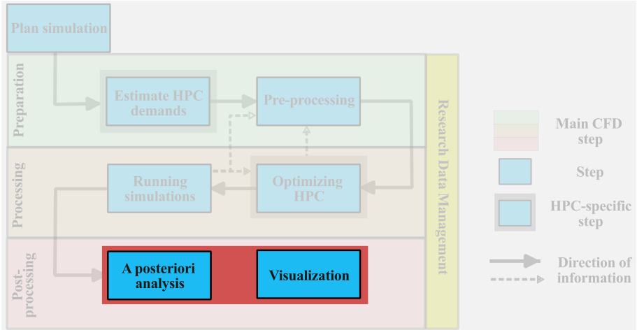
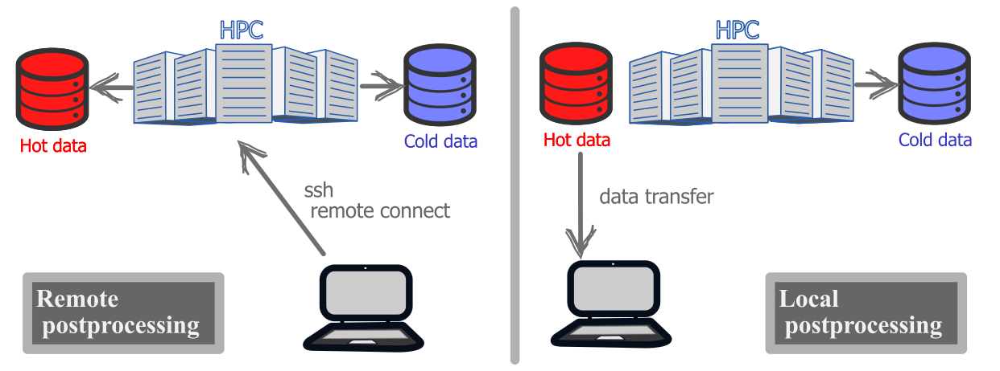
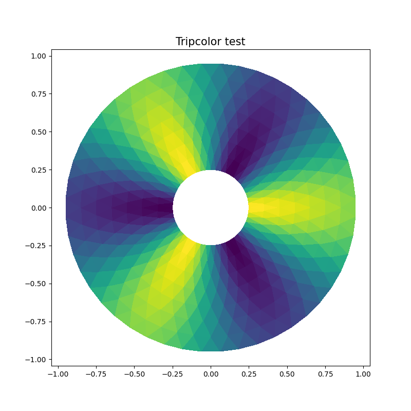
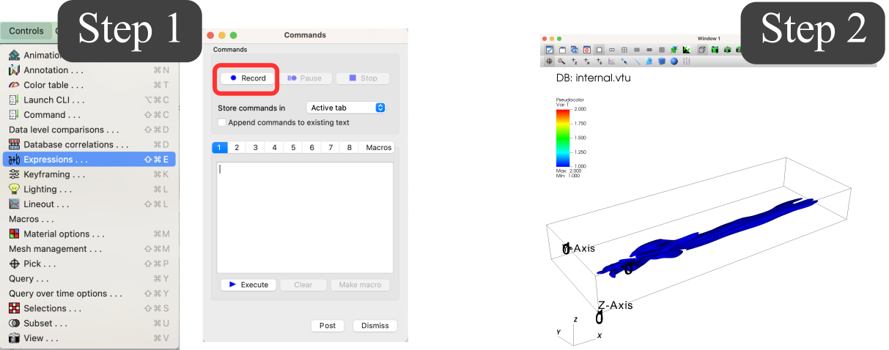
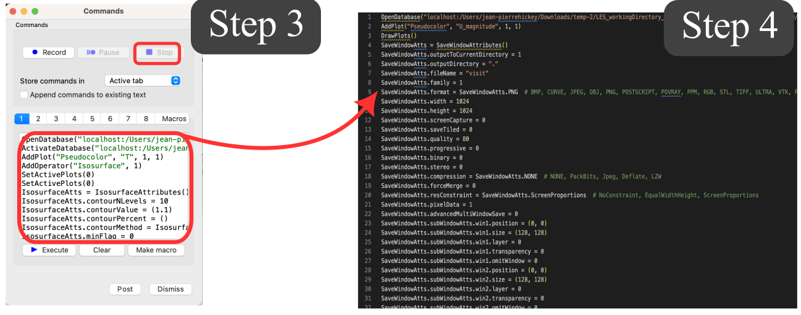
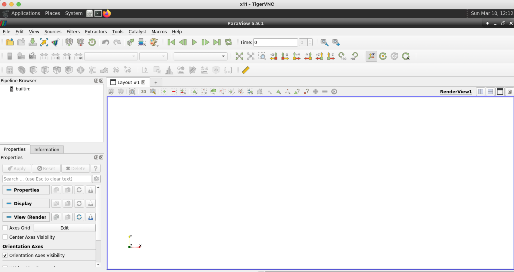
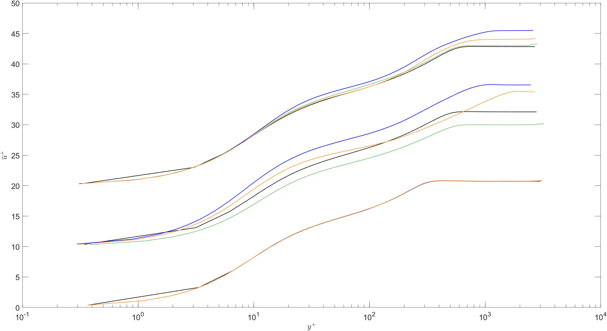

import Box from '../../../components/Box.astro';
import Caption from '../../../components/Caption.astro';
import Option from '../../../components/Option.astro';
import CustomAside from '../../../components/CustomAside.astro';
import { CardGrid } from '@astrojs/starlight/components';
import { Tabs, TabItem } from '@astrojs/starlight/components';
import CodeFetch from '../../../components/CodeFetch.astro';
import MultipleChoice from '../../../components/MultipleChoice.astro';


:::note[Learning Objectives]
By the end of this section, you should be able to:
1. Organize and plan result files on the cluster.
2. Visualize large-scale CFD data using various methods.
3. Organize and plan the postprocessing workflow.
:::
<CustomAside icon="pen" title="Time to complete: 45 min" colour="green"></CustomAside>

After completing [section 2.6](https://arc4cfd.github.io/section2/part6/), our large-scale CFD simulation is now running on the HPC system and we have presented strategies to conduct run-time checks of the simulations. At this point, we will dive into the a posteriori analysis and visualization of the results. Before that, however, we need to consider the organization of the data ...




## Organization of result files
The simulation is now complete and we can start the postprocessing phase. At this stage, we want to distinguish between two main categories of research data:
- **Hot data**: Is research data that will be used in the postprocessing phase (visualization and analysis) and requires frequent and near-instantaneous access. Hot data can be either result files, statistical output files, or any other files that will be used for postprocessing. 
- **Cold data**: Is research data that does not require frequent access but needs to be saved during the postprocessing phase. Examples of cold data include log files, restart files, and any other outputs that preserved during the postprocessing.

Distinguishing between these two types of data, helps to determine where to temporarily store the data during the postprocessing phase. We distinguish between two types of postprocessing workflows:
- **remote postprocessing**: all the relevant data remains on the remote host for all stages of postprocessing. This can be the preferred approach if there is too much data or the local workstation is insufficient.
- **local postprocessing**: the relevant hot data is copied to a local workstation for local postprocessing.  If the files are not too large and local system has sufficient storage and memory, local postprocessing can be very effective, especially for visualization.



<Caption>Remote and local postprocessing.</Caption>

Irrespective of the selected postprocessing workflow, some of the data will remain on the remote HPC system. As the run directory on `/scratch` is not meant for data storage and the data is purged after a fixed amount of time (see [scratch purging policy](https://docs.alliancecan.ca/wiki/Scratch_purging_policy)), an assessment must be made if the  `/scratch` filesystem is adequate for the temporary postprocessing phase.  The *longer term* filesystem in `/project` filesystem may be preferred Although, the `/project` space will probably have sizeable storage capacity, it will always have a limit, especially in the total number of files that can be stored. 


<CustomAside icon="star" title="Keep in mind" colour="green">
1. `/project` is a **group** directory, meaning that whatever you do inside it could affect and potentially harm the workflow of other researchers in the same group.
2. Always **merge** parallel output files before moving them to `/project`. This is a crucial step as we saw how a very simple simulation like the BFS on 64 processors generated close to 100 thousand files. 
</CustomAside>

### Transferring data
So far we have seen 2 common ways to move files between two locations in the HPC system: the `cp` command, and the `sftp` protocol. We will show below three more **secure** and **much faster** ways of transferring LARGE quantities of data. Further information can be found on the [Alliance Wiki site](https://docs.alliancecan.ca/wiki/Transferring_data).

:::caution[Data transfer nodes]
When moving large amount of data, the user should use the dedicated data transfer nodes, also called [**data mover nodes**](https://docs.alliancecan.ca/wiki/Transferring_data). Just like login nodes, these are dedicated nodes for the sole purpose of data transfer. If available, you will find the URL on the documentation of each respective HPC system. For instance, Graham has dedicated **data transfer nodes** under the URL `gra-dtn1.alliancecan.ca`. To login into the data transfer nodes simply type:
```bash
[user@gra-login1] ssh user@gra-dtn1.alliancecan.ca
```
:::

#### The Secure Copy Protocol (SCP)
The secure copy protocol or simply `scp` is a command-line tool to **securely** transfer data. The **very important** feature of `scp` is that all files and passwords that are being transferred are encrypted, so that any third-party user analyzing the traffic of data, cannot retrieve any sensitive information. `scp` is therefore highly recommended when dealing with sensitive or proprietary data. The basic syntax for `scp` is:
```bash
[user@gra-login1] scp [options] user@source_host:/path-to-files user@dest_host:/path-to-dir
```
where:
- **[options]**: the user might specify options for `scp`. Commonly used options are:
    1. `-P`: specifies the **port** to connect on the remote host.
    2. `-p`: preserves **modification times, access times, and modes** from original files.
    3. `-r`: recursively copy entire directories.

- **user@source_host:/path-to-files**: this is the path of the local or remote file(s) we are about to transfer. 
- **user@dest_host:/path-to-dir**: this it the path to the final destination of the files(s) we are about to transfer.


#### Remote sync 
The remote sync or simply `rsync` is a command-line, remote and local file synchronization tool. `rsync` is very fast and the most important feature is that it uses an algorithm that minimizes the amount of data **copied** by only moving the portion of files that are different between the **source** directory and the **destination** directory. Therefore, `rsync` is extremely useful for a periodic backup of data on the HPC system. The basic syntax for `rsync` is:
```bash
[user@gra-login1] rsync [options] user@source_host:/path-to-files user@dest_host:/path-to-dir
```
where the structure and syntax of the command is very similar to `scp`. To see what options are available for `rsync` click [here](https://linux.die.net/man/1/rsync).

The largest advantage of `rsync` with respect to `scp` is that if the copying is interrupted (due to network issue, for example), `rsync` will continue the data transfer without recopying all the previously transferred data.

##### Globus transfer
The easiest and most reliable way of transferring large dataset between any two locations is a **Globus transfer**.

[Globus](https://docs.alliancecan.ca/wiki/Globus) is a service for fast, reliable, secure transfer of files. Designed specifically for researchers, Globus has an easy-to-use interface with background monitoring features that automate the management of file transfers between any two resources, whether they are at on Alliance cluster, another supercomputing facility, a campus cluster, lab server, desktop or laptop.

Globus leverages GridFTP for its transfer protocol but shields the end user from complex and time-consuming tasks related to GridFTP and other aspects of data movement. It improves transfer performance over GridFTP, rsync, scp, and sftp, by automatically tuning transfer settings, restarting interrupted transfers, and checking file integrity.

Accessing the Globus portal can be done via a standard web-browser at https://www.globus.org using your Digital Alliance credentials (same `username` and `password` used to connect to the remote cluster) the Globus welcome page will look something like this:


<Caption>Globus welcome page.</Caption>

Globus has a very user-friendly interface, and the user can split the page to have **source files** on the left, and **destination directory** on the right. At this point the only step left is to find the Globus **end-point** for the specific cluster. Since we are working on Graham, its Globus end point is `computecanada#graham-globus`. If you are working with a different Compute Ontario HPC system, please visit the respective documentation page ([Graham](https://docs.alliancecan.ca/wiki/Graham), [Niagara](https://docs.alliancecan.ca/wiki/Niagara), [Narval](https://docs.alliancecan.ca/wiki/Narval), [Beluga](https://docs.alliancecan.ca/wiki/B%C3%A9luga), and [Cedar](https://docs.alliancecan.ca/wiki/Cedar)).

By pasting the **Globus endpoint** on the top-left search bar the user will be taken to a visual of the `home` directory, and can directly navigate to the directory containing all the files that must be moved. Assuming that files must be transferred on the same cluster, the user follow the same process on the right side navigating in the directory where data must be transferred to. To start the transfer simply push the button `start` on the top left side. This will initiate the transfer from left to right of the selected directories. The user can also monitor the activity by navigating under the `activity` tab of the left-bar options. When the transfer is completed, the user will receive a confirmation email. 


<Box iconName="quiz">
  <font size="+3">**QUIZ**</font>

You are on your **local** workstation and you want to transfer result files (in Results/) on Niagara to your local directory using scp?
<MultipleChoice>
    <Option>
scp -r ~/Downloads user@niagara.alliancecan.ca:/scratch/m/myuser/Results  
    </Option>
    <Option>
scp user@niagara.alliancecan.ca:/scratch/m/myuser/Results  ~/Downloads
    </Option>
    <Option isCorrect>
    scp -r user@niagara.alliancecan.ca:/scratch/m/myuser/Results ~/Downloads
    </Option>
     <Option>
    scp -P ~/Downloads user@niagara.alliancecan.ca:/scratch/m/myuser/Results 
    </Option>
</MultipleChoice>

TO DO Now assume that you are on a login node of an HPC system and you wish to use rsync to transfer a small file (log.txt) to the your project directory.
<MultipleChoice>
    <Option>
scp -r ~/Downloads user@niagara.alliancecan.ca:/scratch/m/myuser/Results  
    </Option>
    </MultipleChoice>
</Box>

## Visualization of the data
At last we come to the fun part of ARC4CFD which is: data visualization. If you are a first-time HPC user, you probably have done most of your visualization on your local machine (desktop or laptop) using your preferred tool. The first thing you'd probably want to do is **download** your freshly computed data on your local machine and embark in a nice visualization session (local postprocessing). However, you will quickly realize that the data you generated can be quite massive. A time-dependent, large-scale, 3D, CFD simulation will generate thousands of snapshots that can be anywhere from 2-3GB to tens of GB. The size of a complete simulation will therefore be in the order of several TB. Downloading this much data in your local machine, even assuming you have the space for it, is probably not the best use of your computational resources. Furthermore,  most standard workstations will not have more than 32GB of RAM (most commonly 8-16GB) and you will probably reach a memory limit when trying to open and analyze the data on your local system.

:::caution[Problems with local postprocessing]
1. Dataset is **WAY TOO LARGE** to be downloaded locally.
2. Download takes **TOO LONG** (e.g. 1 Tb will take over 24 hours assuming a download rate of 100 mbps!)
3. Individual snapshots **WILL NOT** cannot be loaded to the computer's memory.
4. Rendering and analyzing the dataset will be **TOO SLOW** on your computer.
:::

As mentioned above, **remote postprocessing** will allow you to leave the datasets on the HPC system and analyze the data remotely. Keep in mind that:
1. Modern HPC systems have **WAY MORE** memory than your local machine.
2. The **dataset can be analyzed in parallel** by spreading the memory across multiple processors (just like we ran the simulation in parallel).
3. The **rendering will be mush faster** with the added benefit of using GPUs on the cluster.


In this section the goal is to present a wide variety of opportunities offered by the HPC system in terms of visualization. This is not, BY ANY MEANS, a comprehensive list, and the students are also given external resources to learn more. Here we will present three common types of CFD visualization on the remote HPC system:
1. **Batch visualization**
2. **Interactive remote desktop visualization**
3. **Interactive client-server visualization**

### Batch visualization
This is probably the easiest and most effective way of visualizing your data on the cluster. Batch visualization has no Graphical User Interface (GUI), therefore you must:  1) write your visualization script in the desired scripting format, and then 2) use the command line to run the script interactively or as a SLURM job (recommended for heavy rendering jobs). There are many advantages to batch visualization:
1. Very easy to automate tasks;
2. Well organized and documented workflow, which improves reproducibility;
3. Some elements of the visualization can be parallelized;
4. Allows visualization without any GUI elements (faster with no lag).

There are multiple approaches to batch visualization. Here, we distinguish between two main categories, namely: 
- Line and contour plots (1D or 2D plots) 
- General three-dimensional plotting (3D plots)
Both categories are briefly discussed.


#### Line and contour plots
Line (1D) and contour (2D) plots are often used to visualize CFD results. These can be, for example, a boundary layer velocity profile or mean velocity plot, or  a time-dependent statistic at a given spatial location in the flow. The most common postprocessing tools for this type of CFD visualization are:
- Python (e.g. matplotlib), Matlab or equivalent
- Gnuplot
In the present section, we will focus on line or contour plot visualization using the **Python libraries** (e.g. [Matplotlib](https://matplotlib.org/stable/)); Gnuplot was briefly presented in the [last class](https://arc4cfd.github.io/section2/part6/).

First thing, if you plan on visualizing any plots on the remote HPC system, we must activate X11 Forwarding, which enables users to run graphical applications on a remote server. This can be setup in the connection options in MobaXterm (or Putty) or, if you are using a terminal, you can activate X11 with the `-X` flag when setting up the connection:

```bash
user@laptop:~$ ssh -X <username>@graham.computecanada.ca
```

To use Python as a batch visualization tool must now load Python and either load the [Matplotlib](https://matplotlib.org) modules ([module load scipy-stack](https://docs.alliancecan.ca/wiki/Python)) or setup a virtual environment to use Matplotlib. The latter option is shown here. Upon logging into Graham or any other HPC system type:


```bash title='Create virtual environment'
[user@gra-login1] module load python/3.10.13 mpi4py
[user@gra-login1] virtualenv --no-download ~/myVirtEnv    # install python pckgs into your ~/myVirtEnv
[user@gra-login1] source ~/myVirtEnv/bin/activate
(myVirtEnv) [user@gra-login1] pip install --no-index --upgrade pip
(myVirtEnv) [user@gra-login1] pip install --no-index matplotlib numpy plotly h5py
(myVirtEnv) [user@gra-login1] pip install yt
(myVirtEnv) [user@gra-login1] python <my-post-pro-routine.py> # which runs your postprocessing script
```
Once you are in the `myVirtEnv` you have access the the python environment that can access all these libraries: `matplotlib`, `numpy`, `plotly`, and `h5py` (and any others you want to install). The environment can be  deactivated and then reactivated by typing:

```bash 
(myVirtEnv) [user@gra-login1] deactivate 
[user@gra-login1]
[user@gra-login1] source ~/myVirtEnv/bin/activate
(myVirtEnv) [user@gra-login1] 
```

Let's take one of the many [examples](https://matplotlib.org/stable/gallery/index.html) available on the Matplotlib web page, and let's use it to generate a PNG figure on the cluster. 

<CodeFetch rawURL='https://raw.githubusercontent.com/ARC4CFD/arc4cfd/master/Section2/tri_colour.py' lang='python' meta="title='tri_colour.py' {5} {30-34}" />

Where the only modifications we have made are the highlighted lines in the code to (i) allow PNG backend, and (ii) generate and save the figure as PNG file. 


        <Caption>Output of the tri-colour.py script.</Caption>

In order to access CFD results (more specifically in VTK format), you can use additional libraries such as [PyVista](https://tutorial.pyvista.org/index.html). This wrapper library reads the output VTK format (in SU2, VTK-formatted files are output natively, in openFoam then can be converted using `foamToVTK`).


#### General three-dimensional plotting
Python and gnuplot are good options for remote line or contour plots generation. For batch visualization of more general three-dimensional visualization, we can rely on CFD specific toolkits. Many general purpose visualization tools provide scripting interfaces. Two of the most common large-scale, open-source visualization tools used in CFD are:
- [ParaView](https://www.paraview.org/), 
- [VisIt](https://visit-dav.github.io/visit-website/)

Both these visualization software can read CFD result files and be script for batch visualization on the remote cluster. Increasingly, for impressive visualization of three-dimensional flows, [Blender](https://www.blender.org/) can also be used in a batch mode.


<CustomAside icon="rocket" title="Scripting for three-dimensional batch mode plotting" colour="green">
The generic scripting format is specific to each visualization software. Here is a quick tip to generate a batch visualization script that can be used on a remote system. For this example, we will use the VisIt software, more details can be found [here](
http://visitusers.org/index.php?title=VisIt-tutorial-Python-scripting).

1. On your local computer (or remote HPC system, see next subsection), open  VisIt, go to the Command window, and record:


2. Open the CFD results, setup as desired, and select the desired output. If the results are too large to be open locally, you can open a smaller file (e.g. used for grid convergence) and modify the path of file a posteriori.


3. Stop the recording in the command window.


4. Copy the script to the remote HPC system into a myVizScript.py file and adjust parameters accordingly (e.g. path to the results). If the version of VisIt differs between your local and remote system, you may need to adjust the inputs accordingly. 


5. Run the script on the remote system in batch mode by typing (remember to load VisIt on the HPC system):
```
visit -nowin -cli -s myVizScript.py
```
</CustomAside>


### Interactive remote desktop visualization
Sometimes it's necessary to work with a GUI, whether we are doing data analysis using Matlab or some heavy rendering using Paraview. The first option that HPC systems allow to remotely visualize data on the cluster is the use of a **Virtual Network Computing** connection. In very simple terms VNC is a cross-platform screen sharing system that was developed to remotely control another computer.

:::caution[Required step]
The students will need to install a **VNC client** on the local machine to connect to the VNC remote server. The Digital Research Alliance recommend the use of [TigerVNC](https://tigervnc.org/) as it's a widely use VNC client, and it's available on Windows, MacOS, and most Linux distributions. For detailed steps on how to install TigerVNC on your local machine, click [**HERE**](https://docs.alliancecan.ca/wiki/VNC).
:::

As you might have guessed, since this is a client/server connection, now that we have set up the **client** on our local machine, we need the VNC server to connect to. Here there are 2 options based on the HPC system you are connected to:
1. **Graham**: Graham has dedicated **VDI nodes** collectively known as gra-vdi. These nodes provide a full graphical desktop, accelerated OpenGL, and shared access to Graham's `/home`, `/project`, and `/scratch` file systems.
2. **Other HPC systems**: the user must initiate a temporary VNC server. This can be done on both **login** or **compute nodes**. The process is quite involved in terms of steps to follow. More detailed information can be found [here](https://docs.alliancecan.ca/wiki/VNC).

Upon starting a VNC desktop on your local machine (e.g. using TigerVNC) a small window pops up asking for the VNC server address. The user can paste `gra-vdi.computecanada.ca:5900` and click on `Connect`. You will be prompted on a login screen where you need to input your Alliance credentials (same credentials used to connect via SSH or SFTP). Notice that on the top-left of the screen you read `gra-vdi3`, meaning that we are now connected to one of the VDI nodes on Graham. Upon connecting, the remote session will start ...


        <Caption>Welcome page when connecting to the VDI nodes in Graham.</Caption>

To open Matlab or Paraview, the user can open a terminal window in the VNC remote session and type:
<Tabs group="tab-group">
    <TabItem label="Paraview">
        ```bash
        [user@gra-vdi3]~: module load SnEnv
        [user@gra-vdi3]~: module load paraview/5.9.1
        [user@gra-vdi3]~: paraview
        ```
    </TabItem>
    <TabItem label="Matlab">
        ```bash
        [user@gra-vdi3]~: module load CcEnv 
        [user@gra-vdi3]~: module load StdEnv/2018 
        [user@gra-vdi3]~: module load matlab
        [user@gra-vdi3]~: matlab
        ```
    </TabItem>
</Tabs>

After which the preferred software will pop up on the screen, and the user can start the visualization session as usually done on the local machine.

        <Caption>Paraview opened on screen using remote VNC on Graham.</Caption>

:::danger[Caution]
If you want to perform computational tasks within a GUI, please do so on a cluster compute node using the `salloc` command as described in the Compute Nodes section [**HERE**](https://docs.alliancecan.ca/wiki/VNC). This will ensure the memory and CPU resources on gra-vdi are fully available for interactive graphical visualization purposes by other users when needed.
:::

When using interactive **remote-desktop** visualization, both the datasets and the rendering ARE ON the cluster. You will probably have solved memory issues since the VDI nodes have a much larger memory compared to your local machine, however you might experience some lag during rendering as the **screenshots** from the VNC Server are transmitted across the network to the VNC Viewer. 

This small issue can be solved by ...

### Interactive client-server visualization
In the client-server visualization method, all the graphical tools are running locally (on your laptop or desktop) while the dataset is on the remote machine. In other words, taking the Paraview example: the Paraview client will run on the local machine while the Paraview server will run on the cluster.

<CustomAside icon="star" title="Important notes" colour="green">
1. An important setting in ParaView's settings is `Edit` -> `Render View` -> `Remote/Parallel Rendering Options` -> `Remote Render Threshold`. If you set it to default (20MB) or similar, small rendering will be done on your computer's GPU, the rotation with a mouse will be fast, but anything modestly intensive (under 20MB) will be shipped to your computer and (depending on your connection) visualization might be slow. If you set it to 0MB, all rendering will be remote including rotation, so you will really be using the cluster resources for everything, which is good for large data processing but not so good for interactivity. **Experiment with the threshold to find a suitable value**.
2. **ParaView requires the same major version on the local client and the remote host**; this prevents incompatibility that typically shows as a failed handshake when establishing the client-server connection. For example, to use ParaView server version 5.10.0 on the cluster, you need client version 5.10.x on your local computer.
</CustomAside>

On Graham, Cedar, Beluga, and Narval you can do client-server rendering on both CPUs (in software) and GPUs (hardware acceleration). As suggested by the system administrators, it is always a good idea to start with CPU-only visualization asking as many cores as necessary.


<CustomAside icon="rocket" title="How many cores should we ask for?" colour="green">
An easy way to estimate the number of cores required for rendering is to look at the size of the dataset loaded into memory at once (e.g. one snapshot), and divide it by $\approx$ 3.5 GB/core. 
</CustomAside>

In our coarse BFS simulation we ran in the previous section, we can get the size of each snapshot by running the command `du -sh timestep/` and you will get that it's about 30MB. Therefore allocating 3GB per cpu, for this case, is more than enough to allow a good rendering performance. In case the Paraview process crashes, we just have to increase the allocated memory.

The client-server connection is established following 6 easy steps (as outlined [here](https://docs.alliancecan.ca/wiki/ParaView)):

1. **Start an interactive job** in the cluster where the data are stored:
    ```bash
    [user@gra-login1] salloc --time=1:00:0 --ntasks=1 --mem-per-cpu=3g --account=def-piname
    ```
2. **Load the offscreen paraview** module and start the server:
    ```bash
    [user@gra796] module load StdEnv/2020 gcc/9.3.0 paraview-offscreen/5.11.0
    ```
    **IMPORTANT**: remember to load the same Paraview version you have installed locally.

3. **Start the server**:
    ```bash
    [user@gra796] pvserver --force-offscreen-rendering
    Waiting for client...
    Connection URL: cs://gra796:11111
    Accepting connection(s): gra796:11111
    ```
    Take notes of the address `gra796` and port number `11111`.

4. **Link the port 11111 on your computer** and the same port on the compute node (make sure to use the correct compute node). Open another terminal window on your local machine and type:
    ```bash
    [user@laptop] ssh user@graham.computecanada.ca -L 11111:gra796:11111
    ```
5. **Open Paraview and connect**: open Paraview on your local machine and navigate to `File` > `connect` > `Add server`. You will need to point ParaView to your local port 11111, so you can do something like `name = Graham`, `server type = Client/Server`, `host = localhost`, `port = 11111`; click Configure, select Manual and click Save. Once the remote is added to the configuration, simply select the server from the list and click on `Connect`. At this point the Graham terminal window will read:
    ```bash
    [user@gra796]~: pvserver --force-offscreen-rendering
    Waiting for client...
    Connection URL: cs://gra796:11111
    Accepting connection(s): gra796:11111
    Client connected.
    ```
6. **Open the desired file**: click on `File` > `Open`, and you will see that the Graham filesystem is now visible from the **local** Paraview client.


## Organize you postprocessing workflow 
You might find yourself in a scenario where you have just generated terabytes of data but you are **struggling** to understand what to do with it, or maybe that you are not taking the most out of your CFD data. To help you organize your postprocessing workflow, we suggest answering a few important questions. 


1. **What are my objectives and relevant metrics of interest?**
The first and most important step towards an organized postprocessing workflow is a clear understanding of what one is trying to achieve, and what are the relevant variables and metrics we can use to measure and compare. A clear answer to these questions will help you narrow down the focus of your postprocessing, and most importantly, will help you select the appropriate tools and methods to continue. A good selection of relevant variables and metrics comes from a deep understanding of the physics of the problem and a thorough literature review on the matter. 

<Box iconName="quiz">
  <font size="+3">**QUIZ**</font>

Take the BFS example we are using throughout this course.
1. How does the physics of the problem affect the postprocessing? 
2. What are, in your opinion, the important variables and metrics to analyze? 
<details>
    <summary>Solution</summary>

     1. We notice that the problem has one homogeneous direction. The flow in fact develops only in the streamwise $x$ and wall-normal $y$ directions. What this tells us is that flow **statistics** are invariant under a shift in position in $z$, and the flow is therefore said to be statistically two-dimensional. **We will see why this is important**.

     2. Some important metrics in this problem are: instantaneous spanwise vorticity $\omega_z$, mean streamwise velocity profile $U$, skin-friction coefficient $C_f$, and step-wall pressure coefficient $C_p$. 

</details>
</Box>


2. **What postprocessing methods/techniques do I need?**
Once the flow characteristics and relevant metrics of interest have been clearly identified, we can select the required postprocessing techniques or methods to accomplish our desired goal. If the interest is to visualize instantaneous flow fields one can directly load one flow realization (i.e. a single time step or snapshot) into the preferred postprocessing tool to perform relevant analysis.

:::caution[Beware of file size]
Depending on the size of the mesh, instantaneous files can range from hundreds of MB to several GB. Loading the entire file is probably not the most efficient of the approaches. One can for instance load only a portion of the file containing the interested region to visualize, or only visualize a fraction of the points (i.e. every other point).
:::

If the physics of the problem allow, one can consider averaging the results. Several types of averaging operators can be defined:
    * **Spatial averaging**: usually performed on the homogeneous flow directions, and defined as:

    $$
    f\left(x,y,t\right)=\frac{1}{N_z}\int_{0}^{L_z}f\left(x,y,z,t\right)dz
    $$ 
    where $N_z$ is the number of points in the homogeneous direction, and assuming that $z$ is the homogeneous direction. The process can be repeated in any other homogeneous direction.

    * **Long-time averaging**: if the problem is steady in the mean, after **some time** that can be estimated (as mentioned in the previous section) the flow statistics will be invariant to a shift in time, and the flow is said to be statistically stationary. We can therefore average our results over a time $T$ much larger than the integral time scale of the flow, and define the time averaging operator as:

    $$
    \overline{f}\left(x,y\right)=\lim_{T\rightarrow\infty}\frac{1}{T}\int_{0}^{T}f\left(x,y,t\right)dt
    $$

    * **Phase-averaging**: our problem might be unsteady but dominated by an external time scale. For instance if we are analyzing a swimming animal, the tail-beat frequency is the external timescale. In the flow over a wind turbine the period of one full rotation is the external frequency. When the problem is dominated by an external time scale, it makes more sense to average our results at specific **phases** in the oscillation period. In the wind turbine case, for instance, one can average results every $\tau=45^\circ$. We can therefore define a phase-averaging operator as:

    $$
    \left\langle f\left(x,y,t\right)\right\rangle=\lim_{N\rightarrow\infty}\frac{1}{N}\sum_{n=0}^{N}f\left(x,y,t+n\tau\right)
    $$

When performing long-time or phase-average on a dataset, is important to store data for a number of cycles (or flow realizations) large enough to reach sample convergence on the flow statistics. To check if sample convergence has been reached, once can averaged the data over the entire collected sample $N$ (or $T$), and compare it with the averaged results of only half the sample $N/2$ (or $T/2$). If the statistics look the same within a 5% error, **sample convergence has been reached**.


<Box iconName="quiz">
  <font size="+3">**QUIZ**</font>

Take the BFS example we are using throughout this course. 
1. **What are the relevant postprocessing methods we can use**? 
1. **What will be the final dimensions of the resulting statistics**? 
<details>
    <summary>Solution</summary>

     1. **Spatial-averaging** on the spanwise direction $z$, and **Long-time averaging** over all the collected time steps.  

     2. The final statistics will only be a function of $f\left(x,y\right)$.

</details>
</Box>

3. **Is the message I am trying to communicate clear from the generated output?**
The output of our postprocessing will probably be several figures or animations to be included in scientific reports or publications.

{/*
:::danger[Keep in mind]
A common mistake we might run into is to be **over confident** with what we are showing. After all, these are OUR data, and we know **exactly** how they were generated, and what the figures are showing. **HOWEVER**, the output of our work has to be understandable to a general audience, not only to those who have studied your same physical problem.
:::
*/}

With this in mind, we need to generate figures that are:
    * **Very clear and legible** (to everyone)
    * **Easy to understand** (within few seconds)

Keep in mind that 1 in 12 individuals in the world are affected by color blindness. 


Below, using data of a turbulent boundary layer over a flat plate from [Ambrogi et al. 2022](https://www.cambridge.org/core/journals/journal-of-fluid-mechanics/article/characterization-of-unsteady-separation-in-a-turbulent-boundary-layer-mean-and-phaseaveraged-flow/25802765C211036318F556F5DF29F46E) we make an example of a badly formatted figure, and a properly formatted one.




        <Caption>Example of a badly formatted figure (top), and a properly formatted on (bottom).</Caption>


<CustomAside icon="star" title="Features of a GOOD figure" colour="green">
1. Labels and axis ticks are legible from a reasonable distance.
2. Lines (representing different simulations) use **different styles** and **different colors**. Very good for people affected by color vision deficiency.
3. Lines (representing reference data) use **symbols** in contrast to lines representing simulation results.
4. The legend helps the overall understanding of the figure.
</CustomAside>


:::note[Reflections and Takeaways]
Having finished this lecture, you should now be able to answer the following important questions:
1. How do I organize my results on the cluster?
2. How do I visualize my large-scale CFD data?
3. How do I plan my postprocessing workflow?
:::