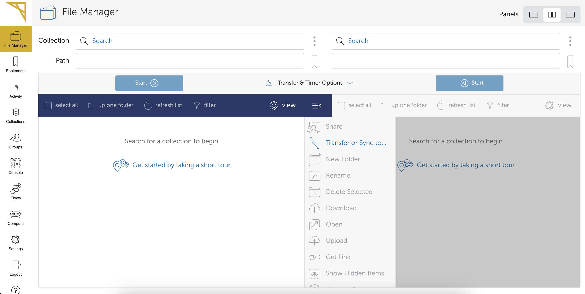

import Box from '../../../components/Box.astro';
import Caption from '../../../components/Caption.astro';
import Option from '../../../components/Option.astro';
import CustomAside from '../../../components/CustomAside.astro';
import { Tabs, TabItem } from '@astrojs/starlight/components';
import CodeFetch from '../../../components/CodeFetch.astro';
import MultipleChoice from '../../../components/MultipleChoice.astro';


:::note[Learning Objectives]
By the end of this section, you should be able to:
1. Organize and plan result files on the cluster
2. Perform common 'a posteriori' analysis technique in CFD
3. Visualize flow field using various methods
:::

## Postprocessing CFD simulations on HPC: Overview


After completing [section 2.6](https://arc4cfd.github.io/section2/part6/), our large-scale CFD simulation is now running on the HPC system, and printing results as specified by the user. We also learned how to monitor the simulation using simple line commands on terminal, and the very useful plotting tool [Gnuplot](http://www.gnuplot.info/). At this point **the fun part** begins as we can dive into the visualization of the results. Before THAT however, **be mindful and ...**


## Organize and plan result files on the cluster
Assuming that your simulation ran for **enough** time based on your estimate, the job is now **completed** and results can be moved in the **long term** storage where analysis can be performed on them without worrying about data getting purged by the system administrators. The **long term** storage unit, as mentioned in [section 2.6](http://localhost:4321/section2/part6), is the `/projects` directory connected to your supervisor's (or principal investigator) account. Although, the `/project` space will probably have hundreds of terabytes (TB) of storage capability, IT WILL ALWAYS have a limit, especially in the **total number** of files that can be stored. 

:::note[Keep in mind]
1. `/projects` is a **group** directory, meaning that whatever you do inside it **could affect** and **potentially harm** the workflow of other researchers in the same group.
2. **Always merge parallel output files before moving them** to `/project`. This is a crucial step as we saw how a very simple simulation like the BFS on 64 processors generated close to 100 thousands files. 
3. The name of the directory (`/projects`) is specific to Compute Ontario HPC systems, however, the concept of **long-term data storage** and the reccommended process we outlined apply to any HPC system.
:::

So far we have seen 2 common ways to move files between two locations in the HPC system: the `cp` command, and the `sftp` protocol. We will show below three more **secure** and **much faster** ways of transferring LARGE quantities of data.

:::caution[Data transfer nodes]
When moving large amount of data, the user **should use** the dedicated data transfer nodes, also called **data mover nodes**. Just like login nodes these are dedicated nodes for the sole purpose of data transfer. If available, you will find the URL on the documentation of each respective HPC system. For instanceof, Graham has dedicated **data transfer nodes** under the URL `gra-dtn1.alliancecan.ca`. To login into the data transfer nodes simply type:
```bash
[username@gra-login1 ~]$ ssh username@gra-dtn1.alliancecan.ca
```
:::

### The Secure Copy Protocol (SCP)
The secure copy protocol or simply `scp` is comman-line tool to **securely** transfer data. The **very important** feature of `scp` is that all files and passwords that are being transferred are encrypted, so that any third-party user analyzing the traffic of data, cannot retreive any sensitive information. `scp` is therefore highly recommended when dealing with sensitive or proprietary data. The basic syntax for `scp` is:
```bash
[username@gra-login1 ~/scratch/01_BFS_openFOAM]$ scp options user@source_host:/path-to-files user@dest_host:/path-to-dir
```
Where:
- **Options**: the user might specify options to change the behavior of `scp`. Commonly used options are:
    1. `-P`: specifies the **port** to connect on the remote host.
    2. `-p`: preserves **modification times, access times, and modes** from original files.
    3. `-r`: recursively copy entire directories.

- **user@source_host:/path-to-files**: this is the path of the local or remote file(s) we are about to transfer. 
- **user@dest_host:/path-to-dir**: this it the path to the final destination of the files(s) we are about to transfer.

### Remote sync 
The remote sync os simply `rsync` is a command-line, remore and local file synchronization tool. `rsync` is very fast and the most important feature is that it uses and algorithm that minimizes the amount of data **copied** by only moving the portion of files that are different between the **source** directory and the *destination** directory. Therefore, `rsync` is extremely useful for a periodic backup of data on the HPC system. The basic syntax for `rsync` is:
```bash
[username@gra-login1 ~/scratch/01_BFS_openFOAM]$ rsync options user@source_host:/path-to-files user@dest_host:/path-to-dir
```
Where the structure and syntax of the command is very similar to `scp`. To see what options are available for `rsync` click [here](https://linux.die.net/man/1/rsync).

### Globus transfer
The easiest, fastest, and most reliable way of transferring TB and even PB of data between any two locations is a **Globus transfer**.

[Globus](https://docs.alliancecan.ca/wiki/Globus) is a service for fast, reliable, secure transfer of files. Designed specifically for researchers, Globus has an easy-to-use interface with background monitoring features that automate the management of file transfers between any two resources, whether they are at on Alliance cluster, another supercomputing facility, a campus cluster, lab server, desktop or laptop.

Globus leverages GridFTP for its transfer protocol but shields the end user from complex and time-consuming tasks related to GridFTP and other aspects of data movement. It improves transfer performance over GridFTP, rsync, scp, and sftp, by automatically tuning transfer settings, restarting interrupted transfers, and checking file integrity.

Upon loggin in the Globus portal using your Compute Canada credentials (same `username` and `password` used to connect to the remote cluster) the Globus welcome page will look something like this:


<Caption>Globus welcome page.</Caption>

Globus has a very user-friendly interface, and the user can split the page to have **source files** on the left, and **destination directory** on the right. At this point the only step left is to find the Globus **end-point** for the specific cluster. Since we are working on Graham, it's globus end point is `computecanada#graham-globus`. If you are working with a different Compute Ontario HPC system, please visit the respective documentation page ([Graham](https://docs.alliancecan.ca/wiki/Graham), [Niagara](https://docs.alliancecan.ca/wiki/Niagara), [Narval](https://docs.alliancecan.ca/wiki/Narval), [Beluga](https://docs.alliancecan.ca/wiki/B%C3%A9luga), and [Cedar](https://docs.alliancecan.ca/wiki/Cedar)).

By pasting the **globus endpoint** on the top-left seach bar the user will be take to a visual of the `home` directory, and can directly manually navigate to the directory containing all the files that must be moved. Assuming that files must be transferred on the same cluster, the user follow the same process on the right side navigating in the directory where data must be transferred to. To start the transfer simply push the button `start` on the top left side. This will initiate the transfer left-right of the selected directories. The user can also monitor the activity by navigating under the `activity` tab of the left-bar options. When the transfer is completed, the user will receive a confirmation email. 

## Common 'a posteriori' analysis techniques in CFD (JPH: please focus on the HPC aspects, not the turbulence aspects)
Explain the most important type of 'a posteriori' analysis [TO DO]. 
1. Instantaneous flow.
2. Long time average
3. Phase average
4. First order statistics
5. Second order statistics

## Visualization
Explain common ways of visualizing the flow: [TO DO]
1. Download data on local machine.
3. Use VDI nodes for flow visualization.
2. [parallel/remote  visualization](https://docs.scinet.utoronto.ca/index.php/Visualization)

## Grid convergence and code validation 
Explain the importance of a grid sensitivity study and how to carry it out [TO DO]

## Data transfer
Considerations/ Globus etc