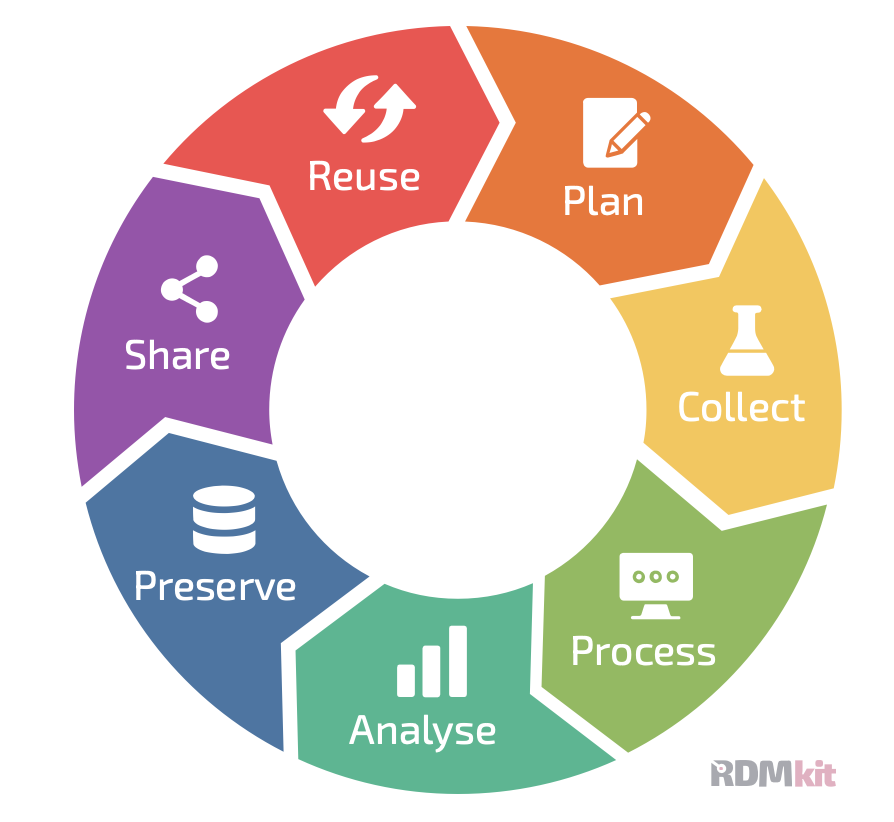

import Caption from '../../../components/Caption.astro';
import CustomAside from '../../../components/CustomAside.astro';

:::note[Learning Objectives]
By the end of this section, you should be able to:
1. Understand the terminology used in RDM
2. Determine the optimal mid- and long term data storage strategies
:::

Data are the output of any CFD simulation--in the context of HPC there are lots of data. The data have scientific, monetary and, strategic value, thus we need develop strategies to effectively utilize the data. This class introduces the concepts of Research Data Management (RDM) and applies these concepts to the field of Computational Fluid Dynamics. 

## Underlying principle of research data management
Research data management (RDM) is concerned with the management of the entire lifecycle of data used or generated as part of a research project. RDM seeks to develop best practices to organize, structure, share, store and care for the scientific data. RDM stem from the understanding that *'publicly funded research data are a public good'*   [(Ohmann et al., 2017)](https://bmjopen.bmj.com/content/7/12/e018647).  Therefore, RDM seeks to maximize the  value of research data for the greatest societal benefit. It should be noted that good data management is not a goal in itself  [(Wilkinson et al., 2016)](https://www.nature.com/articles/sdata201618) but a means to better value the research data.

<Caption>Visualization of the data lifecycle proposed for the  [Horizon Europe Program](https://rdmkit.elixir-europe.org/data_life_cycle). </Caption>

The field of RDM has emerged primarily from the need to manage sensitive (medical data) and/or expensive datasets (astrophysics) and driven by large-scale research endeavours. These scientific fields are characterized by large-scale, international collaboration between multiple institutions, thus an effective management of the data is critical to these efforts. RDM has also developed in parallel to the increasing push towards transparent and open science. Sound research data management principles enables open science. 

Within this context, the understanding of RDM principles is not as well developed within the CFD community. This is in part due to the nature of CFD workflows which is typically better suited for individual researchers or small research groups as opposed to large-research enterprise (such as in bio-informatics or astrophysics).  Yet, the use of high performance computing with modern CFD tools generates lots of expensive datasets that are not fully valorized without modern RDM practices.

## Why manage data?
There are a number of reasons to justify sound data management in CFD:

   -  Facilicate research and avoid duplication of efforts
   -  Store data for future internal use
   -  Share data for re-use and/or open-source data
   -  Better disseminate the results (increase citations and collaborations)
   -  Open science (best practice)
   -  Meet funders requirements
  
  For specific applications of CFD, for example in biomedical CFD, privacy considerations may also further justify RDM considerations.

## What is data in CFD?
Data underpin the scientific process.  We tend to associate 'data' with 'results', yet data in CFD should be understood as an umbrella  term that includes:

 -  preliminary calculations, and estimations
 -  mesh, and mesh configuration files
 -  input, setup, and configuration files 
 -  CFD codes, solvers, tools, and scripts
 -  raw CFD simulation data
 -  post-processed data
 -  visualization results and settings
 -  runtime data (statistics)
 -  meta data regarding the simulations 

## What is metadata?
Metadata is data about data. It represents highly-structured machine readable data. In CFD [todo example]

## Guiding principles for scientific data management: FAIR (and  TRUST)
The FAIR principles  were proposed by [Wilkinson et al. (2016)](https://www.nature.com/articles/sdata201618) with the goal of comming up with a set of guidelines for sound data management and stewartship. The FAIR accronym stands for: **F**indable, **A**ccessible, **I**nteroperable, and **R**eusable.  These principle were concrete properties ([source](https://www.nature.com/articles/sdata201618)  and [source](https://science.gc.ca/site/science/en/interagency-research-funding/policies-and-guidelines/research-data-management/tri-agency-research-data-management-policy-frequently-asked-questions)):

  -  **F**indable: The first step in (re)using data is to find them. Metadata and data should be easy to find for both humans and computers. Machine-readable metadata are essential for automatic discovery of data sets and services.
      * **F.1** (meta)data are assigned a globally unique and persistent identifier
      * **F.2** (meta)data are described with rich metadata
      * **F.3** metadata clearly and explicitly include the identifier of the data it describes
      * **F.4** (meta)data are registered or indexed in a searchable resource
  -  **A**ccessible: Once the user finds the required data, the user needs to know how they can be accessed, possibly including authentication and authorization.
      * **A.1** (meta)data are retrievable by their identifier using a standardized communications protocol
        - **A.1.1** the protocol is open, free, and universally implementable
        - **A.1.2** the protocol allows for an authentication and authorization procedure, where necessary
        * **A.2** (meta)data are accessible, even when the data are no longer available
  -  **I**nteroperable:  The data usually need to be integrated with other data. In addition, the data need to be interoperable and able to function with applications (including computer software and hardware) or workflows for analysis, storage and processing.
    * **I.1** (meta)data use a formal, accessible, shared, and broadly applicable language for knowledge representation
    * **I.2** (meta)data use vocabularies that follow FAIR principles
    * **I.3** (meta)data include qualified references to other (meta)data
  -  **R**eusable: The ultimate goal of FAIR is to optimize the reuse of data. To achieve this, metadata and data should be well-described so that they can be replicated and/or combined in different settings.
      * **R.1** (meta)data are richly described with a plurality of accurate and relevant attributes
            - **R.1.1**  (meta)data are released with a clear and accessible data usage license
            - **R.1.1**  (meta)data are associated with detailed provenance
            - **R.1.3**  (meta)data meet domain-relevant community standards

A similar set of guiding principles have been proposed for digital repositories by [Lin et al., (2020)](https://www.nature.com/articles/s41597-020-0486-7), although the considerations for databases for CFD are typically not as critical. The TRUST accronym stands for: **T**ransparency, **R**esponsibility, **U**ser Focus, **S**ustainability, and **T**echnology.

## Digital Repositories
Digital repositories represents one of the key elements of modern RDM concepts. Repositories are increasingly using the FAIR and TRUST principles. These databases can be used

#### General databases:
https://zenodo.org

https://borealisdata.ca'

Federated Research Data Repository (FRDR)
https://www.frdr-dfdr.ca/repo/

####  Curated databases for CFD data
The CFD community has 
JHTD [test](https://turbulence.pha.jhu.edu)
Turbase [test](https://turbase.cineca.it/init/routes/#/logging/welcome)

## Ressources
[test](https://scienceeurope.org/media/4brkxxe5/se_rdm_practical_guide_extended_final.pdf)

## Determining the principles of RDM in CFD

We should aim for a holistic data management (solver/tools/etc)

What are the challenges: infrastructure and tools, capacity/skills, ethical (less important for CFD), culture/incentive

### Learning from other fields 
AI
See this course: [test](https://thodrek.github.io/CS839_spring18/)
[test](https://fullstackdeeplearning.com/spring2021/lecture-8/)

"The resulting data ecosystem, therefore, appears to be moving away from centralization, is becoming more diverse, and less integrated, thereby exacerbating the discovery and re-usability problem for both human and computational stakeholders." ref wilkinson_fair_2016

Important discussion [test](https://towardsdatascience.com/data-entropy-more-data-more-problems-fa889a9dd0ec)

Workshop in TUM
[test](https://zenodo.org/records/7785532#.ZCw4h85ByUk)

[test](https://nfdi4ing.de)

[test](https://www.youtube.com/watch?v=3sDhQRIYUmA)
