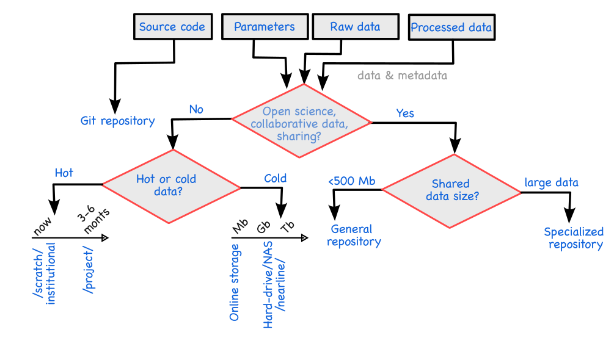

import Caption from '../../../components/Caption.astro';
import CustomAside from '../../../components/CustomAside.astro';
import Option from '../../../components/Option.astro';
import MultipleChoice from '../../../components/MultipleChoice.astro';
import Box from '../../../components/Box.astro';

:::note[Learning Objectives]
At the end of this class, you should be able to:
1. Define the main concepts relevant to RDM
2. State the guiding principles of FAIR and TRUST
3. Determine a systematic approach to data storage 
:::
<CustomAside icon="pen" title="Time to complete: 60 min" colour="green"></CustomAside>

Research data are the output of any CFD simulation and, in the context of CFD on HPC, there are lots of data. The data, often supported through public funds, have scientific, monetary, and strategic value; therefore, we need to develop strategies to effectively utilize the data. This class introduces you to the concepts of Research Data Management (RDM), the following class applies it to the field of Computational Fluid Dynamics, and then we develop data management plans for CFD. This section may be optional to some. [Additional questions related to the tri-agencies' RDM efforts can be found here.](https://science.gc.ca/site/science/en/interagency-research-funding/policies-and-guidelines/research-data-management/tri-agency-research-data-management-policy-frequently-asked-questions)

## Underlying principle of research data management
Research data management (RDM) is concerned with the management of the entire lifecycle of data used or generated as part of a research project. RDM seeks to develop best practices to organize, structure, share, store, and care for scientific data. RDM is based on the understanding that *'publicly funded research data are a public good'* [(Ohmann et al., 2017)](https://bmjopen.bmj.com/content/7/12/e018647).  Therefore, RDM seeks to maximize the  value of research data for the greatest societal benefit. It should be noted that good data management is not a goal in itself  [(Wilkinson et al., 2016)](https://www.nature.com/articles/sdata201618) but a mean to better value the research data.

RDM has emerged primarily from the need to manage sensitive (medical data) and/or expensive datasets (astrophysics) and has been driven by large-scale research endeavour. These scientific fields are characterized by large-scale, international collaboration between multiple institutions, thus an effective management and sharing of the data is critical to these sustained efforts. In parallel to the recent push towards RDM, there has been an increasing emphasis towards transparent, reproducible, and open science. Both these efforts are intrinsically linked, as sound research data management principles enables open science. 

Within this context, the understanding of RDM principles is not as well developed within the CFD community. This is in part due to the nature of CFD workflow which is typically better suited for individual researchers or small research groups as opposed to large-research enterprises (such as in bioinformatics or astrophysics).  Yet, the use of high performance computing with modern CFD tools generates lots of expensive datasets that are not fully valorized without modern RDM practices. Therefore, there is an increasing need to start adopting RDM principles in the CFD workflow. The following cartoon illustrates the necessary shift in our thinking about research data: research outcomes must be more than only publications/patents/results and **must include research data**. For this reason, we develop strategies to effectively manage our research data. 

<Caption>Illustration of data valorization with RDM. </Caption>

### What are research data? 
We consider research data in the broadest sense of the word; that is to say, it is **information that has been created, observed, generated or collected during a research effort that is necessary to validate the research findings**. This definition includes more than only final postprocessed results, in fact, preliminary calculations, input files, settings etc. could all be considered as research data in this context.

#### What are research data in CFD?
 We tend to associate 'data' with 'results', yet research data in CFD should be understood as an umbrella term that includes:

 -  Preliminary calculations, and estimations
 -  Mesh, and mesh configuration files
 -  Input, setup, and configuration files 
 -  CFD codes, solvers, tools, and scripts
 -  Raw CFD simulation data
 -  postprocessed data
 -  Visualization results and settings
 -  Runtime data (statistics)
 -  Meta data regarding the simulations 

### Why manage research data? 
There are a number of reasons to justify sound data management in CFD:

   -  Facilitate research and avoid duplication of efforts
   -  Encourages the creation of high-quality data
   -  Store data for future internal use (helps you remember what you did)
   -  Better disseminate the results (increase citations and collaborations)
   -  Avoid losing, deleting, forgetting about research data
   -  Facilitates the reproducibility of scientific results
   -  Open science (best practice)
   -  Meet funder requirements
  
  For specific applications of CFD, for example in biomedical CFD, privacy considerations or some licensed or proprietary data may also further complicate the RDM discussion.   These specific considerations fall outside the scope of the present course.  Similarly, dual-use data with potential national security implications also fall outside of the present scope ([more details can be found here]((https://science.gc.ca/site/science/en/interagency-research-funding/policies-and-guidelines/research-data-management/tri-agency-research-data-management-policy-frequently-asked-questions)))

### What are the challenges of RDM?
There are several challenges that impede a broader adoption of RDM principles:
 - culture/incentive
 - desire to maintain strategic advantage
 - infrastructure and tools
 - capacity/skills
 - ethical (less important for CFD) 

For the most part, in CFD, it is the first two bullet points that impede a faster adoption of these principles. To effectively incentivize sound data management, we need to foster a research culture that promotes the revalorization of research data.

> ---
> 
>*"(Sound RDM) Culture eats (data management) strategy for breakfast"*
>
>      -Peter Drucker (ARC-modified)
>
> ---

### Data lifecycle
The goal of RDM is to better valorize the data. To add value to the data, they must be organized, saved, and documented. Through these efforts, data can have multiple uses; thus, we can discuss the data lifecycle. Even if the data are not revalorized through future use, at minimum, the data should be saved for archival purposes.  The data have a lifecycle of its own, which can be illustrated by the figure below.

 
<Caption>Visualization of the data lifecycle proposed for the [Horizon Europe Program](https://rdmkit.elixir-europe.org/data_life_cycle). </Caption>

### Data documentation
There are two main types of documentation that is relevant to RDM implementation:
- Human-readable documentation
- Metadata

Both represent integral parts of data storage strategies and have two very different roles.

> ---
>
> *"(Human-readable) Documentation is a love letter that you write to your future self (, whereas metadata helps you find it). "*
>
>  -Damian Conway (RDM-extended)
>
> ---

#### Human-readable documentation
Human-readable documentation takes the form of a classical README file. Typically, this is unstructured information that explains the data or code to the user. It is usually saved in the most generic format (e.g. .txt) to avoid compatibility issues in accessing the file. Typically, the README is associated with the folder where it is located and can provide additional information such as installation procedures, interpretation of the data set, explanation of the variables, uncertainty, etc.

#### Metadata
When talking about research data management, we are discussing the management of complex and highly heterogeneous information and data. Metadata are data about data. It represents highly structured, machine-readable data that are an essential component to the effective management of your data. The amount, type, and complexity stored metadata are problem-specific and domain-specific. The standardized metadata organization is not the norm across many disciplines, although many communities have adopted metadata standard to facilitate exchanges between researchers. The metadata standards are compiled [here](http://rd-alliance.github.io/metadata-directory/standards/) and [here](
https://rdamsc.bath.ac.uk/subject-index) although few, if any, are directly relevant to CFD. A systematic curation of metadata helps to facilitate data retrieval (avoids wasted time) and helps interpret and explain the stored data. 

### Guiding principles for scientific data management: FAIR (and  TRUST)
The FAIR principles were proposed by [Wilkinson et al. (2016)](https://www.nature.com/articles/sdata201618) with the goal of developing a set of guidelines for sound data management and stewardship. The **FAIR** acronym stands for: **F**indable, **A**ccessible, **I**nteroperable, and **R**eusable.  These principles underpin many of the most important concepts in RDM ([source](https://www.nature.com/articles/sdata201618)):

  -  **F**indable: The first step in (re)using data is to find them. Metadata and data should be easy to find for both humans and computers. Machine-readable metadata are essential for the automatic discovery of data sets and services.
      * **F.1** (meta)data are assigned a globally unique and persistent identifier
      * **F.2** (meta)data are described with rich metadata
      * **F.3** metadata clearly and explicitly include the identifier of the data described
      * **F.4** (meta)data are registered or indexed in a searchable resource
  -  **A**ccessible: Once the user finds the required data, the user needs to know how they can be accessed, possibly including authentication and authorization.
      * **A.1** (meta)data are retrievable by their identifier using a standardized communication protocol
        - **A.1.1** the protocol is open, free, and universally implementable
        - **A.1.2** the protocol allows for an authentication and authorization procedure, where necessary
      * **A.2** (meta)data are accessible, even when the data are no longer available
  -  **I**nteroperable:  The data usually need to be integrated with other data. In addition, the data need to be interoperable and able to function with applications (including computer software and hardware) or workflows for analysis, storage, and processing.
      * **I.1** (meta)data use a formal, accessible, shared, and broadly applicable language for knowledge representation
      * **I.2** (meta)data use vocabularies that follow the FAIR principles
      * **I.3** (meta)data include qualified references to other (meta)data
  -  **R**eusable: The ultimate goal of FAIR is to optimize the reuse of data. To achieve this, metadata and data should be well described so that they can be replicated and/or combined in different settings.
      * **R.1** (meta)data are richly described with a plurality of accurate and relevant attributes
            - **R.1.1**  (meta)data are released with a clear and accessible data usage license
            - **R.1.1**  (meta)data are associated with detailed provenance
            - **R.1.3**  (meta)data meet domain-relevant community standards

A similar set of guiding principles have been proposed for digital repositories by [Lin et al., (2020)](https://www.nature.com/articles/s41597-020-0486-7), although the considerations for databases for CFD are typically not as critical. The **TRUST** acronym stands for: **T**ransparency, **R**esponsibility, **U**ser Focus, **S**ustainability, and **T**echnology. We seek to align the RDM efforts with the FAIR and TRUST principles. These principles will be applied to the CFD workflow in the next class.

## Data storage and repository
The storage of large, organized datasets is necessary for both archival and sharing purposes. Given the wide range in type and size of data, there are multiple considerations when selecting data storage technology. In this section, we first list some of the modern data storage technologies and explore strategies for further research.

### Strategies for storing data: 3-2-1 backup strategy
The decades-old concept of the 3-2-1 backup strategy provides reasonable guidelines for the backup and storage of data. The 3-2-1 principle is summarized as follows:

- **Three** copies of the data need to be created
- **Two** different storage media
- At least **one** copy should be kept off-site

These principles allow for data redundancy, mitigates hardware specific or compatibility challenges, and avoids data loss under a site-specific failure scenario. With the increasing need for data security, these multiple storage modalities also mitigate losses in a ransomware attack.

### Type of data storage 
A variety of different storage technologies and modalities have different use cases and associated costs. Here is a list of the primarily storage types:

- Local hard-drive/SSD (less than 1 Tb)
- External hard-drive, USB drive (usually less than 10 Tb)
- Network-attached storage (1  to 100 Tb)
- Institutional share storage (1  to 100 Tb)
- Data centre temporary storage (/scratch)
- Data centre hot data storage (/project)
- Data centre archival storage (/nearline)
- Cloud-based storage (usually under 50 Tb)
- Version control repositories
- Digital repositories

Where to store data depends on several factors. The following figure illustrates a simplified decision tree to decide the data storage technologies.

<Caption>Data storage decision tree (inspired by Hachinger,  HPC Research Data MGMT at LRZ & beyond (2023) </Caption>

#### Local data storage
Local data storage is typically done at the individual or small research group level. It includes data storage on local hard drive/SSD directly on a workstation, external hard drive/USB drive, and network attached storage (NAS). These local storage modalities have the advantage of being physically accessible and, in the case of external hard drives, can be a cost-effective way to archive or backup data.

#### Institutional data storage 
Institutional data storage facilities include larger facilities at a university, research institute, or as part of the Digital Research Alliance of Canada storage facilities. These data facilities offer a variety of storage capabilities covering a range of data sizes. These data facilities are usually off-site and some provide data redundancy through, e.g. RAID.

##### HPC data storage 
 The Digital Research Alliance of Canada provides data storage facilities to meet users' storage needs. Details on data storage facilities are listed [here](https://alliancecan.ca/en/services/advanced-research-computing/national-services/storage).

#### Internet-based storage and versioning
Cloud-based storage (Dropbox, Google Drive, etc.) is increasingly relevant for large-scale data sharing and collaboration.

##### Versioning (Git, Subversion, or others)
Git is the most widely used versioning tool, based on a distributed version control model that tracks changes in any set of computer files. These are particularly useful for the management of CFD and postprocessing codes. Although not strictly necessary, most git repositories are remote or cloud-based storage facilities and cab be either commercial ([GitHub](https://github.com), [GitLab](https://gitlab.com) etc.) or institutional.

#### Digital Repositories
Digital repositories represent one of the key elements for data sharing and open science. Repositories are increasingly using the FAIR and TRUST principles. Often, these databases can be publicly funded or research community funded to provide a platform to store and disseminate research data. Many of these digital repositories offer persistent identifiers (e.g. DOI).

##### General databases:
There are several digital repositories, such as:
- [Borealis](https://borealisdata.ca)
- [Federated Research Data Repository (FRDR)](https://www.frdr-dfdr.ca/repo/)
- [zenodo](https://zenodo.org)

#####  Curated databases for CFD data
 - [Johns Hopkins Turbulent Database](https://turbulence.pha.jhu.edu)
 - [Turbase](https://turbase.cineca.it/init/routes/#/logging/welcome)

<Box iconName="quiz">
  
**QUIZ**

  

**3.1.1 If I store my data set on a USB stick, does it comply with the FAIR standards?**

<MultipleChoice>
    <Option >
        Yes
    </Option>
     <Option isCorrect>
      No   
      </Option>
</MultipleChoice>

**3.1.2 What storage modality would satisfy the 3-2-1 principle?**

<MultipleChoice>
    <Option >
        Local USB drive, local external hard drive, research group NAS
    </Option>
     <Option>
       local external hard-drive, NAS, remote long-term storage
      </Option>
      <Option isCorrect>
        digital repository, local external hard drive, remote long-term storage
      </Option>
</MultipleChoice>

</Box>

{/*

https://ecampusontario.pressbooks.pub/canadardm/chapter/fair/

## Determining the principles of RDM in CFD

We should aim for a holistic data management (solver/tools/etc)

### Learning from other fields 
AI
See this course: [test](https://thodrek.github.io/CS839_spring18/)
[test](https://fullstackdeeplearning.com/spring2021/lecture-8/)

"The resulting data ecosystem, therefore, appears to be moving away from centralization, is becoming more diverse, and less integrated, thereby exacerbating the discovery and re-usability problem for both human and computational stakeholders." ref wilkinson_fair_2016

Important discussion [test](https://towardsdatascience.com/data-entropy-more-data-more-problems-fa889a9dd0ec)

Workshop in TUM
[test](https://zenodo.org/records/7785532#.ZCw4h85ByUk)

[test](https://nfdi4ing.de)

[test](https://www.youtube.com/watch?v=3sDhQRIYUmA)
*/}

:::note[Reflections and Takeaways]
Having finished this class, you should now be able to answer the following questions:
1. What are the two main types of documentation used in RDM?
2. What does the FAIR acronym stand for?
3. Explain the principles of the 3-2-1 backup strategy.
:::
