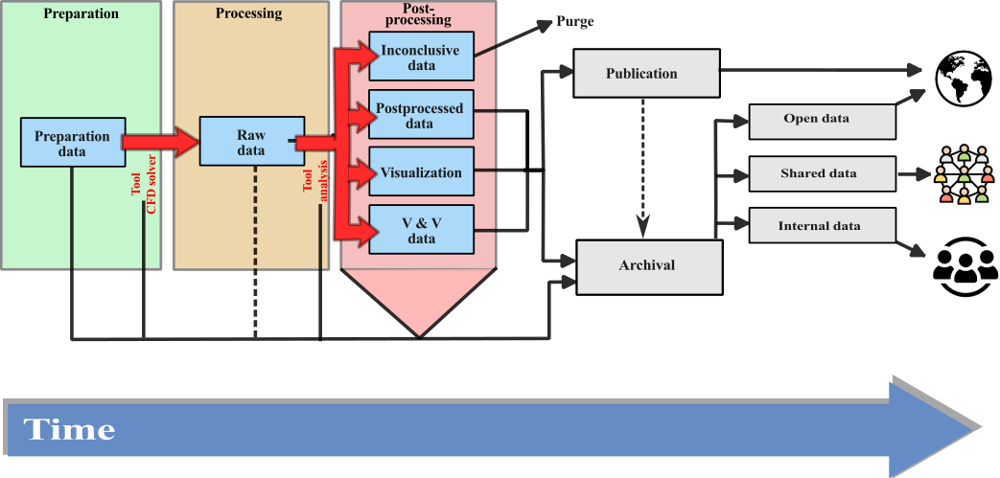

import Caption from '../../../components/Caption.astro';
import CustomAside from '../../../components/CustomAside.astro';

:::note[Learning Objectives]
By the end of this section, you should be able to:
1. Understand the terminology used in RDM
2. Determine the optimal mid- and long term data storage strategies
:::

Data are the output of any CFD simulation--in the context of HPC there are lots of data. The data have scientific, monetary and, strategic value, thus we need develop strategies to effectively utilize the data. This class introduces the concepts of Research Data Management (RDM) and applies these concepts to the field of Computational Fluid Dynamics. 

## Underlying principle of research data management
Research data management (RDM) is concerned with the management of the entire lifecycle of data used or generated as part of a research project. RDM seeks to develop best practices to organize, structure, share, store and care for the scientific data. RDM stem from the understanding that *'publicly funded research data are a public good'*   [(Ohmann et al., 2017)](https://bmjopen.bmj.com/content/7/12/e018647).  Therefore, RDM seeks to maximize the  value of research data for the greatest societal benefit. It should be noted that good data management is not a goal in itself  [(Wilkinson et al., 2016)](https://www.nature.com/articles/sdata201618) but a means to better value the research data.

<Caption>Visualization of the data lifecycle proposed for the  [Horizon Europe Program](https://rdmkit.elixir-europe.org/data_life_cycle). </Caption>

The field of RDM has emerged primarily from the need to manage sensitive (medical data) and/or expensive datasets (astrophysics) and driven by large-scale research endeavours. These scientific fields are characterized by large-scale, international collaboration between multiple institutions, thus an effective management of the data is critical to these efforts. RDM has also developed in parallel to the increasing push towards transparent and open science. Sound research data management principles enables open science. 

Within this context, the understanding of RDM principles is not as well developed within the CFD community. This is in part due to the nature of CFD workflows which is typically better suited for individual researchers or small research groups as opposed to large-research enterprise (such as in bio-informatics or astrophysics).  Yet, the use of high performance computing with modern CFD tools generates lots of expensive datasets that are not fully valorized without modern RDM practices.

## Why manage data?
There are a number of reasons to justify sound data management in CFD:

   -  Facilicate research and avoid duplication of efforts
   -  Save data for later
   -  Share data for re-use
   -  Better disseminate the results (increase citations and collaborations)
   -  Open science (best practice)
   -  Meet funders requirements
  
  For specific applications of CFD, for example in biomedical CFD, privacy considerations may also further justify RDM considerations.

## What is data in CFD?
Data underpin the scientific process.  We tend to associate 'data' with 'results', yet data in CFD should be understood as an umbrella  term that includes:

 -  preliminary calculations, and estimations
 -  mesh, and mesh configuration files
 -  input, setup, and configuration files 
 -  CFD codes, solvers, tools, and scripts
 -  raw CFD simulation data
 -  post-processed data
 -  visualization results and settings
 -  runtime data (statistics)
 -  meta data regarding the simulations 

## TRUST and FAIR

The FAIR principles  wilkinson_fair_2016 ref

  -  Findable:
  -  Accessible:
  -  Interoperable: 
  -  Reusable:

The TRUST principles underpin ref lin_trust_2020
1. Transparency:
2. Responsibility:
3. User Focus:
4. Sustainability:
5. Technology.

## Databases for CFD

## Data management for CFD remains quite unique. 

Many large-scale projects, such as computational astronomy, have developed and established processes to assure the perenity of the data while maintaining traceability and free-access to large data bases. Within other communities, such computational fluid dynamics, the research endeavor does not entail large, multi-institutional research groups that demand large scale data management.

<Caption>Data creation and lifecycle in CFD. </Caption>

Yet, large-scale data exchanges are a key part of the modern scientific community. Much of the efforts over the past X years have focused on developing freely accessible plateforms to exchange large scale data. Although a curated dataset, from both experimental and computational fluid dynamics

Solver (version number, git identifier)
post-processing scripts

## Repositories

We do note the following repositories:
JHTD [test](https://turbulence.pha.jhu.edu)
Turbase [test](https://turbase.cineca.it/init/routes/#/logging/welcome)

ref selent_management_2020 : paper explains the different stages of data in CFD

FAIR
[test](Findable, Accessible, Interoperable, and Reusable)
[test](https://force11.org/info/the-fair-data-principles/)

## Ressources
[test](https://scienceeurope.org/media/4brkxxe5/se_rdm_practical_guide_extended_final.pdf)

## Determining the principles of RDM in CFD

We should aim for a holistic data management (solver/tools/etc)

What are the challenges: infrastructure and tools, capacity/skills, ethical (less important for CFD), culture/incentive

### Learning from other fields 
AI
See this course: [test](https://thodrek.github.io/CS839_spring18/)
[test](https://fullstackdeeplearning.com/spring2021/lecture-8/)

"The resulting data ecosystem, therefore, appears to be moving away from centralization, is becoming more diverse, and less integrated, thereby exacerbating the discovery and re-usability problem for both human and computational stakeholders." ref wilkinson_fair_2016

Important discussion [test](https://towardsdatascience.com/data-entropy-more-data-more-problems-fa889a9dd0ec)

Workshop in TUM
[test](https://zenodo.org/records/7785532#.ZCw4h85ByUk)

[test](https://nfdi4ing.de)

[test](https://www.youtube.com/watch?v=3sDhQRIYUmA)
