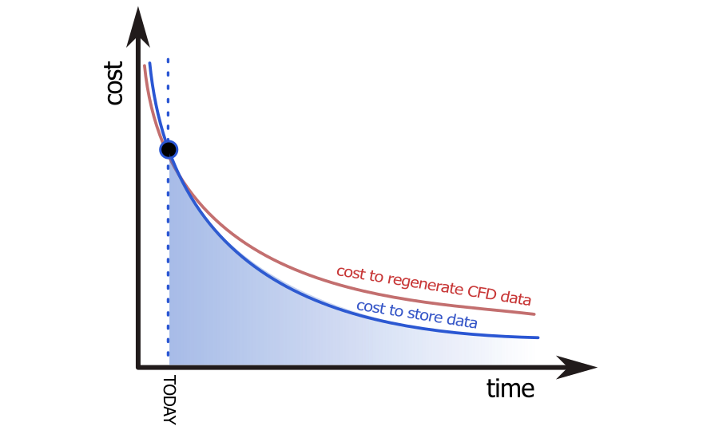
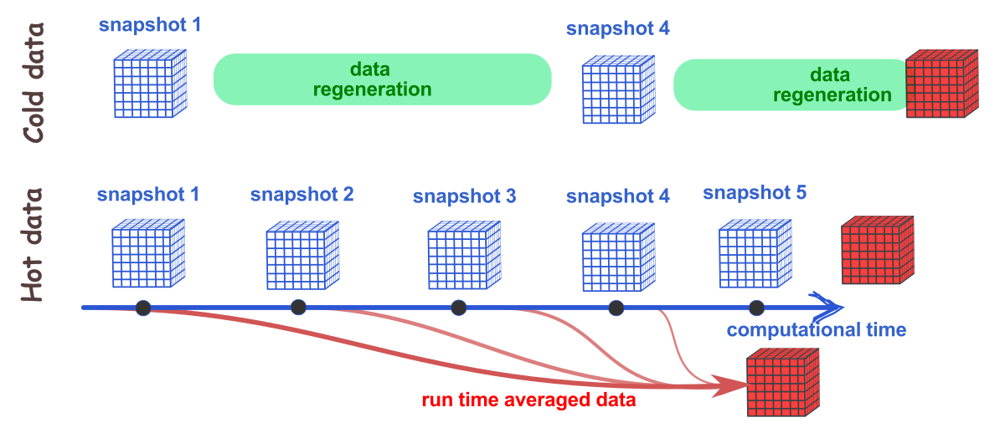

:::note[Learning Objectives]
At the end of this class, you should be able to:
1. Define a relevant RDM strategy for CFD
2. Optimize data storage for usability and efficiency
3. Apply the FAIR principles to CFD research data
:::
<CustomAside icon="pen" title="Time to complete: 60 min" colour="green"></CustomAside>
import Caption from '../../../components/Caption.astro';
import CustomAside from '../../../components/CustomAside.astro';
import Gif from '../../../components/Gif.astro';
import CodeFetch from '../../../components/CodeFetch.astro';
import { Tabs, TabItem } from '@astrojs/starlight/components';
import { CardGrid } from '@astrojs/starlight/components';
import Option from '../../../components/Option.astro';
import MultipleChoice from '../../../components/MultipleChoice.astro';
import Box from '../../../components/Box.astro';
import Spoiler from '../../../components/Spoiler.astro';

Computational fluid dynamics remains unique among many modern disciplines developing big-data RDM strategies. The constitutive equations of fluid motion are derived from classical Newtonian physics; therefore, they are inherently deterministic. Therefore, given sufficient information on the numerical setup, conditions, numerics, etc. the solution data can be perfectly replicated. The understanding of RDM in CFD must be considered from this perspective, which is the focus of the present lecture.

    
 

##  CFD data management 
As discussed [last class](https://arc4cfd.github.io/section3/part1/), research data is created throughout the entire CFD workflow. These data take many forms but are an essential component to ensure reproducibility of the scientific work.  When breaking down the typical CFD workflow, we can see where data are generated and the path that the data take throughout the entire workflow.

<Caption>Data generation and lifecycle in a typical CFD workflow. </Caption>

Most of the research data are of modest size (Mb-rage), but the raw CFD results can be significantly larger (Gb or Tb range), especially for unsteady problems, where multiple snapshots may need to be saved. Therefore, most of the work in data management for CFD lies in the organization of the data with the additional challenge of curating and storing large data sets.  

### Do we need to store all CFD results?
postprocessed data (averaged flow fields, point statistics, etc.) should be curated and organized, as these represent important research outcomes that have likely made their way to the final publication. Given the modest size of these data, the organization of the postprocessed dataset represents the largest challenge.

On the other hand, raw CFD results represent an organizational, but also storage challenge given their total size. Results generated from CFD are inherently deterministic (assuming there are no purely stochastic events in the simulation). In other words, given the identical initial state, boundary conditions, and solver characteristics, we should be able to reproduce the same dataset up to the numerical precision of the system. In this context, the first question we need to ask is: Do we need to store all the data?

The short answer is **no**, and the less short answer is: **most of the time, we cannot afford to.**

Let's consider a modern case of turbulent channel flow at $Re_\tau~5200$ [(Lee and Moser, 2015)](https://www.cambridge.org/core/journals/journal-of-fluid-mechanics/article/direct-numerical-simulation-of-turbulent-channel-flow-up-to-mathitreittauapprox-5200/3AE84A5A48F83AF294F6CB042AF92DA8). This simulation requires over 80 billion grid points ($Nx=10240$, $Ny=1024$,  and  $Nz=7680$), assuming 5 variables at each grid point, the size for each snapshot is just under 26 Tb. If we need to store 10 snapshots, at a cost of \$5 per Tb/month, we can estimate a total cost of approximately \$15,000/year.

In deciding about the amount of simulation results to store, we are faced with two considerations:

1. cost of storage 
2. ease of data re-generation 

As technology progresses, both costs decrease with time. The cost of data regeneration follows [Moore's law](https://en.wikipedia.org/wiki/Moore%27s_law), whereas data storage decreases [faster than Moore's law](https://pubs.aip.org/aip/adv/article/8/5/056506/1075722/Moore-s-law-realities-for-recording-systems-and). However, in addition to long-term storage of archived data on disk, storage costs represent a quantity that must be integrated over time. 

<Caption>Data storage versus data regeneration. </Caption>

Given this, it is often more advantageous to expand the definition of hot and cold data introduced earlier:
- **Hot data** are data that are still under active use and will be over the next 8 weeks or so. These data must be able to be easily accessed from the HPC system during this time.
 - **Cold data** is archival data that cannot be easily accessible from the HPC system. These data can be stored to disk (primarily offline) but present the lowest cost for data storage and represent data archival strategies. If the cold data are stored offline (e.g. external hard drives), this represents a fixed storage cost.
- **Warm data** is data that is accessible from the HPC system through modest effort. These data could be stored to institutional repositories or network-attached storage devices and may be used by future students or collaborators. Warm data represent archival data that can be accessed, if needed, and thus present a more significant cost compared to cold data storage. 

Following the 3-2-1 backup strategy described in the last class, 

- Curate a smaller subset of data to store to a **warm** storage site. Data regeneration is then emphasized to supplement the missing data if needed. These warm data can be stored in institutional storage facilities. 
- A more extensive **cold data** can be stored to disk for archival purpose. As this storage modality has a lower cost and fixed cost, additional snapshots can be stored.

The illustration below shows the various data storage compromise strategies in a CFD workflow. It's important to emphasize that all the postprocessed data (e.g. time averaged, statistics etc.) should be saved and stored at all stages.

<Caption> Type of data storage for archival CFD results. </Caption>

The above strategy enables a lower disk space utilization for long-term storage, while permitting, if needed, to regenerate data from the snapshots. The ability to regenerate results from stored data is predicated on:
- perpetual compatibility of the stored data 
- ability to run the same CFD code on future HPC systems.

Both points will be discussed in the following subsection.

   
<Box iconName="quiz">
  **QUIZ**
  
TEST
<MultipleChoice>
    <Option>
TEST
    </Option>
        <Option>
TEST2
    </Option>
</MultipleChoice>
</Box>

## Relating FAIR concepts to CFD
The FAIR principles, discussed in the previous lecture, are guiding principles for the effective management of research data. Here, we relate the FAIR concepts to the CFD workflow in order to identify the best practices.

### **F***indable*
The ability to find the research data is naturally a key requirement for RDM.  To make CFD research data findable, there are a couple key characteristics:

##### Persistent Identifiers (F.1 and F.4)
A **persistent identifier**  is a perpetual unique reference number to a document, file, or other digital objects. The persistent identifier is linked to a document, metadata, or webpage containing research data.  The digital object identifier, or DOI, allows persistent access to digital materials by assigning a unique number and unique URL. Similarly to the DOI assigned to journal articles, DOIs are also assigned to most data repositories. These persistent identifiers facilitate the finding of research data and enables citations of the research data.

##### Relevant metadata (F.2 and F.3)
As discussed in the last class, **metadata**, is an integral part of the research data documentation. It must be **machine readable** and have **tags** to facilitate searching and identifying key data. For CFD, the metadata should include information on:
- Code, version, installation/compilation
- Initial, boundary conditions
- Modelling decisions
- Settings and parameters
- Data storage location
- Averaging parameters 

The metadata should encapsulate the data that allows us to reproduce a simulation while facilitating the searching of the data. This means utilizing consistent **tags** to facilitate metadata organization. A good option  for developing metadata is [Extensible Markup Language or XML](https://www.w3schools.com/xml/xml_whatis.asp). XML allows the creation of user-defined tags and can be stored in a generic ASCII format.

<Box iconName='exercise'>
  **Example of CFD metadata**

The following is a partial example of a typical XML file as metadata of a CFD simulation case. This can be extended and adapted by the end user, although consistency in the tag nomenclature facilitates searching and finding. 
<CodeFetch rawURL='https://raw.githubusercontent.com/ARC4CFD/arc4cfd/master/Section3/metadata_example.xml' lang='python'  meta='title="metadata_example.xml"' />

</Box>

### **A***ccessible*
Accessibility refers to the ability to access the required data once they have been found. For openly shareable CFD data, the accessibility of the data is greatly facilitated by using digital repositories and linking the archival storage path directly within the stored metadata. The concepts of data accessibility are less relevant to CFD than to other fields developing RDM strategies.

### **I***nteroperable*
Here, we distinguish between interoperability of:
- data and data format
- simulation tools to generate the data

#### Interoperability of data format
To facilitate open science and research data dissemination, the data (and mesh) needs to be stored in a format that can be:
- shared and read among various users on different systems
- sustainability of the data format (future-proof data format)

As covered in the previous section, ASCII format is inefficient and binary format is system dependent. Therefore, the community has developed a number of standards for data format to facilitate exchange and collaboration. Here are a few standard data formats (containers) that can be considered to facilitate the sharing and sustainability of simulation results:

- [CGNS](https://cgns.github.io): CFD General Notation System is a machine-independent data storage format that is suggested as a [best-practice from AIAA](https://cgns.github.io/CGNS_docs_current/aiaa.html).
- [HDF5](https://www.hdfgroup.org/solutions/hdf5): Hierarchical Data Format (HDF) provides a way to store and organize large amounts of heterogeneous data. This format can be used in conjunction with other data storage formats.
- [VTK](https://docs.vtk.org/en/latest/design_documents/VTKFileFormats.html): Visualization Toolkit file format offers two storage approaches for large-scale heterogeneous data.

In addition to simulation data, mesh files should also be stored with data interoperability in mind.  The mesh can usually be stored in the above mentioned formats. In addition, conversion tools, such as [meshio](https://github.com/nschloe/meshio), can facilitate exchanges among different mesh data formats.

#### Interoperability of CFD solver 
In the context of large-data storage, as discussed earlier, the computational tools used to generate the simulation results need to be interoperable. In addition to being able to be used on different systems, they need to be sustainable in the face of continually changing HPC architectures, libraries, and data formats. Without an interoperable CFD code, the data regeneration necessary to reconstruct the stored CFD data may not occur. Therefore, strategies for sustainable CFD code interoperability include the idea of: *containerization*.

#### Containerization
In order to reproduce data from numerical codes, we must be able to re-run the code, yet most codes rely on external libraries, codes, compilers, and modules that continually evolve.  Containerization is the concept of bundling an application's code, files, and libraries into a platform-independent container. Therefore, the same code can run on (almost) any hardware and host operating system. Containerization is well established as a modern computer concept and is increasingly being used to code sustainability within the context of research data storage and management  (see e.g. [Maric et al.](https://arxiv.org/pdf/2208.07460.pdf)). Containers, such as what is offered by [Docker](https://www.docker.com/resources/what-container/#:~:text=A%20Docker%20container%20image%20is,tools%2C%20system%20libraries%20and%20settings). In these cases, the containers of the software can be saved, organized, and archived in addition to the archived source code (typically in a Git repository).

### **R***eusable*
To facilitate the reusability of the research data, there are a number of parameters that should be considered
- Clearly stating the **licensing parameters** for re-use of the data. This should be explicitly stated in both the human-readable (README file) and metadata file, and a license file should be included in the digital repository.
- Adopting **community standards** can facilitate the reusability of the data. When making an effort to use data formats that are common in the community, the reuse of the data may be facilitated. 
- Defining **rich metadata** helps to find and access the research data, which facilitates its reuse.

    
:::note[Reflections and Takeaways]
Having finished this class, you should now be able to answer the following questions:
1. Define the data workflow in a typical CFD simulation?
2. Do I need to save **all** results generated by a large-scale CFD simulation?
3. What are the considerations to organize and curate the CFD dataset over time?
:::

