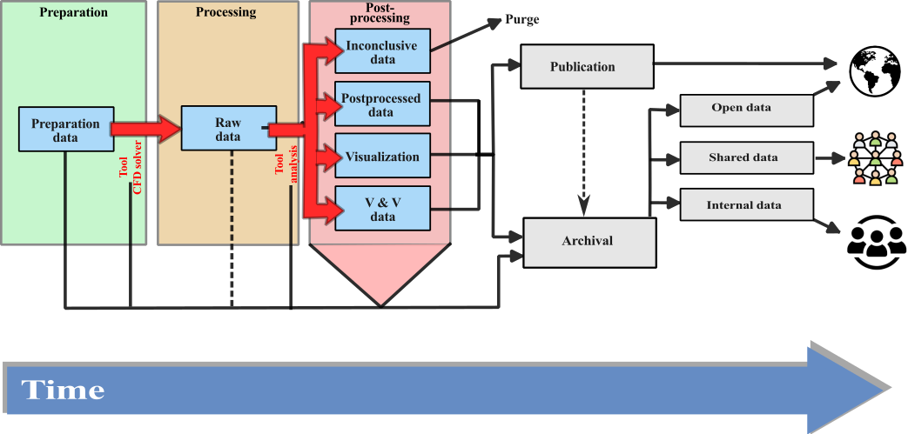

:::note[Learning Objectives]
By the end of this section, you should be able to:
1. Understand the terminology used in RDM
2. Determine the optimal mid- and long term data storage strategies
:::
import Caption from '../../../components/Caption.astro';
import CustomAside from '../../../components/CustomAside.astro';
import Gif from '../../../components/Gif.astro';

import { Tabs, TabItem } from '@astrojs/starlight/components';
import { CardGrid } from '@astrojs/starlight/components';
import Option from '../../../components/Option.astro';
import MultipleChoice from '../../../components/MultipleChoice.astro';
import Box from '../../../components/Box.astro';
import Spoiler from '../../../components/Spoiler.astro';

Computational fluid dynamics remains unique among many modern disciplines relying on HPC. The constitutive equations are derived from classical Newtonian physics and can be written down as a system of partial differential equations. Yet, the there is no generalizeable closed form solution, especially in turbulent flow. This is especially problematic given the multi-scale nature of turbulence. Modern efforts, especially for scale resolving simulations, are pushing 
High fidelity data must be generated, yet it is not apriori clear what data is relevant to understanding the problem.

    
 
## Relating FAIR concepts to CFD

## Databases for CFD
[here](https://science.gc.ca/site/science/en/interagency-research-funding/policies-and-guidelines/research-data-management/tri-agency-research-data-management-policy-frequently-asked-questions)

## Data management for CFD remains quite unique. 
Many large-scale projects, such as computational astronomy, have developed and established processes to assure the perenity of the data while maintaining traceability and free-access to large data bases. Within other communities, such computational fluid dynamics, the research endeavor does not entail large, multi-institutional research groups that demand large scale data management.

<Caption>Data creation and lifecycle in CFD. </Caption>

Yet, large-scale data exchanges are a key part of the modern scientific community. Much of the efforts over the past X years have focused on developing freely accessible plateforms to exchange large scale data. Although a curated dataset, from both experimental and computational fluid dynamics

Solver (version number, git identifier)
post-processing scripts

   
    
 
    
## What to deposit
Everything needed to FIND, ASSESS, UNDERSTAND, 'REPRODUCE', and REUSE.

DATA, METADATA ('data about data'), ANY other documentation

http://rd-alliance.github.io/metadata-directory/standards/

## Do we need to store all data?
Data generated from Computational Fluid Dynamics is inherently deterministic. In other words, given the identical initial state and boundary conditions of a problem, abstracted from numerical and round-off errors, we should be able to reproduce the same dataset. As a field that draws its heritage from Newtonian physics, the challenges in CFD are different from experimental fluid mechanics and other which have big-data challenges. 

Let's consider a modern case of turbulent channel flow at $Re_\tau~5200$ [test](https://www.cambridge.org/core/journals/journal-of-fluid-mechanics/article/direct-numerical-simulation-of-turbulent-channel-flow-up-to-mathitreittauapprox-5200/3AE84A5A48F83AF294F6CB042AF92DA8)
This represents a 
Nx=10240, Ny=1024,  and  Nz=7680 = 80,530,636,800

## Open Science and CFD

## Containerization
Reproducibility is a core principle of science. In order to reproduce data from numerical codes, we must be able to re-run the code, yet most codes rely on external libraries, codes, compilers, and modules that continually evolve. Therefore, a CFD code that runs and compiles today, may not easily be compiled in the future.  As interoperability and reuse represents some of the core concepts of FAIR, 

One concepts to enable the perenity of the current state of the software is containerization (see e.g. [Maric et al.](https://arxiv.org/pdf/2208.07460.pdf)). Containers, such as what is offered by [Docker](https://www.docker.com/resources/what-container/#:~:text=A%20Docker%20container%20image%20is,tools%2C%20system%20libraries%20and%20settings.), is a lightwight, standalone package that includes all the libraries and tools needed to run an application. These containers can be used to encapsulate current state of CFD tools, archived, and, at a future date, re-run.

 

The longterm storage of CFD data
As CFD codes are 

## References
More information: https://www.openaire.eu/opendatapilot-repository 
Zenodo: http://www.zenodo.org 
Re3data.org: http://www.re3data.org