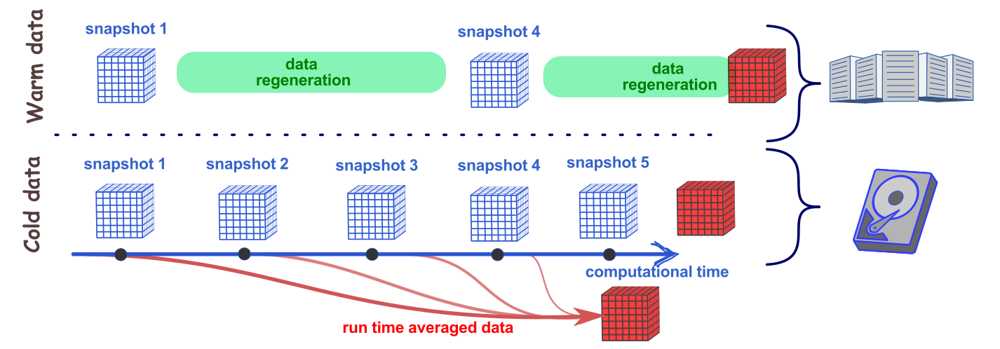

:::note[Learning Objectives]
By the end of this section, you should be able to:
1. Relate RDM concepts to CFD
2. 
:::
import Caption from '../../../components/Caption.astro';
import CustomAside from '../../../components/CustomAside.astro';
import Gif from '../../../components/Gif.astro';

import { Tabs, TabItem } from '@astrojs/starlight/components';
import { CardGrid } from '@astrojs/starlight/components';
import Option from '../../../components/Option.astro';
import MultipleChoice from '../../../components/MultipleChoice.astro';
import Box from '../../../components/Box.astro';
import Spoiler from '../../../components/Spoiler.astro';

Computational fluid dynamics remains unique among many modern disciplines developing big data RDM strategies. The constitutive equations of fluid motion are derived from classical Newtonian physics, therefore they are inherently deterministic. As a consequence, given sufficient information on the numerical setup, conditions, numerics, etc. the solution data can be perfectly replicated. The understanding of RDM in CFD must be considered from this perspective.

    
 

##  CFD data management 
As discussed last class, research data is created throughout the entire CFD workflow. This data takes many forms but are an essential component to assure reproducibility of the scientific work.  When breaking down the typical CFD workflow, we can see where data is generated and path the data takes throughout the entire workflow.


<Caption>Data generation and lifecycle in a typical CFD workflow. </Caption>

CFD generates large amounts of raw data that must be curated prior storage but also a large amount of smaller data files that need to be organized.

### Do we need to store all results?
Post-processed data 

Research data  generated from CFD are inherently deterministic. In other words, given the identical initial state and boundary conditions, we should be able to reproduce the same dataset. In this context, the first question we need to ask is: do we need to store all the data?

Let's consider a modern case of turbulent channel flow at $Re_\tau~5200$ [(Lee and Moser, 2015)](https://www.cambridge.org/core/journals/journal-of-fluid-mechanics/article/direct-numerical-simulation-of-turbulent-channel-flow-up-to-mathitreittauapprox-5200/3AE84A5A48F83AF294F6CB042AF92DA8). This simulation requires over 80 billion grid points ($Nx=10240$, $Ny=1024$,  and  $Nz=7680$), assuming 5 variables at each grid point, the size for each snapshot if just under 26 Tb. If we need to store 10 snapshots, at a cost of \$5 per Tb/month, we can estimate a total cost of approximately \$15,000/year.


<Caption>Data storage versus data generation. </Caption>

The decision on the amount of data to store is faced with two considerations:

1. cost of storage 
2. cost of data re-generation 

As technology progresses, both of these two costs decrease with time. The cost of data re-generation follows [Moore's law](https://en.wikipedia.org/wiki/Moore%27s_law), whereas data storage decreases [faster than Moore's law](https://pubs.aip.org/aip/adv/article/8/5/056506/1075722/Moore-s-law-realities-for-recording-systems-and). Yet, other than long-term archival data storage, the storage costs represent a quantity that is integrated over time. 



<Caption> Type of data storage for CFD results. </Caption>


Therefore, re-generation 
- perpetual data compatibility 
- ability to maintain ability to run code.


### 
Create data using consistent and meaningful naming conventions


   

## Relating FAIR concepts to CFD
The FAIR principles, discussed last lecture, are guiding principles for effective management of research data. Here, we relate the FAIR concepts to the CFD workflow in order to identify the best practices.


### **Findable** 
The ability to find the research data is naturally a key requirement to RDM.  To make research data findable, there are a couple key characteristics:


##### Persistent Identifiers (F.1 and F.4)
A **persistent identifier**  is a perpetual, unique reference number to a document, file, or other digital object. The persistent identifier is linked to a document, metadata or webpage containing research data.  Digital object identifier, or DOI, allows for persistent access to digital materials by assigning a unique number and unique URL. Similar to the DOI assigned to journal articles, DOIs are also assigned to most repositories data repositories. These persistent identifiers facilitates the finding of research data and enables citations of the research data.


##### Relevant metadata (F.2 and F.3)
As discussed last class, **metadata**, is an integral part of the research data documentation. It must be **machine readable** and have **tags** to facilitate searching and identifying key data. For CFD, the metadata should include information on:
- Code, version, installation/compilation
- Initial, boundary conditions
- Modelling decisions
- settings and parameters
- data storage location
- averaging parameters 

The metadata should encapsulate the data that allows us reproduce a simulation while facilitating the searching of the data. This means utilizing consistent **tags** to facilitate metadata organization. A good option  for developing metadata is[Extensible Markup Language or XML](https://www.w3schools.com/xml/xml_whatis.asp). XML allows the creation of user-defined tags and can be stored in a generic ASCII format.


:::note[Example of CFD metadata]
The following is a partial example of a typical XML file as metadata of a CFD simulation case. This can be extended and adapted by the end-user, although consistency in the tag nomenclature facilitates searching and finding. 
```python "even"
<?xml version="1.0" encoding="UTF-8"?>
<CFDsimulation>
  <DOI>
    https://doi.org/xxxx
  </DOI>
  <overview>
    <title>Backward facing step at Re_theta=5000</title>
    <ID>BFS_LES_Re5k</ID>
    <description>LES of a backward facing step that reproduces the experimental results by  Jovic and Driver (1994) and the numerical results from  Le et al (1997). </description>
    <comparative_data>https://doi.org/xxxx/BFS_LES_Re5k_validationData.dat</comparative_data>
  </overview>
  <preliminary_calculations>
    <calculation_fname>https://doi.org/xxxx/BFS_LES_Re5k_preliminaryCalcs.dat</calculation_fname>
  </preliminary_calculations>
  <mesh>
    <title>BFS_LES_Re5k_shearResolved</title>
    <author>Nipin Lokanathan</author>
    <meshType>structured</meshType>
    <meshFormat>SU2</meshFormat>
    <meshSize>12400234</meshSize>
    <meshTool>GMSH</meshTool>
   </mesh>
  <solver>
    <name>SU2</name>
    <version>18.04</version>
    <compilation> </compilation>
  </solver>
  <numerics>
    <scheme>WENO5thOrder</scheme>
  </numerics>
  <initial_conditions>
    < .... >
  </initial_conditions>
  <boundary_conditions>
        < .... >
  </boundary_conditions>
  <output>
        < .... >
  </output>
  <HPCsystem>
        < .... >
  </HPCsystem>
</CFDsimulation>
```
:::


### **Accessible**


### **Interoperable**

#### Containerization
Reproducibility is a core principle of science. In order to reproduce data from numerical codes, we must be able to re-run the code, yet most codes rely on external libraries, codes, compilers, and modules that continually evolve. Therefore, a CFD code that runs and compiles today, may not easily be compiled in the future.  As interoperability and reuse represents some of the core concepts of FAIR, 

One concepts to enable the perennity of the current state of the software is containerization (see e.g. [Maric et al.](https://arxiv.org/pdf/2208.07460.pdf)). Containers, such as what is offered by [Docker](https://www.docker.com/resources/what-container/#:~:text=A%20Docker%20container%20image%20is,tools%2C%20system%20libraries%20and%20settings.), is a lightweight, standalone package that includes all the libraries and tools needed to run an application. These containers can be used to encapsulate current state of CFD tools, archived, and, at a future date, re-run.


### **Reusable**


    


The longterm storage of CFD data
As CFD codes are 


## C


## References
More information: https://www.openaire.eu/opendatapilot-repository 
Zenodo: http://www.zenodo.org 
Re3data.org: http://www.re3data.org